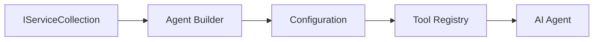

<!--
CO_OP_TRANSLATOR_METADATA:
{
  "original_hash": "bcc874e190347bd6a095aed56dc16de8",
  "translation_date": "2025-11-13T11:09:48+00:00",
  "source_file": "03-agentic-design-patterns/code_samples/03-dotnet-agent-framework.md",
  "language_code": "fa"
}
-->
# 🎨 الگوهای طراحی عامل با مدل‌های GitHub (.NET)

## 📋 اهداف یادگیری

این مثال الگوهای طراحی در سطح سازمانی برای ساخت عوامل هوشمند با استفاده از Microsoft Agent Framework در .NET و ادغام مدل‌های GitHub را نشان می‌دهد. شما الگوهای حرفه‌ای و رویکردهای معماری را یاد خواهید گرفت که عوامل را آماده تولید، قابل نگهداری و مقیاس‌پذیر می‌کنند.

### الگوهای طراحی سازمانی

- 🏭 **الگوی کارخانه**: ایجاد استاندارد عوامل با تزریق وابستگی
- 🔧 **الگوی سازنده**: پیکربندی و تنظیم عوامل به صورت روان
- 🧵 **الگوهای ایمن در برابر رشته‌ها**: مدیریت مکالمات همزمان
- 📋 **الگوی مخزن**: مدیریت ابزارها و قابلیت‌ها به صورت سازمان‌یافته

## 🎯 مزایای معماری خاص .NET

### ویژگی‌های سازمانی

- **تایپ قوی**: اعتبارسنجی در زمان کامپایل و پشتیبانی IntelliSense
- **تزریق وابستگی**: ادغام کانتینر DI داخلی
- **مدیریت پیکربندی**: الگوهای IConfiguration و Options
- **Async/Await**: پشتیبانی درجه یک از برنامه‌نویسی غیرهمزمان

### الگوهای آماده تولید

- **ادغام لاگ‌گیری**: پشتیبانی از ILogger و لاگ‌گیری ساختاریافته
- **بررسی سلامت**: نظارت و تشخیص داخلی
- **اعتبارسنجی پیکربندی**: تایپ قوی با حاشیه‌نویسی داده‌ها
- **مدیریت خطا**: مدیریت استثناهای ساختاریافته

## 🔧 معماری فنی

### اجزای اصلی .NET

- **Microsoft.Extensions.AI**: انتزاعات خدمات AI یکپارچه
- **Microsoft.Agents.AI**: چارچوب هماهنگی عوامل سازمانی
- **ادغام مدل‌های GitHub**: الگوهای مشتری API با عملکرد بالا
- **سیستم پیکربندی**: ادغام appsettings.json و محیط

### پیاده‌سازی الگوهای طراحی



## 🏗️ الگوهای سازمانی نشان داده شده

### 1. **الگوهای ساختاری**

- **کارخانه عامل**: ایجاد متمرکز عوامل با پیکربندی ثابت
- **الگوی سازنده**: API روان برای پیکربندی پیچیده عوامل
- **الگوی Singleton**: مدیریت منابع و پیکربندی مشترک
- **تزریق وابستگی**: اتصال آزاد و قابلیت تست

### 2. **الگوهای رفتاری**

- **الگوی استراتژی**: استراتژی‌های اجرای ابزار قابل تعویض
- **الگوی فرمان**: عملیات عامل کپسوله شده با قابلیت بازگشت
- **الگوی ناظر**: مدیریت چرخه عمر عامل مبتنی بر رویداد
- **الگوی روش قالب**: جریان‌های کاری اجرای عامل استاندارد

### 3. **الگوهای ساختاری**

- **الگوی آداپتور**: لایه ادغام API مدل‌های GitHub
- **الگوی تزئین‌کننده**: افزایش قابلیت‌های عامل
- **الگوی Facade**: رابط‌های تعامل ساده‌شده عامل
- **الگوی Proxy**: بارگذاری تنبل و کش برای عملکرد بهتر

## 📚 اصول طراحی .NET

### اصول SOLID

- **مسئولیت واحد**: هر جزء یک هدف واضح دارد
- **باز/بسته**: قابل توسعه بدون تغییر
- **جایگزینی لیسکوف**: پیاده‌سازی ابزار مبتنی بر رابط
- **جداسازی رابط**: رابط‌های متمرکز و منسجم
- **وارونگی وابستگی**: وابستگی به انتزاعات، نه موارد خاص

### معماری پاک

- **لایه دامنه**: انتزاعات اصلی عامل و ابزار
- **لایه برنامه**: هماهنگی عوامل و جریان‌های کاری
- **لایه زیرساخت**: ادغام مدل‌های GitHub و خدمات خارجی
- **لایه ارائه**: تعامل کاربر و قالب‌بندی پاسخ

## 🔒 ملاحظات سازمانی

### امنیت

- **مدیریت اعتبارنامه**: مدیریت امن کلیدهای API با IConfiguration
- **اعتبارسنجی ورودی**: تایپ قوی و اعتبارسنجی حاشیه‌نویسی داده‌ها
- **پاکسازی خروجی**: پردازش و فیلتر کردن پاسخ‌های امن
- **لاگ‌گیری حسابرسی**: ردیابی جامع عملیات

### عملکرد

- **الگوهای غیرهمزمان**: عملیات I/O غیرمسدودکننده
- **مدیریت اتصال**: مدیریت کارآمد مشتری HTTP
- **کش**: کش پاسخ برای بهبود عملکرد
- **مدیریت منابع**: الگوهای پاکسازی و تخلیه مناسب

### مقیاس‌پذیری

- **ایمنی رشته‌ها**: پشتیبانی از اجرای همزمان عوامل
- **تجمع منابع**: استفاده کارآمد از منابع
- **مدیریت بار**: محدودیت نرخ و مدیریت فشار برگشتی
- **نظارت**: معیارهای عملکرد و بررسی سلامت

## 🚀 استقرار تولید

- **مدیریت پیکربندی**: تنظیمات خاص محیط
- **استراتژی لاگ‌گیری**: لاگ‌گیری ساختاریافته با شناسه‌های همبستگی
- **مدیریت خطا**: مدیریت استثناهای جهانی با بازیابی مناسب
- **نظارت**: بینش‌های برنامه و شمارنده‌های عملکرد
- **تست**: الگوهای تست واحد، تست یکپارچه و تست بار

آماده ساخت عوامل هوشمند در سطح سازمانی با .NET هستید؟ بیایید چیزی قدرتمند طراحی کنیم! 🏢✨

## 🚀 شروع به کار

### پیش‌نیازها

- [.NET 10 SDK](https://dotnet.microsoft.com/download/dotnet/10.0) یا بالاتر
- [توکن دسترسی API مدل‌های GitHub](https://docs.github.com/github-models/github-models-at-scale/using-your-own-api-keys-in-github-models)

### متغیرهای محیطی مورد نیاز

```bash
# zsh/bash
export GH_TOKEN=<your_github_token>
export GH_ENDPOINT=https://models.github.ai/inference
export GH_MODEL_ID=openai/gpt-5-mini
```

```powershell
# PowerShell
$env:GH_TOKEN = "<your_github_token>"
$env:GH_ENDPOINT = "https://models.github.ai/inference"
$env:GH_MODEL_ID = "openai/gpt-5-mini"
```

### کد نمونه

برای اجرای مثال کد،

```bash
# zsh/bash
chmod +x ./03-dotnet-agent-framework.cs
./03-dotnet-agent-framework.cs
```

یا با استفاده از CLI دات‌نت:

```bash
dotnet run ./03-dotnet-agent-framework.cs
```

کد کامل را در [`03-dotnet-agent-framework.cs`](../../../../03-agentic-design-patterns/code_samples/03-dotnet-agent-framework.cs) مشاهده کنید.

```csharp
#!/usr/bin/dotnet run

#:package Microsoft.Extensions.AI@10.*
#:package Microsoft.Agents.AI.OpenAI@1.*-*

using System.ClientModel;
using System.ComponentModel;

using Microsoft.Agents.AI;
using Microsoft.Extensions.AI;

using OpenAI;

// Tool Function: Random Destination Generator
// This static method will be available to the agent as a callable tool
// The [Description] attribute helps the AI understand when to use this function
// This demonstrates how to create custom tools for AI agents
[Description("Provides a random vacation destination.")]
static string GetRandomDestination()
{
    // List of popular vacation destinations around the world
    // The agent will randomly select from these options
    var destinations = new List<string>
    {
        "Paris, France",
        "Tokyo, Japan",
        "New York City, USA",
        "Sydney, Australia",
        "Rome, Italy",
        "Barcelona, Spain",
        "Cape Town, South Africa",
        "Rio de Janeiro, Brazil",
        "Bangkok, Thailand",
        "Vancouver, Canada"
    };

    // Generate random index and return selected destination
    // Uses System.Random for simple random selection
    var random = new Random();
    int index = random.Next(destinations.Count);
    return destinations[index];
}

// Extract configuration from environment variables
// Retrieve the GitHub Models API endpoint, defaults to https://models.github.ai/inference if not specified
// Retrieve the model ID, defaults to openai/gpt-5-mini if not specified
// Retrieve the GitHub token for authentication, throws exception if not specified
var github_endpoint = Environment.GetEnvironmentVariable("GH_ENDPOINT") ?? "https://models.github.ai/inference";
var github_model_id = Environment.GetEnvironmentVariable("GH_MODEL_ID") ?? "openai/gpt-5-mini";
var github_token = Environment.GetEnvironmentVariable("GH_TOKEN") ?? throw new InvalidOperationException("GH_TOKEN is not set.");

// Configure OpenAI Client Options
// Create configuration options to point to GitHub Models endpoint
// This redirects OpenAI client calls to GitHub's model inference service
var openAIOptions = new OpenAIClientOptions()
{
    Endpoint = new Uri(github_endpoint)
};

// Initialize OpenAI Client with GitHub Models Configuration
// Create OpenAI client using GitHub token for authentication
// Configure it to use GitHub Models endpoint instead of OpenAI directly
var openAIClient = new OpenAIClient(new ApiKeyCredential(github_token), openAIOptions);

// Define Agent Identity and Comprehensive Instructions
// Agent name for identification and logging purposes
var AGENT_NAME = "TravelAgent";

// Detailed instructions that define the agent's personality, capabilities, and behavior
// This system prompt shapes how the agent responds and interacts with users
var AGENT_INSTRUCTIONS = """
You are a helpful AI Agent that can help plan vacations for customers.

Important: When users specify a destination, always plan for that location. Only suggest random destinations when the user hasn't specified a preference.

When the conversation begins, introduce yourself with this message:
"Hello! I'm your TravelAgent assistant. I can help plan vacations and suggest interesting destinations for you. Here are some things you can ask me:
1. Plan a day trip to a specific location
2. Suggest a random vacation destination
3. Find destinations with specific features (beaches, mountains, historical sites, etc.)
4. Plan an alternative trip if you don't like my first suggestion

What kind of trip would you like me to help you plan today?"

Always prioritize user preferences. If they mention a specific destination like "Bali" or "Paris," focus your planning on that location rather than suggesting alternatives.
""";

// Create AI Agent with Advanced Travel Planning Capabilities
// Initialize complete agent pipeline: OpenAI client → Chat client → AI agent
// Configure agent with name, detailed instructions, and available tools
// This demonstrates the .NET agent creation pattern with full configuration
AIAgent agent = openAIClient
    .GetChatClient(github_model_id)
    .CreateAIAgent(
        name: AGENT_NAME,
        instructions: AGENT_INSTRUCTIONS,
        tools: [AIFunctionFactory.Create(GetRandomDestination)]
    );

// Create New Conversation Thread for Context Management
// Initialize a new conversation thread to maintain context across multiple interactions
// Threads enable the agent to remember previous exchanges and maintain conversational state
// This is essential for multi-turn conversations and contextual understanding
AgentThread thread = agent.GetNewThread();

// Execute Agent: First Travel Planning Request
// Run the agent with an initial request that will likely trigger the random destination tool
// The agent will analyze the request, use the GetRandomDestination tool, and create an itinerary
// Using the thread parameter maintains conversation context for subsequent interactions
await foreach (var update in agent.RunStreamingAsync("Plan me a day trip", thread))
{
    await Task.Delay(10);
    Console.Write(update);
}

Console.WriteLine();

// Execute Agent: Follow-up Request with Context Awareness
// Demonstrate contextual conversation by referencing the previous response
// The agent remembers the previous destination suggestion and will provide an alternative
// This showcases the power of conversation threads and contextual understanding in .NET agents
await foreach (var update in agent.RunStreamingAsync("I don't like that destination. Plan me another vacation.", thread))
{
    await Task.Delay(10);
    Console.Write(update);
}
```

---

<!-- CO-OP TRANSLATOR DISCLAIMER START -->
**سلب مسئولیت**:  
این سند با استفاده از سرویس ترجمه هوش مصنوعی [Co-op Translator](https://github.com/Azure/co-op-translator) ترجمه شده است. در حالی که ما برای دقت تلاش می‌کنیم، لطفاً توجه داشته باشید که ترجمه‌های خودکار ممکن است حاوی خطاها یا نادرستی‌هایی باشند. سند اصلی به زبان اصلی آن باید به عنوان منبع معتبر در نظر گرفته شود. برای اطلاعات حیاتی، ترجمه حرفه‌ای انسانی توصیه می‌شود. ما مسئولیتی در قبال هرگونه سوءتفاهم یا تفسیر نادرست ناشی از استفاده از این ترجمه نداریم.
<!-- CO-OP TRANSLATOR DISCLAIMER END -->