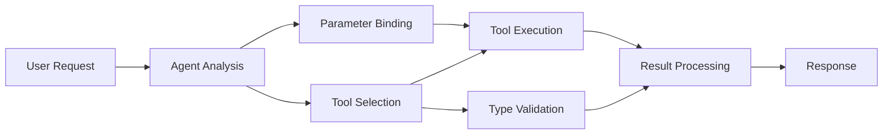

<!--
CO_OP_TRANSLATOR_METADATA:
{
  "original_hash": "91d6061e402489603f2ec8b528cae59b",
  "translation_date": "2025-11-18T16:41:00+00:00",
  "source_file": "04-tool-use/code_samples/04-dotnet-agent-framework.md",
  "language_code": "fa"
}
-->
# 🛠️ استفاده پیشرفته از ابزارها با مدل‌های GitHub (.NET)

## 📋 اهداف یادگیری

این دفترچه الکترونیکی الگوهای یکپارچه‌سازی ابزارهای سطح سازمانی را با استفاده از Microsoft Agent Framework در .NET و مدل‌های GitHub نشان می‌دهد. شما یاد می‌گیرید که عوامل پیشرفته‌ای با ابزارهای تخصصی متعدد بسازید و از تایپ قوی C# و ویژگی‌های سازمانی .NET بهره ببرید.

### قابلیت‌های پیشرفته ابزار که یاد خواهید گرفت

- 🔧 **معماری چندابزاری**: ساخت عوامل با قابلیت‌های تخصصی متعدد
- 🎯 **اجرای ابزار ایمن از نظر نوع**: استفاده از اعتبارسنجی زمان کامپایل C#
- 📊 **الگوهای ابزار سازمانی**: طراحی ابزار آماده تولید و مدیریت خطا
- 🔗 **ترکیب ابزارها**: ترکیب ابزارها برای جریان‌های کاری پیچیده کسب‌وکار

## 🎯 مزایای معماری ابزار .NET

### ویژگی‌های ابزار سازمانی

- **اعتبارسنجی زمان کامپایل**: تایپ قوی صحت پارامترهای ابزار را تضمین می‌کند
- **تزریق وابستگی**: یکپارچه‌سازی IoC container برای مدیریت ابزار
- **الگوهای Async/Await**: اجرای ابزار غیرمسدودکننده با مدیریت منابع مناسب
- **ثبت ساختاریافته**: یکپارچه‌سازی ثبت داخلی برای نظارت بر اجرای ابزار

### الگوهای آماده تولید

- **مدیریت استثناها**: مدیریت جامع خطا با استثناهای تایپ‌شده
- **مدیریت منابع**: الگوهای دفع مناسب و مدیریت حافظه
- **نظارت بر عملکرد**: معیارهای داخلی و شمارنده‌های عملکرد
- **مدیریت پیکربندی**: پیکربندی ایمن از نظر نوع با اعتبارسنجی

## 🔧 معماری فنی

### اجزای اصلی ابزار .NET

- **Microsoft.Extensions.AI**: لایه انتزاعی ابزار یکپارچه
- **Microsoft.Agents.AI**: ارکستراسیون ابزار سطح سازمانی
- **یکپارچه‌سازی مدل‌های GitHub**: کلاینت API با عملکرد بالا و مدیریت اتصال

### خط لوله اجرای ابزار



## 🛠️ دسته‌بندی‌ها و الگوهای ابزار

### 1. **ابزارهای پردازش داده**

- **اعتبارسنجی ورودی**: تایپ قوی با حاشیه‌نویسی داده
- **عملیات تبدیل**: تبدیل و قالب‌بندی داده ایمن از نظر نوع
- **منطق کسب‌وکار**: ابزارهای محاسبه و تحلیل خاص دامنه
- **قالب‌بندی خروجی**: تولید پاسخ ساختاریافته

### 2. **ابزارهای یکپارچه‌سازی**

- **اتصال‌دهنده‌های API**: یکپارچه‌سازی خدمات RESTful با HttpClient
- **ابزارهای پایگاه داده**: یکپارچه‌سازی Entity Framework برای دسترسی به داده
- **عملیات فایل**: عملیات ایمن سیستم فایل با اعتبارسنجی
- **خدمات خارجی**: الگوهای یکپارچه‌سازی خدمات شخص ثالث

### 3. **ابزارهای کمکی**

- **پردازش متن**: ابزارهای دستکاری و قالب‌بندی رشته
- **عملیات تاریخ/زمان**: محاسبات تاریخ/زمان با آگاهی از فرهنگ
- **ابزارهای ریاضی**: محاسبات دقیق و عملیات آماری
- **ابزارهای اعتبارسنجی**: اعتبارسنجی قوانین کسب‌وکار و تأیید داده

آماده‌اید عوامل سطح سازمانی با قابلیت‌های ابزار قدرتمند و ایمن از نظر نوع در .NET بسازید؟ بیایید راه‌حل‌های حرفه‌ای طراحی کنیم! 🏢⚡

## 🚀 شروع به کار

### پیش‌نیازها

- [.NET 10 SDK](https://dotnet.microsoft.com/download/dotnet/10.0) یا بالاتر
- [توکن دسترسی API مدل‌های GitHub](https://docs.github.com/github-models/github-models-at-scale/using-your-own-api-keys-in-github-models)

### متغیرهای محیطی مورد نیاز

```bash
# zsh/bash
export GH_TOKEN=<your_github_token>
export GH_ENDPOINT=https://models.github.ai/inference
export GH_MODEL_ID=openai/gpt-5-mini
```

```powershell
# PowerShell
$env:GH_TOKEN = "<your_github_token>"
$env:GH_ENDPOINT = "https://models.github.ai/inference"
$env:GH_MODEL_ID = "openai/gpt-5-mini"
```

### کد نمونه

برای اجرای مثال کد،

```bash
# zsh/bash
chmod +x ./04-dotnet-agent-framework.cs
./04-dotnet-agent-framework.cs
```

یا با استفاده از CLI دات‌نت:

```bash
dotnet run ./04-dotnet-agent-framework.cs
```

فایل [`04-dotnet-agent-framework.cs`](../../../../04-tool-use/code_samples/04-dotnet-agent-framework.cs) را برای کد کامل مشاهده کنید.

```csharp
#!/usr/bin/dotnet run

#:package Microsoft.Extensions.AI@10.*
#:package Microsoft.Agents.AI.OpenAI@1.*-*

using System.ClientModel;
using System.ComponentModel;

using Microsoft.Agents.AI;
using Microsoft.Extensions.AI;

using OpenAI;

// Tool Function: Random Destination Generator
// This static method will be available to the agent as a callable tool
// The [Description] attribute helps the AI understand when to use this function
// This demonstrates how to create custom tools for AI agents
[Description("Provides a random vacation destination.")]
static string GetRandomDestination()
{
    // List of popular vacation destinations around the world
    // The agent will randomly select from these options
    var destinations = new List<string>
    {
        "Paris, France",
        "Tokyo, Japan",
        "New York City, USA",
        "Sydney, Australia",
        "Rome, Italy",
        "Barcelona, Spain",
        "Cape Town, South Africa",
        "Rio de Janeiro, Brazil",
        "Bangkok, Thailand",
        "Vancouver, Canada"
    };

    // Generate random index and return selected destination
    // Uses System.Random for simple random selection
    var random = new Random();
    int index = random.Next(destinations.Count);
    return destinations[index];
}

// Extract configuration from environment variables
// Retrieve the GitHub Models API endpoint, defaults to https://models.github.ai/inference if not specified
// Retrieve the model ID, defaults to openai/gpt-5-mini if not specified
// Retrieve the GitHub token for authentication, throws exception if not specified
var github_endpoint = Environment.GetEnvironmentVariable("GH_ENDPOINT") ?? "https://models.github.ai/inference";
var github_model_id = Environment.GetEnvironmentVariable("GH_MODEL_ID") ?? "openai/gpt-5-mini";
var github_token = Environment.GetEnvironmentVariable("GH_TOKEN") ?? throw new InvalidOperationException("GH_TOKEN is not set.");

// Configure OpenAI Client Options
// Create configuration options to point to GitHub Models endpoint
// This redirects OpenAI client calls to GitHub's model inference service
var openAIOptions = new OpenAIClientOptions()
{
    Endpoint = new Uri(github_endpoint)
};

// Initialize OpenAI Client with GitHub Models Configuration
// Create OpenAI client using GitHub token for authentication
// Configure it to use GitHub Models endpoint instead of OpenAI directly
var openAIClient = new OpenAIClient(new ApiKeyCredential(github_token), openAIOptions);

// Define Agent Identity and Comprehensive Instructions
// Agent name for identification and logging purposes
var AGENT_NAME = "TravelAgent";

// Detailed instructions that define the agent's personality, capabilities, and behavior
// This system prompt shapes how the agent responds and interacts with users
var AGENT_INSTRUCTIONS = """
You are a helpful AI Agent that can help plan vacations for customers.

Important: When users specify a destination, always plan for that location. Only suggest random destinations when the user hasn't specified a preference.

When the conversation begins, introduce yourself with this message:
"Hello! I'm your TravelAgent assistant. I can help plan vacations and suggest interesting destinations for you. Here are some things you can ask me:
1. Plan a day trip to a specific location
2. Suggest a random vacation destination
3. Find destinations with specific features (beaches, mountains, historical sites, etc.)
4. Plan an alternative trip if you don't like my first suggestion

What kind of trip would you like me to help you plan today?"

Always prioritize user preferences. If they mention a specific destination like "Bali" or "Paris," focus your planning on that location rather than suggesting alternatives.
""";

// Create AI Agent with Advanced Travel Planning Capabilities
// Initialize complete agent pipeline: OpenAI client → Chat client → AI agent
// Configure agent with name, detailed instructions, and available tools
// This demonstrates the .NET agent creation pattern with full configuration
AIAgent agent = openAIClient
    .GetChatClient(github_model_id)
    .CreateAIAgent(
        name: AGENT_NAME,
        instructions: AGENT_INSTRUCTIONS,
        tools: [AIFunctionFactory.Create(GetRandomDestination)]
    );

// Create New Conversation Thread for Context Management
// Initialize a new conversation thread to maintain context across multiple interactions
// Threads enable the agent to remember previous exchanges and maintain conversational state
// This is essential for multi-turn conversations and contextual understanding
AgentThread thread = agent.GetNewThread();

// Execute Agent: First Travel Planning Request
// Run the agent with an initial request that will likely trigger the random destination tool
// The agent will analyze the request, use the GetRandomDestination tool, and create an itinerary
// Using the thread parameter maintains conversation context for subsequent interactions
await foreach (var update in agent.RunStreamingAsync("Plan me a day trip", thread))
{
    await Task.Delay(10);
    Console.Write(update);
}

Console.WriteLine();

// Execute Agent: Follow-up Request with Context Awareness
// Demonstrate contextual conversation by referencing the previous response
// The agent remembers the previous destination suggestion and will provide an alternative
// This showcases the power of conversation threads and contextual understanding in .NET agents
await foreach (var update in agent.RunStreamingAsync("I don't like that destination. Plan me another vacation.", thread))
{
    await Task.Delay(10);
    Console.Write(update);
}
```

---

<!-- CO-OP TRANSLATOR DISCLAIMER START -->
**سلب مسئولیت**:  
این سند با استفاده از سرویس ترجمه هوش مصنوعی [Co-op Translator](https://github.com/Azure/co-op-translator) ترجمه شده است. در حالی که ما برای دقت تلاش می‌کنیم، لطفاً توجه داشته باشید که ترجمه‌های خودکار ممکن است حاوی خطاها یا نادرستی‌هایی باشند. سند اصلی به زبان اصلی آن باید به عنوان منبع معتبر در نظر گرفته شود. برای اطلاعات حیاتی، ترجمه حرفه‌ای انسانی توصیه می‌شود. ما هیچ مسئولیتی در قبال سوءتفاهم‌ها یا تفسیرهای نادرست ناشی از استفاده از این ترجمه نداریم.
<!-- CO-OP TRANSLATOR DISCLAIMER END -->