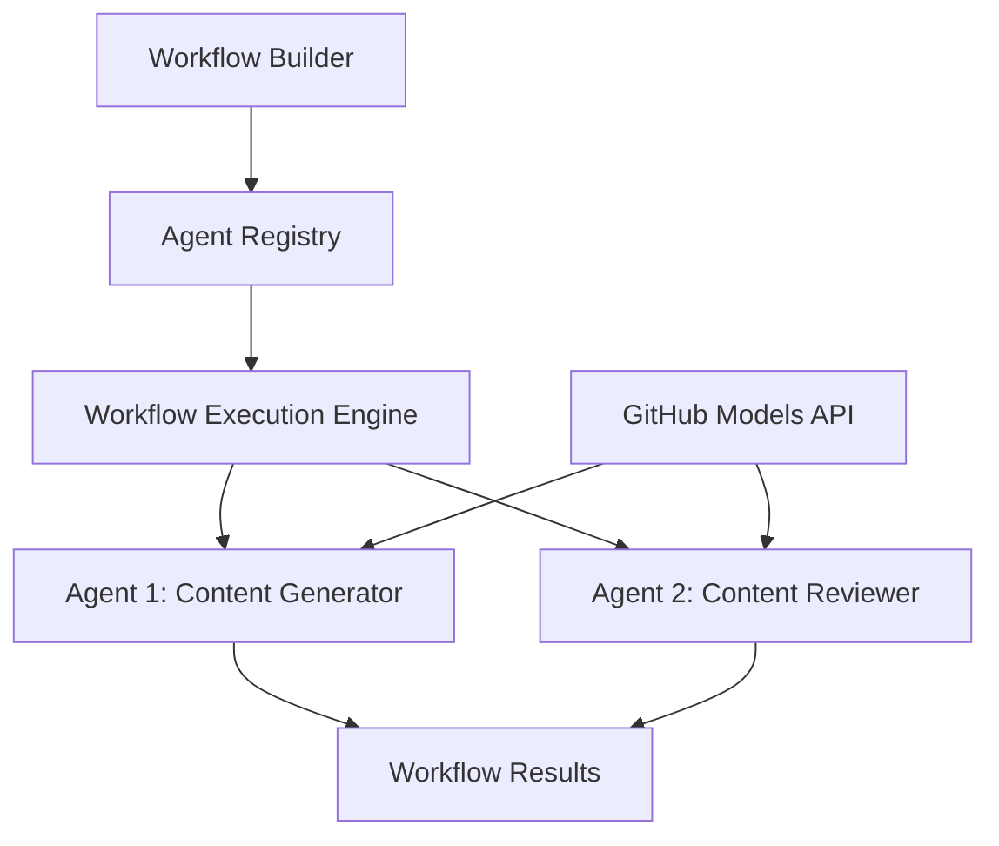

<!--
CO_OP_TRANSLATOR_METADATA:
{
  "original_hash": "034158688d0a45aae06dcbb21b0da5ae",
  "translation_date": "2025-11-11T12:40:51+00:00",
  "source_file": "08-multi-agent/code_samples/workflows-agent-framework/dotNET/01.dotnet-agent-framework-workflow-ghmodel-basic.md",
  "language_code": "fa"
}
-->
# 🔄 جریان‌های کاری پایه‌ای عامل با مدل‌های GitHub (.NET)

## 📋 آموزش هماهنگی جریان کاری

این دفترچه نشان می‌دهد که چگونه می‌توان جریان‌های کاری پیچیده **عامل** را با استفاده از چارچوب عامل مایکروسافت برای .NET و مدل‌های GitHub ایجاد کرد. شما یاد خواهید گرفت که فرآیندهای چندمرحله‌ای کسب‌وکار را طراحی کنید که در آن عوامل هوش مصنوعی با همکاری یکدیگر وظایف پیچیده را از طریق الگوهای هماهنگی ساختاری انجام دهند.

## 🎯 اهداف یادگیری

### 🏗️ **مبانی معماری جریان کاری**
- **سازنده جریان کاری**: طراحی و هماهنگی فرآیندهای پیچیده چندمرحله‌ای هوش مصنوعی
- **هماهنگی عامل‌ها**: هماهنگی چندین عامل تخصصی در جریان‌های کاری
- **ادغام مدل‌های GitHub**: استفاده از سرویس استنتاج مدل‌های هوش مصنوعی GitHub در جریان‌های کاری
- **طراحی بصری جریان کاری**: ایجاد و نمایش ساختارهای جریان کاری برای درک بهتر

### 🔄 **الگوهای هماهنگی فرآیند**
- **پردازش ترتیبی**: زنجیره‌ای کردن وظایف عامل‌ها به ترتیب منطقی
- **مدیریت وضعیت**: حفظ زمینه و جریان داده در مراحل مختلف جریان کاری
- **مدیریت خطا**: پیاده‌سازی بازیابی خطا و مقاومت جریان کاری
- **بهینه‌سازی عملکرد**: طراحی جریان‌های کاری کارآمد برای عملیات در مقیاس سازمانی

### 🏢 **کاربردهای جریان کاری سازمانی**
- **اتوماسیون فرآیندهای کسب‌وکار**: خودکارسازی جریان‌های کاری پیچیده سازمانی
- **خط تولید محتوا**: جریان‌های کاری ویرایشی با مراحل بررسی و تأیید
- **اتوماسیون خدمات مشتری**: حل چندمرحله‌ای درخواست‌های مشتری
- **جریان‌های کاری پردازش داده**: جریان‌های ETL با تبدیل‌های مبتنی بر هوش مصنوعی

## ⚙️ پیش‌نیازها و تنظیمات

### 📦 **بسته‌های ضروری NuGet**

این نمایش جریان کاری از چندین بسته کلیدی .NET استفاده می‌کند:

```xml
<!-- Core AI Framework -->
<PackageReference Include="Microsoft.Extensions.AI" Version="9.9.0" />

<!-- Agent Framework (Local Development) -->
<!-- Microsoft.Agents.AI.dll - Core agent abstractions -->
<!-- Microsoft.Agents.AI.OpenAI.dll - OpenAI/GitHub Models integration -->

<!-- Configuration and Environment -->
<PackageReference Include="DotNetEnv" Version="3.1.1" />
```

### 🔑 **پیکربندی مدل‌های GitHub**

**تنظیم محیط (.env file):**
```env
GITHUB_TOKEN=your_github_personal_access_token
GITHUB_ENDPOINT=https://models.inference.ai.azure.com
GITHUB_MODEL_ID=gpt-4o-mini
```

**دسترسی به مدل‌های GitHub:**
1. ثبت‌نام در مدل‌های GitHub (در حال حاضر در پیش‌نمایش)
2. ایجاد یک توکن دسترسی شخصی با مجوزهای دسترسی به مدل
3. پیکربندی متغیرهای محیطی همانطور که در بالا نشان داده شده است

### 🏗️ **نمای کلی معماری جریان کاری**



**اجزای کلیدی:**
- **WorkflowBuilder**: موتور اصلی هماهنگی برای طراحی جریان‌های کاری
- **AIAgent**: عامل‌های تخصصی فردی با قابلیت‌های خاص
- **GitHub Models Client**: ادغام سرویس استنتاج مدل‌های هوش مصنوعی
- **Execution Context**: مدیریت وضعیت و جریان داده بین مراحل جریان کاری

## 🎨 **الگوهای طراحی جریان کاری سازمانی**

### 📝 **جریان کاری تولید محتوا**
```
User Request → Content Generation → Quality Review → Final Output
```

### 🔍 **خط پردازش اسناد**
```
Document Input → Analysis → Extraction → Validation → Structured Output
```

### 💼 **جریان کاری هوش تجاری**
```
Data Collection → Processing → Analysis → Report Generation → Distribution
```

### 🤝 **اتوماسیون خدمات مشتری**
```
Customer Inquiry → Classification → Processing → Response Generation → Follow-up
```

## 🏢 **مزایای سازمانی**

### 🎯 **قابلیت اطمینان و مقیاس‌پذیری**
- **اجرای تعیین‌کننده**: نتایج جریان کاری ثابت و قابل تکرار
- **بازیابی خطا**: مدیریت مناسب شکست‌ها در هر مرحله از جریان کاری
- **نظارت بر عملکرد**: ردیابی معیارهای اجرا و فرصت‌های بهینه‌سازی
- **مدیریت منابع**: تخصیص و استفاده کارآمد از منابع مدل‌های هوش مصنوعی

### 🔒 **امنیت و انطباق**
- **احراز هویت امن**: احراز هویت مبتنی بر توکن GitHub برای دسترسی به API
- **ردیابی حسابرسی**: ثبت کامل اجرای جریان کاری و نقاط تصمیم‌گیری
- **کنترل دسترسی**: مجوزهای دقیق برای اجرای جریان کاری و نظارت
- **حریم خصوصی داده‌ها**: مدیریت امن اطلاعات حساس در طول جریان‌های کاری

### 📊 **مشاهده‌پذیری و مدیریت**
- **طراحی بصری جریان کاری**: نمایش واضح جریان‌های فرآیند و وابستگی‌ها
- **نظارت بر اجرا**: ردیابی لحظه‌ای پیشرفت و عملکرد جریان کاری
- **گزارش خطا**: تحلیل دقیق خطاها و قابلیت‌های اشکال‌زدایی
- **تحلیل عملکرد**: معیارهایی برای بهینه‌سازی و برنامه‌ریزی ظرفیت

بیایید اولین جریان کاری هوش مصنوعی آماده سازمانی خود را بسازیم! 🚀

## 💻 اجرای کد

پیاده‌سازی کامل در `01.dotnet-agent-framework-workflow-ghmodel-basic.cs` موجود است. این فایل نشان می‌دهد:

1. **پیکربندی محیط** - بارگذاری اعتبارنامه‌های مدل‌های GitHub از فایل `.env`
2. **تنظیم کلاینت OpenAI** - پیکربندی کلاینت برای استفاده از نقطه پایانی مدل‌های GitHub
3. **ایجاد عامل‌ها** - تعریف عامل‌های تخصصی (Front Desk و Concierge)
4. **سازنده جریان کاری** - ایجاد جریان کاری چندعاملی با پردازش ترتیبی
5. **اجرای جریان کاری** - اجرای جریان کاری با نتایج استریم‌شده

### 🚀 اجرای مثال

```bash
# Make the script executable (Unix/Linux/macOS)
chmod +x 01.dotnet-agent-framework-workflow-ghmodel-basic.cs

# Run the workflow
./01.dotnet-agent-framework-workflow-ghmodel-basic.cs
```

یا در ویندوز:
```powershell
dotnet run 01.dotnet-agent-framework-workflow-ghmodel-basic.cs
```

### 📝 خروجی مورد انتظار

جریان کاری:
1. درخواست مقصد سفر شما را می‌پذیرد ("می‌خواهم به پاریس بروم")
2. عامل Front Desk یک توصیه اولیه ارائه می‌دهد
3. عامل Concierge توصیه را بررسی و اصلاح می‌کند
4. خروجی نهایی مکالمه کامل را نمایش می‌دهد

### 🔧 سفارشی‌سازی

شما می‌توانید جریان کاری را با:
- تغییر دستورالعمل‌های عامل‌ها برای تغییر رفتار آن‌ها
- افزودن عامل‌های بیشتر برای ایجاد جریان‌های کاری پیچیده‌تر
- تغییر پیام کاربر برای آزمایش سناریوهای مختلف
- تنظیم لبه‌های جریان کاری برای ایجاد الگوهای اجرای متفاوت

---

<!-- CO-OP TRANSLATOR DISCLAIMER START -->
**سلب مسئولیت**:  
این سند با استفاده از سرویس ترجمه هوش مصنوعی [Co-op Translator](https://github.com/Azure/co-op-translator) ترجمه شده است. در حالی که ما تلاش می‌کنیم دقت را حفظ کنیم، لطفاً توجه داشته باشید که ترجمه‌های خودکار ممکن است شامل خطاها یا نادرستی‌ها باشند. سند اصلی به زبان اصلی آن باید به عنوان منبع معتبر در نظر گرفته شود. برای اطلاعات حیاتی، ترجمه حرفه‌ای انسانی توصیه می‌شود. ما مسئولیتی در قبال سوء تفاهم‌ها یا تفسیرهای نادرست ناشی از استفاده از این ترجمه نداریم.
<!-- CO-OP TRANSLATOR DISCLAIMER END -->