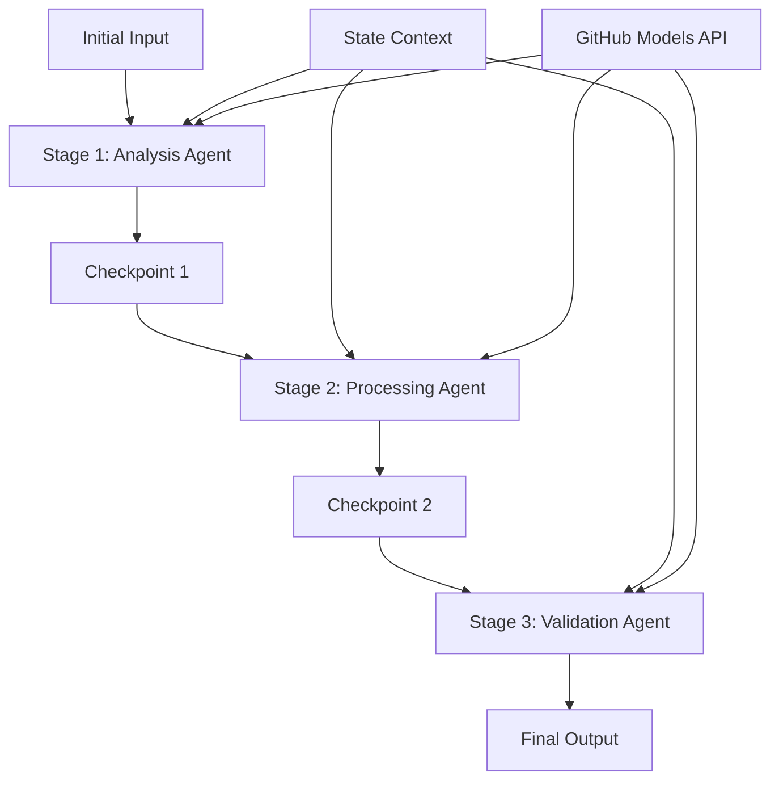

<!--
CO_OP_TRANSLATOR_METADATA:
{
  "original_hash": "1be9c8dcbd79a02d33d2c138684c1394",
  "translation_date": "2025-11-11T13:41:49+00:00",
  "source_file": "08-multi-agent/code_samples/workflows-agent-framework/dotNET/02.dotnet-agent-framework-workflow-ghmodel-sequential.md",
  "language_code": "fa"
}
-->
# ⏩ جریان‌های کاری متوالی عامل‌ها با مدل‌های GitHub (.NET)

## 📋 آموزش پیشرفته پردازش متوالی

این دفترچه آموزشی **الگوهای جریان کاری متوالی** را با استفاده از چارچوب عامل مایکروسافت برای .NET و مدل‌های GitHub نشان می‌دهد. شما یاد خواهید گرفت که چگونه خطوط پردازش پیچیده و مرحله به مرحله‌ای بسازید که در آن عامل‌ها به ترتیب خاصی اجرا شوند و هر مرحله بر اساس نتایج مرحله قبلی بنا شود.

## 🎯 اهداف آموزشی

### 🔄 **معماری پردازش متوالی**
- **طراحی جریان کاری خطی**: ایجاد خطوط پردازش مرحله به مرحله با وابستگی‌های مشخص
- **مدیریت وضعیت**: حفظ زمینه و جریان داده در مراحل مختلف جریان کاری
- **ادغام مدل‌های GitHub**: استفاده از مدل‌های هوش مصنوعی GitHub در جریان‌های کاری چندمرحله‌ای .NET
- **الگوهای خطوط تولید سازمانی**: ساخت سیستم‌های پردازش متوالی آماده تولید

### 🏗️ **الگوهای پیشرفته متوالی**
- **پردازش مرحله‌ای**: پیاده‌سازی نقاط اعتبارسنجی بین مراحل جریان کاری
- **حفظ زمینه**: حفظ وضعیت و دانش انباشته شده در تمام مراحل
- **انتقال خطا**: مدیریت شکست‌ها به صورت مؤثر در زنجیره‌های پردازش متوالی
- **بهینه‌سازی عملکرد**: اجرای متوالی کارآمد با حداقل سربار

### 🏢 **کاربردهای متوالی سازمانی**
- **خط پردازش اسناد**: تحلیل، تبدیل و اعتبارسنجی چندمرحله‌ای اسناد
- **جریان‌های کاری تضمین کیفیت**: بررسی، اعتبارسنجی و فرآیندهای تأیید متوالی
- **خط تولید محتوا**: تحقیق → نگارش → ویرایش → بررسی → انتشار
- **اتوماسیون فرآیندهای کسب‌وکار**: جریان‌های کاری چندمرحله‌ای با وابستگی‌های مشخص مراحل

## ⚙️ پیش‌نیازها و تنظیمات

### 📦 **بسته‌های ضروری NuGet**

بسته‌های ضروری برای جریان‌های کاری متوالی .NET:

```xml
<!-- Core AI Framework -->
<PackageReference Include="Microsoft.Extensions.AI" Version="9.9.0" />

<!-- Client Model Abstractions -->
<PackageReference Include="System.ClientModel" Version="1.6.1.0" />

<!-- Azure Identity and Async LINQ Support -->
<PackageReference Include="Azure.Identity" Version="1.15.0" />
<PackageReference Include="System.Linq.Async" Version="6.0.3" />

<!-- Local Agent Framework References -->
<!-- Microsoft.Agents.AI.dll - Core agent abstractions -->
<!-- Microsoft.Agents.AI.OpenAI.dll - GitHub Models integration -->
```

### 🔑 **پیکربندی مدل‌های GitHub**

**تنظیم محیط (.env file):**
```env
GITHUB_TOKEN=your_github_personal_access_token
GITHUB_ENDPOINT=https://models.inference.ai.azure.com
GITHUB_MODEL_ID=gpt-4o-mini
```

**مدیریت پیکربندی:**
```csharp
// Load environment variables securely
Env.Load("../../../.env");
var githubToken = Environment.GetEnvironmentVariable("GITHUB_TOKEN");
var githubEndpoint = Environment.GetEnvironmentVariable("GITHUB_ENDPOINT");
var modelId = Environment.GetEnvironmentVariable("GITHUB_MODEL_ID");
```

### 🏗️ **معماری جریان کاری متوالی**



**اجزای کلیدی:**
- **عامل‌های متوالی**: عامل‌های تخصصی برای هر مرحله پردازش
- **زمینه وضعیت**: حفظ داده‌ها و تصمیمات انباشته شده در مراحل مختلف
- **نقاط اعتبارسنجی**: نقاط بررسی بین مراحل برای تضمین کیفیت و سازگاری
- **کلاینت مدل‌های GitHub**: دسترسی ثابت به مدل‌های هوش مصنوعی در تمام مراحل جریان کاری

## 🎨 **الگوهای طراحی جریان کاری متوالی**

### 📝 **خط پردازش اسناد**
```
Raw Document → Content Extraction → Analysis → Validation → Structured Output
```

### 🎯 **جریان تولید محتوا**
```
Brief/Requirements → Research → Content Creation → Review → Final Polish
```

### 🔍 **خط تضمین کیفیت**
```
Initial Review → Technical Validation → Compliance Check → Final Approval
```

### 💼 **جریان هوش تجاری**
```
Data Collection → Processing → Analysis → Report Generation → Distribution
```

## 🏢 **مزایای متوالی سازمانی**

### 🎯 **قابلیت اطمینان و کیفیت**
- **پردازش قطعی**: نتایج ثابت و قابل تکرار از طریق مراحل ساختاریافته
- **دروازه‌های کیفیت**: نقاط اعتبارسنجی کیفیت را در هر مرحله تضمین می‌کنند
- **ایزوله‌سازی خطا**: مشکلات در یک مرحله به مراحل بعدی منتقل نمی‌شوند
- **ردیابی کامل**: پیگیری کامل تصمیمات و تغییرات در هر مرحله

### 📈 **مقیاس‌پذیری و عملکرد**
- **طراحی ماژولار**: هر مرحله می‌تواند به صورت مستقل بهینه شود
- **مدیریت منابع**: تخصیص کارآمد منابع مدل‌های هوش مصنوعی در مراحل مختلف
- **بهینه‌سازی وضعیت**: انتقال حداقلی وضعیت بین مراحل برای عملکرد بهینه
- **گروه‌های مرحله‌ای موازی**: چندین جریان کاری متوالی می‌توانند به صورت موازی اجرا شوند

### 🔒 **امنیت و انطباق**
- **امنیت در سطح مرحله**: سیاست‌های امنیتی مختلف برای مراحل مختلف پردازش
- **اعتبارسنجی داده‌ها**: تضمین یکپارچگی داده‌ها و انطباق در هر نقطه بررسی
- **کنترل دسترسی**: مجوزهای دقیق برای مراحل مختلف جریان کاری
- **انطباق قانونی**: رعایت الزامات قانونی از طریق پردازش ساختاریافته

### 📊 **نظارت و تحلیل**
- **معیارهای سطح مرحله**: نظارت بر عملکرد هر مرحله جریان کاری
- **شناسایی گلوگاه‌ها**: شناسایی و بهینه‌سازی مراحل کند
- **معیارهای کیفیت**: پیگیری کیفیت و نرخ موفقیت در هر مرحله
- **بهینه‌سازی فرآیند**: بهبود مستمر بر اساس تحلیل‌های سطح مرحله

بیایید خطوط پردازش هوش مصنوعی متوالی قدرتمندی بسازیم! 🚀

## 💻 اجرای کد

پیاده‌سازی کامل در فایل `02.dotnet-agent-framework-workflow-ghmodel-sequential.cs` موجود است. این فایل یک **جریان کاری سه مرحله‌ای تحلیل مبلمان** را نشان می‌دهد:

1. **مرحله 1 - عامل فروش**: تصاویر مبلمان را تحلیل کرده و پیشنهادات خرید ارائه می‌دهد
2. **مرحله 2 - عامل قیمت**: تحلیل جزئی قیمت‌ها و گزینه‌های بودجه را ارائه می‌دهد
3. **مرحله 3 - عامل پیشنهاد قیمت**: یک سند پیشنهاد قیمت حرفه‌ای به فرمت Markdown تولید می‌کند

### 🏗️ **معماری جریان کاری**

```
Image Input → Sales Analysis → Price Estimation → Quote Generation → Final Output
```

هر عامل:
- خروجی مرحله قبلی را به عنوان زمینه دریافت می‌کند
- بر اساس تحلیل قبلی با تخصص خاص خود بنا می‌کند
- تداوم جریان کاری را از طریق مدیریت وضعیت حفظ می‌کند

### 🚀 اجرای مثال

**پیش‌نیازها:**
- یک تصویر مبلمان را در مسیر `../imgs/home.png` قرار دهید (یا متغیر `imgPath` را به‌روزرسانی کنید)
- فایل `.env` خود را با اطلاعات اعتبار مدل‌های GitHub پیکربندی کنید

```bash
# Make the script executable (Unix/Linux/macOS)
chmod +x 02.dotnet-agent-framework-workflow-ghmodel-sequential.cs

# Run the sequential workflow
./02.dotnet-agent-framework-workflow-ghmodel-sequential.cs
```

یا در ویندوز:
```powershell
dotnet run 02.dotnet-agent-framework-workflow-ghmodel-sequential.cs
```

### 📝 خروجی مورد انتظار

جریان کاری:
1. **عامل فروش**: اقلام مبلمان را از تصویر شناسایی کرده و پیشنهادات ارائه می‌دهد
2. **عامل قیمت**: تحلیل جزئی قیمت‌ها با سطوح بودجه و پیشنهادات خرید اضافه می‌کند
3. **عامل پیشنهاد قیمت**: یک سند پیشنهاد قیمت قالب‌بندی شده با تمام اطلاعات ترکیب شده تولید می‌کند

خروجی نهایی یک پیشنهاد قیمت جامع و حرفه‌ای مبلمان بر اساس تحلیل تصویر خواهد بود.

### 🔧 گزینه‌های سفارشی‌سازی

**تغییر رفتار عامل:**
```csharp
// Adjust agent instructions to change their focus
const string SalesAgentInstructions = "Your custom instructions...";
```

**تغییر جریان متوالی:**
```csharp
// Add or reorder workflow stages
var workflow = new WorkflowBuilder(salesagent)
    .AddEdge(salesagent, priceagent)
    .AddEdge(priceagent, quoteagent)
    .AddEdge(quoteagent, newAgent)  // Add another stage
    .Build();
```

**استفاده از ورودی متفاوت:**
```csharp
// Process text instead of images
ChatMessage userMessage = new ChatMessage(ChatRole.User, [
    new TextContent("Analyze pricing for a modern living room set")
]);
```

### 🎯 کاربردهای واقعی

این الگوی متوالی برای موارد زیر ایده‌آل است:
- **تجارت الکترونیک**: تحلیل محصول → قیمت‌گذاری → تولید پیشنهاد
- **املاک و مستغلات**: تحلیل ملک → ارزیابی → ایجاد لیست
- **بیمه**: تحلیل ادعا → ارزیابی → تولید پیشنهاد
- **تولید محتوا**: تحقیق → نگارش → ویرایش → انتشار

### 🔍 درک جریان وضعیت

هر عامل در دنباله دریافت می‌کند:
- **ورودی اصلی**: پیام اولیه کاربر (تصویر + متن)
- **خروجی‌های عامل‌های قبلی**: تمام پاسخ‌های عامل‌های قبلی در تاریخچه مکالمه
- **زمینه انباشته شده**: وضعیت کامل حفظ شده در طول جریان کاری

این امکان پردازش چندمرحله‌ای پیچیده را فراهم می‌کند که در آن هر عامل بر اساس زمینه جامع از تمام مراحل قبلی بنا می‌کند.

---

<!-- CO-OP TRANSLATOR DISCLAIMER START -->
**سلب مسئولیت**:  
این سند با استفاده از سرویس ترجمه هوش مصنوعی [Co-op Translator](https://github.com/Azure/co-op-translator) ترجمه شده است. در حالی که ما تلاش می‌کنیم دقت را حفظ کنیم، لطفاً توجه داشته باشید که ترجمه‌های خودکار ممکن است شامل خطاها یا نادرستی‌ها باشند. سند اصلی به زبان اصلی آن باید به عنوان منبع معتبر در نظر گرفته شود. برای اطلاعات حیاتی، ترجمه حرفه‌ای انسانی توصیه می‌شود. ما مسئولیتی در قبال سوء تفاهم‌ها یا تفسیرهای نادرست ناشی از استفاده از این ترجمه نداریم.
<!-- CO-OP TRANSLATOR DISCLAIMER END -->