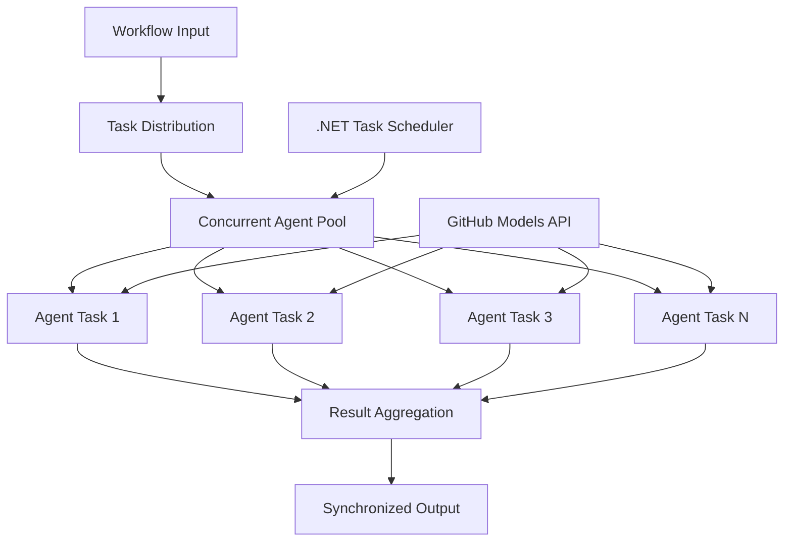

<!--
CO_OP_TRANSLATOR_METADATA:
{
  "original_hash": "b9c6e32c9b5f2fed20b6916984440d88",
  "translation_date": "2025-11-11T13:07:35+00:00",
  "source_file": "08-multi-agent/code_samples/workflows-agent-framework/dotNET/03.dotnet-agent-framework-workflow-ghmodel-concurrent.md",
  "language_code": "fa"
}
-->
# ⚡ جریان‌های کاری همزمان عامل‌ها با مدل‌های GitHub (.NET)

## 📋 آموزش پردازش موازی با عملکرد بالا

این دفترچه راهنما الگوهای **جریان کاری همزمان** را با استفاده از Microsoft Agent Framework برای .NET و مدل‌های GitHub نشان می‌دهد. شما یاد خواهید گرفت که چگونه جریان‌های کاری پردازش موازی با عملکرد بالا ایجاد کنید که با اجرای همزمان چندین عامل هوش مصنوعی، بهره‌وری را به حداکثر برسانید و در عین حال هماهنگی و انسجام داده‌ها را حفظ کنید.

## 🎯 اهداف یادگیری

### 🚀 **مبانی پردازش همزمان**
- **اجرای موازی عامل‌ها**: اجرای همزمان چندین عامل هوش مصنوعی برای عملکرد بهینه
- **الگوهای Async/Await**: استفاده از مدل برنامه‌نویسی async در .NET برای همزمانی کارآمد
- **ادغام مدل‌های GitHub**: هماهنگی چندین فراخوانی همزمان به سرویس استنتاج مدل‌های هوش مصنوعی GitHub
- **مدیریت منابع**: مدیریت کارآمد منابع مدل‌های هوش مصنوعی در عملیات همزمان

### 🏗️ **معماری پیشرفته همزمانی**
- **موازی‌سازی مبتنی بر وظیفه**: استفاده از کتابخانه موازی وظیفه در .NET برای اجرای بهینه همزمان
- **الگوهای هماهنگی**: هماهنگی عامل‌های همزمان در حالی که از شرایط رقابتی جلوگیری می‌شود
- **تعادل بار**: توزیع کار به صورت کارآمد در ظرفیت پردازش همزمان موجود
- **تحمل خطا**: مدیریت شکست‌های فردی عامل‌ها بدون توقف کل جریان کاری

### 🏢 **برنامه‌های همزمان سازمانی**
- **پردازش اسناد با حجم بالا**: پردازش همزمان چندین سند
- **تحلیل محتوای بلادرنگ**: تحلیل همزمان جریان‌های داده ورودی
- **بهینه‌سازی پردازش دسته‌ای**: به حداکثر رساندن بهره‌وری برای عملیات پردازش داده‌های بزرگ
- **تحلیل چندوجهی**: پردازش موازی انواع و فرمت‌های مختلف محتوا

## ⚙️ پیش‌نیازها و تنظیمات

### 📦 **بسته‌های ضروری NuGet**

بسته‌های ضروری برای جریان‌های کاری همزمان با عملکرد بالا:

```xml
<!-- Core AI Framework with Async Support -->
<PackageReference Include="Microsoft.Extensions.AI" Version="9.9.0" />

<!-- Client Model Abstractions for API Communication -->
<PackageReference Include="System.ClientModel" Version="1.6.1.0" />

<!-- Azure Identity and Async LINQ for Advanced Operations -->
<PackageReference Include="Azure.Identity" Version="1.15.0" />
<PackageReference Include="System.Linq.Async" Version="6.0.3" />

<!-- Local Agent Framework References -->
<!-- Microsoft.Agents.AI.dll - Core agent abstractions with async support -->
<!-- Microsoft.Agents.AI.OpenAI.dll - GitHub Models integration with concurrency -->
```

### 🔑 **پیکربندی مدل‌های GitHub**

**تنظیم محیط (.env file):**
```env
GITHUB_TOKEN=your_github_personal_access_token
GITHUB_ENDPOINT=https://models.inference.ai.azure.com
GITHUB_MODEL_ID=gpt-4o-mini
```

**ملاحظات پردازش همزمان:**
```csharp
// Configure for concurrent operations
var clientOptions = new OpenAIClientOptions()
{
    Endpoint = new Uri(githubEndpoint),
    // Configure connection pooling for concurrent requests
    NetworkTimeout = TimeSpan.FromMinutes(5)
};
```

### 🏗️ **معماری جریان کاری همزمان**



**اجزای کلیدی:**
- **کتابخانه موازی وظیفه**: پشتیبانی داخلی .NET برای عملیات همزمان
- **مخزن عامل‌ها**: چندین نمونه عامل برای پردازش موازی
- **تجمیع نتایج**: هماهنگی و ادغام نتایج عامل‌های همزمان
- **نقاط هماهنگی**: تضمین انسجام داده‌ها در عملیات همزمان

## 🎨 **الگوهای طراحی جریان کاری همزمان**

### 🔍 **تحقیق و تحلیل موازی**
```
Research Topic → Concurrent Research Agents → Result Synthesis → Final Report
```

### 📊 **پردازش داده‌های چندمنبعی**
```
Data Sources → Parallel Processing Agents → Data Integration → Unified Output
```

### 🎭 **خط تولید محتوای همزمان**
```
Content Requirements → Concurrent Content Generators → Quality Review → Final Content
```

### 🔄 **پردازش Fan-Out/Fan-In**
```
Single Input → Multiple Concurrent Processors → Result Aggregation → Single Output
```

## 🏢 **مزایای عملکرد سازمانی**

### ⚡ **بهره‌وری و مقیاس‌پذیری**
- **مقیاس‌پذیری خطی عملکرد**: افزودن عامل‌های همزمان بیشتر برای افزایش بهره‌وری
- **استفاده از منابع**: بهره‌وری حداکثری از ظرفیت مدل‌های هوش مصنوعی موجود
- **کاهش زمان پردازش**: کاهش قابل توجه زمان از طریق اجرای موازی
- **مقیاس‌پذیری الاستیک**: تنظیم پویا تعداد عامل‌های همزمان بر اساس حجم کار

### 🛡️ **قابلیت اطمینان و مقاومت**
- **ایزوله‌سازی خطا**: شکست‌های فردی عامل‌ها بر عملیات همزمان دیگر تأثیر نمی‌گذارد
- **کاهش تدریجی**: سیستم با ظرفیت کاهش‌یافته عامل‌ها به کار خود ادامه می‌دهد
- **بازیابی خطا**: مکانیسم‌های تلاش مجدد خودکار برای عملیات همزمان شکست‌خورده
- **توزیع بار**: توزیع یکنواخت کار در میان عامل‌های موجود

### 📊 **نظارت بر عملکرد**
- **معیارهای اجرای همزمان**: ردیابی عملکرد تمام عملیات موازی
- **تحلیل استفاده از منابع**: نظارت بر استفاده از CPU، حافظه و شبکه
- **تحلیل بهره‌وری**: اندازه‌گیری سودمندی حاصل از پردازش همزمان
- **شناسایی گلوگاه‌ها**: شناسایی و رفع محدودیت‌های عملکرد

### 🔧 **توسعه و عملیات**
- **مدل برنامه‌نویسی Async**: استفاده از الگوهای بالغ async/await در .NET
- **هماهنگی وظایف**: قابلیت‌های مدیریت و هماهنگی وظایف داخلی
- **مدیریت استثنا**: مدیریت جامع خطاها برای عملیات همزمان
- **پشتیبانی از اشکال‌زدایی**: ابزارهای اشکال‌زدایی Visual Studio برای جریان‌های کاری همزمان

بیایید جریان‌های کاری هوش مصنوعی همزمان با عملکرد بالا را با .NET بسازیم! 🚀

## 💻 اجرای کد

پیاده‌سازی کامل در فایل `03.dotnet-agent-framework-workflow-ghmodel-concurrent.cs` موجود است. این فایل یک **جریان کاری Fan-Out/Fan-In همزمان** برای برنامه‌ریزی سفر را نشان می‌دهد:

### 🏗️ **معماری جریان کاری**

```
User Request → ConcurrentStartExecutor → [Researcher Agent || Planner Agent] → ConcurrentAggregationExecutor → Final Output
```

**اجزای کلیدی:**

1. **ConcurrentStartExecutor**: درخواست کاربر را به طور همزمان به همه عامل‌ها ارسال می‌کند
2. **عامل محقق**: به طور همزمان مقصدها و جاذبه‌ها را تحلیل می‌کند
3. **عامل برنامه‌ریز**: برنامه‌های سفر دقیق را به طور همزمان ایجاد می‌کند
4. **ConcurrentAggregationExecutor**: نتایج هر دو عامل را جمع‌آوری و ادغام می‌کند

### 🎯 **الگوی Fan-Out/Fan-In**

این جریان کاری الگوی کلاسیک **Fan-Out/Fan-In** را نشان می‌دهد:
- **Fan-Out**: یک پیام ورودی به طور همزمان به چندین عامل ارسال می‌شود
- **پردازش همزمان**: چندین عامل به طور موازی روی یک وظیفه کار می‌کنند
- **Fan-In**: نتایج همه عامل‌ها جمع‌آوری و به یک خروجی واحد ادغام می‌شود

### 🚀 اجرای مثال

```bash
# Make the script executable (Unix/Linux/macOS)
chmod +x 03.dotnet-agent-framework-workflow-ghmodel-concurrent.cs

# Run the concurrent workflow
./03.dotnet-agent-framework-workflow-ghmodel-concurrent.cs
```

یا در ویندوز:
```powershell
dotnet run 03.dotnet-agent-framework-workflow-ghmodel-concurrent.cs
```

### 📝 خروجی مورد انتظار

جریان کاری:
1. **ارسال درخواست**: ارسال "برنامه‌ریزی سفری به سیاتل در دسامبر" به هر دو عامل
2. **پردازش همزمان**: هر دو عامل به طور همزمان کار می‌کنند:
   - محقق جاذبه‌ها و جزئیات را شناسایی می‌کند
   - برنامه‌ریز برنامه سفر و لجستیک را ایجاد می‌کند
3. **ادغام**: ترکیب هر دو پاسخ به یک خروجی جامع
4. **نمایش نتایج**: نمایش برنامه سفر ادغام‌شده با تمام اطلاعات

### 🔧 گزینه‌های سفارشی‌سازی

**افزودن عامل‌های همزمان بیشتر:**
```csharp
// Create additional specialized agents
AIAgent budgetAgent = openAIClient.GetChatClient(github_model_id).CreateAIAgent(
    name: "Budget-Agent", instructions: "Calculate travel costs...");

// Add to fan-out
var workflow = new WorkflowBuilder(startExecutor)
    .AddFanOutEdge(startExecutor, targets: [researcherAgent, plannerAgent, budgetAgent])
    .AddFanInEdge(aggregationExecutor, sources: [researcherAgent, plannerAgent, budgetAgent])
    .WithOutputFrom(aggregationExecutor)
    .Build();

// Update aggregation count
if (this._messages.Count == 3) { ... }
```

**تغییر دستورالعمل‌های عامل:**
```csharp
const string ResearcherAgentInstructions = "Your custom instructions for research...";
const string PlanAgentInstructions = "Your custom instructions for planning...";
```

**تغییر وظیفه:**
```csharp
StreamingRun run = await InProcessExecution.StreamAsync(
    workflow, 
    "Plan a European vacation for 2 weeks in summer"
);
```

### 🎯 کاربردهای واقعی

این الگوی همزمان برای موارد زیر ایده‌آل است:
- **ایجاد محتوا**: نویسندگان متعدد که به طور همزمان بخش‌های مختلف را ایجاد می‌کنند
- **بررسی کد**: بازبین‌های متعدد که کد را از دیدگاه‌های مختلف تحلیل می‌کنند
- **تحقیق بازار**: تحلیل موازی بخش‌های مختلف بازار
- **پردازش اسناد**: استخراج، تحلیل و اعتبارسنجی همزمان
- **تحلیل چندمنظری**: دریافت دیدگاه‌های متنوع درباره یک ورودی واحد

### 🔍 درک اجراکننده‌های سفارشی

**ConcurrentStartExecutor:**
- پیاده‌سازی `IMessageHandler<string>` برای پذیرش ورودی رشته‌ای
- ارسال پیام‌ها به همه عامل‌های متصل
- ارسال `TurnToken` برای شروع پردازش همزمان

**ConcurrentAggregationExecutor:**
- پیاده‌سازی `IMessageHandler<ChatMessage>` برای دریافت پاسخ‌های عامل‌ها
- جمع‌آوری پیام‌ها به صورت ایمن در برابر رشته‌ها
- ادغام زمانی که همه پاسخ‌های مورد انتظار دریافت شدند
- ارائه خروجی نهایی با استفاده از `context.YieldOutputAsync()`

### ⚡ مزایای عملکرد

**همزمان در مقابل ترتیبی:**
- ترتیبی: عامل1 (30 ثانیه) → عامل2 (30 ثانیه) = **60 ثانیه کل**
- همزمان: عامل1 (30 ثانیه) || عامل2 (30 ثانیه) = **30 ثانیه کل**

**بهبود بهره‌وری**: تا N× سریع‌تر برای N عامل همزمان (بسته به حجم کار و منابع)

### 🛡️ مدیریت خطا

جریان کاری شکست‌های فردی عامل‌ها را به خوبی مدیریت می‌کند:
- اگر یک عامل شکست بخورد، دیگران به پردازش ادامه می‌دهند
- ادغام‌کننده می‌تواند منطق زمان‌بندی را پیاده‌سازی کند
- نتایج جزئی در صورت نیاز می‌توانند بازگردانده شوند

### 📊 ویژگی‌های پیشرفته

**تعداد عامل‌های پویا:**
منطق ادغام را برای پشتیبانی از تعداد متغیر عامل‌ها تغییر دهید:

```csharp
private int _expectedAgentCount;
private readonly List<ChatMessage> _messages = [];

public async ValueTask HandleAsync(ChatMessage message, IWorkflowContext context)
{
    this._messages.Add(message);
    if (this._messages.Count == _expectedAgentCount)
    {
        // Process aggregation
    }
}
```

این الگوی جریان کاری همزمان برای ساخت سیستم‌های عامل هوش مصنوعی با عملکرد بالا و مقیاس‌پذیر ضروری است!

---

<!-- CO-OP TRANSLATOR DISCLAIMER START -->
**سلب مسئولیت**:  
این سند با استفاده از سرویس ترجمه هوش مصنوعی [Co-op Translator](https://github.com/Azure/co-op-translator) ترجمه شده است. در حالی که ما تلاش می‌کنیم دقت را حفظ کنیم، لطفاً توجه داشته باشید که ترجمه‌های خودکار ممکن است شامل خطاها یا نادرستی‌ها باشند. سند اصلی به زبان اصلی آن باید به عنوان منبع معتبر در نظر گرفته شود. برای اطلاعات حیاتی، ترجمه حرفه‌ای انسانی توصیه می‌شود. ما مسئولیتی در قبال سوء تفاهم‌ها یا تفسیرهای نادرست ناشی از استفاده از این ترجمه نداریم.
<!-- CO-OP TRANSLATOR DISCLAIMER END -->