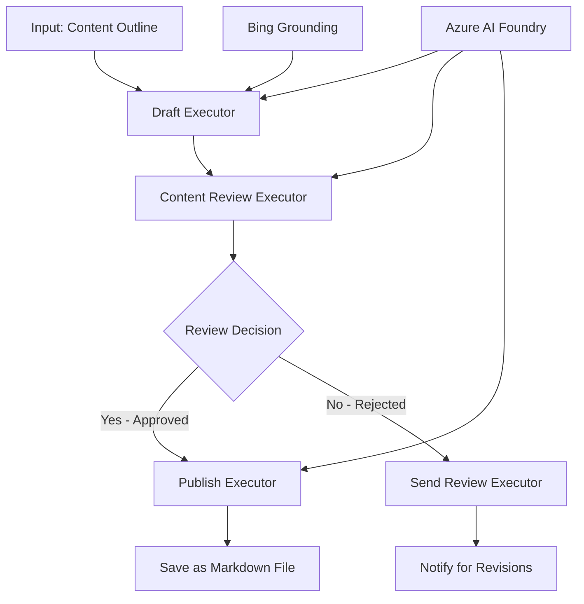

<!--
CO_OP_TRANSLATOR_METADATA:
{
  "original_hash": "8abd335151cee553293b637ee3d80d10",
  "translation_date": "2025-11-11T12:03:12+00:00",
  "source_file": "08-multi-agent/code_samples/workflows-agent-framework/dotNET/04.dotnet-agent-framework-workflow-aifoundry-condition.md",
  "language_code": "fa"
}
-->
# 🔀 جریان‌های کاری شرطی با Azure AI Foundry (.NET)

## 📋 آموزش جریان کاری مبتنی بر تصمیم‌گیری هوشمند

این دفترچه نحوه استفاده از **الگوهای جریان کاری شرطی** با Azure AI Foundry و Microsoft Agent Framework برای .NET را نشان می‌دهد. شما یاد خواهید گرفت که چگونه جریان‌های کاری پیچیده و مبتنی بر تصمیم‌گیری را ایجاد کنید که پردازش را بر اساس تحلیل هوش مصنوعی، قوانین کسب‌وکار و شرایط پویا برای اتوماسیون در سطح سازمانی به صورت هوشمندانه هدایت می‌کند.

## 🎯 اهداف آموزشی

### 🧠 **معماری تصمیم‌گیری هوشمند**
- **پیاده‌سازی منطق شرطی**: ایجاد درخت‌های تصمیم‌گیری پیچیده با نقاط شاخه‌دار متعدد
- **هدایت هوشمند مبتنی بر هوش مصنوعی**: استفاده از مدل‌های Azure AI Foundry برای تصمیم‌گیری‌های هوشمندانه در هدایت
- **تطبیق جریان کاری پویا**: تغییر رفتار جریان کاری بر اساس تحلیل و شرایط زمان اجرا
- **ادغام قوانین سازمانی**: ترکیب منطق کسب‌وکار و الزامات انطباق در جریان‌های کاری

### 🔀 **الگوهای شرطی پیشرفته**
- **تصمیم‌گیری چندمعیاره**: ارزیابی عوامل متعدد برای تصمیمات هدایت
- **پردازش آگاه از زمینه**: تصمیم‌گیری بر اساس زمینه و تاریخچه انباشته جریان کاری
- **تعدیل جریان کاری تطبیقی**: تنظیم مسیرهای پردازش به صورت پویا بر اساس شرایط لحظه‌ای
- **ادغام موتور قوانین**: پیاده‌سازی موتورهای قوانین کسب‌وکار پیچیده در جریان‌های کاری

### 🏢 **کاربردهای شرطی سازمانی**
- **طبقه‌بندی و هدایت اسناد**: طبقه‌بندی خودکار و هدایت اسناد به جریان‌های کاری مناسب
- **تریاژ خدمات مشتری**: هدایت هوشمند درخواست‌های مشتری به تیم‌های تخصصی
- **پردازش انطباق و ریسک**: اعمال فرآیندهای اعتبارسنجی و بررسی مختلف بر اساس ارزیابی ریسک
- **جریان‌های کاری تضمین کیفیت**: هدایت محتوا از طریق فرآیندهای بررسی مناسب بر اساس معیارهای کیفیت

## ⚙️ پیش‌نیازها و تنظیمات

### 📦 **بسته‌های مورد نیاز NuGet**

بسته‌های پیشرفته برای پردازش جریان کاری شرطی:

```xml
<!-- Core AI Framework -->
<PackageReference Include="Microsoft.Extensions.AI" Version="9.9.0" />

<!-- Azure AI Agents with Persistent State -->
<PackageReference Include="Azure.AI.Agents.Persistent" Version="1.2.0-beta.5" />

<!-- Azure Identity and Utilities -->
<PackageReference Include="Azure.Identity" Version="1.15.0" />
<PackageReference Include="System.Linq.Async" Version="6.0.3" />
<PackageReference Include="DotNetEnv" Version="3.1.1" />

<!-- Local Workflow Framework References -->
<!-- Microsoft.Agents.Workflows.dll - Advanced workflow orchestration -->
<!-- Microsoft.Agents.AI.AzureAI.dll - Azure AI Foundry integration -->
<!-- Microsoft.Agents.AI.dll - Core agent abstractions -->
```

### 🔑 **پیکربندی Azure AI Foundry**

**منابع مورد نیاز Azure:**
- فضای کاری Azure AI Foundry با مدل‌های پردازش شرطی
- اشتراک Azure با سهمیه‌های محاسباتی و مجوزهای مناسب
- مدل‌های هوش مصنوعی مستقر برای تصمیم‌گیری و تحلیل محتوا
- (اختیاری) اتصال API جستجوی Bing برای قابلیت‌های پایه‌گذاری

**پیکربندی محیط (.env file):**
```env
# Azure AI Foundry Configuration
AZURE_AI_PROJECT_ENDPOINT=https://your-project.cognitiveservices.azure.com/
BING_CONNECTION_ID=your-bing-connection-id
```

**تنظیمات احراز هویت:**
```csharp
// Azure CLI or Managed Identity authentication
using Azure.Identity;
var credential = new AzureCliCredential();

// Load environment configuration
DotNetEnv.Env.Load("../../../.env");
```

### 🏗️ **معماری جریان کاری شرطی**



**اجزای کلیدی:**
- **Draft Executor**: عامل هوش مصنوعی که پیش‌نویس‌های اولیه محتوا را از طرح‌ها ایجاد می‌کند
- **Content Review Executor**: عامل هوش مصنوعی که کیفیت و انطباق پیش‌نویس را ارزیابی می‌کند
- **Conditional Routing**: منطق تصمیم‌گیری که بر اساس نتایج بررسی هدایت می‌کند
- **مسیرهای انتشار/بررسی**: مسیرهای پردازش جداگانه برای محتوای تایید شده و رد شده
- **مدیریت وضعیت**: حفظ زمینه محتوا و بررسی در طول جریان کاری

## 🎨 **الگوهای طراحی جریان کاری شرطی**

### 📋 **تولید محتوا با دروازه‌های کیفیت**
```
Outline → Draft Creation → Quality Review → {Approve: Publish | Reject: Revise}
```

### 🎯 **پردازش اسناد مبتنی بر ریسک**
```
Document → Risk Assessment → {Low: Standard | High: Enhanced Review}
```

### 🔍 **هدایت هوشمند خدمات مشتری**
```
Customer Query → Analysis → {Simple: FAQ Bot | Complex: Human Agent}
```

### 💼 **جریان‌های کاری مبتنی بر انطباق**
```
Content → Compliance Check → {Pass: Publish | Fail: Legal Review}
```

## 🏢 **مزایای شرطی سازمانی**

### 🎯 **اتوماسیون هوشمند**
- **تصمیم‌گیری هوشمندانه**: تصمیمات هدایت مبتنی بر تحلیل محتوا و زمینه
- **پردازش تطبیقی**: جریان‌های کاری که به صورت خودکار بر اساس شرایط متغیر تنظیم می‌شوند
- **اجرای قوانین کسب‌وکار**: اعمال خودکار منطق و سیاست‌های پیچیده کسب‌وکار
- **هدایت آگاه از زمینه**: تصمیم‌گیری بر اساس تاریخچه کامل جریان کاری و زمینه انباشته

### 📈 **برتری عملیاتی**
- **بهینه‌سازی تخصیص منابع**: هدایت کار به متخصصان و فرآیندهای مناسب
- **کاهش مداخله دستی**: تصمیم‌گیری خودکار نیاز به هدایت انسانی را به حداقل می‌رساند
- **زمان‌های حل سریع‌تر**: هدایت مستقیم به تخصص و قابلیت‌های پردازش مناسب
- **اجرای یکنواخت**: اعمال یکنواخت قوانین کسب‌وکار و معیارهای تصمیم‌گیری

### 🛡️ **مدیریت ریسک و انطباق**
- **ارزیابی ریسک خودکار**: ارزیابی مبتنی بر هوش مصنوعی از سطح ریسک محتوا و موقعیت
- **اجرای انطباق**: هدایت خودکار از طریق فرآیندهای نظارتی مورد نیاز
- **اجرای پروتکل‌های امنیتی**: اعمال اقدامات امنیتی پیشرفته بر اساس ارزیابی ریسک
- **نگهداری ردپای حسابرسی**: مستندسازی کامل تصمیمات هدایت و دلایل آن

### 📊 **تحلیل و بهبود مستمر**
- **تحلیل تصمیم‌گیری**: ردیابی اثربخشی و دقت تصمیمات هدایت
- **تشخیص الگو**: شناسایی روندها و الگوها در تصمیمات هدایت در طول زمان
- **بهینه‌سازی عملکرد**: بهبود مستمر معیارهای تصمیم‌گیری و کارایی هدایت
- **هوش کسب‌وکار**: بینش در ویژگی‌های محتوا و نیازهای پردازش

### 🔧 **برتری فنی**
- **مدیریت وضعیت پایدار**: حفظ وضعیت پیچیده در طول اجرای جریان کاری
- **معماری مقیاس‌پذیر**: مدیریت نیازهای پردازش شرطی با حجم بالا
- **قابلیت‌های ادغام**: ادغام بی‌نقص با سیستم‌ها و فرآیندهای موجود کسب‌وکار
- **نظارت و مشاهده‌پذیری**: ردیابی جامع عملکرد جریان کاری و تصمیمات

بیایید جریان‌های کاری هوشمند و مبتنی بر تصمیم‌گیری را برای سازمان‌ها با .NET بسازیم! 🚀

## 💻 اجرای کد

پیاده‌سازی کامل در `04.dotnet-agent-framework-workflow-aifoundry-condition.cs` موجود است. این فایل یک **جریان کاری تولید محتوا با دروازه‌های کیفیت** را نشان می‌دهد:

### 🏗️ **معماری جریان کاری**

```
Content Outline → Draft Creation → Quality Review → Conditional Routing:
                                                      ├─ Approved (>200 words) → Publish
                                                      └─ Rejected (<200 words) → Review Notification
```

**عوامل در جریان کاری:**
1. **Evangelist Agent**: پیش‌نویس‌های آموزشی را از طرح‌ها با پایه‌گذاری Bing ایجاد می‌کند
2. **Content Reviewer Agent**: کیفیت پیش‌نویس را ارزیابی می‌کند (تعداد کلمات، کامل بودن)
3. **Publisher Agent**: محتوای تایید شده را به عنوان فایل‌های Markdown با زمان‌بندی ذخیره می‌کند

**اجراکننده‌های سفارشی:**
1. **DraftExecutor**: ایجاد پیش‌نویس را هماهنگ می‌کند
2. **ContentReviewExecutor**: ارزیابی کیفیت را انجام می‌دهد
3. **PublishExecutor**: انتشار محتوای تایید شده را مدیریت می‌کند
4. **SendReviewExecutor**: اعلان‌های محتوای رد شده را مدیریت می‌کند

### 🚀 اجرای مثال

**پیش‌نیازها:**
- فضای کاری Azure AI Foundry پیکربندی شده
- احراز هویت CLI Azure (`az login`)
- (اختیاری) اتصال جستجوی Bing برای پایه‌گذاری

```bash
# Make the script executable (Unix/Linux/macOS)
chmod +x 04.dotnet-agent-framework-workflow-aifoundry-condition.cs

# Run the conditional workflow
./04.dotnet-agent-framework-workflow-aifoundry-condition.cs
```

یا در ویندوز:
```powershell
dotnet run 04.dotnet-agent-framework-workflow-aifoundry-condition.cs
```

### 📝 خروجی مورد انتظار

جریان کاری:
1. **ایجاد عوامل**: سه عامل تخصصی Azure AI Foundry را راه‌اندازی می‌کند
2. **ایجاد پیش‌نویس**: عامل Evangelist پیش‌نویس آموزشی را از طرح ایجاد می‌کند
3. **بررسی محتوا**: Content Reviewer کیفیت پیش‌نویس را ارزیابی می‌کند
4. **هدایت شرطی**:
   - **اگر تایید شد (>200 کلمه)**: Publish executor به عنوان فایل Markdown ذخیره می‌کند
   - **اگر رد شد (<200 کلمه)**: اعلان بررسی ارسال می‌شود
5. **نمایش نتایج**: نتیجه نهایی جریان کاری را نشان می‌دهد

### 🔧 گزینه‌های سفارشی‌سازی

**تغییر معیارهای بررسی:**
```csharp
const string ContentReviewerInstructions = @"
You are a content reviewer...
1. Check if content is more than 500 words (instead of 200)
2. Verify technical accuracy
3. Ensure proper formatting
...";
```

**افزودن مسیرهای شرطی بیشتر:**
```csharp
var workflow = new WorkflowBuilder(draftExecutor)
    .AddEdge(draftExecutor, contentReviewerExecutor)
    .AddEdge(contentReviewerExecutor, publishExecutor, condition: GetCondition("Excellent"))
    .AddEdge(contentReviewerExecutor, editExecutor, condition: GetCondition("Good"))
    .AddEdge(contentReviewerExecutor, sendReviewerExecutor, condition: GetCondition("Poor"))
    .Build();
```

**تغییر الزامات محتوا:**
```csharp
string OUTLINE_Content = @"
# Your Custom Topic
## Section 1
https://your-reference-url
## Section 2
...
";
```

### 🎯 کاربردهای واقعی

این الگوی جریان کاری شرطی برای موارد زیر ایده‌آل است:
- **سیستم‌های مدیریت محتوا**: جریان‌های کاری تحریریه خودکار با دروازه‌های کیفیت
- **پردازش اسناد**: هدایت اسناد بر اساس طبقه‌بندی و انطباق
- **پشتیبانی مشتری**: هدایت هوشمند درخواست‌ها بر اساس پیچیدگی و فوریت
- **بررسی حقوقی**: هدایت قراردادها بر اساس ارزیابی ریسک و ارزش
- **فرآیندهای منابع انسانی**: هدایت درخواست‌ها از طریق جریان‌های کاری غربالگری مناسب

### 🔍 درک منطق شرطی

**تابع شرط:**
```csharp
public Func<object?, bool> GetCondition(string expectedResult) =>
    reviewResult => reviewResult is ReviewResult review && review.Result == expectedResult;
```

این تابع یک گزاره ایجاد می‌کند که:
1. بررسی می‌کند آیا نتیجه از نوع `ReviewResult` است
2. ویژگی `Result` را با مقدار مورد انتظار مقایسه می‌کند
3. برای تعیین هدایت true/false برمی‌گرداند

**لبه‌های جریان کاری با شرایط:**
```csharp
.AddEdge(contentReviewerExecutor, publishExecutor, condition: GetCondition("Yes"))
.AddEdge(contentReviewerExecutor, sendReviewerExecutor, condition: GetCondition("No"))
```

### 📊 ویژگی‌های پیشرفته

**اعتبارسنجی JSON Schema:**
جریان کاری از JSON schemas برای اطمینان از پاسخ‌های ساختاری استفاده می‌کند:

```csharp
// Define response structure
public class ReviewResult
{
    [JsonPropertyName("review_result")]
    public string Result { get; set; } = string.Empty;
    
    [JsonPropertyName("reason")]
    public string Reason { get; set; } = string.Empty;
    
    [JsonPropertyName("draft_content")]
    public string DraftContent { get; set; } = string.Empty;
}

// Apply to agent
ResponseFormat = ChatResponseFormat.ForJsonSchema(
    AIJsonUtilities.CreateJsonSchema(typeof(ReviewResult)), 
    "ReviewResult", 
    "Review Result From DraftContent"
)
```

**ادغام پایه‌گذاری Bing:**
عامل Evangelist از پایه‌گذاری Bing برای دسترسی به اطلاعات لحظه‌ای استفاده می‌کند:

```csharp
var bingGroundingConfig = new BingGroundingSearchConfiguration(bing_conn_id);
BingGroundingToolDefinition bingGroundingTool = new(
    new BingGroundingSearchToolParameters([bingGroundingConfig])
);
```

این امکان را به عامل می‌دهد که URL‌های موجود در طرح را دنبال کرده و اطلاعات فعلی را استخراج کند.

### 🛡️ مدیریت خطا

جریان کاری شامل مدیریت خطای قوی برای محتوای رد شده است:
- شکست‌های بررسی مسیر جایگزین را فعال می‌کنند
- اعلان‌ها دلایل رد شدن را به وضوح ارائه می‌دهند
- محتوا برای بازبینی حفظ می‌شود

### 🔄 گسترش جریان کاری

**افزودن حلقه بازبینی:**
یک حلقه بازخورد ایجاد کنید که به صورت خودکار محتوا را بازنویسی کند:

```csharp
.AddEdge(contentReviewerExecutor, publishExecutor, condition: GetCondition("Yes"))
.AddEdge(contentReviewerExecutor, draftExecutor, condition: GetCondition("No")) // Loop back
```

**پیاده‌سازی بررسی چندسطحی:**
چندین مرحله بررسی با معیارهای مختلف اضافه کنید:

```csharp
.AddEdge(draftExecutor, technicalReviewer)
.AddEdge(technicalReviewer, editorialReviewer, condition: GetCondition("TechPass"))
.AddEdge(editorialReviewer, publishExecutor, condition: GetCondition("EditPass"))
```

این الگوی جریان کاری شرطی پایه‌ای برای ایجاد سیستم‌های اتوماسیون هوشمند و پیچیده سازمانی فراهم می‌کند! 🚀

---

<!-- CO-OP TRANSLATOR DISCLAIMER START -->
**سلب مسئولیت**:  
این سند با استفاده از سرویس ترجمه هوش مصنوعی [Co-op Translator](https://github.com/Azure/co-op-translator) ترجمه شده است. در حالی که ما تلاش می‌کنیم دقت را حفظ کنیم، لطفاً توجه داشته باشید که ترجمه‌های خودکار ممکن است شامل خطاها یا نادرستی‌ها باشند. سند اصلی به زبان اصلی آن باید به عنوان منبع معتبر در نظر گرفته شود. برای اطلاعات حیاتی، ترجمه حرفه‌ای انسانی توصیه می‌شود. ما مسئولیتی در قبال سوء تفاهم‌ها یا تفسیرهای نادرست ناشی از استفاده از این ترجمه نداریم.
<!-- CO-OP TRANSLATOR DISCLAIMER END -->