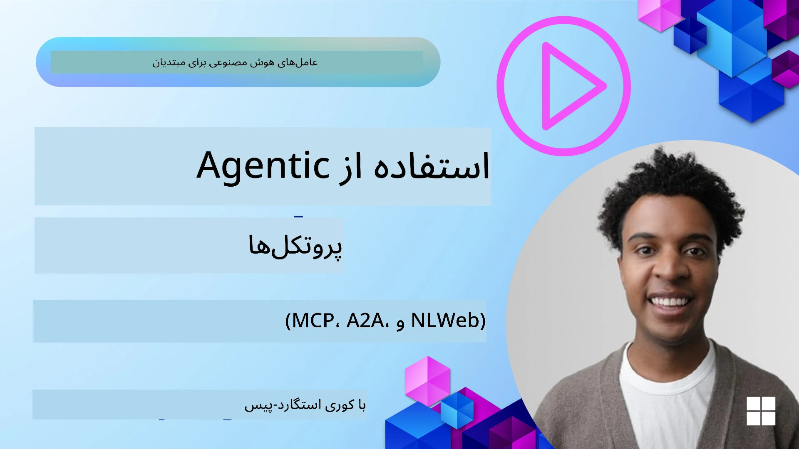
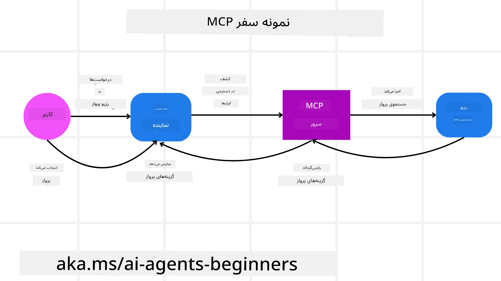
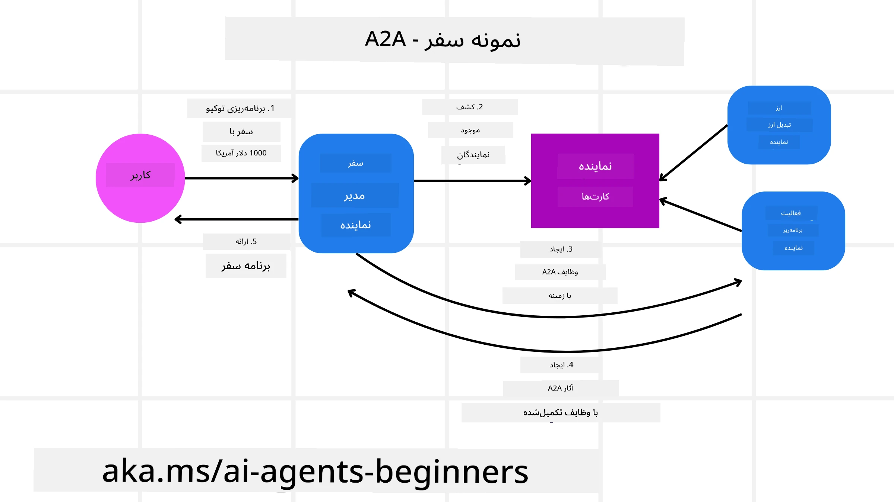
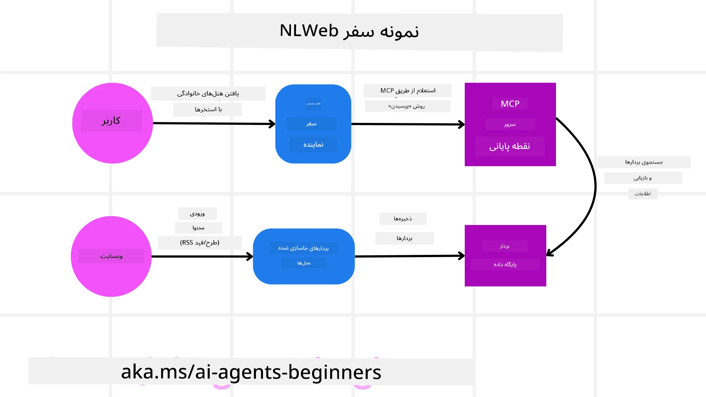

<!--
CO_OP_TRANSLATOR_METADATA:
{
  "original_hash": "aff92c6f019b4627ca9399c6e3882e17",
  "translation_date": "2025-09-18T14:12:23+00:00",
  "source_file": "11-agentic-protocols/README.md",
  "language_code": "fa"
}
-->
# استفاده از پروتکل‌های عامل‌محور (MCP، A2A و NLWeb)

> _(برای مشاهده ویدئوی این درس روی تصویر بالا کلیک کنید)_

با افزایش استفاده از عوامل هوش مصنوعی، نیاز به پروتکل‌هایی که استانداردسازی، امنیت و نوآوری باز را تضمین کنند نیز افزایش می‌یابد. در این درس، سه پروتکل که به دنبال رفع این نیاز هستند را بررسی خواهیم کرد: پروتکل زمینه مدل (MCP)، ارتباط عامل به عامل (A2A) و وب زبان طبیعی (NLWeb).

## مقدمه

در این درس، موارد زیر را پوشش خواهیم داد:

• چگونه **MCP** به عوامل هوش مصنوعی اجازه می‌دهد تا به ابزارها و داده‌های خارجی دسترسی پیدا کنند و وظایف کاربران را انجام دهند.

• چگونه **A2A** ارتباط و همکاری بین عوامل مختلف هوش مصنوعی را ممکن می‌سازد.

• چگونه **NLWeb** رابط‌های زبان طبیعی را به هر وب‌سایتی می‌آورد و به عوامل هوش مصنوعی امکان کشف و تعامل با محتوا را می‌دهد.

## اهداف یادگیری

• **شناسایی** هدف اصلی و مزایای MCP، A2A و NLWeb در زمینه عوامل هوش مصنوعی.

• **توضیح** نحوه تسهیل ارتباط و تعامل هر پروتکل بین LLMها، ابزارها و عوامل دیگر.

• **تشخیص** نقش‌های متمایز هر پروتکل در ساخت سیستم‌های پیچیده عامل‌محور.

## پروتکل زمینه مدل

**پروتکل زمینه مدل (MCP)** یک استاندارد باز است که راهی استاندارد برای برنامه‌ها فراهم می‌کند تا زمینه و ابزارها را به LLMها ارائه دهند. این پروتکل به عنوان یک "آداپتور جهانی" برای منابع داده و ابزارهای مختلف عمل می‌کند که عوامل هوش مصنوعی می‌توانند به صورت یکپارچه به آن‌ها متصل شوند.

اجزای MCP، مزایای آن در مقایسه با استفاده مستقیم از APIها، و یک مثال از نحوه استفاده عوامل هوش مصنوعی از یک سرور MCP را بررسی خواهیم کرد.

### اجزای اصلی MCP

MCP بر اساس معماری **کلاینت-سرور** عمل می‌کند و اجزای اصلی آن عبارتند از:

• **میزبان‌ها** برنامه‌های LLM هستند (برای مثال یک ویرایشگر کد مانند VSCode) که اتصال به سرور MCP را آغاز می‌کنند.

• **کلاینت‌ها** اجزایی درون برنامه میزبان هستند که ارتباطات یک به یک با سرورها را حفظ می‌کنند.

• **سرورها** برنامه‌های سبک هستند که قابلیت‌های خاصی را ارائه می‌دهند.

پروتکل شامل سه عنصر اصلی است که قابلیت‌های یک سرور MCP را تشکیل می‌دهند:

• **ابزارها**: این‌ها اقدامات یا عملکردهای مجزایی هستند که یک عامل هوش مصنوعی می‌تواند برای انجام یک عمل فراخوانی کند. برای مثال، یک سرویس آب‌وهوا ممکن است ابزار "دریافت آب‌وهوا" را ارائه دهد، یا یک سرور تجارت الکترونیک ممکن است ابزار "خرید محصول" را ارائه دهد. سرورهای MCP نام، توضیحات و طرح ورودی/خروجی هر ابزار را در لیست قابلیت‌های خود تبلیغ می‌کنند.

• **منابع**: این‌ها آیتم‌های داده یا اسناد فقط خواندنی هستند که یک سرور MCP می‌تواند ارائه دهد و کلاینت‌ها می‌توانند آن‌ها را به صورت درخواستی بازیابی کنند. مثال‌ها شامل محتوای فایل‌ها، رکوردهای پایگاه داده یا فایل‌های گزارش هستند. منابع می‌توانند متنی (مانند کد یا JSON) یا باینری (مانند تصاویر یا PDFها) باشند.

• **پرامپت‌ها**: این‌ها قالب‌های از پیش تعریف‌شده‌ای هستند که پرامپت‌های پیشنهادی ارائه می‌دهند و امکان گردش کارهای پیچیده‌تر را فراهم می‌کنند.

### مزایای MCP

MCP مزایای قابل توجهی برای عوامل هوش مصنوعی ارائه می‌دهد:

• **کشف ابزار پویا**: عوامل می‌توانند به صورت پویا لیستی از ابزارهای موجود در یک سرور را همراه با توضیحات آن‌ها دریافت کنند. این در مقابل APIهای سنتی قرار دارد که اغلب نیاز به کدنویسی ثابت برای یکپارچه‌سازی دارند، به این معنی که هر تغییر API نیاز به به‌روزرسانی کد دارد. MCP یک رویکرد "یک بار یکپارچه‌سازی" ارائه می‌دهد که منجر به سازگاری بیشتر می‌شود.

• **قابلیت همکاری بین LLMها**: MCP در مدل‌های مختلف LLM کار می‌کند و انعطاف‌پذیری برای تغییر مدل‌های اصلی جهت ارزیابی عملکرد بهتر را فراهم می‌کند.

• **امنیت استاندارد شده**: MCP شامل یک روش احراز هویت استاندارد است که مقیاس‌پذیری را هنگام افزودن دسترسی به سرورهای MCP اضافی بهبود می‌بخشد. این روش ساده‌تر از مدیریت کلیدها و انواع احراز هویت مختلف برای APIهای سنتی است.

### مثال MCP

تصور کنید یک کاربر می‌خواهد با استفاده از یک دستیار هوش مصنوعی که از MCP قدرت گرفته است، یک پرواز رزرو کند.

1. **اتصال**: دستیار هوش مصنوعی (کلاینت MCP) به یک سرور MCP که توسط یک شرکت هواپیمایی ارائه شده است، متصل می‌شود.

2. **کشف ابزار**: کلاینت از سرور MCP شرکت هواپیمایی می‌پرسد: "چه ابزارهایی در دسترس دارید؟" سرور با ابزارهایی مانند "جستجوی پروازها" و "رزرو پروازها" پاسخ می‌دهد.

3. **فراخوانی ابزار**: سپس شما از دستیار هوش مصنوعی می‌خواهید: "لطفاً یک پرواز از پورتلند به هونولولو جستجو کن." دستیار هوش مصنوعی با استفاده از LLM خود تشخیص می‌دهد که باید ابزار "جستجوی پروازها" را فراخوانی کند و پارامترهای مربوطه (مبدا، مقصد) را به سرور MCP ارسال کند.

4. **اجرا و پاسخ**: سرور MCP، به عنوان یک واسط، فراخوانی واقعی را به API داخلی رزرو شرکت هواپیمایی انجام می‌دهد. سپس اطلاعات پرواز (مانند داده‌های JSON) را دریافت کرده و به دستیار هوش مصنوعی ارسال می‌کند.

5. **تعامل بیشتر**: دستیار هوش مصنوعی گزینه‌های پرواز را ارائه می‌دهد. پس از انتخاب یک پرواز، دستیار ممکن است ابزار "رزرو پرواز" را در همان سرور MCP فراخوانی کند و رزرو را تکمیل کند.

## پروتکل عامل به عامل (A2A)

در حالی که MCP بر اتصال LLMها به ابزارها تمرکز دارد، **پروتکل عامل به عامل (A2A)** یک گام فراتر می‌رود و ارتباط و همکاری بین عوامل مختلف هوش مصنوعی را ممکن می‌سازد. A2A عوامل هوش مصنوعی را در سازمان‌ها، محیط‌ها و پشته‌های فناوری مختلف به هم متصل می‌کند تا یک وظیفه مشترک را تکمیل کنند.

اجزای A2A، مزایای آن و یک مثال از نحوه استفاده آن در برنامه سفرمان را بررسی خواهیم کرد.

### اجزای اصلی A2A

A2A بر فعال‌سازی ارتباط بین عوامل و همکاری آن‌ها برای تکمیل یک زیروظیفه کاربر تمرکز دارد. هر جزء پروتکل به این هدف کمک می‌کند:

#### کارت عامل

مشابه نحوه اشتراک‌گذاری لیست ابزارها توسط یک سرور MCP، کارت عامل شامل موارد زیر است:
- نام عامل.
- **توضیح وظایف کلی** که انجام می‌دهد.
- **لیستی از مهارت‌های خاص** همراه با توضیحات برای کمک به عوامل دیگر (یا حتی کاربران انسانی) در درک زمان و دلیل فراخوانی آن عامل.
- **آدرس URL نقطه پایانی فعلی** عامل.
- **نسخه** و **قابلیت‌های** عامل مانند پاسخ‌های استریم و اعلان‌های فشاری.

#### اجراکننده عامل

اجراکننده عامل مسئول **انتقال زمینه چت کاربر به عامل راه دور** است. عامل راه دور به این زمینه نیاز دارد تا وظیفه‌ای که باید انجام شود را درک کند. در یک سرور A2A، یک عامل از مدل زبان بزرگ خود (LLM) برای تجزیه درخواست‌های ورودی و اجرای وظایف با استفاده از ابزارهای داخلی خود استفاده می‌کند.

#### مصنوع

پس از تکمیل وظیفه درخواست‌شده توسط عامل راه دور، محصول کاری آن به عنوان یک مصنوع ایجاد می‌شود. یک مصنوع **نتیجه کار عامل**، **توضیح آنچه انجام شده** و **متن ارسال‌شده از طریق پروتکل** را شامل می‌شود. پس از ارسال مصنوع، اتصال با عامل راه دور تا زمانی که دوباره مورد نیاز باشد بسته می‌شود.

#### صف رویداد

این جزء برای **مدیریت به‌روزرسانی‌ها و انتقال پیام‌ها** استفاده می‌شود. این مورد به‌ویژه در تولید سیستم‌های عامل‌محور مهم است تا از بسته شدن اتصال بین عوامل قبل از تکمیل وظیفه جلوگیری شود، به‌ویژه زمانی که زمان تکمیل وظیفه طولانی‌تر باشد.

### مزایای A2A

• **همکاری پیشرفته**: این پروتکل به عوامل از فروشندگان و پلتفرم‌های مختلف اجازه می‌دهد تا تعامل کنند، زمینه را به اشتراک بگذارند و با هم کار کنند، و اتوماسیون یکپارچه را در سیستم‌های سنتی جداگانه تسهیل می‌کند.

• **انعطاف‌پذیری انتخاب مدل**: هر عامل A2A می‌تواند تصمیم بگیرد که از کدام LLM برای ارائه درخواست‌های خود استفاده کند، و این امکان را فراهم می‌کند که مدل‌های بهینه یا تنظیم‌شده برای هر عامل استفاده شوند، برخلاف اتصال یک LLM در برخی از سناریوهای MCP.

• **احراز هویت داخلی**: احراز هویت به طور مستقیم در پروتکل A2A ادغام شده است، و یک چارچوب امنیتی قوی برای تعاملات عامل فراهم می‌کند.

### مثال A2A

بیایید سناریوی رزرو سفرمان را گسترش دهیم، اما این بار با استفاده از A2A.

1. **درخواست کاربر به چندعامل**: یک کاربر با یک "عامل سفر" کلاینت/عامل A2A تعامل می‌کند، شاید با گفتن: "لطفاً یک سفر کامل به هونولولو برای هفته آینده رزرو کن، شامل پروازها، هتل و ماشین اجاره‌ای."

2. **هماهنگی توسط عامل سفر**: عامل سفر این درخواست پیچیده را دریافت می‌کند. از LLM خود برای استدلال درباره وظیفه استفاده می‌کند و تعیین می‌کند که باید با عوامل تخصصی دیگر تعامل کند.

3. **ارتباط بین عوامل**: عامل سفر سپس از پروتکل A2A برای اتصال به عوامل پایین‌دستی استفاده می‌کند، مانند "عامل هواپیمایی"، "عامل هتل" و "عامل اجاره ماشین" که توسط شرکت‌های مختلف ایجاد شده‌اند.

4. **اجرای وظیفه واگذار شده**: عامل سفر وظایف خاصی را به این عوامل تخصصی ارسال می‌کند (مانند "یافتن پروازها به هونولولو"، "رزرو هتل"، "اجاره ماشین"). هر یک از این عوامل تخصصی، LLMهای خود را اجرا می‌کنند و از ابزارهای داخلی خود استفاده می‌کنند (که ممکن است خودشان سرورهای MCP باشند) تا بخش خاصی از رزرو را انجام دهند.

5. **پاسخ یکپارچه**: پس از تکمیل وظایف توسط همه عوامل پایین‌دستی، عامل سفر نتایج (جزئیات پرواز، تأییدیه هتل، رزرو ماشین اجاره‌ای) را جمع‌آوری کرده و یک پاسخ جامع به سبک چت به کاربر ارسال می‌کند.

## وب زبان طبیعی (NLWeb)

وب‌سایت‌ها مدت‌هاست که راه اصلی دسترسی کاربران به اطلاعات و داده‌ها در سراسر اینترنت بوده‌اند.

اجزای مختلف NLWeb، مزایای آن و یک مثال از نحوه عملکرد NLWeb را با بررسی برنامه سفرمان بررسی خواهیم کرد.

### اجزای NLWeb

- **برنامه NLWeb (کد سرویس اصلی)**: سیستمی که سوالات زبان طبیعی را پردازش می‌کند. این سیستم بخش‌های مختلف پلتفرم را به هم متصل می‌کند تا پاسخ‌ها را ایجاد کند. می‌توانید آن را به عنوان **موتور قدرت‌دهنده ویژگی‌های زبان طبیعی** یک وب‌سایت در نظر بگیرید.

- **پروتکل NLWeb**: این یک **مجموعه قوانین پایه برای تعامل زبان طبیعی** با یک وب‌سایت است. پاسخ‌ها را در قالب JSON ارسال می‌کند (اغلب با استفاده از Schema.org). هدف آن ایجاد یک پایه ساده برای "وب هوش مصنوعی" است، همان‌طور که HTML امکان اشتراک‌گذاری اسناد آنلاین را فراهم کرد.

- **سرور MCP (نقطه پایانی پروتکل زمینه مدل)**: هر تنظیمات NLWeb همچنین به عنوان یک **سرور MCP** عمل می‌کند. این بدان معناست که می‌تواند **ابزارها (مانند روش "پرسش") و داده‌ها** را با سیستم‌های هوش مصنوعی دیگر به اشتراک بگذارد. در عمل، این ویژگی محتوای وب‌سایت و توانایی‌های آن را برای عوامل هوش مصنوعی قابل استفاده می‌کند و وب‌سایت را بخشی از اکوسیستم گسترده‌تر "عامل" می‌سازد.

- **مدل‌های جاسازی**: این مدل‌ها برای **تبدیل محتوای وب‌سایت به نمایش‌های عددی به نام بردارها** (جاسازی‌ها) استفاده می‌شوند. این بردارها معنا را به گونه‌ای ثبت می‌کنند که کامپیوترها بتوانند مقایسه و جستجو کنند. آن‌ها در یک پایگاه داده خاص ذخیره می‌شوند و کاربران می‌توانند مدل جاسازی مورد نظر خود را انتخاب کنند.

- **پایگاه داده بردار (مکانیزم بازیابی)**: این پایگاه داده **جاسازی‌های محتوای وب‌سایت** را ذخیره می‌کند. وقتی کسی سوالی می‌پرسد، NLWeb پایگاه داده بردار را بررسی می‌کند تا سریع‌ترین اطلاعات مرتبط را پیدا کند. این پایگاه داده لیستی سریع از پاسخ‌های ممکن را ارائه می‌دهد که بر اساس شباهت رتبه‌بندی شده‌اند. NLWeb با سیستم‌های مختلف ذخیره‌سازی بردار مانند Qdrant، Snowflake، Milvus، Azure AI Search و Elasticsearch کار می‌کند.

### NLWeb با مثال

وب‌سایت رزرو سفرمان را در نظر بگیرید، اما این بار با قدرت NLWeb.

1. **ورود داده‌ها**: کاتالوگ‌های محصول موجود وب‌سایت سفر (مانند لیست پروازها، توضیحات هتل‌ها، بسته‌های تور) با استفاده از Schema.org قالب‌بندی شده یا از طریق فیدهای RSS بارگذاری می‌شوند. ابزارهای NLWeb این داده‌های ساختاریافته را دریافت می‌کنند، جاسازی‌ها ایجاد می‌کنند و آن‌ها را در یک پایگاه داده بردار محلی یا راه دور ذخیره می‌کنند.

2. **پرسش زبان طبیعی (انسان)**: یک کاربر به وب‌سایت مراجعه می‌کند و به جای پیمایش منوها، در یک رابط چت تایپ می‌کند: "یک هتل مناسب خانواده در هونولولو با استخر برای هفته آینده پیدا کن."

3. **پردازش NLWeb**: برنامه NLWeb این پرسش را دریافت می‌کند. پرسش را به یک LLM برای درک ارسال می‌کند و به طور همزمان پایگاه داده بردار خود را برای لیست‌های مرتبط هتل جستجو می‌کند.

4. **نتایج دقیق**: LLM به تفسیر نتایج جستجو از پایگاه داده کمک می‌کند، بهترین تطابق‌ها را بر اساس معیارهای "مناسب خانواده"، "استخر" و "هونولولو" شناسایی می‌کند و سپس یک پاسخ زبان طبیعی قالب‌بندی می‌کند. مهم‌تر از همه، پاسخ به هتل‌های واقعی از کاتالوگ وب‌سایت اشاره دارد و از اطلاعات ساختگی اجتناب می‌کند.

5. **تعامل عامل هوش مصنوعی**: از آنجا که NLWeb به عنوان یک سرور MCP عمل می‌کند، یک عامل هوش مصنوعی سفر خارجی نیز می‌تواند به تنظیمات NLWeb این وب‌سایت متصل شود. عامل هوش مصنوعی می‌تواند از روش `ask` MCP برای پرسش مستقیم از وب‌سایت استفاده کند: `ask("آیا رستوران‌های مناسب گیاه‌خواران در منطقه هونولولو توسط هتل توصیه شده‌اند؟")`. تنظیمات NLWeb این پرسش را پردازش می‌کند، از پایگاه داده اطلاعات رستوران (در صورت بارگذاری) استفاده می‌کند و یک پاسخ ساختاریافته JSON ارسال می‌کند.

### سوالات بیشتری درباره MCP/A2A/NLWeb دارید؟

به [دیسکورد Azure AI Foundry](https://aka.ms/ai-agents/discord) بپیوندید تا با دیگر یادگیرندگان ملاقات کنید، در ساعات اداری شرکت کنید و سوالات خود درباره عوامل هوش مصنوعی را پاسخ دهید.

## منابع

- [MCP برای مبتدیان](https://aka.ms/mcp-for-beginners)  
- [مستندات MCP](https://github.com/microsoft/semantic-kernel/tree/main/python/semantic-kernel/semantic_kernel/connectors/mcp)
- [مخزن NLWeb](https://github.com/nlweb-ai/NLWeb)
- [راهنمای Semantic Kernel](https://learn.microsoft.com/semantic-kernel/)

---

**سلب مسئولیت**:  
این سند با استفاده از سرویس ترجمه هوش مصنوعی [Co-op Translator](https://github.com/Azure/co-op-translator) ترجمه شده است. در حالی که ما تلاش می‌کنیم دقت را حفظ کنیم، لطفاً توجه داشته باشید که ترجمه‌های خودکار ممکن است شامل خطاها یا نادرستی‌ها باشند. سند اصلی به زبان اصلی آن باید به عنوان منبع معتبر در نظر گرفته شود. برای اطلاعات حساس، توصیه می‌شود از ترجمه حرفه‌ای انسانی استفاده کنید. ما مسئولیتی در قبال سوء تفاهم‌ها یا تفسیرهای نادرست ناشی از استفاده از این ترجمه نداریم.