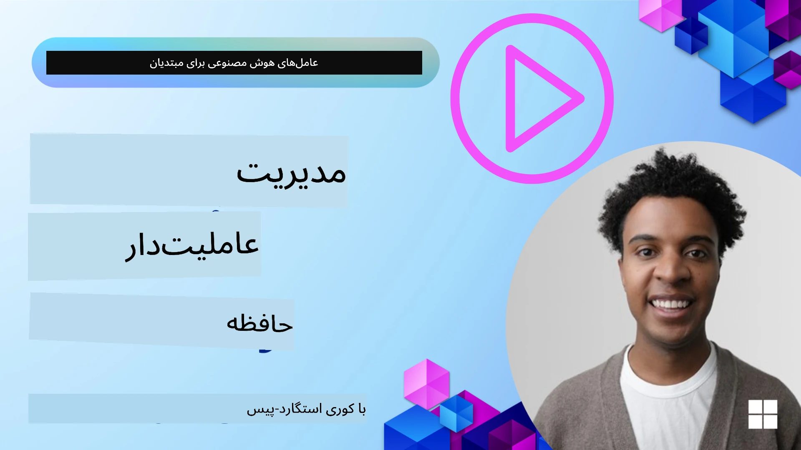

<!--
CO_OP_TRANSLATOR_METADATA:
{
  "original_hash": "a1d90991499ad697c4ad24decaf36968",
  "translation_date": "2025-12-09T11:51:28+00:00",
  "source_file": "13-agent-memory/README.md",
  "language_code": "fa"
}
-->
# حافظه برای عوامل هوش مصنوعی  

وقتی درباره مزایای منحصر به فرد ایجاد عوامل هوش مصنوعی صحبت می‌کنیم، دو موضوع اصلی مطرح می‌شود: توانایی استفاده از ابزارها برای انجام وظایف و توانایی بهبود در طول زمان. حافظه پایه‌ای برای ایجاد عاملی است که بتواند خود را بهبود دهد و تجربه‌های بهتری برای کاربران ما ایجاد کند.

در این درس، به بررسی مفهوم حافظه برای عوامل هوش مصنوعی و نحوه مدیریت و استفاده از آن برای بهبود برنامه‌های خود خواهیم پرداخت.

## مقدمه  

این درس شامل موارد زیر است:  

• **درک حافظه عامل هوش مصنوعی**: حافظه چیست و چرا برای عوامل ضروری است.  

• **پیاده‌سازی و ذخیره حافظه**: روش‌های عملی برای افزودن قابلیت‌های حافظه به عوامل هوش مصنوعی، با تمرکز بر حافظه کوتاه‌مدت و بلندمدت.  

• **ایجاد عوامل هوش مصنوعی خودبهبود**: چگونه حافظه به عوامل کمک می‌کند تا از تعاملات گذشته یاد بگیرند و در طول زمان بهبود یابند.  

## پیاده‌سازی‌های موجود  

این درس شامل دو آموزش جامع در قالب دفترچه یادداشت است:  

• **[13-agent-memory.ipynb](./13-agent-memory.ipynb)**: پیاده‌سازی حافظه با استفاده از Mem0 و Azure AI Search در چارچوب Semantic Kernel  

• **[13-agent-memory-cognee.ipynb](./13-agent-memory-cognee.ipynb)**: پیاده‌سازی حافظه ساختاریافته با استفاده از Cognee، ایجاد خودکار نمودار دانش با پشتیبانی از embeddings، نمایش نمودار و بازیابی هوشمند  

## اهداف یادگیری  

پس از تکمیل این درس، شما قادر خواهید بود:  

• **تفاوت بین انواع مختلف حافظه عامل هوش مصنوعی** را درک کنید، از جمله حافظه کاری، کوتاه‌مدت، بلندمدت و انواع تخصصی مانند حافظه شخصیت و اپیزودیک.  

• **پیاده‌سازی و مدیریت حافظه کوتاه‌مدت و بلندمدت برای عوامل هوش مصنوعی** با استفاده از چارچوب Semantic Kernel، بهره‌گیری از ابزارهایی مانند Mem0، Cognee، حافظه Whiteboard و ادغام با Azure AI Search.  

• **اصول پشت عوامل هوش مصنوعی خودبهبود** را درک کنید و اینکه چگونه سیستم‌های مدیریت حافظه قوی به یادگیری و سازگاری مداوم کمک می‌کنند.  

## درک حافظه عامل هوش مصنوعی  

در اصل، **حافظه برای عوامل هوش مصنوعی به مکانیزم‌هایی اشاره دارد که به آن‌ها اجازه می‌دهد اطلاعات را حفظ و بازیابی کنند**. این اطلاعات می‌تواند جزئیات خاصی از یک مکالمه، ترجیحات کاربر، اقدامات گذشته یا حتی الگوهای یادگرفته شده باشد.  

بدون حافظه، برنامه‌های هوش مصنوعی اغلب بدون حالت هستند، به این معنی که هر تعامل از ابتدا شروع می‌شود. این منجر به تجربه‌ای تکراری و ناامیدکننده برای کاربران می‌شود که عامل "فراموش" می‌کند زمینه یا ترجیحات قبلی را.  

### چرا حافظه مهم است؟  

هوش یک عامل به شدت به توانایی آن در یادآوری و استفاده از اطلاعات گذشته وابسته است. حافظه به عوامل اجازه می‌دهد که:  

• **بازتابی**: از اقدامات و نتایج گذشته یاد بگیرند.  

• **تعاملی**: زمینه را در طول یک مکالمه جاری حفظ کنند.  

• **پیش‌بینی‌کننده و واکنشی**: نیازها را پیش‌بینی کنند یا بر اساس داده‌های تاریخی به درستی پاسخ دهند.  

• **خودمختار**: با استفاده از دانش ذخیره‌شده به طور مستقل‌تر عمل کنند.  

هدف از پیاده‌سازی حافظه این است که عوامل را **قابل اعتمادتر و توانمندتر** کنیم.  

### انواع حافظه  

#### حافظه کاری  

این نوع حافظه مانند یک کاغذ یادداشت است که عامل در طول یک وظیفه یا فرآیند تفکر جاری از آن استفاده می‌کند. اطلاعات فوری مورد نیاز برای محاسبه مرحله بعدی را نگه می‌دارد.  

برای عوامل هوش مصنوعی، حافظه کاری اغلب اطلاعات مرتبط‌ترین بخش‌های یک مکالمه را ثبت می‌کند، حتی اگر تاریخچه کامل چت طولانی یا کوتاه شده باشد. این حافظه بر استخراج عناصر کلیدی مانند نیازها، پیشنهادات، تصمیمات و اقدامات تمرکز دارد.  

**مثال حافظه کاری**  

در یک عامل رزرو سفر، حافظه کاری ممکن است درخواست فعلی کاربر را ثبت کند، مانند "می‌خواهم سفری به پاریس رزرو کنم". این نیاز خاص در زمینه فوری عامل نگه داشته می‌شود تا تعامل جاری را هدایت کند.  

#### حافظه کوتاه‌مدت  

این نوع حافظه اطلاعات را برای مدت زمان یک مکالمه یا جلسه حفظ می‌کند. این زمینه مکالمه جاری است که به عامل اجازه می‌دهد به نوبت‌های قبلی در گفتگو ارجاع دهد.  

**مثال حافظه کوتاه‌مدت**  

اگر کاربر بپرسد، "هزینه پرواز به پاریس چقدر است؟" و سپس ادامه دهد، "هزینه اقامت در آنجا چطور؟"، حافظه کوتاه‌مدت تضمین می‌کند که عامل می‌داند "آنجا" به "پاریس" در همان مکالمه اشاره دارد.  

#### حافظه بلندمدت  

این اطلاعاتی است که در طول چندین مکالمه یا جلسه باقی می‌ماند. به عوامل اجازه می‌دهد ترجیحات کاربر، تعاملات تاریخی یا دانش عمومی را در طول زمان به یاد داشته باشند. این برای شخصی‌سازی مهم است.  

**مثال حافظه بلندمدت**  

یک حافظه بلندمدت ممکن است ذخیره کند که "بن از اسکی و فعالیت‌های بیرون لذت می‌برد، قهوه با منظره کوه را دوست دارد و می‌خواهد از شیب‌های اسکی پیشرفته به دلیل یک آسیب قبلی اجتناب کند". این اطلاعات که از تعاملات قبلی یاد گرفته شده است، توصیه‌ها را در جلسات برنامه‌ریزی سفر آینده بسیار شخصی‌سازی می‌کند.  

#### حافظه شخصیت  

این نوع حافظه تخصصی به عامل کمک می‌کند یک "شخصیت" یا "شخصیت" ثابت ایجاد کند. به عامل اجازه می‌دهد جزئیات مربوط به خود یا نقش مورد نظرش را به یاد داشته باشد، و تعاملات را روان‌تر و متمرکزتر کند.  

**مثال حافظه شخصیت**  
اگر عامل سفر طراحی شده باشد تا یک "برنامه‌ریز اسکی متخصص" باشد، حافظه شخصیت ممکن است این نقش را تقویت کند و پاسخ‌های آن را به گونه‌ای تنظیم کند که با لحن و دانش یک متخصص هماهنگ باشد.  

#### حافظه کاری/اپیزودیک  

این حافظه دنباله‌ای از مراحل را که عامل در طول یک وظیفه پیچیده انجام می‌دهد، از جمله موفقیت‌ها و شکست‌ها ذخیره می‌کند. مانند به یاد آوردن "اپیزودها" یا تجربیات گذشته برای یادگیری از آن‌ها.  

**مثال حافظه اپیزودیک**  

اگر عامل تلاش کند یک پرواز خاص را رزرو کند اما به دلیل عدم موجودی شکست بخورد، حافظه اپیزودیک می‌تواند این شکست را ثبت کند و به عامل اجازه دهد پروازهای جایگزین را امتحان کند یا کاربر را در تلاش بعدی به طور آگاهانه‌تر از مشکل مطلع کند.  

#### حافظه موجودیت  

این شامل استخراج و به یاد آوردن موجودیت‌های خاص (مانند افراد، مکان‌ها یا چیزها) و رویدادها از مکالمات است. به عامل اجازه می‌دهد درک ساختاری از عناصر کلیدی مورد بحث ایجاد کند.  

**مثال حافظه موجودیت**  

از یک مکالمه درباره یک سفر گذشته، عامل ممکن است "پاریس"، "برج ایفل" و "شام در رستوران Le Chat Noir" را به عنوان موجودیت‌ها استخراج کند. در یک تعامل آینده، عامل می‌تواند "Le Chat Noir" را به یاد آورد و پیشنهاد دهد که یک رزرو جدید در آنجا انجام دهد.  

#### RAG ساختاریافته (تولید تقویت‌شده با بازیابی)  

در حالی که RAG یک تکنیک گسترده‌تر است، "RAG ساختاریافته" به عنوان یک فناوری حافظه قدرتمند برجسته شده است. این اطلاعات متراکم و ساختاریافته را از منابع مختلف (مکالمات، ایمیل‌ها، تصاویر) استخراج می‌کند و از آن برای افزایش دقت، بازیابی و سرعت در پاسخ‌ها استفاده می‌کند. برخلاف RAG کلاسیک که فقط به شباهت معنایی متکی است، RAG ساختاریافته با ساختار ذاتی اطلاعات کار می‌کند.  

**مثال RAG ساختاریافته**  

به جای فقط تطبیق کلمات کلیدی، RAG ساختاریافته می‌تواند جزئیات پرواز (مقصد، تاریخ، زمان، شرکت هواپیمایی) را از یک ایمیل تجزیه و ذخیره کند. این امکان پرسش‌های دقیق مانند "چه پروازی به پاریس در روز سه‌شنبه رزرو کردم؟" را فراهم می‌کند.  

## پیاده‌سازی و ذخیره حافظه  

پیاده‌سازی حافظه برای عوامل هوش مصنوعی شامل فرآیند سیستماتیک **مدیریت حافظه** است که شامل تولید، ذخیره، بازیابی، ادغام، به‌روزرسانی و حتی "فراموش کردن" (یا حذف) اطلاعات می‌شود. بازیابی یک جنبه به‌ویژه حیاتی است.  

### ابزارهای تخصصی حافظه  

#### Mem0  

یکی از راه‌های ذخیره و مدیریت حافظه عامل استفاده از ابزارهای تخصصی مانند Mem0 است. Mem0 به عنوان یک لایه حافظه پایدار عمل می‌کند، به عوامل اجازه می‌دهد تعاملات مرتبط را به یاد آورند، ترجیحات کاربر و زمینه‌های واقعی را ذخیره کنند و از موفقیت‌ها و شکست‌ها در طول زمان یاد بگیرند. ایده اینجا این است که عوامل بدون حالت به عوامل دارای حالت تبدیل شوند.  

این ابزار از طریق یک **خط لوله حافظه دو مرحله‌ای: استخراج و به‌روزرسانی** کار می‌کند. ابتدا، پیام‌هایی که به رشته عامل اضافه می‌شوند به سرویس Mem0 ارسال می‌شوند، که از یک مدل زبان بزرگ (LLM) برای خلاصه کردن تاریخچه مکالمه و استخراج حافظه‌های جدید استفاده می‌کند. سپس، مرحله به‌روزرسانی مبتنی بر LLM تعیین می‌کند که آیا این حافظه‌ها باید اضافه، اصلاح یا حذف شوند و آن‌ها را در یک ذخیره داده ترکیبی که می‌تواند شامل پایگاه داده‌های برداری، نمودار و کلید-مقدار باشد ذخیره می‌کند. این سیستم همچنین از انواع مختلف حافظه پشتیبانی می‌کند و می‌تواند حافظه نموداری را برای مدیریت روابط بین موجودیت‌ها ادغام کند.  

#### Cognee  

رویکرد قدرتمند دیگر استفاده از **Cognee** است، یک حافظه معنایی متن‌باز برای عوامل هوش مصنوعی که داده‌های ساختاریافته و غیرساختاریافته را به نمودارهای دانش قابل پرسش تبدیل می‌کند که با embeddings پشتیبانی می‌شوند. Cognee یک **معماری ذخیره دوگانه** ارائه می‌دهد که جستجوی شباهت برداری را با روابط نمودار ترکیب می‌کند، و به عوامل اجازه می‌دهد نه تنها اطلاعات مشابه را درک کنند، بلکه چگونه مفاهیم به یکدیگر مرتبط هستند.  

این ابزار در **بازیابی ترکیبی** که شباهت برداری، ساختار نمودار و استدلال LLM را ترکیب می‌کند - از جستجوی خام تا پاسخ‌دهی به سوالات آگاه از نمودار - برتری دارد. سیستم حافظه **زنده** را حفظ می‌کند که تکامل می‌یابد و رشد می‌کند در حالی که به عنوان یک نمودار متصل قابل پرسش باقی می‌ماند، و از زمینه جلسه کوتاه‌مدت و حافظه پایدار بلندمدت پشتیبانی می‌کند.  

آموزش دفترچه یادداشت Cognee ([13-agent-memory-cognee.ipynb](./13-agent-memory-cognee.ipynb)) ایجاد این لایه حافظه یکپارچه را نشان می‌دهد، با مثال‌های عملی از وارد کردن منابع داده متنوع، نمایش نمودار دانش و پرسش با استراتژی‌های جستجوی مختلف متناسب با نیازهای خاص عامل.  

### ذخیره حافظه با RAG  

فراتر از ابزارهای تخصصی حافظه مانند Mem0، شما می‌توانید از خدمات جستجوی قدرتمند مانند **Azure AI Search به عنوان بک‌اند برای ذخیره و بازیابی حافظه‌ها** استفاده کنید، به‌ویژه برای RAG ساختاریافته.  

این امکان را فراهم می‌کند که پاسخ‌های عامل خود را با داده‌های خودتان پایه‌گذاری کنید، و اطمینان حاصل کنید که پاسخ‌ها مرتبط‌تر و دقیق‌تر هستند. Azure AI Search می‌تواند برای ذخیره حافظه‌های سفر کاربر، کاتالوگ‌های محصول یا هر دانش خاص دامنه دیگری استفاده شود.  

Azure AI Search از قابلیت‌هایی مانند **RAG ساختاریافته** پشتیبانی می‌کند، که در استخراج و بازیابی اطلاعات متراکم و ساختاریافته از مجموعه داده‌های بزرگ مانند تاریخچه مکالمات، ایمیل‌ها یا حتی تصاویر برتری دارد. این نسبت به روش‌های سنتی تقسیم متن و embedding "دقت و بازیابی فوق‌العاده انسانی" ارائه می‌دهد.  

## ایجاد عوامل هوش مصنوعی خودبهبود  

یک الگوی رایج برای عوامل خودبهبود شامل معرفی یک **"عامل دانش"** است. این عامل جداگانه مکالمه اصلی بین کاربر و عامل اصلی را مشاهده می‌کند. نقش آن این است که:  

1. **شناسایی اطلاعات ارزشمند**: تعیین کند که آیا بخشی از مکالمه ارزش ذخیره به عنوان دانش عمومی یا ترجیح خاص کاربر را دارد.  

2. **استخراج و خلاصه‌سازی**: اطلاعات ضروری یا ترجیح را از مکالمه استخراج کند.  

3. **ذخیره در پایگاه دانش**: این اطلاعات استخراج‌شده را ذخیره کند، اغلب در یک پایگاه داده برداری، تا بعداً قابل بازیابی باشد.  

4. **تقویت پرسش‌های آینده**: وقتی کاربر یک پرسش جدید را آغاز می‌کند، عامل دانش اطلاعات ذخیره‌شده مرتبط را بازیابی کرده و به درخواست کاربر اضافه می‌کند، و زمینه مهمی را به عامل اصلی ارائه می‌دهد (مشابه RAG).  

### بهینه‌سازی‌ها برای حافظه  

• **مدیریت تأخیر**: برای جلوگیری از کند شدن تعاملات کاربر، می‌توان ابتدا از یک مدل ارزان‌تر و سریع‌تر استفاده کرد تا سریعاً بررسی کند که آیا اطلاعات ارزش ذخیره یا بازیابی را دارد، و فقط فرآیند استخراج/بازیابی پیچیده‌تر را در صورت لزوم فراخوانی کند.  

• **نگهداری پایگاه دانش**: برای یک پایگاه دانش در حال رشد، اطلاعات کمتر استفاده‌شده می‌تواند به "ذخیره سرد" منتقل شود تا هزینه‌ها مدیریت شود.  

## سوالات بیشتری درباره حافظه عامل دارید؟  

به [Discord Azure AI Foundry](https://aka.ms/ai-agents/discord) بپیوندید تا با دیگر یادگیرندگان ملاقات کنید، در ساعات اداری شرکت کنید و سوالات خود درباره عوامل هوش مصنوعی را پاسخ دهید.  

---

<!-- CO-OP TRANSLATOR DISCLAIMER START -->
**سلب مسئولیت**:  
این سند با استفاده از سرویس ترجمه هوش مصنوعی [Co-op Translator](https://github.com/Azure/co-op-translator) ترجمه شده است. در حالی که ما تلاش می‌کنیم دقت را حفظ کنیم، لطفاً توجه داشته باشید که ترجمه‌های خودکار ممکن است شامل خطاها یا نادرستی‌ها باشند. سند اصلی به زبان اصلی آن باید به عنوان منبع معتبر در نظر گرفته شود. برای اطلاعات حیاتی، ترجمه حرفه‌ای انسانی توصیه می‌شود. ما مسئولیتی در قبال سوء تفاهم‌ها یا تفسیرهای نادرست ناشی از استفاده از این ترجمه نداریم.
<!-- CO-OP TRANSLATOR DISCLAIMER END -->