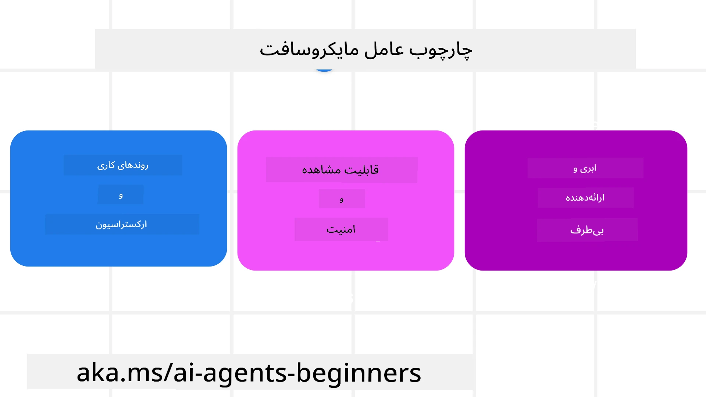
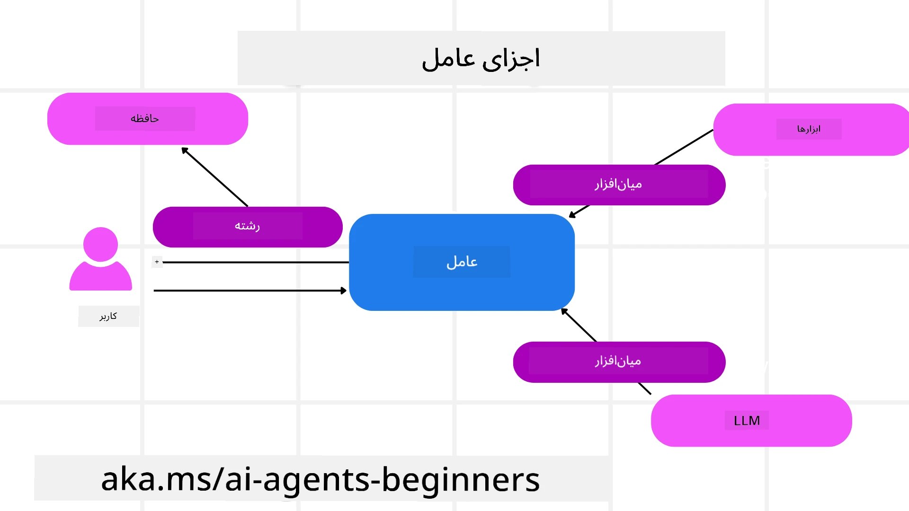

<!--
CO_OP_TRANSLATOR_METADATA:
{
  "original_hash": "19c4dab375acbc733855cc7f2f04edbc",
  "translation_date": "2025-10-01T21:43:07+00:00",
  "source_file": "14-microsoft-agent-framework/README.md",
  "language_code": "fa"
}
-->
# بررسی چارچوب Microsoft Agent


### مقدمه

این درس شامل موارد زیر خواهد بود:

- آشنایی با چارچوب Microsoft Agent: ویژگی‌های کلیدی و ارزش  
- بررسی مفاهیم اصلی چارچوب Microsoft Agent  
- مقایسه MAF با Semantic Kernel و AutoGen: راهنمای مهاجرت  

## اهداف یادگیری

پس از اتمام این درس، شما قادر خواهید بود:

- عوامل هوش مصنوعی آماده تولید را با استفاده از چارچوب Microsoft Agent بسازید  
- ویژگی‌های اصلی چارچوب Microsoft Agent را در موارد استفاده عامل‌محور خود اعمال کنید  
- چارچوب‌ها و ابزارهای عامل‌محور موجود را مهاجرت داده و یکپارچه کنید  

## نمونه‌های کد

نمونه‌های کد برای [Microsoft Agent Framework (MAF)](https://aka.ms/ai-agents-beginners/agent-framewrok) در این مخزن تحت فایل‌های `xx-python-agent-framework` و `xx-dotnet-agent-framework` موجود است.

## آشنایی با چارچوب Microsoft Agent



[چارچوب Microsoft Agent (MAF)](https://aka.ms/ai-agents-beginners/agent-framewrok) بر اساس تجربیات و آموخته‌های Semantic Kernel و AutoGen ساخته شده است. این چارچوب انعطاف‌پذیری لازم برای پاسخگویی به انواع موارد استفاده عامل‌محور در محیط‌های تولید و تحقیقاتی را فراهم می‌کند، از جمله:

- **ارکستراسیون عامل ترتیبی** در سناریوهایی که نیاز به جریان‌های کاری مرحله به مرحله دارند.  
- **ارکستراسیون همزمان** در سناریوهایی که عوامل باید وظایف را به طور همزمان انجام دهند.  
- **ارکستراسیون چت گروهی** در سناریوهایی که عوامل می‌توانند با هم روی یک وظیفه همکاری کنند.  
- **ارکستراسیون انتقال وظیفه** در سناریوهایی که عوامل وظیفه را به یکدیگر منتقل می‌کنند تا زیر وظایف تکمیل شوند.  
- **ارکستراسیون مغناطیسی** در سناریوهایی که یک عامل مدیر لیست وظایف را ایجاد و اصلاح می‌کند و هماهنگی عوامل فرعی را برای تکمیل وظیفه مدیریت می‌کند.  

برای ارائه عوامل هوش مصنوعی در تولید، MAF همچنین ویژگی‌هایی را شامل می‌شود برای:

- **مشاهده‌پذیری** از طریق استفاده از OpenTelemetry که هر اقدام عامل هوش مصنوعی از جمله فراخوانی ابزار، مراحل ارکستراسیون، جریان‌های استدلال و نظارت بر عملکرد را از طریق داشبوردهای Azure AI Foundry ثبت می‌کند.  
- **امنیت** با میزبانی عوامل به صورت بومی در Azure AI Foundry که شامل کنترل‌های امنیتی مانند دسترسی مبتنی بر نقش، مدیریت داده‌های خصوصی و ایمنی محتوای داخلی است.  
- **دوام** به گونه‌ای که رشته‌ها و جریان‌های کاری عامل می‌توانند متوقف شوند، از سر گرفته شوند و از خطاها بازیابی شوند که امکان فرآیندهای طولانی‌تر را فراهم می‌کند.  
- **کنترل** به گونه‌ای که جریان‌های کاری با حضور انسان پشتیبانی می‌شوند، جایی که وظایف به عنوان نیازمند تأیید انسانی علامت‌گذاری می‌شوند.  

چارچوب Microsoft Agent همچنین بر قابلیت همکاری تمرکز دارد از طریق:

- **عدم وابستگی به ابر** - عوامل می‌توانند در کانتینرها، در محل و در چندین ابر مختلف اجرا شوند.  
- **عدم وابستگی به ارائه‌دهنده** - عوامل می‌توانند از طریق SDK مورد نظر شما از جمله Azure OpenAI و OpenAI ایجاد شوند.  
- **یکپارچه‌سازی استانداردهای باز** - عوامل می‌توانند از پروتکل‌هایی مانند Agent-to-Agent (A2A) و Model Context Protocol (MCP) برای کشف و استفاده از عوامل و ابزارهای دیگر بهره ببرند.  
- **پلاگین‌ها و کانکتورها** - اتصالات می‌توانند به خدمات داده و حافظه مانند Microsoft Fabric، SharePoint، Pinecone و Qdrant برقرار شوند.  

بیایید ببینیم چگونه این ویژگی‌ها در برخی از مفاهیم اصلی چارچوب Microsoft Agent اعمال می‌شوند.

## مفاهیم اصلی چارچوب Microsoft Agent

### عوامل



**ایجاد عوامل**

ایجاد عامل با تعریف سرویس استنتاج (ارائه‌دهنده LLM)، مجموعه‌ای از دستورالعمل‌ها برای عامل هوش مصنوعی و یک `نام` اختصاص داده شده انجام می‌شود:

```python
agent = AzureOpenAIChatClient(credential=AzureCliCredential()).create_agent( instructions="You are good at recommending trips to customers based on their preferences.", name="TripRecommender" )
```

در مثال بالا از `Azure OpenAI` استفاده شده است، اما عوامل می‌توانند با استفاده از خدمات مختلف از جمله `Azure AI Foundry Agent Service` ایجاد شوند:

```python
AzureAIAgentClient(async_credential=credential).create_agent( name="HelperAgent", instructions="You are a helpful assistant." ) as agent
```

API‌های `Responses` و `ChatCompletion` OpenAI

```python
agent = OpenAIResponsesClient().create_agent( name="WeatherBot", instructions="You are a helpful weather assistant.", )
```

```python
agent = OpenAIChatClient().create_agent( name="HelpfulAssistant", instructions="You are a helpful assistant.", )
```

یا عوامل از راه دور با استفاده از پروتکل A2A:

```python
agent = A2AAgent( name=agent_card.name, description=agent_card.description, agent_card=agent_card, url="https://your-a2a-agent-host" )
```

**اجرای عوامل**

عوامل با استفاده از متدهای `.run` یا `.run_stream` برای پاسخ‌های غیرجریانی یا جریانی اجرا می‌شوند.

```python
result = await agent.run("What are good places to visit in Amsterdam?")
print(result.text)
```

```python
async for update in agent.run_stream("What are the good places to visit in Amsterdam?"):
    if update.text:
        print(update.text, end="", flush=True)

```

هر اجرای عامل همچنین می‌تواند گزینه‌هایی برای سفارشی‌سازی پارامترهایی مانند `max_tokens` که توسط عامل استفاده می‌شود، `ابزارها` که عامل قادر به فراخوانی آن‌ها است، و حتی `مدل` مورد استفاده برای عامل داشته باشد.

این ویژگی در مواردی که مدل‌ها یا ابزارهای خاصی برای تکمیل وظیفه کاربر مورد نیاز است، مفید است.

**ابزارها**

ابزارها می‌توانند هم هنگام تعریف عامل تعریف شوند:

```python
def get_attractions( location: Annotated[str, Field(description="The location to get the top tourist attractions for")], ) -> str: """Get the top tourist attractions for a given location.""" return f"The top attractions for {location} are." 


# When creating a ChatAgent directly 

agent = ChatAgent( chat_client=OpenAIChatClient(), instructions="You are a helpful assistant", tools=[get_attractions]

```

و هم هنگام اجرای عامل:

```python

result1 = await agent.run( "What's the best place to visit in Seattle?", tools=[get_attractions] # Tool provided for this run only )
```

**رشته‌های عامل**

رشته‌های عامل برای مدیریت مکالمات چند نوبتی استفاده می‌شوند. رشته‌ها می‌توانند با استفاده از:

- `get_new_thread()` که امکان ذخیره رشته را در طول زمان فراهم می‌کند.  
- ایجاد خودکار رشته هنگام اجرای عامل و فقط داشتن رشته در طول اجرای فعلی.  

برای ایجاد یک رشته، کد به این صورت است:

```python
# Create a new thread. 
thread = agent.get_new_thread() # Run the agent with the thread. 
response = await agent.run("Hello, I am here to help you book travel. Where would you like to go?", thread=thread)

```

سپس می‌توانید رشته را برای استفاده بعدی ذخیره کنید:

```python
# Create a new thread. 
thread = agent.get_new_thread() 

# Run the agent with the thread. 

response = await agent.run("Hello, how are you?", thread=thread) 

# Serialize the thread for storage. 

serialized_thread = await thread.serialize() 

# Deserialize the thread state after loading from storage. 

resumed_thread = await agent.deserialize_thread(serialized_thread)
```

**میان‌افزار عامل**

عوامل برای تکمیل وظایف کاربر با ابزارها و LLM‌ها تعامل دارند. در برخی سناریوها، می‌خواهیم بین این تعاملات عملیاتی را اجرا یا پیگیری کنیم. میان‌افزار عامل به ما این امکان را می‌دهد که این کار را انجام دهیم:

*میان‌افزار عملکرد*

این میان‌افزار به ما امکان می‌دهد عملیاتی را بین عامل و یک عملکرد/ابزار که قرار است فراخوانی شود اجرا کنیم. مثالی از زمانی که این مورد استفاده می‌شود، زمانی است که ممکن است بخواهید برخی از اطلاعات مربوط به فراخوانی عملکرد را ثبت کنید.

در کد زیر `next` تعریف می‌کند که آیا میان‌افزار بعدی یا عملکرد واقعی باید فراخوانی شود.

```python
async def logging_function_middleware(
    context: FunctionInvocationContext,
    next: Callable[[FunctionInvocationContext], Awaitable[None]],
) -> None:
    """Function middleware that logs function execution."""
    # Pre-processing: Log before function execution
    print(f"[Function] Calling {context.function.name}")

    # Continue to next middleware or function execution
    await next(context)

    # Post-processing: Log after function execution
    print(f"[Function] {context.function.name} completed")
```

*میان‌افزار چت*

این میان‌افزار به ما امکان می‌دهد عملیاتی را بین عامل و درخواست‌های بین LLM اجرا یا ثبت کنیم.

این شامل اطلاعات مهمی مانند `پیام‌ها` است که به سرویس هوش مصنوعی ارسال می‌شوند.

```python
async def logging_chat_middleware(
    context: ChatContext,
    next: Callable[[ChatContext], Awaitable[None]],
) -> None:
    """Chat middleware that logs AI interactions."""
    # Pre-processing: Log before AI call
    print(f"[Chat] Sending {len(context.messages)} messages to AI")

    # Continue to next middleware or AI service
    await next(context)

    # Post-processing: Log after AI response
    print("[Chat] AI response received")

```

**حافظه عامل**

همان‌طور که در درس `Agentic Memory` پوشش داده شد، حافظه یک عنصر مهم برای امکان‌پذیر کردن عملکرد عامل در زمینه‌های مختلف است. MAF چندین نوع حافظه مختلف ارائه می‌دهد:

*ذخیره‌سازی در حافظه*

این حافظه در رشته‌ها در طول زمان اجرای برنامه ذخیره می‌شود.

```python
# Create a new thread. 
thread = agent.get_new_thread() # Run the agent with the thread. 
response = await agent.run("Hello, I am here to help you book travel. Where would you like to go?", thread=thread)
```

*پیام‌های پایدار*

این حافظه زمانی استفاده می‌شود که تاریخچه مکالمه در جلسات مختلف ذخیره شود. این حافظه با استفاده از `chat_message_store_factory` تعریف می‌شود:

```python
from agent_framework import ChatMessageStore

# Create a custom message store
def create_message_store():
    return ChatMessageStore()

agent = ChatAgent(
    chat_client=OpenAIChatClient(),
    instructions="You are a Travel assistant.",
    chat_message_store_factory=create_message_store
)

```

*حافظه پویا*

این حافظه قبل از اجرای عوامل به زمینه اضافه می‌شود. این حافظه‌ها می‌توانند در خدمات خارجی مانند mem0 ذخیره شوند:

```python
from agent_framework.mem0 import Mem0Provider

# Using Mem0 for advanced memory capabilities
memory_provider = Mem0Provider(
    api_key="your-mem0-api-key",
    user_id="user_123",
    application_id="my_app"
)

agent = ChatAgent(
    chat_client=OpenAIChatClient(),
    instructions="You are a helpful assistant with memory.",
    context_providers=memory_provider
)

```

**مشاهده‌پذیری عامل**

مشاهده‌پذیری برای ساخت سیستم‌های عامل‌محور قابل اعتماد و قابل نگهداری مهم است. MAF با OpenTelemetry یکپارچه شده است تا ردیابی و اندازه‌گیری‌های بهتر برای مشاهده‌پذیری فراهم کند.

```python
from agent_framework.observability import get_tracer, get_meter

tracer = get_tracer()
meter = get_meter()
with tracer.start_as_current_span("my_custom_span"):
    # do something
    pass
counter = meter.create_counter("my_custom_counter")
counter.add(1, {"key": "value"})
```

### جریان‌های کاری

MAF جریان‌های کاری را ارائه می‌دهد که مراحل از پیش تعریف شده‌ای برای تکمیل یک وظیفه هستند و شامل عوامل هوش مصنوعی به عنوان اجزای این مراحل می‌شوند.

جریان‌های کاری از اجزای مختلفی تشکیل شده‌اند که کنترل جریان را بهتر می‌کنند. جریان‌های کاری همچنین امکان **ارکستراسیون چند عاملی** و **ایجاد نقاط بررسی** برای ذخیره وضعیت جریان کاری را فراهم می‌کنند.

اجزای اصلی یک جریان کاری عبارتند از:

**اجراکننده‌ها**

اجراکننده‌ها پیام‌های ورودی را دریافت می‌کنند، وظایف اختصاص داده شده خود را انجام می‌دهند و سپس یک پیام خروجی تولید می‌کنند. این فرآیند جریان کاری را به سمت تکمیل وظیفه بزرگ‌تر پیش می‌برد. اجراکننده‌ها می‌توانند عامل هوش مصنوعی یا منطق سفارشی باشند.

**لبه‌ها**

لبه‌ها برای تعریف جریان پیام‌ها در یک جریان کاری استفاده می‌شوند. این لبه‌ها می‌توانند:

*لبه‌های مستقیم* - اتصالات ساده یک به یک بین اجراکننده‌ها:

```python
from agent_framework import WorkflowBuilder

builder = WorkflowBuilder()
builder.add_edge(source_executor, target_executor)
builder.set_start_executor(source_executor)
workflow = builder.build()
```

*لبه‌های شرطی* - پس از برآورده شدن یک شرط خاص فعال می‌شوند. به عنوان مثال، زمانی که اتاق‌های هتل در دسترس نیستند، یک اجراکننده می‌تواند گزینه‌های دیگر را پیشنهاد دهد.

*لبه‌های سوئیچ-کیس* - پیام‌ها را بر اساس شرایط تعریف شده به اجراکننده‌های مختلف هدایت می‌کنند. به عنوان مثال، اگر مشتری سفر دسترسی اولویت داشته باشد، وظایف آن‌ها از طریق یک جریان کاری دیگر مدیریت می‌شود.

*لبه‌های فن-اوت* - یک پیام را به چندین هدف ارسال می‌کنند.

*لبه‌های فن-این* - چندین پیام از اجراکننده‌های مختلف جمع‌آوری کرده و به یک هدف ارسال می‌کنند.

**رویدادها**

برای ارائه مشاهده‌پذیری بهتر در جریان‌های کاری، MAF رویدادهای داخلی برای اجرا ارائه می‌دهد، از جمله:

- `WorkflowStartedEvent` - اجرای جریان کاری آغاز می‌شود  
- `WorkflowOutputEvent` - جریان کاری یک خروجی تولید می‌کند  
- `WorkflowErrorEvent` - جریان کاری با خطا مواجه می‌شود  
- `ExecutorInvokeEvent` - اجراکننده شروع به پردازش می‌کند  
- `ExecutorCompleteEvent` - اجراکننده پردازش را به پایان می‌رساند  
- `RequestInfoEvent` - یک درخواست صادر می‌شود  

## مهاجرت از چارچوب‌های دیگر (Semantic Kernel و AutoGen)

### تفاوت‌های بین MAF و Semantic Kernel

**ایجاد عامل ساده‌تر**

Semantic Kernel نیاز به ایجاد یک نمونه Kernel برای هر عامل دارد. MAF از رویکرد ساده‌تری با استفاده از افزونه‌ها برای ارائه‌دهندگان اصلی استفاده می‌کند.

```python
agent = AzureOpenAIChatClient(credential=AzureCliCredential()).create_agent( instructions="You are good at reccomending trips to customers based on their preferences.", name="TripRecommender" )
```

**ایجاد رشته عامل**

Semantic Kernel نیاز به ایجاد دستی رشته‌ها دارد. در MAF، عامل به طور مستقیم یک رشته اختصاص داده می‌شود.

```python
thread = agent.get_new_thread() # Run the agent with the thread. 
```

**ثبت ابزار**

در Semantic Kernel، ابزارها به Kernel ثبت می‌شوند و سپس Kernel به عامل منتقل می‌شود. در MAF، ابزارها به طور مستقیم در طول فرآیند ایجاد عامل ثبت می‌شوند.

```python
agent = ChatAgent( chat_client=OpenAIChatClient(), instructions="You are a helpful assistant", tools=[get_attractions]
```

### تفاوت‌های بین MAF و AutoGen

**تیم‌ها در مقابل جریان‌های کاری**

`تیم‌ها` ساختار رویداد برای فعالیت‌های مبتنی بر رویداد با عوامل در AutoGen هستند. MAF از `جریان‌های کاری` استفاده می‌کند که داده‌ها را از طریق معماری مبتنی بر گراف به اجراکننده‌ها هدایت می‌کند.

**ایجاد ابزار**

AutoGen از `FunctionTool` برای بسته‌بندی توابعی که عوامل می‌توانند فراخوانی کنند استفاده می‌کند. MAF از @ai_function استفاده می‌کند که به طور مشابه عمل می‌کند اما همچنین به طور خودکار طرح‌ها را برای هر عملکرد استنتاج می‌کند.

**رفتار عامل**

عوامل در AutoGen به طور پیش‌فرض عوامل تک‌نوبتی هستند مگر اینکه `max_tool_iterations` به مقدار بالاتری تنظیم شود. در MAF، `ChatAgent` به طور پیش‌فرض چند نوبتی است، به این معنی که تا زمانی که وظیفه کاربر کامل شود، به فراخوانی ابزارها ادامه می‌دهد.

## نمونه‌های کد

نمونه‌های کد برای چارچوب Microsoft Agent در این مخزن تحت فایل‌های `xx-python-agent-framework` و `xx-dotnet-agent-framework` موجود است.

## سوالات بیشتری درباره چارچوب Microsoft Agent دارید؟

به [Discord Azure AI Foundry](https://aka.ms/ai-agents/discord) بپیوندید تا با دیگر یادگیرندگان ملاقات کنید، در ساعات اداری شرکت کنید و سوالات خود درباره عوامل هوش مصنوعی را پاسخ دهید.

---

**سلب مسئولیت**:  
این سند با استفاده از سرویس ترجمه هوش مصنوعی [Co-op Translator](https://github.com/Azure/co-op-translator) ترجمه شده است. در حالی که ما تلاش می‌کنیم دقت را حفظ کنیم، لطفاً توجه داشته باشید که ترجمه‌های خودکار ممکن است شامل خطاها یا نادرستی‌ها باشند. سند اصلی به زبان اصلی آن باید به عنوان منبع معتبر در نظر گرفته شود. برای اطلاعات حساس، توصیه می‌شود از ترجمه انسانی حرفه‌ای استفاده کنید. ما مسئولیتی در قبال سوء تفاهم‌ها یا تفسیرهای نادرست ناشی از استفاده از این ترجمه نداریم.