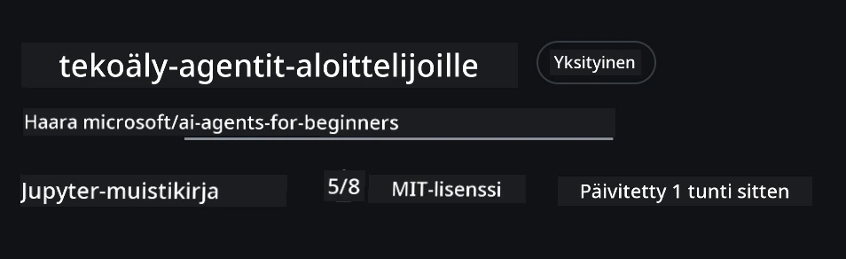
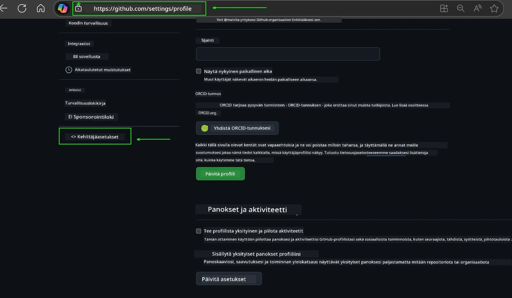
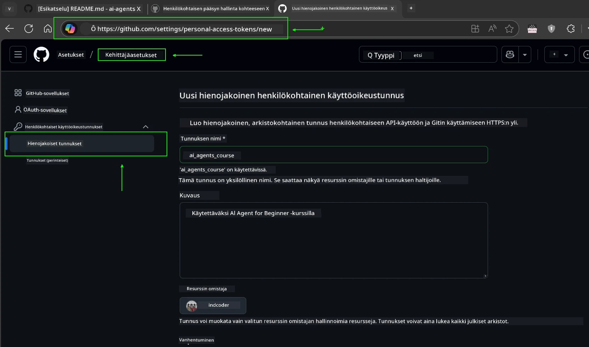
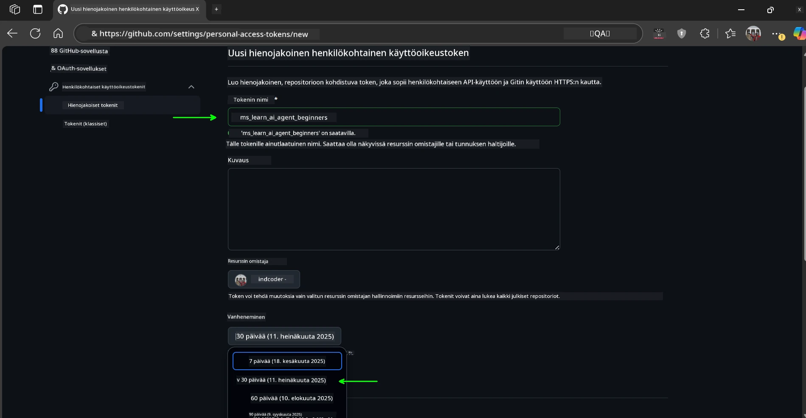
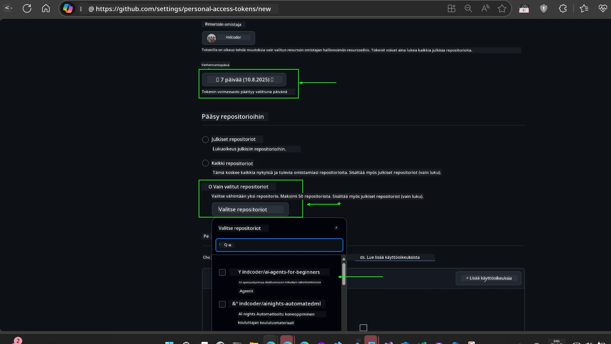
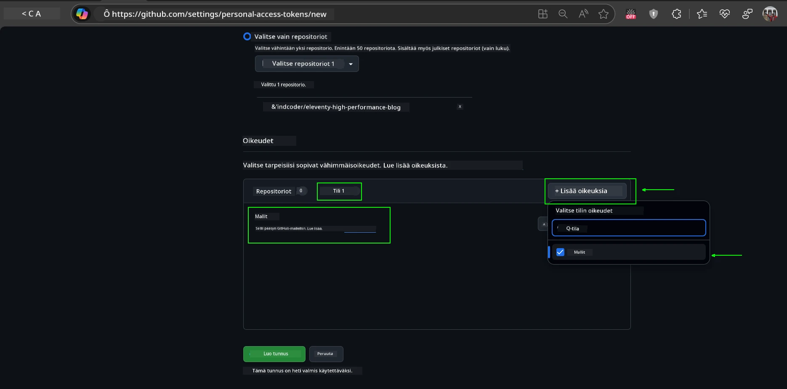
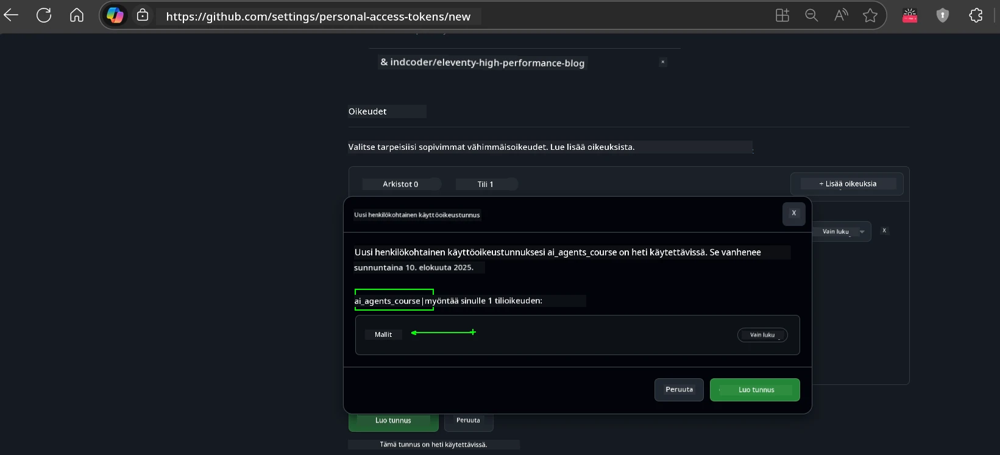
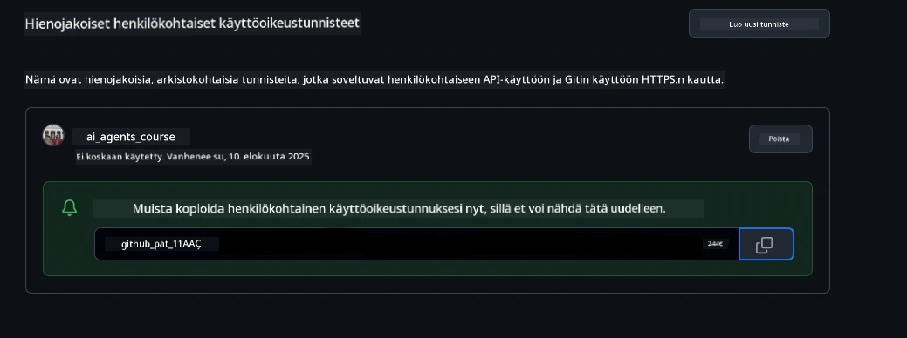
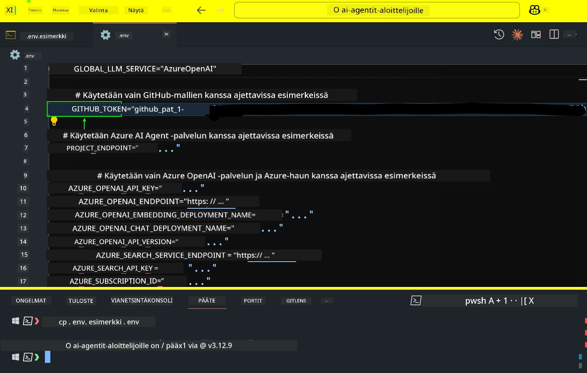
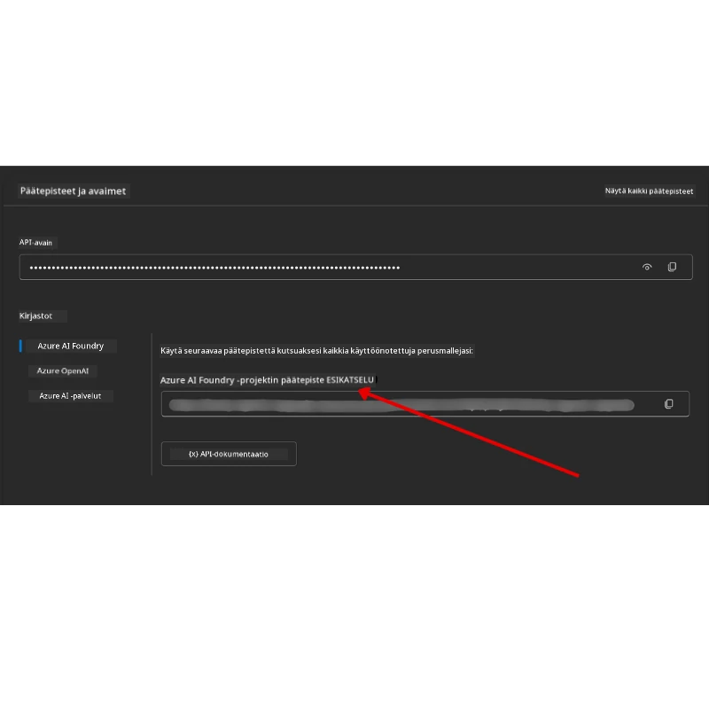

<!--
CO_OP_TRANSLATOR_METADATA:
{
  "original_hash": "63b1a8f6e840df15934935b728e569f0",
  "translation_date": "2025-12-03T14:35:15+00:00",
  "source_file": "00-course-setup/README.md",
  "language_code": "fi"
}
-->
# Kurssin Asennus

## Johdanto

Tässä osiossa käsitellään, kuinka tämän kurssin koodiesimerkkejä ajetaan.

## Liity muihin oppijoihin ja saa apua

Ennen kuin aloitat repositorion kloonaamisen, liity [AI Agents For Beginners Discord-kanavalle](https://aka.ms/ai-agents/discord) saadaksesi apua asennuksessa, kysymyksiin kurssista tai yhteyden muihin oppijoihin.

## Kloonaa tai haarauta tämä repositorio

Aloittaaksesi, kloonaa tai haarauta GitHub-repositorio. Tämä luo oman version kurssimateriaalista, jotta voit ajaa, testata ja muokata koodia!

Tämä onnistuu klikkaamalla linkkiä <a href="https://github.com/microsoft/ai-agents-for-beginners/fork" target="_blank">haaraudu repositorioon</a>.

Sinulla pitäisi nyt olla oma haarautettu versio tästä kurssista seuraavassa linkissä:



### Pintakloonaus (suositeltu työpajoihin / Codespaces-ympäristöihin)

  >Koko repositorio voi olla suuri (~3 GB), kun lataat koko historian ja kaikki tiedostot. Jos osallistut vain työpajaan tai tarvitset vain muutaman oppituntikansion, pintakloonaus (tai osittainen kloonaus) välttää suurimman osan tästä latauksesta lyhentämällä historiaa ja/tai ohittamalla tiedostot.

#### Nopea pintakloonaus — minimaalinen historia, kaikki tiedostot

Korvaa `<your-username>` alla olevissa komennoissa haarautumisesi URL-osoitteella (tai alkuperäisellä URL-osoitteella, jos haluat).

Kloonataksesi vain viimeisimmän commit-historian (pieni lataus):

```bash|powershell
git clone --depth 1 https://github.com/<your-username>/ai-agents-for-beginners.git
```

Kloonataksesi tietyn haaran:

```bash|powershell
git clone --depth 1 --branch <branch-name> https://github.com/<your-username>/ai-agents-for-beginners.git
```

#### Osittainen (sparse) kloonaus — minimaaliset tiedostot + vain valitut kansiot

Tämä käyttää osittaista kloonausta ja sparse-checkoutia (vaatii Git 2.25+ ja suositellaan modernia Git-versiota osittaisen kloonauksen tuella):

```bash|powershell
git clone --depth 1 --filter=blob:none --sparse https://github.com/<your-username>/ai-agents-for-beginners.git
```

Siirry repositorion kansioon:

```bash|powershell
cd ai-agents-for-beginners
```

Määritä sitten, mitkä kansiot haluat (esimerkki alla näyttää kaksi kansiota):

```bash|powershell
git sparse-checkout set 00-course-setup 01-intro-to-ai-agents
```

Kun olet kloonannut ja varmistanut tiedostot, jos tarvitset vain tiedostoja ja haluat vapauttaa tilaa (ilman git-historiaa), poista repositorion metadata (💀peruuttamaton — menetät kaiken Git-toiminnallisuuden: ei committeja, pull-pyyntöjä, push-pyyntöjä tai historian käyttöä).

```bash
# zsh/bash
rm -rf .git
```

```powershell
# PowerShell
Remove-Item -Recurse -Force .git
```

#### GitHub Codespacesin käyttö (suositeltu välttämään suuria paikallisia latauksia)

- Luo uusi Codespace tälle repositoriolle [GitHub-käyttöliittymän](https://github.com/codespaces) kautta.  

- Aja uuden Codespace-ympäristön terminaalissa yksi yllä olevista pintakloonaus-/osittaiskloonaus-komennoista tuodaksesi vain tarvitsemasi oppituntikansiot Codespace-työtilaan.
- Valinnainen: kloonauksen jälkeen Codespaces-ympäristössä poista .git vapauttaaksesi lisätilaa (katso poistokäskyt yllä).
- Huomio: Jos haluat avata repositorion suoraan Codespacesissa (ilman ylimääräistä kloonausta), huomaa, että Codespaces rakentaa devcontainer-ympäristön ja saattaa silti varata enemmän kuin tarvitset. Kloonaamalla pintakopion uudessa Codespaces-ympäristössä saat enemmän hallintaa levytilan käytöstä.

#### Vinkkejä

- Korvaa aina kloonaus-URL haarautumisellasi, jos haluat muokata/commitoida.
- Jos myöhemmin tarvitset lisää historiaa tai tiedostoja, voit hakea ne tai säätää sparse-checkoutia sisällyttämään lisäkansioita.

## Koodin suorittaminen

Tämä kurssi tarjoaa sarjan Jupyter Notebookeja, joita voit ajaa saadaksesi käytännön kokemusta AI-agenttien rakentamisesta.

Koodiesimerkit käyttävät joko:

**Vaatii GitHub-tilin - Ilmainen**:

1) Semantic Kernel Agent Framework + GitHub Models Marketplace. Merkitty nimellä (semantic-kernel.ipynb)
2) AutoGen Framework + GitHub Models Marketplace. Merkitty nimellä (autogen.ipynb)

**Vaatii Azure-tilauksen**:

3) Azure AI Foundry + Azure AI Agent Service. Merkitty nimellä (azureaiagent.ipynb)

Kannustamme sinua kokeilemaan kaikkia kolmea esimerkkiä nähdäksesi, mikä toimii sinulle parhaiten.

Valitsemasi vaihtoehto määrittää, mitkä asennusvaiheet sinun tulee suorittaa alla:

## Vaatimukset

- Python 3.12+
  - **HUOM**: Jos sinulla ei ole Python 3.12 asennettuna, varmista, että asennat sen. Luo sitten venv käyttämällä python3.12 varmistaaksesi, että oikeat versiot asennetaan requirements.txt-tiedostosta.
  
    >Esimerkki

    Luo Python venv-hakemisto:

    ```bash|powershell
    python -m venv venv
    ```

    Aktivoi sitten venv-ympäristö:

    ```bash
    # zsh/bash
    source venv/bin/activate
    ```
  
    ```dos
    # Command Prompt for Windows
    venv\Scripts\activate
    ```

- .NET 10+: Näytekoodien käyttöön .NET:llä, varmista, että asennat [.NET 10 SDK:n](https://dotnet.microsoft.com/download/dotnet/10.0) tai uudemman. Tarkista sitten asennettu .NET SDK -versio:

    ```bash|powershell
    dotnet --list-sdks
    ```

- GitHub-tili - Pääsyyn GitHub Models Marketplaceen
- Azure-tilaus - Pääsyyn Azure AI Foundryyn
- Azure AI Foundry -tili - Pääsyyn Azure AI Agent Serviceen

Olemme sisällyttäneet `requirements.txt`-tiedoston tämän repositorion juureen, joka sisältää kaikki tarvittavat Python-paketit koodiesimerkkien suorittamiseen.

Voit asentaa ne suorittamalla seuraavan komennon terminaalissasi repositorion juuressa:

```bash|powershell
pip install -r requirements.txt
```

Suosittelemme Python-virtuaaliympäristön luomista välttääksesi konflikteja ja ongelmia.

## VSCode-asennus

Varmista, että käytät oikeaa Python-versiota VSCode:ssa.


## Näytteiden asennus GitHub-mallien käyttöön 

### Vaihe 1: Hanki GitHubin henkilökohtainen käyttöoikeustoken (PAT)

Tämä kurssi hyödyntää GitHub Models Marketplacea, joka tarjoaa ilmaisen pääsyn suuriin kielimalleihin (LLM), joita käytät AI-agenttien rakentamiseen.

GitHub-mallien käyttöön tarvitset [GitHubin henkilökohtaisen käyttöoikeustokenin](https://docs.github.com/en/authentication/keeping-your-account-and-data-secure/managing-your-personal-access-tokens).

Tämä onnistuu menemällä <a href="https://github.com/settings/personal-access-tokens" target="_blank">Henkilökohtaisten käyttöoikeustokenien asetuksiin</a> GitHub-tililläsi.

Noudata [vähimmän oikeuden periaatetta](https://docs.github.com/en/get-started/learning-to-code/storing-your-secrets-safely) luodessasi tokenia. Tämä tarkoittaa, että sinun tulisi antaa tokenille vain ne oikeudet, joita se tarvitsee tämän kurssin koodiesimerkkien suorittamiseen.

1. Valitse `Fine-grained tokens` -vaihtoehto näytön vasemmasta reunasta siirtymällä **Kehittäjäasetuksiin**.

   

   Valitse sitten `Luo uusi token`.

   

2. Anna tokenille kuvaava nimi, joka heijastaa sen tarkoitusta, jotta se on helppo tunnistaa myöhemmin.

    🔐 Tokenin keston suositus

    Suositeltu kesto: 30 päivää  
    Turvallisemman käytännön vuoksi voit valita lyhyemmän ajan—esimerkiksi 7 päivää 🛡️  
    Tämä on hyvä tapa asettaa henkilökohtainen tavoite ja suorittaa kurssi, kun oppimismotivaatiota riittää 🚀.

    

3. Rajoita tokenin käyttöoikeus haarautumiseesi tästä repositoriosta.

    

4. Rajoita tokenin oikeudet: Valitse **Oikeudet**-kohdassa **Tili**-välilehti ja napsauta "+ Lisää oikeuksia" -painiketta. Avautuvasta valikosta etsi **Models** ja valitse se.

    

5. Varmista tarvittavat oikeudet ennen tokenin luomista. 

6. Ennen tokenin luomista varmista, että olet valmis tallentamaan tokenin turvalliseen paikkaan, kuten salasananhallintaohjelmaan, sillä sitä ei näytetä uudelleen luomisen jälkeen. 

Kopioi juuri luomasi token. Lisää se nyt tämän kurssin mukana toimitettuun `.env`-tiedostoon.

### Vaihe 2: Luo `.env`-tiedosto

Luo `.env`-tiedosto suorittamalla seuraava komento terminaalissasi.

```bash
# zsh/bash
cp .env.example .env
```

```powershell
# PowerShell
Copy-Item .env.example .env
```

Tämä kopioi esimerkkitiedoston ja luo `.env`-tiedoston hakemistoosi, jossa täytät ympäristömuuttujien arvot.

Kopioidun tokenin kanssa avaa `.env`-tiedosto suosikkitekstieditorissasi ja liitä token `GITHUB_TOKEN`-kenttään.



Nyt sinun pitäisi pystyä suorittamaan tämän kurssin koodiesimerkit.

## Näytteiden asennus Azure AI Foundry- ja Azure AI Agent Service -käyttöön

### Vaihe 1: Hanki Azure-projektin päätepiste

Seuraa ohjeita hubin ja projektin luomiseksi Azure AI Foundryssa täältä: [Hub-resurssien yleiskatsaus](https://learn.microsoft.com/azure/ai-foundry/concepts/ai-resources)

Kun olet luonut projektisi, sinun täytyy hankkia projektisi yhteysmerkkijono.

Tämä onnistuu menemällä projektisi **Yleiskatsaus**-sivulle Azure AI Foundry -portaalissa.



### Vaihe 2: Luo `.env`-tiedosto

Luo `.env`-tiedosto suorittamalla seuraava komento terminaalissasi.

```bash
# zsh/bash
cp .env.example .env
```

```powershell
# PowerShell
Copy-Item .env.example .env
```

Tämä kopioi esimerkkitiedoston ja luo `.env`-tiedoston hakemistoosi, jossa täytät ympäristömuuttujien arvot.

Kopioidun tokenin kanssa avaa `.env`-tiedosto suosikkitekstieditorissasi ja liitä token `PROJECT_ENDPOINT`-kenttään.

### Vaihe 3: Kirjaudu sisään Azureen

Turvallisuuskäytännön mukaisesti käytämme [avaimetonta todennusta](https://learn.microsoft.com/azure/developer/ai/keyless-connections?tabs=csharp%2Cazure-cli?WT.mc_id=academic-105485-koreyst) kirjautuaksemme Azure OpenAI:hin Microsoft Entra ID:n avulla. 

Avaa seuraavaksi terminaali ja suorita `az login --use-device-code` kirjautuaksesi Azure-tilillesi.

Kun olet kirjautunut sisään, valitse tilauksesi terminaalissa.

## Lisäympäristömuuttujat - Azure Search ja Azure OpenAI 

Agentic RAG -oppitunnille - Oppitunti 5 - on näytteitä, jotka käyttävät Azure Searchia ja Azure OpenAI:ta.

Jos haluat suorittaa nämä näytteet, sinun täytyy lisätä seuraavat ympäristömuuttujat `.env`-tiedostoosi:

### Yleiskatsaus-sivu (Projekti)

- `AZURE_SUBSCRIPTION_ID` - Tarkista **Projektin tiedot** projektisi **Yleiskatsaus**-sivulta.

- `AZURE_AI_PROJECT_NAME` - Katso projektisi **Yleiskatsaus**-sivun yläosasta.

- `AZURE_OPENAI_SERVICE` - Löydät tämän **Sisältyvät ominaisuudet**-välilehdeltä **Azure OpenAI Service** kohdasta **Yleiskatsaus**-sivulla.

### Hallintakeskus

- `AZURE_OPENAI_RESOURCE_GROUP` - Mene **Projektin ominaisuudet** kohtaan **Yleiskatsaus**-sivulla **Hallintakeskuksessa**.

- `GLOBAL_LLM_SERVICE` - **Liitetyt resurssit**-kohdassa löydä **Azure AI Services** -yhteyden nimi. Jos ei listattu, tarkista **Azure-portaali** resurssiryhmästäsi AI Services -resurssin nimi.

### Mallit + Päätepisteet -sivu

- `AZURE_OPENAI_EMBEDDING_DEPLOYMENT_NAME` - Valitse upotusmallisi (esim. `text-embedding-ada-002`) ja huomioi **Deployment name** mallin tiedoista.

- `AZURE_OPENAI_CHAT_DEPLOYMENT_NAME` - Valitse keskustelumallisi (esim. `gpt-4o-mini`) ja huomioi **Deployment name** mallin tiedoista.

### Azure-portaali

- `AZURE_OPENAI_ENDPOINT` - Etsi **Azure AI services**, klikkaa sitä, mene **Resurssien hallinta**, **Avaimet ja päätepiste**, selaa alas kohtaan "Azure OpenAI endpoints" ja kopioi se, jossa lukee "Language APIs".

- `AZURE_OPENAI_API_KEY` - Samalta näytöltä kopioi AVAIN 1 tai AVAIN 2.

- `AZURE_SEARCH_SERVICE_ENDPOINT` - Löydä **Azure AI Search** -resurssisi, klikkaa sitä ja katso **Yleiskatsaus**.

- `AZURE_SEARCH_API_KEY` - Mene sitten **Asetukset** ja sitten **Avaimet** kopioidaksesi ensisijaisen tai toissijaisen hallinta-avaimen.

### Ulkoinen verkkosivu

- `AZURE_OPENAI_API_VERSION` - Vieraile [API-version elinkaari](https://learn.microsoft.com/azure/ai-services/openai/api-version-deprecation#latest-ga-api-release) -sivulla kohdassa **Uusin GA API -julkaisu**.

### Avaimeton todennus

Sen sijaan, että kovakoodaisimme tunnistetietosi, käytämme avaimetonta yhteyttä Azure OpenAI:hin. Tätä varten tuomme `DefaultAzureCredential`-luokan ja kutsumme myöhemmin `DefaultAzureCredential`-funktiota saadaksemme tunnistetiedot.

```python
# Python
from azure.identity import DefaultAzureCredential, InteractiveBrowserCredential
```

## Jäikö jokin epäselväksi?
Jos sinulla on ongelmia tämän asennuksen kanssa, liity <a href="https://discord.gg/kzRShWzttr" target="_blank">Azure AI Community Discordiin</a> tai <a href="https://github.com/microsoft/ai-agents-for-beginners/issues?WT.mc_id=academic-105485-koreyst" target="_blank">luo ongelmailmoitus</a>.

## Seuraava oppitunti

Olet nyt valmis suorittamaan kurssin koodin. Mukavia hetkiä AI-agenttien maailmaan tutustuessa!

[Johdatus AI-agentteihin ja agenttien käyttötapauksiin](../01-intro-to-ai-agents/README.md)

---

<!-- CO-OP TRANSLATOR DISCLAIMER START -->
**Vastuuvapauslauseke**:  
Tämä asiakirja on käännetty käyttämällä tekoälypohjaista käännöspalvelua [Co-op Translator](https://github.com/Azure/co-op-translator). Vaikka pyrimme tarkkuuteen, huomioithan, että automaattiset käännökset voivat sisältää virheitä tai epätarkkuuksia. Alkuperäistä asiakirjaa sen alkuperäisellä kielellä tulisi pitää ensisijaisena lähteenä. Kriittisen tiedon osalta suositellaan ammattimaista ihmiskäännöstä. Emme ole vastuussa tämän käännöksen käytöstä johtuvista väärinkäsityksistä tai virhetulkinnoista.
<!-- CO-OP TRANSLATOR DISCLAIMER END -->