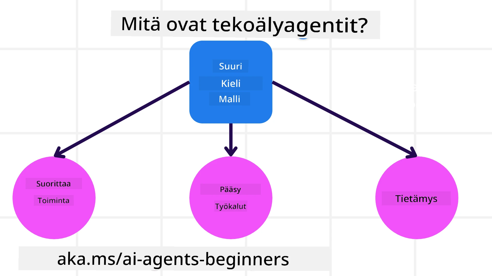
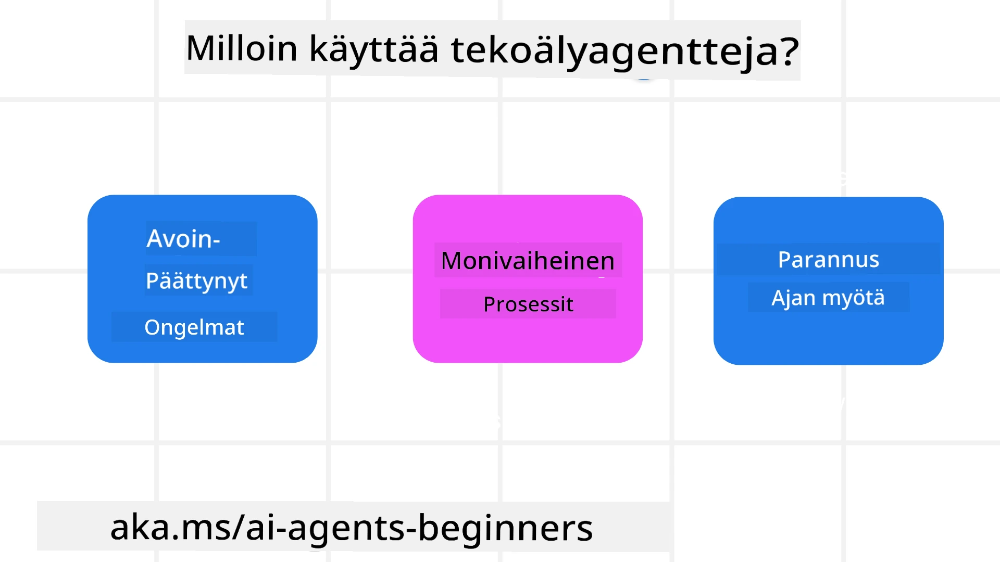

<!--
CO_OP_TRANSLATOR_METADATA:
{
  "original_hash": "cdd28bc00816d2773bb2b5968d782abc",
  "translation_date": "2025-11-11T11:23:20+00:00",
  "source_file": "01-intro-to-ai-agents/README.md",
  "language_code": "fi"
}
-->

> _(Klikkaa yllä olevaa kuvaa nähdäksesi tämän oppitunnin videon)_

# Johdanto tekoälyagentteihin ja niiden käyttötapauksiin

Tervetuloa "Tekoälyagentit aloittelijoille" -kurssille! Tämä kurssi tarjoaa perustiedot ja käytännön esimerkkejä tekoälyagenttien rakentamiseen.

Liity <a href="https://discord.gg/kzRShWzttr" target="_blank">Azure AI Discord -yhteisöön</a>, jossa voit tavata muita oppijoita ja tekoälyagenttien kehittäjiä sekä esittää kysymyksiä kurssista.

Kurssin aluksi tutustumme siihen, mitä tekoälyagentit ovat ja miten voimme hyödyntää niitä rakentamissamme sovelluksissa ja työnkuluissa.

## Johdanto

Tämä oppitunti käsittelee:

- Mitä tekoälyagentit ovat ja mitkä ovat niiden eri tyypit?
- Mitkä käyttötapaukset sopivat parhaiten tekoälyagenteille ja miten ne voivat auttaa meitä?
- Mitkä ovat agenttiratkaisujen suunnittelun peruspalikat?

## Oppimistavoitteet
Oppitunnin jälkeen sinun pitäisi pystyä:

- Ymmärtämään tekoälyagenttien käsitteet ja miten ne eroavat muista tekoälyratkaisuista.
- Käyttämään tekoälyagentteja tehokkaasti.
- Suunnittelemaan agenttiratkaisuja tuottavasti sekä käyttäjille että asiakkaille.

## Tekoälyagenttien määrittely ja tyypit

### Mitä tekoälyagentit ovat?

Tekoälyagentit ovat **järjestelmiä**, jotka mahdollistavat **suuret kielimallit (LLM)** **toimimaan** laajentamalla niiden kykyjä antamalla LLM:ille **pääsyn työkaluihin** ja **tietoon**.

Puretaan tämä määritelmä pienempiin osiin:

- **Järjestelmä** - On tärkeää ajatella agentteja ei vain yksittäisenä komponenttina, vaan monien komponenttien järjestelmänä. Perustasolla tekoälyagentin komponentit ovat:
  - **Ympäristö** - Määritelty tila, jossa tekoälyagentti toimii. Esimerkiksi matkavarauksen tekoälyagentin ympäristö voisi olla matkavarausjärjestelmä, jota agentti käyttää tehtävien suorittamiseen.
  - **Anturit** - Ympäristöt sisältävät tietoa ja antavat palautetta. Tekoälyagentit käyttävät antureita kerätäkseen ja tulkitakseen tietoa ympäristön nykytilasta. Matkavarausagentin tapauksessa varaussysteemi voi antaa tietoa, kuten hotellien saatavuuden tai lentojen hinnat.
  - **Toimilaitteet** - Kun tekoälyagentti saa ympäristön nykytilan, se määrittää tehtävän perusteella, mitä toimia tarvitaan ympäristön muuttamiseksi. Matkavarausagentin tapauksessa tämä voisi olla huoneen varaaminen käyttäjälle.

**Suuret kielimallit** - Agenttien käsite oli olemassa jo ennen LLM:ien luomista. Tekoälyagenttien rakentamisen etu LLM:ien avulla on niiden kyky tulkita ihmiskieltä ja dataa. Tämä kyky mahdollistaa LLM:ien ympäristötiedon tulkinnan ja suunnitelman laatimisen ympäristön muuttamiseksi.

**Toimien suorittaminen** - Tekoälyagenttijärjestelmien ulkopuolella LLM:ien toiminta rajoittuu tilanteisiin, joissa ne tuottavat sisältöä tai tietoa käyttäjän antaman kehotteen perusteella. Tekoälyagenttijärjestelmissä LLM:t voivat suorittaa tehtäviä tulkitsemalla käyttäjän pyynnön ja käyttämällä ympäristössä saatavilla olevia työkaluja.

**Pääsy työkaluihin** - Mitä työkaluja LLM:illä on käytettävissään, määritellään 1) ympäristön perusteella, jossa se toimii, ja 2) tekoälyagentin kehittäjän toimesta. Matkavarausagentin tapauksessa agentin työkalut rajoittuvat varaussysteemin tarjoamiin toimintoihin, ja/tai kehittäjä voi rajoittaa agentin työkalujen käyttöä esimerkiksi vain lentojen varaamiseen.

**Muisti + Tieto** - Muisti voi olla lyhytaikaista käyttäjän ja agentin välisen keskustelun kontekstissa. Pitkällä aikavälillä, ympäristön tarjoaman tiedon lisäksi, tekoälyagentit voivat myös hakea tietoa muista järjestelmistä, palveluista, työkaluista ja jopa muilta agenteilta. Matkavarausagentin tapauksessa tämä tieto voisi olla käyttäjän matkustustottumuksia koskeva tieto asiakasrekisteristä.

### Eri agenttityypit

Nyt kun meillä on yleinen määritelmä tekoälyagenteista, tarkastellaan joitakin erityisiä agenttityyppejä ja miten niitä voitaisiin soveltaa matkavarausagenttiin.

| **Agenttityyppi**             | **Kuvaus**                                                                                                                            | **Esimerkki**                                                                                                                                                                                                                   |
| ----------------------------- | ------------------------------------------------------------------------------------------------------------------------------------- | ----------------------------------------------------------------------------------------------------------------------------------------------------------------------------------------------------------------------------- |
| **Yksinkertaiset refleksiagentit** | Suorittavat välittömiä toimia ennalta määriteltyjen sääntöjen perusteella.                                                                 | Matkavarausagentti tulkitsee sähköpostin kontekstin ja ohjaa matkustusvalitukset asiakaspalveluun.                                                                                                                          |
| **Mallipohjaiset refleksiagentit** | Suorittavat toimia maailman mallin ja sen muutosten perusteella.                                                                      | Matkavarausagentti priorisoi reitit, joilla on merkittäviä hintamuutoksia, perustuen pääsyyn historiallisiin hintatietoihin.                                                                                                             |
| **Tavoitepohjaiset agentit**   | Laativat suunnitelmia tiettyjen tavoitteiden saavuttamiseksi tulkitsemalla tavoitteen ja määrittämällä tarvittavat toimet sen saavuttamiseksi.                                  | Matkavarausagentti varaa matkan määrittämällä tarvittavat matkajärjestelyt (auto, julkinen liikenne, lennot) nykyisestä sijainnista määränpäähän.                                                                                |
| **Hyötypohjaiset agentit**     | Ottavat huomioon mieltymykset ja punnitsevat kompromisseja numeerisesti määrittääkseen, miten tavoitteet saavutetaan.                                               | Matkavarausagentti maksimoi hyötyä punnitsemalla mukavuuden ja kustannukset matkavarauksessa.                                                                                                                                          |
| **Oppivat agentit**            | Parantavat toimintaansa ajan myötä reagoimalla palautteeseen ja säätämällä toimiaan sen mukaisesti.                                                        | Matkavarausagentti parantaa toimintaansa käyttämällä asiakaspalautetta matkan jälkeisistä kyselyistä tehdäkseen muutoksia tuleviin varauksiin.                                                                                                               |
| **Hierarkkiset agentit**       | Sisältävät useita agentteja kerrostetussa järjestelmässä, jossa ylemmän tason agentit jakavat tehtävät alemman tason agenteille suoritettaviksi. | Matkavarausagentti peruuttaa matkan jakamalla tehtävän osatehtäviin (esimerkiksi tiettyjen varausten peruuttaminen) ja antaa alemman tason agenttien suorittaa ne, raportoiden takaisin ylemmän tason agentille.                                     |
| **Moniagenttijärjestelmät (MAS)** | Agentit suorittavat tehtäviä itsenäisesti, joko yhteistyössä tai kilpailullisesti.                                                           | Yhteistyö: Useat agentit varaavat tiettyjä matkustuspalveluja, kuten hotelleja, lentoja ja viihdettä. Kilpailu: Useat agentit hallinnoivat ja kilpailevat jaetusta hotellivarauskalenterista varatakseen asiakkaita hotelliin. |

## Milloin käyttää tekoälyagentteja

Edellisessä osiossa käytimme matkavarausagenttia esimerkkinä selittääksemme, miten eri agenttityyppejä voidaan käyttää matkavarauksen eri tilanteissa. Käytämme tätä sovellusta läpi kurssin.

Tarkastellaan nyt, millaisiin käyttötapauksiin tekoälyagentit sopivat parhaiten:

- **Avoimet ongelmat** - LLM:n salliminen määrittää tarvittavat askeleet tehtävän suorittamiseksi, koska niitä ei aina voida kovakoodata työnkulkuun.
- **Monivaiheiset prosessit** - Tehtävät, jotka vaativat tiettyä monimutkaisuutta, jossa tekoälyagentin täytyy käyttää työkaluja tai tietoa useiden vuorovaikutusten aikana yhden hakukerran sijaan.  
- **Parantuminen ajan myötä** - Tehtävät, joissa agentti voi parantaa toimintaansa ajan myötä saamalla palautetta joko ympäristöltään tai käyttäjiltä tarjotakseen parempaa hyötyä.

Käsittelemme lisää tekoälyagenttien käyttöön liittyviä näkökohtia luotettavien tekoälyagenttien rakentamista käsittelevässä oppitunnissa.

## Agenttiratkaisujen perusteet

### Agenttien kehittäminen

Ensimmäinen askel tekoälyagenttijärjestelmän suunnittelussa on määritellä työkalut, toimet ja käyttäytymiset. Tässä kurssissa keskitymme käyttämään **Azure AI Agent Service** -palvelua agenttien määrittelyyn. Se tarjoaa ominaisuuksia, kuten:

- Avoimien mallien valinta, kuten OpenAI, Mistral ja Llama
- Lisensoidun datan käyttö palveluntarjoajien, kuten Tripadvisorin, kautta
- Standardoitujen OpenAPI 3.0 -työkalujen käyttö

### Agenttimallit

Vuorovaikutus LLM:ien kanssa tapahtuu kehotteiden avulla. Tekoälyagenttien puoliksi autonomisen luonteen vuoksi ei aina ole mahdollista tai tarpeellista kehottaa LLM:ää manuaalisesti ympäristön muutoksen jälkeen. Käytämme **agenttimalleja**, jotka mahdollistavat LLM:n kehotteiden käytön useiden vaiheiden aikana skaalautuvammalla tavalla.

Tämä kurssi on jaettu joihinkin nykyisin suosittuihin agenttimalleihin.

### Agenttikehykset

Agenttikehykset mahdollistavat kehittäjille agenttimallien toteuttamisen koodin avulla. Nämä kehykset tarjoavat malleja, laajennuksia ja työkaluja parempaan tekoälyagenttien yhteistyöhön. Näiden etujen avulla voidaan parantaa tekoälyagenttijärjestelmien havaittavuutta ja vianetsintää.

Tässä kurssissa tutkimme tutkimuslähtöistä AutoGen-kehystä ja tuotantovalmiita Semantic Kernelin Agent-kehystä.

## Esimerkkikoodit

- Python: [Agent Framework](./code_samples/01-python-agent-framework.ipynb)
- .NET: [Agent Framework](./code_samples/01-dotnet-agent-framework.md)

## Onko sinulla lisää kysymyksiä tekoälyagenteista?

Liity [Azure AI Foundry Discordiin](https://aka.ms/ai-agents/discord), jossa voit tavata muita oppijoita, osallistua toimistoaikoihin ja saada vastauksia tekoälyagentteihin liittyviin kysymyksiisi.

## Edellinen oppitunti

[Kurssin aloitus](../00-course-setup/README.md)

## Seuraava oppitunti

[Agenttikehysten tutkiminen](../02-explore-agentic-frameworks/README.md)

---

<!-- CO-OP TRANSLATOR DISCLAIMER START -->
**Vastuuvapauslauseke**:  
Tämä asiakirja on käännetty käyttämällä tekoälypohjaista käännöspalvelua [Co-op Translator](https://github.com/Azure/co-op-translator). Vaikka pyrimme tarkkuuteen, huomioithan, että automaattiset käännökset voivat sisältää virheitä tai epätarkkuuksia. Alkuperäinen asiakirja sen alkuperäisellä kielellä tulisi pitää ensisijaisena lähteenä. Tärkeissä tiedoissa suositellaan ammattimaista ihmiskäännöstä. Emme ole vastuussa väärinkäsityksistä tai virhetulkinnoista, jotka johtuvat tämän käännöksen käytöstä.
<!-- CO-OP TRANSLATOR DISCLAIMER END -->