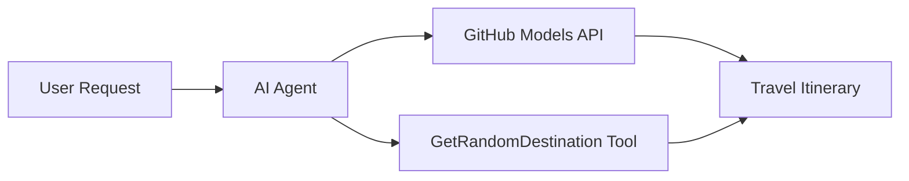

<!--
CO_OP_TRANSLATOR_METADATA:
{
  "original_hash": "5f351412e934f0833c8c821a0a60efaf",
  "translation_date": "2025-11-13T12:56:36+00:00",
  "source_file": "01-intro-to-ai-agents/code_samples/01-dotnet-agent-framework.md",
  "language_code": "fi"
}
-->
# 🌍 Älykäs matkatoimisto Microsoft Agent Frameworkilla (.NET)

## 📋 Yleiskatsaus skenaarioon

Tämä esimerkki näyttää, kuinka rakentaa älykäs matkasuunnittelija-agentti Microsoft Agent Frameworkin avulla .NET-ympäristössä. Agentti voi automaattisesti luoda henkilökohtaisia päiväretkien matkasuunnitelmia satunnaisiin kohteisiin ympäri maailmaa.

### Keskeiset ominaisuudet:

- 🎲 **Satunnaisen kohteen valinta**: Käyttää mukautettua työkalua lomakohteiden valintaan
- 🗺️ **Älykäs matkasuunnittelu**: Luo yksityiskohtaisia päiväkohtaisia matkasuunnitelmia
- 🔄 **Reaaliaikainen suoratoisto**: Tukee sekä välittömiä että suoratoistovastauksia
- 🛠️ **Mukautettu työkalujen integrointi**: Näyttää, kuinka agentin ominaisuuksia voidaan laajentaa

## 🔧 Tekninen arkkitehtuuri

### Keskeiset teknologiat

- **Microsoft Agent Framework**: Uusin .NET-toteutus tekoälyagenttien kehittämiseen
- **GitHub Models -integraatio**: Käyttää GitHubin AI-mallien inferenssipalvelua
- **OpenAI API -yhteensopivuus**: Hyödyntää OpenAI:n asiakaskirjastoja mukautetuilla päätepisteillä
- **Turvallinen konfigurointi**: API-avainten hallinta ympäristömuuttujien avulla

### Keskeiset komponentit

1. **AIAgent**: Pääagentti, joka hallitsee keskustelun kulkua
2. **Mukautetut työkalut**: `GetRandomDestination()`-funktio agentin käytettävissä
3. **Chat Client**: GitHub Models -pohjainen keskusteluliittymä
4. **Suoratoistotuki**: Reaaliaikainen vastausten generointi

### Integraatiomalli



## 🚀 Aloittaminen

### Esivaatimukset

- [.NET 10 SDK](https://dotnet.microsoft.com/download/dotnet/10.0) tai uudempi
- [GitHub Models API -pääsytunnus](https://docs.github.com/github-models/github-models-at-scale/using-your-own-api-keys-in-github-models)

### Vaaditut ympäristömuuttujat

```bash
# zsh/bash
export GH_TOKEN=<your_github_token>
export GH_ENDPOINT=https://models.github.ai/inference
export GH_MODEL_ID=openai/gpt-5-mini
```

```powershell
# PowerShell
$env:GH_TOKEN = "<your_github_token>"
$env:GH_ENDPOINT = "https://models.github.ai/inference"
$env:GH_MODEL_ID = "openai/gpt-5-mini"
```

### Esimerkkikoodi

Koodiesimerkin suorittamiseksi,

```bash
# zsh/bash
chmod +x ./01-dotnet-agent-framework.cs
./01-dotnet-agent-framework.cs
```

Tai käyttämällä dotnet CLI:tä:

```bash
dotnet run ./01-dotnet-agent-framework.cs
```

Katso [`01-dotnet-agent-framework.cs`](../../../../01-intro-to-ai-agents/code_samples/01-dotnet-agent-framework.cs) täydellinen koodi.

```csharp
#!/usr/bin/dotnet run

#:package Microsoft.Extensions.AI@9.*
#:package Microsoft.Agents.AI.OpenAI@1.*-*

using System.ClientModel;
using System.ComponentModel;

using Microsoft.Agents.AI;
using Microsoft.Extensions.AI;

using OpenAI;

// Tool Function: Random Destination Generator
// This static method will be available to the agent as a callable tool
// The [Description] attribute helps the AI understand when to use this function
// This demonstrates how to create custom tools for AI agents
[Description("Provides a random vacation destination.")]
static string GetRandomDestination()
{
    // List of popular vacation destinations around the world
    // The agent will randomly select from these options
    var destinations = new List<string>
    {
        "Paris, France",
        "Tokyo, Japan",
        "New York City, USA",
        "Sydney, Australia",
        "Rome, Italy",
        "Barcelona, Spain",
        "Cape Town, South Africa",
        "Rio de Janeiro, Brazil",
        "Bangkok, Thailand",
        "Vancouver, Canada"
    };

    // Generate random index and return selected destination
    // Uses System.Random for simple random selection
    var random = new Random();
    int index = random.Next(destinations.Count);
    return destinations[index];
}

// Extract configuration from environment variables
// Retrieve the GitHub Models API endpoint, defaults to https://models.github.ai/inference if not specified
// Retrieve the model ID, defaults to openai/gpt-5-mini if not specified
// Retrieve the GitHub token for authentication, throws exception if not specified
var github_endpoint = Environment.GetEnvironmentVariable("GH_ENDPOINT") ?? "https://models.github.ai/inference";
var github_model_id = Environment.GetEnvironmentVariable("GH_MODEL_ID") ?? "openai/gpt-5-mini";
var github_token = Environment.GetEnvironmentVariable("GH_TOKEN") ?? throw new InvalidOperationException("GH_TOKEN is not set.");

// Configure OpenAI Client Options
// Create configuration options to point to GitHub Models endpoint
// This redirects OpenAI client calls to GitHub's model inference service
var openAIOptions = new OpenAIClientOptions()
{
    Endpoint = new Uri(github_endpoint)
};

// Initialize OpenAI Client with GitHub Models Configuration
// Create OpenAI client using GitHub token for authentication
// Configure it to use GitHub Models endpoint instead of OpenAI directly
var openAIClient = new OpenAIClient(new ApiKeyCredential(github_token), openAIOptions);

// Create AI Agent with Travel Planning Capabilities
// Initialize OpenAI client, get chat client for specified model, and create AI agent
// Configure agent with travel planning instructions and random destination tool
// The agent can now plan trips using the GetRandomDestination function
AIAgent agent = openAIClient
    .GetChatClient(github_model_id)
    .CreateAIAgent(
        instructions: "You are a helpful AI Agent that can help plan vacations for customers at random destinations",
        tools: [AIFunctionFactory.Create(GetRandomDestination)]
    );

// Execute Agent: Plan a Day Trip
// Run the agent with streaming enabled for real-time response display
// Shows the agent's thinking and response as it generates the content
// Provides better user experience with immediate feedback
await foreach (var update in agent.RunStreamingAsync("Plan me a day trip"))
{
    await Task.Delay(10);
    Console.Write(update);
}
```

## 🎓 Keskeiset opit

1. **Agenttiarkkitehtuuri**: Microsoft Agent Framework tarjoaa selkeän ja tyypitetyn lähestymistavan tekoälyagenttien rakentamiseen .NET-ympäristössä
2. **Työkalujen integrointi**: `[Description]`-attribuuteilla koristellut funktiot tulevat agentin käytettävissä oleviksi työkaluiksi
3. **Konfiguraation hallinta**: Ympäristömuuttujat ja turvallinen tunnusten käsittely noudattavat .NET:n parhaita käytäntöjä
4. **OpenAI-yhteensopivuus**: GitHub Models -integraatio toimii saumattomasti OpenAI-yhteensopivien API:iden kautta

## 🔗 Lisäresurssit

- [Microsoft Agent Framework -dokumentaatio](https://learn.microsoft.com/agent-framework)
- [GitHub Models Marketplace](https://github.com/marketplace?type=models)
- [Microsoft.Extensions.AI](https://learn.microsoft.com/dotnet/ai/microsoft-extensions-ai)
- [.NET Single File Apps](https://devblogs.microsoft.com/dotnet/announcing-dotnet-run-app)

---

<!-- CO-OP TRANSLATOR DISCLAIMER START -->
**Vastuuvapauslauseke**:  
Tämä asiakirja on käännetty käyttämällä tekoälypohjaista käännöspalvelua [Co-op Translator](https://github.com/Azure/co-op-translator). Vaikka pyrimme tarkkuuteen, huomioithan, että automaattiset käännökset voivat sisältää virheitä tai epätarkkuuksia. Alkuperäinen asiakirja sen alkuperäisellä kielellä tulisi pitää ensisijaisena lähteenä. Tärkeää tietoa varten suositellaan ammattimaista ihmiskäännöstä. Emme ole vastuussa väärinkäsityksistä tai virhetulkinnoista, jotka johtuvat tämän käännöksen käytöstä.
<!-- CO-OP TRANSLATOR DISCLAIMER END -->