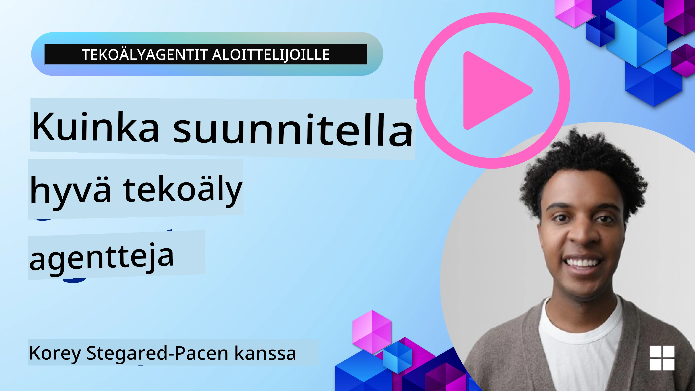

<!--
CO_OP_TRANSLATOR_METADATA:
{
  "original_hash": "d71524fe83a23829ae7a23b4031aaac8",
  "translation_date": "2025-11-13T13:00:34+00:00",
  "source_file": "03-agentic-design-patterns/README.md",
  "language_code": "fi"
}
-->

> _(Klikkaa yllä olevaa kuvaa katsoaksesi tämän oppitunnin videon)_
# Tekoälyagenttien suunnitteluperiaatteet

## Johdanto

Tekoälyagenttijärjestelmien rakentamiseen on monia lähestymistapoja. Koska epäselvyys on ominaisuus eikä virhe generatiivisen tekoälyn suunnittelussa, insinöörien voi olla joskus vaikea tietää, mistä aloittaa. Olemme luoneet joukon ihmiskeskeisiä UX-suunnitteluperiaatteita, joiden avulla kehittäjät voivat rakentaa asiakaskeskeisiä agenttijärjestelmiä liiketoimintatarpeidensa ratkaisemiseksi. Nämä suunnitteluperiaatteet eivät ole tarkka arkkitehtuuri, vaan lähtökohta tiimeille, jotka määrittelevät ja rakentavat agenttikokemuksia.

Yleisesti ottaen agenttien tulisi:

- Laajentaa ja skaalata ihmisten kykyjä (ideointi, ongelmanratkaisu, automaatio jne.)
- Täyttää tiedon aukkoja (auttaa ymmärtämään tiettyjä aihealueita, kääntäminen jne.)
- Helpottaa ja tukea yhteistyötä tavoilla, joilla haluamme työskennellä muiden kanssa
- Tehdä meistä parempia versioita itsestämme (esim. elämänvalmentaja/tehtävien hallitsija, auttaa oppimaan tunteiden säätelyä ja tietoisuustaitoja, rakentaa resilienssiä jne.)

## Tämä oppitunti käsittelee

- Mitä ovat tekoälyagenttien suunnitteluperiaatteet
- Mitä ohjeita tulisi noudattaa näitä suunnitteluperiaatteita toteutettaessa
- Esimerkkejä suunnitteluperiaatteiden käytöstä

## Oppimistavoitteet

Tämän oppitunnin jälkeen osaat:

1. Selittää, mitä tekoälyagenttien suunnitteluperiaatteet ovat
2. Selittää ohjeet näiden suunnitteluperiaatteiden käyttöön
3. Ymmärtää, miten rakentaa agentti näiden suunnitteluperiaatteiden avulla

## Tekoälyagenttien suunnitteluperiaatteet

### Agentti (Tila)

Tämä on ympäristö, jossa agentti toimii. Nämä periaatteet ohjaavat, miten suunnittelemme agentteja toimimaan fyysisissä ja digitaalisissa maailmoissa.

- **Yhdistäminen, ei eristäminen** – auta yhdistämään ihmisiä toisiinsa, tapahtumiin ja toiminnalliseen tietoon yhteistyön ja yhteyksien mahdollistamiseksi.
- Agentit auttavat yhdistämään tapahtumia, tietoa ja ihmisiä.
- Agentit tuovat ihmisiä lähemmäksi toisiaan. Niitä ei ole suunniteltu korvaamaan tai vähättelemään ihmisiä.
- **Helposti saavutettavissa mutta ajoittain näkymättömiä** – agentti toimii pääosin taustalla ja antaa muistutuksia vain silloin, kun se on merkityksellistä ja sopivaa.
  - Agentti on helposti löydettävissä ja käytettävissä valtuutettujen käyttäjien toimesta millä tahansa laitteella tai alustalla.
  - Agentti tukee monimuotoisia syöte- ja tulostusmuotoja (ääni, puhe, teksti jne.).
  - Agentti voi saumattomasti siirtyä etu- ja taustatoimintojen välillä; proaktiivisen ja reaktiivisen välillä käyttäjän tarpeiden mukaan.
  - Agentti voi toimia näkymättömässä muodossa, mutta sen taustaprosessit ja yhteistyö muiden agenttien kanssa ovat käyttäjälle läpinäkyviä ja hallittavissa.

### Agentti (Aika)

Tämä kuvaa, miten agentti toimii ajan kuluessa. Nämä periaatteet ohjaavat, miten suunnittelemme agentteja, jotka toimivat menneisyydessä, nykyhetkessä ja tulevaisuudessa.

- **Menneisyys**: Historian huomioiminen, mukaan lukien tila ja konteksti.
  - Agentti tarjoaa merkityksellisempiä tuloksia analysoimalla laajempia historiallisia tietoja kuin vain tapahtumia, ihmisiä tai tiloja.
  - Agentti luo yhteyksiä menneisiin tapahtumiin ja heijastaa aktiivisesti muistiaan nykytilanteisiin.
- **Nykyhetki**: Muistuttaminen, ei vain ilmoittaminen.
  - Agentti omaksuu kokonaisvaltaisen lähestymistavan ihmisten kanssa vuorovaikuttamiseen. Kun tapahtuma tapahtuu, agentti menee staattisen ilmoituksen tai muun muodollisuuden yli. Agentti voi yksinkertaistaa prosesseja tai luoda dynaamisia vihjeitä ohjatakseen käyttäjän huomion oikeaan aikaan.
  - Agentti toimittaa tietoa kontekstin, sosiaalisten ja kulttuuristen muutosten sekä käyttäjän tarkoituksen mukaan räätälöitynä.
  - Agentin vuorovaikutus voi olla asteittaista, kehittyen monimutkaisemmaksi pitkällä aikavälillä käyttäjän voimaannuttamiseksi.
- **Tulevaisuus**: Mukautuminen ja kehittyminen.
  - Agentti mukautuu erilaisiin laitteisiin, alustoihin ja toimintatapoihin.
  - Agentti mukautuu käyttäjän käyttäytymiseen, saavutettavuustarpeisiin ja on vapaasti muokattavissa.
  - Agentti muotoutuu ja kehittyy jatkuvan käyttäjävuorovaikutuksen kautta.

### Agentti (Ydin)

Nämä ovat agentin suunnittelun keskeisiä elementtejä.

- **Hyväksy epävarmuus mutta rakenna luottamusta**.
  - Tietty määrä agentin epävarmuutta on odotettavissa. Epävarmuus on olennainen osa agentin suunnittelua.
  - Luottamus ja läpinäkyvyys ovat agentin suunnittelun perusta.
  - Ihmiset hallitsevat, milloin agentti on päällä/pois päältä, ja agentin tila on aina selkeästi näkyvissä.

## Ohjeet näiden periaatteiden toteuttamiseen

Kun käytät edellä mainittuja suunnitteluperiaatteita, noudata seuraavia ohjeita:

1. **Läpinäkyvyys**: Kerro käyttäjälle, että tekoäly on mukana, miten se toimii (mukaan lukien aiemmat toiminnot) ja miten antaa palautetta ja muokata järjestelmää.
2. **Hallinta**: Mahdollista käyttäjän mukauttaa, määrittää mieltymyksiä ja personoida sekä hallita järjestelmää ja sen ominaisuuksia (mukaan lukien kyky unohtaa).
3. **Johdonmukaisuus**: Pyri johdonmukaisiin, monimuotoisiin kokemuksiin eri laitteilla ja käyttöliittymissä. Käytä tuttuja UI/UX-elementtejä aina kun mahdollista (esim. mikrofonikuvake puhevuorovaikutukseen) ja vähennä asiakkaan kognitiivista kuormitusta mahdollisimman paljon (esim. pyri ytimekkäisiin vastauksiin, visuaalisiin apuvälineisiin ja "Lue lisää" -sisältöön).

## Miten suunnitella matkailuagentti näiden periaatteiden ja ohjeiden avulla

Kuvittele, että suunnittelet matkailuagenttia. Näin voisit hyödyntää suunnitteluperiaatteita ja ohjeita:

1. **Läpinäkyvyys** – Kerro käyttäjälle, että matkailuagentti on tekoälypohjainen agentti. Anna perusohjeet, miten aloittaa (esim. "Hei"-viesti, esimerkkikyselyt). Dokumentoi tämä selkeästi tuotesivulla. Näytä lista käyttäjän aiemmin esittämistä kyselyistä. Tee selväksi, miten antaa palautetta (peukku ylös/alas, Lähetä palautetta -painike jne.). Ilmoita selkeästi, jos agentilla on käyttö- tai aihealueen rajoituksia.
2. **Hallinta** – Varmista, että käyttäjälle on selvää, miten agenttia voi muokata sen luomisen jälkeen, esimerkiksi järjestelmäkyselyn avulla. Mahdollista käyttäjän valita, kuinka laajasti agentti vastaa, sen kirjoitustyyli ja mitkä aiheet agentin tulisi välttää. Salli käyttäjän tarkastella ja poistaa liitettyjä tiedostoja tai tietoja, kyselyjä ja aiempia keskusteluja.
3. **Johdonmukaisuus** – Varmista, että kuvakkeet, kuten Jaa kysely, lisää tiedosto tai kuva ja merkitse joku tai jokin, ovat standardoituja ja tunnistettavia. Käytä paperiliitinkuvaketta tiedoston latauksen/jakamisen merkkinä agentin kanssa ja kuvaketta kuvan latauksen merkkinä.

## Esimerkkikoodit

- Python: [Agenttikehys](./code_samples/03-python-agent-framework.ipynb)
- .NET: [Agenttikehys](./code_samples/03-dotnet-agent-framework.md)

## Onko sinulla lisää kysymyksiä tekoälyagenttien suunnittelumalleista?

Liity [Azure AI Foundry Discordiin](https://aka.ms/ai-agents/discord) keskustellaksesi muiden oppijoiden kanssa, osallistuaksesi toimistotunteihin ja saadaksesi vastauksia tekoälyagentteihin liittyviin kysymyksiisi.

## Lisäresurssit

- <a href="https://openai.com" target="_blank">Käytännöt agenttien tekoälyjärjestelmien hallintaan | OpenAI</a>
- <a href="https://microsoft.com" target="_blank">HAX Toolkit -projekti - Microsoft Research</a>
- <a href="https://responsibleaitoolbox.ai" target="_blank">Responsible AI Toolbox</a>

## Edellinen oppitunti

[Tutustuminen agenttikehyksiin](../02-explore-agentic-frameworks/README.md)

## Seuraava oppitunti

[Työkalujen käyttö -suunnittelumalli](../04-tool-use/README.md)

---

<!-- CO-OP TRANSLATOR DISCLAIMER START -->
**Vastuuvapauslauseke**:  
Tämä asiakirja on käännetty käyttämällä tekoälypohjaista käännöspalvelua [Co-op Translator](https://github.com/Azure/co-op-translator). Vaikka pyrimme tarkkuuteen, huomioithan, että automaattiset käännökset voivat sisältää virheitä tai epätarkkuuksia. Alkuperäinen asiakirja sen alkuperäisellä kielellä tulisi pitää ensisijaisena lähteenä. Kriittisen tiedon osalta suositellaan ammattimaista ihmiskäännöstä. Emme ole vastuussa väärinkäsityksistä tai virhetulkinnoista, jotka johtuvat tämän käännöksen käytöstä.
<!-- CO-OP TRANSLATOR DISCLAIMER END -->