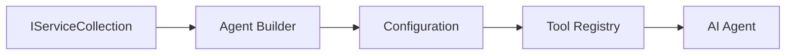

<!--
CO_OP_TRANSLATOR_METADATA:
{
  "original_hash": "bcc874e190347bd6a095aed56dc16de8",
  "translation_date": "2025-11-13T13:02:08+00:00",
  "source_file": "03-agentic-design-patterns/code_samples/03-dotnet-agent-framework.md",
  "language_code": "fi"
}
-->
# 🎨 Agenttiset suunnittelumallit GitHub-mallien kanssa (.NET)

## 📋 Oppimistavoitteet

Tämä esimerkki esittelee yritystason suunnittelumalleja älykkäiden agenttien rakentamiseen Microsoft Agent Frameworkin avulla .NET-ympäristössä, integroituna GitHub-malleihin. Opit ammattimaisia malleja ja arkkitehtuurilähestymistapoja, jotka tekevät agenteista tuotantovalmiita, helposti ylläpidettäviä ja skaalautuvia.

### Yritystason suunnittelumallit

- 🏭 **Tehdasmalli**: Vakioitu agenttien luonti riippuvuuksien injektoinnilla
- 🔧 **Rakentajamalli**: Sujuva agenttien konfigurointi ja asennus
- 🧵 **Säikeiden turvallisuusmallit**: Samanaikainen keskustelujen hallinta
- 📋 **Repositoriomalli**: Järjestelmällinen työkalujen ja kyvykkyyksien hallinta

## 🎯 .NET-spesifiset arkkitehtuuriedut

### Yritysominaisuudet

- **Vahva tyypitys**: Kääntöaikainen validointi ja IntelliSense-tuki
- **Riippuvuuksien injektointi**: Sisäänrakennettu DI-kontainerin integrointi
- **Konfiguraation hallinta**: IConfiguration- ja Options-mallit
- **Async/Await**: Ensiluokkainen asynkroninen ohjelmointituki

### Tuotantovalmiit mallit

- **Lokitusintegraatio**: ILogger ja rakenteellinen lokitustuki
- **Terveystarkistukset**: Sisäänrakennettu seuranta ja diagnostiikka
- **Konfiguraation validointi**: Vahva tyypitys ja data-anotaatiot
- **Virheenkäsittely**: Rakenteellinen poikkeusten hallinta

## 🔧 Tekninen arkkitehtuuri

### Keskeiset .NET-komponentit

- **Microsoft.Extensions.AI**: Yhtenäiset AI-palvelujen abstraktiot
- **Microsoft.Agents.AI**: Yritystason agenttien orkestrointikehys
- **GitHub-mallien integrointi**: Suorituskykyiset API-asiakasmallit
- **Konfiguraatiojärjestelmä**: appsettings.json ja ympäristöintegraatio

### Suunnittelumallien toteutus



## 🏗️ Esitetyt yritysmallit

### 1. **Luontimallit**

- **Agenttitehdas**: Keskitetty agenttien luonti johdonmukaisella konfiguraatiolla
- **Rakentajamalli**: Sujuva API monimutkaiseen agenttien konfigurointiin
- **Singleton-malli**: Jaettujen resurssien ja konfiguraation hallinta
- **Riippuvuuksien injektointi**: Löyhä kytkentä ja testattavuus

### 2. **Käyttäytymismallit**

- **Strategiamalli**: Vaihdettavat työkalujen suoritusstrategiat
- **Komento-malli**: Kapseloidut agenttitoiminnot undo/redo-toiminnolla
- **Havainnoijamalli**: Tapahtumapohjainen agenttien elinkaaren hallinta
- **Template Method**: Vakioidut agenttien suoritusprosessit

### 3. **Rakennemallit**

- **Adapterimalli**: GitHub-mallien API-integraatiokerros
- **Dekoraattorimalli**: Agenttien kyvykkyyksien parantaminen
- **Fasadi-malli**: Yksinkertaistetut agenttien vuorovaikutusrajapinnat
- **Proxymalli**: Viivästetty lataus ja välimuisti suorituskyvyn parantamiseksi

## 📚 .NET-suunnitteluperiaatteet

### SOLID-periaatteet

- **Yksi vastuualue**: Jokaisella komponentilla on yksi selkeä tarkoitus
- **Avoin/Suljettu**: Laajennettavissa ilman muutoksia
- **Liskovin korvausperiaate**: Rajapintapohjaiset työkalutoteutukset
- **Rajapinnan erottelu**: Keskittyneet, yhtenäiset rajapinnat
- **Riippuvuuksien inversio**: Riippuvuus abstraktioista, ei konkreettisista toteutuksista

### Puhdas arkkitehtuuri

- **Domain-kerros**: Keskeiset agentti- ja työkaluabstraktiot
- **Sovelluskerros**: Agenttien orkestrointi ja työnkulut
- **Infrastruktuurikerros**: GitHub-mallien integrointi ja ulkoiset palvelut
- **Esityskerros**: Käyttäjävuorovaikutus ja vastausten muotoilu

## 🔒 Yritystason näkökohdat

### Turvallisuus

- **Tunnusten hallinta**: Turvallinen API-avainten käsittely IConfigurationin avulla
- **Syötteen validointi**: Vahva tyypitys ja data-anotaatiot
- **Tulosten puhdistus**: Turvallinen vastausten käsittely ja suodatus
- **Auditointilokitus**: Kattava toimintojen seuranta

### Suorituskyky

- **Asynkroniset mallit**: Ei-blokkaavat I/O-toiminnot
- **Yhteyspoolaus**: Tehokas HTTP-asiakashallinta
- **Välimuisti**: Vastausten välimuisti suorituskyvyn parantamiseksi
- **Resurssien hallinta**: Asianmukainen hävitys ja siivousmallit

### Skaalautuvuus

- **Säikeiden turvallisuus**: Samanaikainen agenttien suorituskyky
- **Resurssipoolaus**: Tehokas resurssien hyödyntäminen
- **Kuormanhallinta**: Nopeusrajoitukset ja paineenhallinta
- **Seuranta**: Suorituskykymittarit ja terveystarkistukset

## 🚀 Tuotantokäyttöön ottaminen

- **Konfiguraation hallinta**: Ympäristökohtaiset asetukset
- **Lokitusstrategia**: Rakenteellinen lokitus korrelaatio-ID:illä
- **Virheenkäsittely**: Globaali poikkeusten hallinta ja asianmukainen palautuminen
- **Seuranta**: Application Insights ja suorituskykylaskurit
- **Testaus**: Yksikkötestit, integraatiotestit ja kuormitustestauksen mallit

Valmiina rakentamaan yritystason älykkäitä agentteja .NET-ympäristössä? Suunnitellaan jotain kestävää! 🏢✨

## 🚀 Aloittaminen

### Esivaatimukset

- [.NET 10 SDK](https://dotnet.microsoft.com/download/dotnet/10.0) tai uudempi
- [GitHub Models API -pääsytunnus](https://docs.github.com/github-models/github-models-at-scale/using-your-own-api-keys-in-github-models)

### Vaaditut ympäristömuuttujat

```bash
# zsh/bash
export GH_TOKEN=<your_github_token>
export GH_ENDPOINT=https://models.github.ai/inference
export GH_MODEL_ID=openai/gpt-5-mini
```

```powershell
# PowerShell
$env:GH_TOKEN = "<your_github_token>"
$env:GH_ENDPOINT = "https://models.github.ai/inference"
$env:GH_MODEL_ID = "openai/gpt-5-mini"
```

### Esimerkkikoodi

Koodiesimerkin suorittamiseksi,

```bash
# zsh/bash
chmod +x ./03-dotnet-agent-framework.cs
./03-dotnet-agent-framework.cs
```

Tai käyttämällä dotnet CLI:tä:

```bash
dotnet run ./03-dotnet-agent-framework.cs
```

Katso [`03-dotnet-agent-framework.cs`](../../../../03-agentic-design-patterns/code_samples/03-dotnet-agent-framework.cs) täydellinen koodi.

```csharp
#!/usr/bin/dotnet run

#:package Microsoft.Extensions.AI@10.*
#:package Microsoft.Agents.AI.OpenAI@1.*-*

using System.ClientModel;
using System.ComponentModel;

using Microsoft.Agents.AI;
using Microsoft.Extensions.AI;

using OpenAI;

// Tool Function: Random Destination Generator
// This static method will be available to the agent as a callable tool
// The [Description] attribute helps the AI understand when to use this function
// This demonstrates how to create custom tools for AI agents
[Description("Provides a random vacation destination.")]
static string GetRandomDestination()
{
    // List of popular vacation destinations around the world
    // The agent will randomly select from these options
    var destinations = new List<string>
    {
        "Paris, France",
        "Tokyo, Japan",
        "New York City, USA",
        "Sydney, Australia",
        "Rome, Italy",
        "Barcelona, Spain",
        "Cape Town, South Africa",
        "Rio de Janeiro, Brazil",
        "Bangkok, Thailand",
        "Vancouver, Canada"
    };

    // Generate random index and return selected destination
    // Uses System.Random for simple random selection
    var random = new Random();
    int index = random.Next(destinations.Count);
    return destinations[index];
}

// Extract configuration from environment variables
// Retrieve the GitHub Models API endpoint, defaults to https://models.github.ai/inference if not specified
// Retrieve the model ID, defaults to openai/gpt-5-mini if not specified
// Retrieve the GitHub token for authentication, throws exception if not specified
var github_endpoint = Environment.GetEnvironmentVariable("GH_ENDPOINT") ?? "https://models.github.ai/inference";
var github_model_id = Environment.GetEnvironmentVariable("GH_MODEL_ID") ?? "openai/gpt-5-mini";
var github_token = Environment.GetEnvironmentVariable("GH_TOKEN") ?? throw new InvalidOperationException("GH_TOKEN is not set.");

// Configure OpenAI Client Options
// Create configuration options to point to GitHub Models endpoint
// This redirects OpenAI client calls to GitHub's model inference service
var openAIOptions = new OpenAIClientOptions()
{
    Endpoint = new Uri(github_endpoint)
};

// Initialize OpenAI Client with GitHub Models Configuration
// Create OpenAI client using GitHub token for authentication
// Configure it to use GitHub Models endpoint instead of OpenAI directly
var openAIClient = new OpenAIClient(new ApiKeyCredential(github_token), openAIOptions);

// Define Agent Identity and Comprehensive Instructions
// Agent name for identification and logging purposes
var AGENT_NAME = "TravelAgent";

// Detailed instructions that define the agent's personality, capabilities, and behavior
// This system prompt shapes how the agent responds and interacts with users
var AGENT_INSTRUCTIONS = """
You are a helpful AI Agent that can help plan vacations for customers.

Important: When users specify a destination, always plan for that location. Only suggest random destinations when the user hasn't specified a preference.

When the conversation begins, introduce yourself with this message:
"Hello! I'm your TravelAgent assistant. I can help plan vacations and suggest interesting destinations for you. Here are some things you can ask me:
1. Plan a day trip to a specific location
2. Suggest a random vacation destination
3. Find destinations with specific features (beaches, mountains, historical sites, etc.)
4. Plan an alternative trip if you don't like my first suggestion

What kind of trip would you like me to help you plan today?"

Always prioritize user preferences. If they mention a specific destination like "Bali" or "Paris," focus your planning on that location rather than suggesting alternatives.
""";

// Create AI Agent with Advanced Travel Planning Capabilities
// Initialize complete agent pipeline: OpenAI client → Chat client → AI agent
// Configure agent with name, detailed instructions, and available tools
// This demonstrates the .NET agent creation pattern with full configuration
AIAgent agent = openAIClient
    .GetChatClient(github_model_id)
    .CreateAIAgent(
        name: AGENT_NAME,
        instructions: AGENT_INSTRUCTIONS,
        tools: [AIFunctionFactory.Create(GetRandomDestination)]
    );

// Create New Conversation Thread for Context Management
// Initialize a new conversation thread to maintain context across multiple interactions
// Threads enable the agent to remember previous exchanges and maintain conversational state
// This is essential for multi-turn conversations and contextual understanding
AgentThread thread = agent.GetNewThread();

// Execute Agent: First Travel Planning Request
// Run the agent with an initial request that will likely trigger the random destination tool
// The agent will analyze the request, use the GetRandomDestination tool, and create an itinerary
// Using the thread parameter maintains conversation context for subsequent interactions
await foreach (var update in agent.RunStreamingAsync("Plan me a day trip", thread))
{
    await Task.Delay(10);
    Console.Write(update);
}

Console.WriteLine();

// Execute Agent: Follow-up Request with Context Awareness
// Demonstrate contextual conversation by referencing the previous response
// The agent remembers the previous destination suggestion and will provide an alternative
// This showcases the power of conversation threads and contextual understanding in .NET agents
await foreach (var update in agent.RunStreamingAsync("I don't like that destination. Plan me another vacation.", thread))
{
    await Task.Delay(10);
    Console.Write(update);
}
```

---

<!-- CO-OP TRANSLATOR DISCLAIMER START -->
**Vastuuvapauslauseke**:  
Tämä asiakirja on käännetty käyttämällä tekoälypohjaista käännöspalvelua [Co-op Translator](https://github.com/Azure/co-op-translator). Vaikka pyrimme tarkkuuteen, huomioithan, että automaattiset käännökset voivat sisältää virheitä tai epätarkkuuksia. Alkuperäinen asiakirja sen alkuperäisellä kielellä tulisi pitää ensisijaisena lähteenä. Tärkeissä tiedoissa suositellaan ammattimaista ihmiskäännöstä. Emme ole vastuussa väärinkäsityksistä tai virhetulkinnoista, jotka johtuvat tämän käännöksen käytöstä.
<!-- CO-OP TRANSLATOR DISCLAIMER END -->