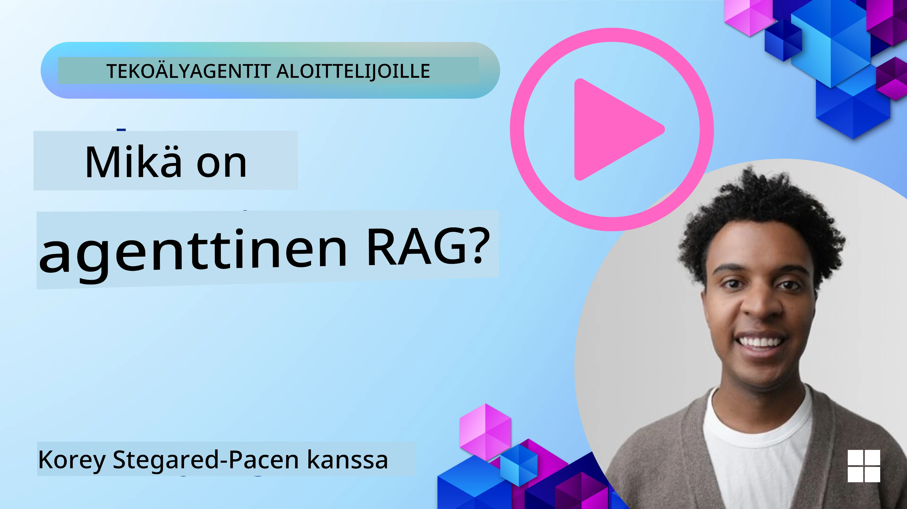
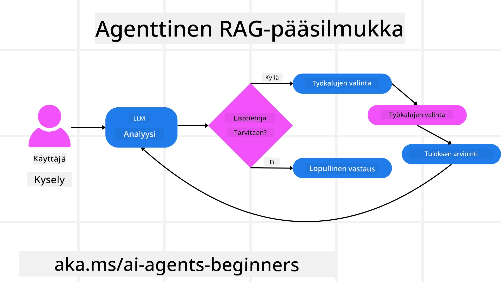
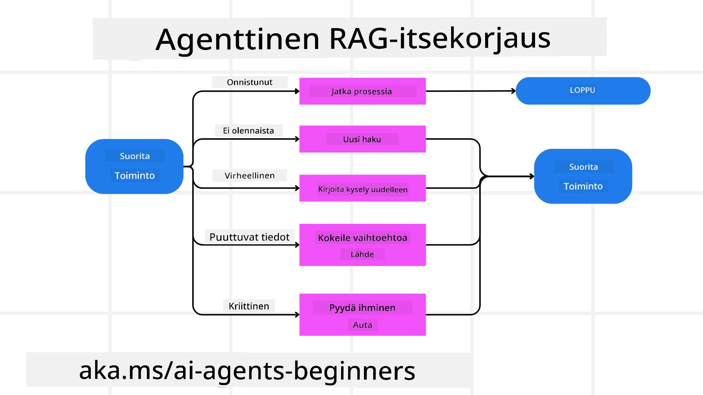

<!--
CO_OP_TRANSLATOR_METADATA:
{
  "original_hash": "0ebf6b2290db55dbf2d10cc49655523b",
  "translation_date": "2025-09-30T07:18:52+00:00",
  "source_file": "05-agentic-rag/README.md",
  "language_code": "fi"
}
-->

> _(Klikkaa yllä olevaa kuvaa nähdäksesi tämän oppitunnin videon)_

# Agentic RAG

Tämä oppitunti tarjoaa kattavan yleiskatsauksen Agentic Retrieval-Augmented Generation (Agentic RAG) -konseptista, joka on nouseva tekoälyn paradigma, jossa suuret kielimallit (LLM:t) suunnittelevat itsenäisesti seuraavat askeleensa samalla kun hakevat tietoa ulkoisista lähteistä. Toisin kuin staattiset haku-ja-lukeminen -mallit, Agentic RAG sisältää iteratiivisia kutsuja LLM:lle, joita vuorottelevat työkalujen tai funktioiden kutsut ja rakenteelliset tulokset. Järjestelmä arvioi tuloksia, tarkentaa kyselyitä, käyttää tarvittaessa lisätyökaluja ja jatkaa tätä sykliä, kunnes tyydyttävä ratkaisu on saavutettu.

## Johdanto

Tässä oppitunnissa käsitellään:

- **Ymmärrä Agentic RAG:** Tutustu tekoälyn nousevaan paradigmaan, jossa suuret kielimallit (LLM:t) suunnittelevat itsenäisesti seuraavat askeleensa samalla kun hakevat tietoa ulkoisista tietolähteistä.
- **Omaksu iteratiivinen Maker-Checker-tyyli:** Ymmärrä iteratiivisten LLM-kutsujen sykli, jota vuorottelevat työkalujen tai funktioiden kutsut ja rakenteelliset tulokset, jotka on suunniteltu parantamaan tarkkuutta ja käsittelemään virheellisiä kyselyitä.
- **Tutki käytännön sovelluksia:** Tunnista tilanteet, joissa Agentic RAG loistaa, kuten tarkkuuslähtöiset ympäristöt, monimutkaiset tietokantainteraktiot ja laajennetut työnkulut.

## Oppimistavoitteet

Oppitunnin jälkeen osaat/ymmärrät:

- **Ymmärrä Agentic RAG:** Tutustu tekoälyn nousevaan paradigmaan, jossa suuret kielimallit (LLM:t) suunnittelevat itsenäisesti seuraavat askeleensa samalla kun hakevat tietoa ulkoisista tietolähteistä.
- **Iteratiivinen Maker-Checker-tyyli:** Omaksu iteratiivisten LLM-kutsujen sykli, jota vuorottelevat työkalujen tai funktioiden kutsut ja rakenteelliset tulokset, jotka on suunniteltu parantamaan tarkkuutta ja käsittelemään virheellisiä kyselyitä.
- **Omaksu päättelyprosessi:** Ymmärrä järjestelmän kyky hallita omaa päättelyprosessiaan, tehdä päätöksiä ongelmien lähestymistavasta ilman ennalta määriteltyjä polkuja.
- **Työnkulku:** Ymmärrä, miten agenttimalli itsenäisesti päättää hakea markkinatrendiraportteja, tunnistaa kilpailijatietoja, korreloida sisäisiä myyntimittareita, yhdistää löydökset ja arvioida strategiaa.
- **Iteratiiviset silmukat, työkalujen integrointi ja muisti:** Tutustu järjestelmän riippuvuuteen silmukkamaisesta vuorovaikutusmallista, joka ylläpitää tilaa ja muistia vaiheiden välillä välttäen toistuvia silmukoita ja tehden perusteltuja päätöksiä.
- **Virhetilanteiden käsittely ja itsekorjaus:** Tutki järjestelmän vahvoja itsekorjausmekanismeja, kuten iterointia ja uudelleenkyselyä, diagnostisten työkalujen käyttöä ja ihmisen valvontaan turvautumista.
- **Toiminnan rajat:** Ymmärrä Agentic RAG:n rajoitukset, keskittyen toimialakohtaiseen autonomiaan, infrastruktuuririippuvuuteen ja turvamekanismien kunnioittamiseen.
- **Käytännön käyttötapaukset ja arvo:** Tunnista tilanteet, joissa Agentic RAG loistaa, kuten tarkkuuslähtöiset ympäristöt, monimutkaiset tietokantainteraktiot ja laajennetut työnkulut.
- **Hallinta, läpinäkyvyys ja luottamus:** Tutustu hallinnan ja läpinäkyvyyden merkitykseen, mukaan lukien selitettävä päättely, harhan hallinta ja ihmisen valvonta.

## Mikä on Agentic RAG?

Agentic Retrieval-Augmented Generation (Agentic RAG) on nouseva tekoälyn paradigma, jossa suuret kielimallit (LLM:t) suunnittelevat itsenäisesti seuraavat askeleensa samalla kun hakevat tietoa ulkoisista lähteistä. Toisin kuin staattiset haku-ja-lukeminen -mallit, Agentic RAG sisältää iteratiivisia kutsuja LLM:lle, joita vuorottelevat työkalujen tai funktioiden kutsut ja rakenteelliset tulokset. Järjestelmä arvioi tuloksia, tarkentaa kyselyitä, käyttää tarvittaessa lisätyökaluja ja jatkaa tätä sykliä, kunnes tyydyttävä ratkaisu on saavutettu. Tämä iteratiivinen “maker-checker”-tyyli parantaa tarkkuutta, käsittelee virheellisiä kyselyitä ja varmistaa korkealaatuiset tulokset.

Järjestelmä hallitsee aktiivisesti omaa päättelyprosessiaan, kirjoittaa uudelleen epäonnistuneita kyselyitä, valitsee erilaisia hakumenetelmiä ja integroi useita työkaluja—kuten vektorihaku Azure AI Searchissa, SQL-tietokantoja tai mukautettuja API:ita—ennen lopullisen vastauksen antamista. Agenttijärjestelmän erottava ominaisuus on sen kyky hallita omaa päättelyprosessiaan. Perinteiset RAG-toteutukset luottavat ennalta määriteltyihin polkuihin, mutta agenttijärjestelmä päättää itsenäisesti askelten järjestyksen sen perusteella, mitä tietoa se löytää.

## Agentic Retrieval-Augmented Generation (Agentic RAG) määritelmä

Agentic Retrieval-Augmented Generation (Agentic RAG) on nouseva paradigma tekoälyn kehityksessä, jossa LLM:t eivät ainoastaan hae tietoa ulkoisista tietolähteistä, vaan myös suunnittelevat itsenäisesti seuraavat askeleensa. Toisin kuin staattiset haku-ja-lukeminen -mallit tai huolellisesti skriptatut kehotussekvenssit, Agentic RAG sisältää iteratiivisia kutsuja LLM:lle, joita vuorottelevat työkalujen tai funktioiden kutsut ja rakenteelliset tulokset. Joka käänteessä järjestelmä arvioi saatuja tuloksia, päättää, tarkentaako kyselyitä, käyttääkö lisätyökaluja tarvittaessa ja jatkaa tätä sykliä, kunnes tyydyttävä ratkaisu on saavutettu.

Tämä iteratiivinen “maker-checker”-tyyli on suunniteltu parantamaan tarkkuutta, käsittelemään virheellisiä kyselyitä rakenteellisiin tietokantoihin (esim. NL2SQL) ja varmistamaan tasapainoiset, korkealaatuiset tulokset. Sen sijaan, että järjestelmä luottaisi pelkästään huolellisesti suunniteltuihin kehotusketjuihin, se hallitsee aktiivisesti omaa päättelyprosessiaan. Se voi kirjoittaa uudelleen epäonnistuneita kyselyitä, valita erilaisia hakumenetelmiä ja integroida useita työkaluja—kuten vektorihaku Azure AI Searchissa, SQL-tietokantoja tai mukautettuja API:ita—ennen lopullisen vastauksen antamista. Tämä poistaa tarpeen monimutkaisille orkestrointikehyksille. Sen sijaan suhteellisen yksinkertainen silmukka “LLM-kutsu → työkalun käyttö → LLM-kutsu → …” voi tuottaa hienostuneita ja hyvin perusteltuja tuloksia.

## Päättelyprosessin hallinta

Agenttijärjestelmän erottava ominaisuus on sen kyky hallita omaa päättelyprosessiaan. Perinteiset RAG-toteutukset usein riippuvat ihmisistä, jotka määrittelevät mallille polun: ajatusketjun, joka hahmottaa, mitä hakea ja milloin. Mutta kun järjestelmä on aidosti agenttimainen, se päättää sisäisesti, miten lähestyä ongelmaa. Se ei vain suorita skriptiä; se määrittää itsenäisesti askelten järjestyksen sen perusteella, mitä tietoa se löytää.

Esimerkiksi, jos järjestelmää pyydetään luomaan tuotelanseerausstrategia, se ei luota pelkästään kehotukseen, joka määrittelee koko tutkimus- ja päätöksentekotyönkulun. Sen sijaan agenttimalli päättää itsenäisesti:

1. Hakea nykyiset markkinatrendiraportit Bing Web Groundingin avulla.
2. Tunnistaa relevantit kilpailijatiedot Azure AI Searchin avulla.
3. Korreloida historialliset sisäiset myyntimittarit Azure SQL Databasea käyttäen.
4. Yhdistää löydökset yhtenäiseksi strategiaksi, jota orkestroidaan Azure OpenAI Servicen avulla.
5. Arvioida strategiaa aukkojen tai epäjohdonmukaisuuksien varalta, mikä voi johtaa uuteen hakukierrokseen.

Kaikki nämä askeleet—kyselyiden tarkentaminen, lähteiden valinta, iterointi kunnes vastaus on “tyydyttävä”—päätetään mallin toimesta, ei ihmisen ennalta skriptamana.

## Iteratiiviset silmukat, työkalujen integrointi ja muisti

Agenttijärjestelmä perustuu silmukkamaiseen vuorovaikutusmalliin:

- **Alkukutsu:** Käyttäjän tavoite (eli käyttäjän kehotus) esitetään LLM:lle.
- **Työkalun käyttö:** Jos malli tunnistaa puuttuvaa tietoa tai epäselviä ohjeita, se valitsee työkalun tai hakumenetelmän—kuten vektorikantahaku (esim. Azure AI Search Hybrid search yksityisistä tiedoista) tai rakenteellisen SQL-kutsun—kerätäkseen lisää kontekstia.
- **Arviointi ja tarkentaminen:** Palautetun datan tarkastelun jälkeen malli päättää, riittääkö tieto. Jos ei, se tarkentaa kyselyä, kokeilee eri työkalua tai säätää lähestymistapaansa.
- **Toista kunnes tyytyväinen:** Tämä sykli jatkuu, kunnes malli päättää, että sillä on tarpeeksi selkeyttä ja todisteita lopullisen, hyvin perustellun vastauksen antamiseen.
- **Muisti ja tila:** Koska järjestelmä ylläpitää tilaa ja muistia vaiheiden välillä, se voi muistaa aiemmat yritykset ja niiden tulokset, välttäen toistuvia silmukoita ja tehden perusteltuja päätöksiä edetessään.

Ajan myötä tämä luo tunteen kehittyvästä ymmärryksestä, mahdollistaen mallin navigoida monimutkaisia, monivaiheisia tehtäviä ilman, että ihmisen täytyy jatkuvasti puuttua asiaan tai muotoilla kehotusta uudelleen.

## Virhetilanteiden käsittely ja itsekorjaus

Agentic RAG:n autonomia sisältää myös vahvat itsekorjausmekanismit. Kun järjestelmä kohtaa umpikujia—kuten hakee epäolennaisia dokumentteja tai kohtaa virheellisiä kyselyitä—se voi:

- **Iteroida ja kysyä uudelleen:** Sen sijaan, että se palauttaisi vähäarvoisia vastauksia, malli kokeilee uusia hakustrategioita, kirjoittaa tietokantakyselyitä uudelleen tai tarkastelee vaihtoehtoisia tietojoukkoja.
- **Käyttää diagnostisia työkaluja:** Järjestelmä voi kutsua lisätoimintoja, jotka on suunniteltu auttamaan sen päättelyvaiheiden virheenkorjauksessa tai varmistamaan haetun datan oikeellisuus. Työkalut kuten Azure AI Tracing ovat tärkeitä mahdollistamaan vahvan havainnoinnin ja seurannan.
- **Turvautua ihmisen valvontaan:** Korkean panoksen tai toistuvasti epäonnistuvissa tilanteissa malli voi merkitä epävarmuuden ja pyytää ihmisen ohjausta. Kun ihminen antaa korjaavaa palautetta, malli voi sisällyttää sen oppitunnin jatkossa.

Tämä iteratiivinen ja dynaaminen lähestymistapa mahdollistaa mallin jatkuvan parantamisen, varmistaen, että se ei ole vain kertaluonteinen järjestelmä, vaan oppii virheistään kyseisen istunnon aikana.

## Toiminnan rajat

Vaikka Agentic RAG on autonominen tehtävän sisällä, se ei ole verrattavissa yleiseen tekoälyyn (Artificial General Intelligence). Sen “agenttimaiset” kyvyt rajoittuvat ihmisten kehittäjien tarjoamiin työkaluihin, tietolähteisiin ja käytäntöihin. Se ei voi keksiä omia työkalujaan tai astua ulos sille asetetuista toimialarajoista. Sen sijaan se loistaa dynaamisesti orkestroimalla käytettävissä olevia resursseja.

Keskeiset erot kehittyneempiin tekoälymuotoihin verrattuna:

1. **Toimialakohtainen autonomia:** Agentic RAG -järjestelmät keskittyvät käyttäjän määrittelemiin tavoitteisiin tunnetussa toimialassa, käyttäen strategioita kuten kyselyiden uudelleenkirjoittamista tai työkalujen valintaa parantaakseen tuloksia.
2. **Infrastruktuuririippuvuus:** Järjestelmän kyvyt riippuvat kehittäjien integroimista työkaluista ja datasta. Se ei voi ylittää näitä rajoja ilman ihmisen väliintuloa.
3. **Turvamekanismien kunnioittaminen:** Eettiset ohjeet, vaatimustenmukaisuussäännöt ja liiketoimintakäytännöt ovat edelleen erittäin tärkeitä. Agentin vapaus on aina rajoitettu turvallisuusmekanismeilla ja valvontajärjestelmillä (toivottavasti?).

## Käytännön käyttötapaukset ja arvo

Agentic RAG loistaa tilanteissa, jotka vaativat iteratiivista tarkentamista ja tarkkuutta:

1. **Tarkkuuslähtöiset ympäristöt:** Vaatimustenmukaisuustarkastuksissa, sääntelyanalyysissä tai oikeudellisessa tutkimuksessa agenttimalli voi toistuvasti varmistaa faktat, konsultoida useita lähteitä ja kirjoittaa kyselyitä uudelleen, kunnes se tuottaa perusteellisesti tarkistetun vastauksen.
2. **Monimutkaiset tietokantainteraktiot:** Kun käsitellään rakenteellista dataa, jossa kyselyt usein epäonnistuvat tai vaativat säätöä, järjestelmä voi itsenäisesti tarkentaa kyselyitään käyttäen Azure SQL:ää tai Microsoft Fabric OneLakea, varmistaen lopullisen haun vastaavan käyttäjän tarkoitusta.
3. **Laajennetut työnkulut:** Pidemmät istunnot voivat kehittyä, kun uutta tietoa tulee esiin. Agentic RAG voi jatkuvasti sisällyttää uutta dataa, muuttaa strategioita oppiessaan lisää ongelma-alueesta.

## Hallinta, läpinäkyvyys ja luottamus

Kun nämä järjestelmät tulevat yhä autonomisemmiksi päättelyssään, hallinta ja läpinäkyvyys ovat ratkaisevan tärkeitä:

- **Selitettävä päättely:** Malli voi tarjota auditointipolun tekemistään kyselyistä, konsultoimistaan lähteistä ja päättelyvaiheista, jotka johtivat sen lopputulokseen. Työkalut kuten Azure AI Content Safety ja Azure AI Tracing / GenAIOps voivat auttaa ylläpitämään läpinäkyvyyttä ja vähentämään riskejä.
- **Harhan hallinta ja tasapainoinen haku:** Kehittäjät voivat säätää hakustrategioita varmistaakseen, että tasapainoiset ja edustavat tietolähteet otetaan huomioon, ja säännöllisesti auditoida tuloksia harhan tai vinoutuneiden mallien havaitsemiseksi käyttämällä mukautettuja malleja edistyneille data science -organisaatioille Azure Machine Learningin avulla.
- **Ihmisen valvonta ja vaatimustenmukaisuus:** Herkissä tehtävissä ihmisen tarkistus on edelleen välttämätöntä. Agentic RAG ei korvaa ihmisen harkintaa korkean panoksen päätöksissä—se täydentää sitä tarjoamalla perusteellisemmin tarkistettuja vaihtoehtoja.

Työkalut, jotka tarjoavat selkeän kirjanpidon toimista, ovat välttämättömiä. Ilman niitä monivaiheisen prosessin virheenkorjaus voi olla erittäin vaikeaa. Katso seuraava esimerkki Literal AI:lta (Chainlitin takana oleva yritys) agentin suorituksesta:

![AgentRunExample](./images/AgentRunExample.png
- <a href="https://ragaboutit.com/agentic-rag-a-complete-guide-to-agent-based-retrieval-augmented-generation/" target="_blank">Agentic RAG: Täydellinen opas agenttipohjaiseen hakuun ja tuotettuun sisältöön – Uutisia sukupolven RAG:sta</a>
- <a href="https://huggingface.co/learn/cookbook/agent_rag" target="_blank">Agentic RAG: tehosta RAG:ia kyselyn muotoilulla ja itse-kyselyllä! Hugging Face Open-Source AI Cookbook</a>
- <a href="https://youtu.be/aQ4yQXeB1Ss?si=2HUqBzHoeB5tR04U" target="_blank">Agenttikerrosten lisääminen RAG:iin</a>
- <a href="https://www.youtube.com/watch?v=zeAyuLc_f3Q&t=244s" target="_blank">Tiedon avustajien tulevaisuus: Jerry Liu</a>
- <a href="https://www.youtube.com/watch?v=AOSjiXP1jmQ" target="_blank">Kuinka rakentaa agenttipohjaisia RAG-järjestelmiä</a>
- <a href="https://ignite.microsoft.com/sessions/BRK102?source=sessions" target="_blank">Azure AI Foundry Agent Service -palvelun käyttö AI-agenttien skaalaamiseen</a>

### Tieteelliset artikkelit

- <a href="https://arxiv.org/abs/2303.17651" target="_blank">2303.17651 Self-Refine: Iteratiivinen tarkennus itsepalautteen avulla</a>
- <a href="https://arxiv.org/abs/2303.11366" target="_blank">2303.11366 Reflexion: Kielelliset agentit sanallisella vahvistusoppimisella</a>
- <a href="https://arxiv.org/abs/2305.11738" target="_blank">2305.11738 CRITIC: Suuret kielimallit voivat korjata itseään työkalujen avulla</a>
- <a href="https://arxiv.org/abs/2501.09136" target="_blank">2501.09136 Agenttipohjainen haku ja tuotettu sisältö: Katsaus agenttipohjaiseen RAG:iin</a>

## Edellinen oppitunti

[Työkalujen käyttö -suunnittelumalli](../04-tool-use/README.md)

## Seuraava oppitunti

[Luotettavien AI-agenttien rakentaminen](../06-building-trustworthy-agents/README.md)

---

**Vastuuvapauslauseke**:  
Tämä asiakirja on käännetty käyttämällä tekoälypohjaista käännöspalvelua [Co-op Translator](https://github.com/Azure/co-op-translator). Vaikka pyrimme tarkkuuteen, huomioithan, että automaattiset käännökset voivat sisältää virheitä tai epätarkkuuksia. Alkuperäistä asiakirjaa sen alkuperäisellä kielellä tulisi pitää ensisijaisena lähteenä. Kriittisen tiedon osalta suositellaan ammattimaista ihmiskäännöstä. Emme ole vastuussa väärinkäsityksistä tai virhetulkinnoista, jotka johtuvat tämän käännöksen käytöstä.