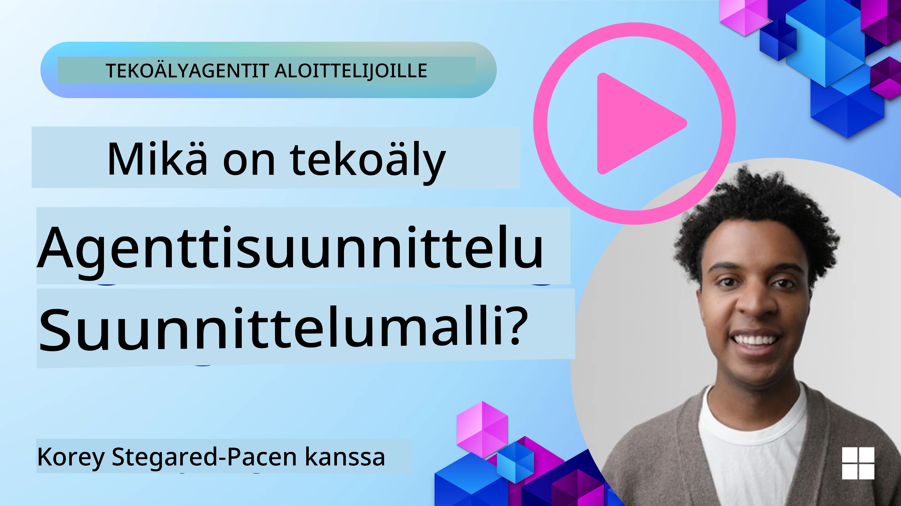
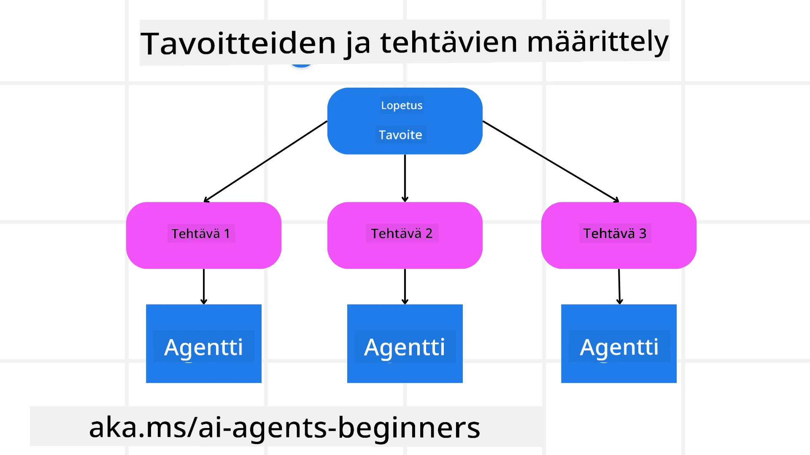

<!--
CO_OP_TRANSLATOR_METADATA:
{
  "original_hash": "43069833a0412210ad5c3cc93d9c2146",
  "translation_date": "2025-09-18T15:10:13+00:00",
  "source_file": "07-planning-design/README.md",
  "language_code": "fi"
}
-->

> _(Klikkaa yllä olevaa kuvaa nähdäksesi tämän oppitunnin videon)_

# Suunnittelun suunnittelu

## Johdanto

Tässä oppitunnissa käsitellään:

* Selkeän kokonaisvaltaisen tavoitteen määrittäminen ja monimutkaisen tehtävän jakaminen hallittaviin osatehtäviin.
* Rakenteellisen ulostulon hyödyntäminen luotettavampien ja koneellisesti luettavien vastausten saamiseksi.
* Tapahtumapohjaisen lähestymistavan soveltaminen dynaamisten tehtävien ja odottamattomien syötteiden käsittelyyn.

## Oppimistavoitteet

Tämän oppitunnin jälkeen ymmärrät:

* Kuinka tunnistaa ja asettaa kokonaisvaltainen tavoite tekoälyagentille, varmistaen, että se tietää selkeästi, mitä tulee saavuttaa.
* Kuinka jakaa monimutkainen tehtävä hallittaviin osatehtäviin ja järjestää ne loogiseen järjestykseen.
* Kuinka varustaa agentit oikeilla työkaluilla (esim. hakutyökalut tai data-analytiikkatyökalut), päättää milloin ja miten niitä käytetään, sekä käsitellä odottamattomia tilanteita.
* Kuinka arvioida osatehtävien tuloksia, mitata suorituskykyä ja iteroida toimia lopullisen tuloksen parantamiseksi.

## Kokonaisvaltaisen tavoitteen määrittäminen ja tehtävän jakaminen

Useimmat tosielämän tehtävät ovat liian monimutkaisia ratkaistavaksi yhdellä askeleella. Tekoälyagentti tarvitsee tiiviin tavoitteen ohjatakseen suunnitteluaan ja toimintaansa. Esimerkiksi tavoite:

    "Luo 3 päivän matkasuunnitelma."

Vaikka tavoite on yksinkertainen ilmaista, se vaatii silti tarkennusta. Mitä selkeämpi tavoite, sitä paremmin agentti (ja mahdolliset ihmiskollegat) voivat keskittyä oikean lopputuloksen saavuttamiseen, kuten kattavan matkasuunnitelman luomiseen, joka sisältää lentovaihtoehdot, hotellisuositukset ja aktiviteettiehdotukset.

### Tehtävän jakaminen

Suuret tai monimutkaiset tehtävät muuttuvat hallittavammiksi, kun ne jaetaan pienempiin, tavoitekeskeisiin osatehtäviin. Esimerkiksi matkasuunnitelman tapauksessa tavoite voidaan jakaa seuraaviin osiin:

* Lentojen varaaminen
* Hotellin varaaminen
* Auton vuokraus
* Personointi

Jokainen osatehtävä voidaan sitten hoitaa omistautuneiden agenttien tai prosessien avulla. Yksi agentti voi erikoistua etsimään parhaita lentotarjouksia, toinen keskittyä hotellivarauksiin ja niin edelleen. Koordinoiva tai "jatkoagentti" voi sitten koota nämä tulokset yhdeksi yhtenäiseksi matkasuunnitelmaksi loppukäyttäjälle.

Tämä modulaarinen lähestymistapa mahdollistaa myös asteittaiset parannukset. Esimerkiksi voit lisätä erikoistuneita agentteja ruokasuosituksia tai paikallisia aktiviteettiehdotuksia varten ja hienosäätää matkasuunnitelmaa ajan myötä.

### Rakenteellinen ulostulo

Suuret kielimallit (LLM:t) voivat tuottaa rakenteellista ulostuloa (esim. JSON), joka on helpompi jatkoagenttien tai palveluiden jäsentää ja käsitellä. Tämä on erityisen hyödyllistä monen agentin kontekstissa, jossa tehtäviä voidaan toteuttaa suunnittelutuloksen vastaanottamisen jälkeen. Katso tämä

---

**Vastuuvapauslauseke**:  
Tämä asiakirja on käännetty käyttämällä tekoälypohjaista käännöspalvelua [Co-op Translator](https://github.com/Azure/co-op-translator). Vaikka pyrimme tarkkuuteen, huomioithan, että automaattiset käännökset voivat sisältää virheitä tai epätarkkuuksia. Alkuperäinen asiakirja sen alkuperäisellä kielellä tulisi pitää ensisijaisena lähteenä. Kriittisen tiedon osalta suositellaan ammattimaista ihmiskäännöstä. Emme ole vastuussa väärinkäsityksistä tai virhetulkinnoista, jotka johtuvat tämän käännöksen käytöstä.