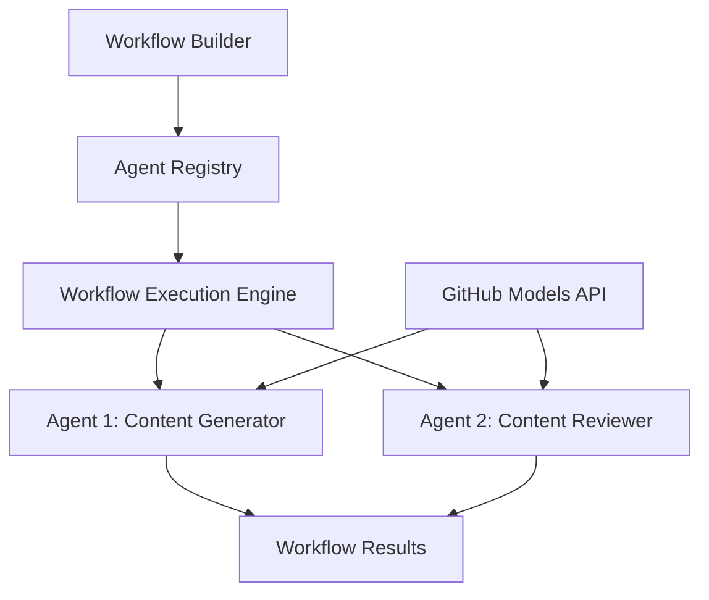

<!--
CO_OP_TRANSLATOR_METADATA:
{
  "original_hash": "034158688d0a45aae06dcbb21b0da5ae",
  "translation_date": "2025-11-11T12:52:26+00:00",
  "source_file": "08-multi-agent/code_samples/workflows-agent-framework/dotNET/01.dotnet-agent-framework-workflow-ghmodel-basic.md",
  "language_code": "fi"
}
-->
# 🔄 Perusagenttien työnkulut GitHub-mallien kanssa (.NET)

## 📋 Työnkulun orkestroinnin opetusohjelma

Tämä muistikirja näyttää, kuinka rakentaa kehittyneitä **agenttien työnkulkuja** Microsoft Agent Frameworkin ja GitHub-mallien avulla .NET-ympäristössä. Opit luomaan monivaiheisia liiketoimintaprosesseja, joissa tekoälyagentit tekevät yhteistyötä monimutkaisten tehtävien suorittamiseksi rakenteellisten orkestrointimallien avulla.

## 🎯 Oppimistavoitteet

### 🏗️ **Työnkulkuarkkitehtuurin perusteet**
- **Työnkulun rakentaja**: Suunnittele ja orkestroi monimutkaisia monivaiheisia tekoälyprosesseja
- **Agenttien koordinointi**: Koordinoi useita erikoistuneita agentteja työnkulkujen sisällä
- **GitHub-mallien integrointi**: Hyödynnä GitHubin tekoälymallien päättelypalvelua työnkuluissa
- **Visuaalinen työnkulun suunnittelu**: Luo ja visualisoi työnkulun rakenteita paremman ymmärryksen saavuttamiseksi

### 🔄 **Prosessien orkestrointimallit**
- **Järjestelmällinen käsittely**: Ketjuta useita agenttitehtäviä loogisessa järjestyksessä
- **Tilanhallinta**: Säilytä konteksti ja tietovirta työnkulun vaiheiden välillä
- **Virheenkäsittely**: Toteuta vankka virheiden palautus ja työnkulun kestävyys
- **Suorituskyvyn optimointi**: Suunnittele tehokkaita työnkulkuja yritystason operaatioihin

### 🏢 **Yrityksen työnkulkujen sovellukset**
- **Liiketoimintaprosessien automatisointi**: Automatisoi monimutkaisia organisaation työnkulkuja
- **Sisällöntuotantoputki**: Editointityönkulut tarkistus- ja hyväksymisvaiheilla
- **Asiakaspalvelun automatisointi**: Monivaiheinen asiakaskyselyjen ratkaisu
- **Tietojenkäsittelyn työnkulut**: ETL-työnkulut tekoälypohjaisella muunnoksella

## ⚙️ Esivaatimukset ja asennus

### 📦 **Vaaditut NuGet-paketit**

Tämä työnkulun esittely käyttää useita keskeisiä .NET-paketteja:

```xml
<!-- Core AI Framework -->
<PackageReference Include="Microsoft.Extensions.AI" Version="9.9.0" />

<!-- Agent Framework (Local Development) -->
<!-- Microsoft.Agents.AI.dll - Core agent abstractions -->
<!-- Microsoft.Agents.AI.OpenAI.dll - OpenAI/GitHub Models integration -->

<!-- Configuration and Environment -->
<PackageReference Include="DotNetEnv" Version="3.1.1" />
```

### 🔑 **GitHub-mallien konfigurointi**

**Ympäristön asennus (.env-tiedosto):**
```env
GITHUB_TOKEN=your_github_personal_access_token
GITHUB_ENDPOINT=https://models.inference.ai.azure.com
GITHUB_MODEL_ID=gpt-4o-mini
```

**GitHub-mallien käyttö:**
1. Rekisteröidy GitHub-malleihin (tällä hetkellä esikatselussa)
2. Luo henkilökohtainen käyttöoikeustunnus, jolla on mallien käyttöoikeudet
3. Määritä ympäristömuuttujat yllä olevan ohjeen mukaisesti

### 🏗️ **Työnkulkuarkkitehtuurin yleiskatsaus**



**Keskeiset komponentit:**
- **WorkflowBuilder**: Pääorkestrointimoottori työnkulkujen suunnitteluun
- **AIAgent**: Yksittäiset erikoistuneet agentit, joilla on erityisiä kykyjä
- **GitHub Models Client**: Tekoälymallien päättelypalvelun integrointi
- **Execution Context**: Hallitsee tilaa ja tietovirtaa työnkulun vaiheiden välillä

## 🎨 **Yrityksen työnkulun suunnittelumallit**

### 📝 **Sisällöntuotannon työnkulku**
```
User Request → Content Generation → Quality Review → Final Output
```

### 🔍 **Asiakirjojen käsittelyputki**
```
Document Input → Analysis → Extraction → Validation → Structured Output
```

### 💼 **Liiketoimintatiedon työnkulku**
```
Data Collection → Processing → Analysis → Report Generation → Distribution
```

### 🤝 **Asiakaspalvelun automatisointi**
```
Customer Inquiry → Classification → Processing → Response Generation → Follow-up
```

## 🏢 **Yrityksen hyödyt**

### 🎯 **Luotettavuus ja skaalautuvuus**
- **Deterministinen suoritus**: Johdonmukaiset ja toistettavat työnkulun tulokset
- **Virheiden palautus**: Sulava virheiden käsittely missä tahansa työnkulun vaiheessa
- **Suorituskyvyn seuranta**: Seuraa suoritusmittareita ja optimointimahdollisuuksia
- **Resurssien hallinta**: Tekoälymallien resurssien tehokas kohdentaminen ja käyttö

### 🔒 **Turvallisuus ja vaatimustenmukaisuus**
- **Turvallinen todennus**: GitHubin tunnuspohjainen todennus API-käyttöä varten
- **Auditointijäljet**: Täydellinen lokitus työnkulun suorittamisesta ja päätöksistä
- **Pääsynhallinta**: Tarkat käyttöoikeudet työnkulun suorittamiseen ja seurantaan
- **Tietosuoja**: Herkän tiedon turvallinen käsittely työnkulkujen aikana

### 📊 **Havainnointi ja hallinta**
- **Visuaalinen työnkulun suunnittelu**: Selkeä esitys prosessivirroista ja riippuvuuksista
- **Suorituksen seuranta**: Reaaliaikainen työnkulun etenemisen ja suorituskyvyn seuranta
- **Virheraportointi**: Yksityiskohtainen virheanalyysi ja vianetsintäominaisuudet
- **Suorituskyvyn analytiikka**: Mittarit optimointia ja kapasiteettisuunnittelua varten

Rakennetaan ensimmäinen yritysvalmis tekoälytyönkulku! 🚀

## 💻 Koodin suorittaminen

Täydellinen toteutus löytyy tiedostosta `01.dotnet-agent-framework-workflow-ghmodel-basic.cs`. Tämä tiedosto näyttää:

1. **Ympäristön konfigurointi** - GitHub-mallien tunnusten lataaminen `.env`-tiedostosta
2. **OpenAI Client -asennus** - Asiakkaan konfigurointi käyttämään GitHub-mallien päätepistettä
3. **Agenttien luominen** - Erikoistuneiden agenttien määrittely (Vastaanotto ja Concierge)
4. **Työnkulun rakentaja** - Monivaiheisen agenttityönkulun luominen järjestelmällisellä käsittelyllä
5. **Työnkulun suoritus** - Työnkulun suorittaminen suoratoistotuloksilla

### 🚀 Esimerkin suorittaminen

```bash
# Make the script executable (Unix/Linux/macOS)
chmod +x 01.dotnet-agent-framework-workflow-ghmodel-basic.cs

# Run the workflow
./01.dotnet-agent-framework-workflow-ghmodel-basic.cs
```

Tai Windowsissa:
```powershell
dotnet run 01.dotnet-agent-framework-workflow-ghmodel-basic.cs
```

### 📝 Odotettu tulos

Työnkulku:
1. Hyväksyy matkakohdepyyntösi ("Haluaisin matkustaa Pariisiin")
2. Vastaanottoagentti antaa alkuperäisen suosituksen
3. Concierge-agentti tarkistaa ja parantaa suositusta
4. Lopullinen tulos näyttää täydellisen keskusteluvirran

### 🔧 Mukauttaminen

Voit mukauttaa työnkulkua:
- Muokkaamalla agenttien ohjeita muuttaaksesi niiden käyttäytymistä
- Lisäämällä enemmän agentteja luodaksesi monimutkaisia monivaiheisia työnkulkuja
- Muuttamalla käyttäjän viestiä testataksesi erilaisia skenaarioita
- Säätämällä työnkulun reunoja luodaksesi erilaisia suoritusmalleja

---

<!-- CO-OP TRANSLATOR DISCLAIMER START -->
**Vastuuvapauslauseke**:  
Tämä asiakirja on käännetty käyttämällä tekoälypohjaista käännöspalvelua [Co-op Translator](https://github.com/Azure/co-op-translator). Vaikka pyrimme tarkkuuteen, huomioithan, että automaattiset käännökset voivat sisältää virheitä tai epätarkkuuksia. Alkuperäistä asiakirjaa sen alkuperäisellä kielellä tulisi pitää ensisijaisena lähteenä. Tärkeissä tiedoissa suositellaan ammattimaista ihmiskäännöstä. Emme ole vastuussa väärinkäsityksistä tai virhetulkinnoista, jotka johtuvat tämän käännöksen käytöstä.
<!-- CO-OP TRANSLATOR DISCLAIMER END -->