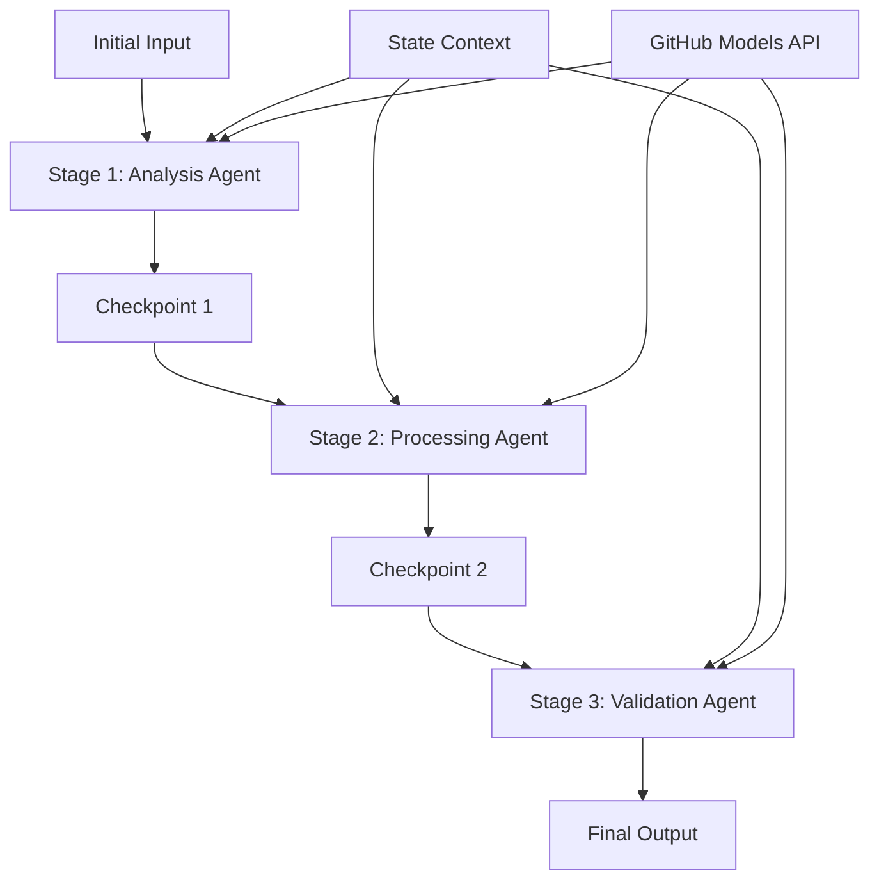

<!--
CO_OP_TRANSLATOR_METADATA:
{
  "original_hash": "1be9c8dcbd79a02d33d2c138684c1394",
  "translation_date": "2025-11-11T13:56:03+00:00",
  "source_file": "08-multi-agent/code_samples/workflows-agent-framework/dotNET/02.dotnet-agent-framework-workflow-ghmodel-sequential.md",
  "language_code": "fi"
}
-->
# ⏩ Järjestelmälliset agenttityönkulut GitHub-mallien kanssa (.NET)

## 📋 Edistynyt opetusohjelma järjestelmällisestä käsittelystä

Tämä muistikirja esittelee **järjestelmällisiä työnkulkuja** käyttäen Microsoft Agent Frameworkia .NET:lle ja GitHub-malleja. Opit rakentamaan monimutkaisia, vaiheittaisia käsittelyputkia, joissa agentit suorittavat tehtäviä tietyssä järjestyksessä, ja jokainen vaihe perustuu edellisen vaiheen tuloksiin.

## 🎯 Oppimistavoitteet

### 🔄 **Järjestelmällisen käsittelyn arkkitehtuuri**
- **Lineaarinen työnkulun suunnittelu**: Luo vaiheittaisia käsittelyputkia, joissa on selkeät riippuvuudet
- **Tilanhallinta**: Säilytä konteksti ja tietovirta työnkulun vaiheiden välillä
- **GitHub-mallien integrointi**: Hyödynnä GitHubin AI-malleja monivaiheisissa .NET-työnkuluissa
- **Yritystason putkimallit**: Rakenna tuotantovalmiita järjestelmällisiä käsittelyjärjestelmiä

### 🏗️ **Edistyneet järjestelmälliset mallit**
- **Vaiheporttikäsittely**: Toteuta validointitarkistuksia työnkulun vaiheiden välillä
- **Kontekstin säilyttäminen**: Säilytä tila ja kertyneet tiedot kaikissa vaiheissa
- **Virheiden eteneminen**: Käsittele epäonnistumiset hallitusti järjestelmällisissä käsittelyketjuissa
- **Suorituskyvyn optimointi**: Tehokas järjestelmällinen suoritus vähäisellä kuormituksella

### 🏢 **Yritystason järjestelmälliset sovellukset**
- **Asiakirjakäsittelyputki**: Monivaiheinen asiakirjojen analyysi, muokkaus ja validointi
- **Laadunvarmistustyönkulut**: Järjestelmällinen tarkistus, validointi ja hyväksyntäprosessi
- **Sisällöntuotantoputki**: Tutkimus → Kirjoittaminen → Editointi → Tarkistus → Julkaisu
- **Liiketoimintaprosessien automatisointi**: Monivaiheiset liiketoimintatyönkulut, joissa on selkeät vaihekohtaiset riippuvuudet

## ⚙️ Esivaatimukset ja asennus

### 📦 **Tarvittavat NuGet-paketit**

Välttämättömät paketit .NET-järjestelmällisiin työnkulkuihin:

```xml
<!-- Core AI Framework -->
<PackageReference Include="Microsoft.Extensions.AI" Version="9.9.0" />

<!-- Client Model Abstractions -->
<PackageReference Include="System.ClientModel" Version="1.6.1.0" />

<!-- Azure Identity and Async LINQ Support -->
<PackageReference Include="Azure.Identity" Version="1.15.0" />
<PackageReference Include="System.Linq.Async" Version="6.0.3" />

<!-- Local Agent Framework References -->
<!-- Microsoft.Agents.AI.dll - Core agent abstractions -->
<!-- Microsoft.Agents.AI.OpenAI.dll - GitHub Models integration -->
```

### 🔑 **GitHub-mallien konfigurointi**

**Ympäristön asennus (.env-tiedosto):**
```env
GITHUB_TOKEN=your_github_personal_access_token
GITHUB_ENDPOINT=https://models.inference.ai.azure.com
GITHUB_MODEL_ID=gpt-4o-mini
```

**Konfiguraation hallinta:**
```csharp
// Load environment variables securely
Env.Load("../../../.env");
var githubToken = Environment.GetEnvironmentVariable("GITHUB_TOKEN");
var githubEndpoint = Environment.GetEnvironmentVariable("GITHUB_ENDPOINT");
var modelId = Environment.GetEnvironmentVariable("GITHUB_MODEL_ID");
```

### 🏗️ **Järjestelmällisen työnkulun arkkitehtuuri**



**Keskeiset komponentit:**
- **Järjestelmälliset agentit**: Erikoistuneet agentit jokaiselle käsittelyvaiheelle
- **Tilakonteksti**: Säilyttää kertyneet tiedot ja päätökset vaiheiden välillä
- **Tarkistuspisteet**: Validointipisteet vaiheiden välillä laadun ja johdonmukaisuuden varmistamiseksi
- **GitHub-mallien asiakas**: Johdonmukainen AI-mallien käyttö kaikissa työnkulun vaiheissa

## 🎨 **Järjestelmälliset työnkulun suunnittelumallit**

### 📝 **Asiakirjakäsittelyputki**
```
Raw Document → Content Extraction → Analysis → Validation → Structured Output
```

### 🎯 **Sisällöntuotantotyönkulku**
```
Brief/Requirements → Research → Content Creation → Review → Final Polish
```

### 🔍 **Laadunvarmistusputki**
```
Initial Review → Technical Validation → Compliance Check → Final Approval
```

### 💼 **Liiketoimintatiedon työnkulku**
```
Data Collection → Processing → Analysis → Report Generation → Distribution
```

## 🏢 **Yritystason järjestelmällisten työnkulkujen edut**

### 🎯 **Luotettavuus ja laatu**
- **Deterministinen käsittely**: Johdonmukaiset ja toistettavat tulokset rakenteellisten vaiheiden avulla
- **Laatuportit**: Validointitarkistukset varmistavat laadun jokaisessa vaiheessa
- **Virheiden eristäminen**: Yhden vaiheen ongelmat eivät vaikuta seuraaviin vaiheisiin
- **Auditointijäljet**: Täydellinen seuranta päätöksistä ja muunnoksista jokaisessa vaiheessa

### 📈 **Laajennettavuus ja suorituskyky**
- **Modulaarinen suunnittelu**: Jokainen vaihe voidaan optimoida itsenäisesti
- **Resurssien hallinta**: Tehokas AI-mallien resurssien jakaminen vaiheiden välillä
- **Tilan optimointi**: Vähäinen tilansiirto vaiheiden välillä optimaalisen suorituskyvyn saavuttamiseksi
- **Rinnakkaiset vaiheryhmät**: Useat järjestelmälliset työnkulut voivat toimia rinnakkain

### 🔒 **Turvallisuus ja vaatimustenmukaisuus**
- **Vaihekohtainen turvallisuus**: Eri turvallisuuskäytännöt eri käsittelyvaiheille
- **Tietojen validointi**: Varmista tietojen eheys ja vaatimustenmukaisuus jokaisessa tarkistuspisteessä
- **Pääsynhallinta**: Tarkat käyttöoikeudet eri työnkulun vaiheille
- **Sääntelyvaatimusten täyttäminen**: Täytä sääntelyvaatimukset rakenteellisen käsittelyn avulla

### 📊 **Seuranta ja analytiikka**
- **Vaihekohtaiset mittarit**: Suorituskyvyn seuranta jokaiselle työnkulun vaiheelle
- **Pullonkaulojen tunnistaminen**: Tunnista ja optimoi hitaat vaiheet
- **Laatumittarit**: Seuraa laatua ja onnistumisprosentteja jokaisessa vaiheessa
- **Prosessin optimointi**: Jatkuva parantaminen vaihekohtaisten analytiikkatietojen perusteella

Rakennetaan vankkoja järjestelmällisiä AI-käsittelyputkia! 🚀

## 💻 Koodin suorittaminen

Täydellinen toteutus löytyy tiedostosta `02.dotnet-agent-framework-workflow-ghmodel-sequential.cs`. Tämä tiedosto esittelee **kolmivaiheisen huonekaluanalyysin työnkulun**:

1. **Vaihe 1 - Myyntiagentti**: Analysoi huonekalukuvia ja antaa ostosuosituksia
2. **Vaihe 2 - Hinta-agentti**: Tarjoaa yksityiskohtaisen hintajaon ja budjettivaihtoehtoja
3. **Vaihe 3 - Tarjousagentti**: Luo ammattimaisen tarjousdokumentin Markdown-muodossa

### 🏗️ **Työnkulun arkkitehtuuri**

```
Image Input → Sales Analysis → Price Estimation → Quote Generation → Final Output
```

Jokainen agentti:
- Saa edellisen vaiheen tuloksen kontekstina
- Rakentaa edellisen analyysin päälle erikoistuneella osaamisella
- Säilyttää työnkulun jatkuvuuden tilanhallinnan avulla

### 🚀 Esimerkin suorittaminen

**Esivaatimukset:**
- Aseta huonekalukuva polkuun `../imgs/home.png` (tai päivitä `imgPath`-muuttuja)
- Konfiguroi `.env`-tiedostosi GitHub-mallien tunnuksilla

```bash
# Make the script executable (Unix/Linux/macOS)
chmod +x 02.dotnet-agent-framework-workflow-ghmodel-sequential.cs

# Run the sequential workflow
./02.dotnet-agent-framework-workflow-ghmodel-sequential.cs
```

Tai Windowsissa:
```powershell
dotnet run 02.dotnet-agent-framework-workflow-ghmodel-sequential.cs
```

### 📝 Odotettu tulos

Työnkulku suorittaa seuraavat vaiheet:
1. **Myyntiagentti**: Tunnistaa huonekalut kuvasta ja antaa suosituksia
2. **Hinta-agentti**: Lisää yksityiskohtaisen hintaanalyysin budjettitasoineen ja ostosuosituksineen
3. **Tarjousagentti**: Luo muotoillun tarjousdokumentin, joka sisältää kaikki tiedot yhteen koottuna

Lopullinen tulos on kattava ja ammattimainen huonekalutarjous, joka perustuu kuva-analyysiin.

### 🔧 Muokkausvaihtoehdot

**Muokkaa agentin toimintaa:**
```csharp
// Adjust agent instructions to change their focus
const string SalesAgentInstructions = "Your custom instructions...";
```

**Muuta järjestelmällistä työnkulkua:**
```csharp
// Add or reorder workflow stages
var workflow = new WorkflowBuilder(salesagent)
    .AddEdge(salesagent, priceagent)
    .AddEdge(priceagent, quoteagent)
    .AddEdge(quoteagent, newAgent)  // Add another stage
    .Build();
```

**Käytä eri syötettä:**
```csharp
// Process text instead of images
ChatMessage userMessage = new ChatMessage(ChatRole.User, [
    new TextContent("Analyze pricing for a modern living room set")
]);
```

### 🎯 Todelliset sovellukset

Tämä järjestelmällinen malli sopii erinomaisesti:
- **Verkkokauppa**: Tuoteanalyysi → Hinnoittelu → Tarjouksen luominen
- **Kiinteistöt**: Kiinteistöanalyysi → Arviointi → Ilmoituksen luominen
- **Vakuutus**: Vahinkojen analyysi → Arviointi → Tarjouksen luominen
- **Sisällöntuotanto**: Tutkimus → Kirjoittaminen → Editointi → Julkaisu

### 🔍 Tilavirran ymmärtäminen

Jokainen järjestelmällisen työnkulun agentti saa:
- **Alkuperäinen syöte**: Käyttäjän alkuperäinen viesti (kuva + teksti)
- **Edellisten agenttien tulokset**: Kaikki aiempien agenttien vastaukset keskusteluhistoriassa
- **Kertyvä konteksti**: Täydellinen tila, joka säilyy koko työnkulun ajan

Tämä mahdollistaa monimutkaisen monivaiheisen käsittelyn, jossa jokainen agentti rakentaa kattavan kontekstin pohjalta, joka sisältää kaikki aiemmat vaiheet.

---

<!-- CO-OP TRANSLATOR DISCLAIMER START -->
**Vastuuvapauslauseke**:  
Tämä asiakirja on käännetty käyttämällä tekoälypohjaista käännöspalvelua [Co-op Translator](https://github.com/Azure/co-op-translator). Vaikka pyrimme tarkkuuteen, huomioithan, että automaattiset käännökset voivat sisältää virheitä tai epätarkkuuksia. Alkuperäinen asiakirja sen alkuperäisellä kielellä tulisi pitää ensisijaisena lähteenä. Tärkeissä tiedoissa suositellaan ammattimaista ihmiskäännöstä. Emme ole vastuussa väärinkäsityksistä tai virhetulkinnoista, jotka johtuvat tämän käännöksen käytöstä.
<!-- CO-OP TRANSLATOR DISCLAIMER END -->