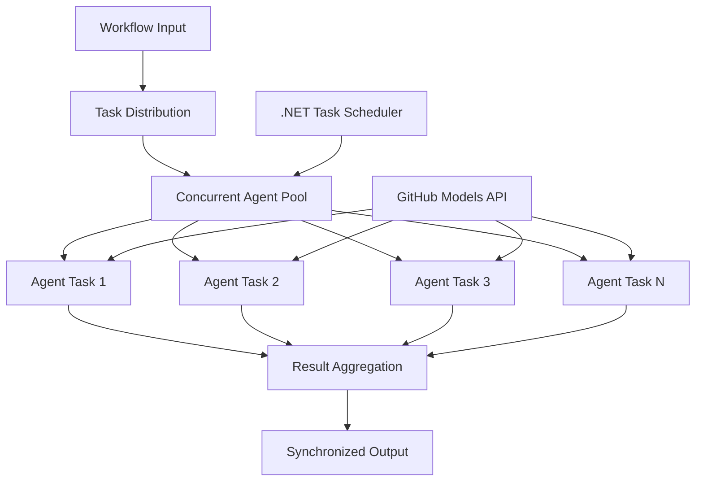

<!--
CO_OP_TRANSLATOR_METADATA:
{
  "original_hash": "b9c6e32c9b5f2fed20b6916984440d88",
  "translation_date": "2025-11-11T13:23:00+00:00",
  "source_file": "08-multi-agent/code_samples/workflows-agent-framework/dotNET/03.dotnet-agent-framework-workflow-ghmodel-concurrent.md",
  "language_code": "fi"
}
-->
# ⚡ Samanaikaiset agenttityönkulut GitHub-mallien kanssa (.NET)

## 📋 Korkean suorituskyvyn rinnakkaiskäsittelyn opas

Tämä muistikirja esittelee **samanaikaisia työnkulkuja** Microsoft Agent Frameworkin ja GitHub-mallien avulla .NET-ympäristössä. Opit rakentamaan korkean suorituskyvyn rinnakkaiskäsittelyn työnkulkuja, jotka maksimoivat läpimenon suorittamalla useita tekoälyagentteja samanaikaisesti säilyttäen samalla koordinoinnin ja tietojen johdonmukaisuuden.

## 🎯 Oppimistavoitteet

### 🚀 **Rinnakkaiskäsittelyn perusteet**
- **Agenttien rinnakkaissuoritus**: Suorita useita tekoälyagentteja samanaikaisesti maksimaalisen suorituskyvyn saavuttamiseksi
- **Async/Await-mallit**: Hyödynnä .NET:n asynkronista ohjelmointimallia tehokkaaseen rinnakkaiskäsittelyyn
- **GitHub-mallien integrointi**: Koordinoi useita samanaikaisia kutsuja GitHubin tekoälymallien tulkintapalveluun
- **Resurssien hallinta**: Hallitse tekoälymallien resursseja tehokkaasti samanaikaisten operaatioiden aikana

### 🏗️ **Edistynyt rinnakkaisarkkitehtuuri**
- **Tehtäväpohjainen rinnakkaisuus**: Käytä .NET Task Parallel Libraryä optimaaliseen rinnakkaissuoritukseen
- **Synkronointimallit**: Koordinoi samanaikaisia agentteja välttäen kilpailutilanteita
- **Kuormituksen tasapainotus**: Jaa työ tehokkaasti käytettävissä olevan rinnakkaiskapasiteetin kesken
- **Vikasietoisuus**: Käsittele yksittäisten agenttien epäonnistumiset pysäyttämättä koko työnkulkua

### 🏢 **Yritystason samanaikaiset sovellukset**
- **Suuri määrä dokumenttien käsittelyä**: Käsittele useita dokumentteja samanaikaisesti
- **Reaaliaikainen sisällön analyysi**: Analysoi saapuvia datavirtoja samanaikaisesti
- **Eräkäsittelyn optimointi**: Maksimoi läpimeno suurten datamäärien käsittelyssä
- **Monimuotoinen analyysi**: Käsittele rinnakkain eri sisältötyyppejä ja -formaatteja

## ⚙️ Esivaatimukset ja asennus

### 📦 **Tarvittavat NuGet-paketit**

Välttämättömät paketit korkean suorituskyvyn rinnakkaiskäsittelyyn:

```xml
<!-- Core AI Framework with Async Support -->
<PackageReference Include="Microsoft.Extensions.AI" Version="9.9.0" />

<!-- Client Model Abstractions for API Communication -->
<PackageReference Include="System.ClientModel" Version="1.6.1.0" />

<!-- Azure Identity and Async LINQ for Advanced Operations -->
<PackageReference Include="Azure.Identity" Version="1.15.0" />
<PackageReference Include="System.Linq.Async" Version="6.0.3" />

<!-- Local Agent Framework References -->
<!-- Microsoft.Agents.AI.dll - Core agent abstractions with async support -->
<!-- Microsoft.Agents.AI.OpenAI.dll - GitHub Models integration with concurrency -->
```

### 🔑 **GitHub-mallien konfigurointi**

**Ympäristön asennus (.env-tiedosto):**
```env
GITHUB_TOKEN=your_github_personal_access_token
GITHUB_ENDPOINT=https://models.inference.ai.azure.com
GITHUB_MODEL_ID=gpt-4o-mini
```

**Rinnakkaiskäsittelyn huomioitavat seikat:**
```csharp
// Configure for concurrent operations
var clientOptions = new OpenAIClientOptions()
{
    Endpoint = new Uri(githubEndpoint),
    // Configure connection pooling for concurrent requests
    NetworkTimeout = TimeSpan.FromMinutes(5)
};
```

### 🏗️ **Rinnakkaisen työnkulun arkkitehtuuri**



**Keskeiset komponentit:**
- **Task Parallel Library**: .NET:n sisäänrakennettu tuki rinnakkaisille operaatioille
- **Agent Pool**: Useita agentti-instansseja rinnakkaiskäsittelyyn
- **Tulosten yhdistäminen**: Koordinoi ja yhdistä samanaikaisten agenttien tulokset
- **Synkronointipisteet**: Varmista tietojen johdonmukaisuus samanaikaisten operaatioiden välillä

## 🎨 **Rinnakkaisen työnkulun suunnittelumallit**

### 🔍 **Rinnakkainen tutkimus ja analyysi**
```
Research Topic → Concurrent Research Agents → Result Synthesis → Final Report
```

### 📊 **Monilähteinen datankäsittely**
```
Data Sources → Parallel Processing Agents → Data Integration → Unified Output
```

### 🎭 **Sisällöntuotantoputki**
```
Content Requirements → Concurrent Content Generators → Quality Review → Final Content
```

### 🔄 **Fan-Out/Fan-In-käsittely**
```
Single Input → Multiple Concurrent Processors → Result Aggregation → Single Output
```

## 🏢 **Yritystason suorituskyvyn edut**

### ⚡ **Läpimenon ja skaalautuvuuden parantaminen**
- **Lineaarinen suorituskyvyn skaalaus**: Lisää samanaikaisia agentteja läpimenon kasvattamiseksi
- **Resurssien hyödyntäminen**: Maksimoi käytettävissä olevan tekoälymallikapasiteetin tehokkuus
- **Lyhennetty käsittelyaika**: Merkittävä ajansäästö rinnakkaissuorituksen avulla
- **Joustava skaalaus**: Säädä samanaikaisten agenttien määrää dynaamisesti työkuorman mukaan

### 🛡️ **Luotettavuus ja kestävyys**
- **Vikojen eristäminen**: Yksittäisten agenttien epäonnistumiset eivät vaikuta muihin samanaikaisiin operaatioihin
- **Hallittu heikentyminen**: Järjestelmä jatkaa toimintaansa pienemmällä agenttikapasiteetilla
- **Virheiden korjaus**: Automaattiset uudelleenkäynnistysmekanismit epäonnistuneille operaatioille
- **Kuormituksen jakaminen**: Työn tasainen jakaminen käytettävissä olevien agenttien kesken

### 📊 **Suorituskyvyn seuranta**
- **Samanaikaisten operaatioiden mittarit**: Seuraa kaikkien rinnakkaisten operaatioiden suorituskykyä
- **Resurssien käyttöanalytiikka**: Tarkkaile CPU:n, muistin ja verkon käyttöä
- **Läpimenon analyysi**: Mittaa tehokkuuden parannuksia rinnakkaiskäsittelystä
- **Pullonkaulojen tunnistus**: Tunnista ja ratkaise suorituskyvyn rajoitteet

### 🔧 **Kehitys ja operointi**
- **Async-ohjelmointimalli**: Hyödynnä .NET:n kehittyneitä async/await-malleja
- **Tehtävien koordinointi**: Sisäänrakennetut tehtävien hallinta- ja koordinointiominaisuudet
- **Poikkeusten käsittely**: Kattava virheenkäsittely samanaikaisille operaatioille
- **Debuggaustuki**: Visual Studion debuggaustyökalut rinnakkaisille työnkuluille

Rakennetaan korkean suorituskyvyn samanaikaisia tekoälytyönkulkuja .NET:llä! 🚀

## 💻 Koodin suorittaminen

Täydellinen toteutus löytyy tiedostosta `03.dotnet-agent-framework-workflow-ghmodel-concurrent.cs`. Tämä tiedosto esittelee **Fan-Out/Fan-In-rinnakkaistyönkulun** matkasuunnitteluun:

### 🏗️ **Työnkulun arkkitehtuuri**

```
User Request → ConcurrentStartExecutor → [Researcher Agent || Planner Agent] → ConcurrentAggregationExecutor → Final Output
```

**Keskeiset komponentit:**

1. **ConcurrentStartExecutor**: Lähettää käyttäjän pyynnön kaikille agenteille samanaikaisesti
2. **Researcher Agent**: Analysoi kohteita ja nähtävyyksiä rinnakkain
3. **Planner Agent**: Laatii yksityiskohtaisia matkasuunnitelmia rinnakkain
4. **ConcurrentAggregationExecutor**: Kerää ja yhdistää molempien agenttien tulokset

### 🎯 **Fan-Out/Fan-In-malli**

Tämä työnkulku esittelee klassisen **Fan-Out/Fan-In**-mallin:
- **Fan-Out**: Yksi syöteviesti lähetetään samanaikaisesti useille agenteille
- **Rinnakkaiskäsittely**: Useat agentit työskentelevät rinnakkain saman tehtävän parissa
- **Fan-In**: Kaikkien agenttien tulokset kerätään ja yhdistetään yhdeksi ulostuloksi

### 🚀 Esimerkin suorittaminen

```bash
# Make the script executable (Unix/Linux/macOS)
chmod +x 03.dotnet-agent-framework-workflow-ghmodel-concurrent.cs

# Run the concurrent workflow
./03.dotnet-agent-framework-workflow-ghmodel-concurrent.cs
```

Tai Windowsissa:
```powershell
dotnet run 03.dotnet-agent-framework-workflow-ghmodel-concurrent.cs
```

### 📝 Odotettu tulos

Työnkulku:
1. **Lähettää pyynnön**: Lähettää "Suunnittele matka Seattleen joulukuussa" molemmille agenteille
2. **Rinnakkaiskäsittely**: Molemmat agentit työskentelevät samanaikaisesti:
   - Tutkija tunnistaa nähtävyydet ja yksityiskohdat
   - Suunnittelija laatii aikataulun ja logistiikan
3. **Yhdistäminen**: Yhdistää molempien vastaukset kattavaksi ulostuloksi
4. **Näyttää tulokset**: Näyttää yhdistetyn matkasuunnitelman kaikilla tiedoilla

### 🔧 Muokkausvaihtoehdot

**Lisää samanaikaisia agentteja:**
```csharp
// Create additional specialized agents
AIAgent budgetAgent = openAIClient.GetChatClient(github_model_id).CreateAIAgent(
    name: "Budget-Agent", instructions: "Calculate travel costs...");

// Add to fan-out
var workflow = new WorkflowBuilder(startExecutor)
    .AddFanOutEdge(startExecutor, targets: [researcherAgent, plannerAgent, budgetAgent])
    .AddFanInEdge(aggregationExecutor, sources: [researcherAgent, plannerAgent, budgetAgent])
    .WithOutputFrom(aggregationExecutor)
    .Build();

// Update aggregation count
if (this._messages.Count == 3) { ... }
```

**Muokkaa agenttien ohjeita:**
```csharp
const string ResearcherAgentInstructions = "Your custom instructions for research...";
const string PlanAgentInstructions = "Your custom instructions for planning...";
```

**Muuta tehtävää:**
```csharp
StreamingRun run = await InProcessExecution.StreamAsync(
    workflow, 
    "Plan a European vacation for 2 weeks in summer"
);
```

### 🎯 Todelliset sovellukset

Tämä rinnakkainen malli sopii erinomaisesti:
- **Sisällöntuotanto**: Useat kirjoittajat luovat eri osioita samanaikaisesti
- **Koodin tarkistus**: Useat tarkistajat analysoivat koodia eri näkökulmista
- **Markkinatutkimus**: Rinnakkainen analyysi eri markkinasegmenteistä
- **Dokumenttien käsittely**: Rinnakkainen tiedon poiminta, analyysi ja validointi
- **Moninäkökulmainen analyysi**: Erilaisten näkökulmien saaminen samaan syötteeseen

### 🔍 Ymmärrä mukautetut suorittajat

**ConcurrentStartExecutor:**
- Toteuttaa `IMessageHandler<string>` vastaanottaakseen merkkijonosyötteen
- Lähettää viestit kaikille liitetyille agenteille
- Lähettää `TurnToken` käynnistääkseen rinnakkaiskäsittelyn

**ConcurrentAggregationExecutor:**
- Toteuttaa `IMessageHandler<ChatMessage>` vastaanottaakseen agenttien vastaukset
- Kerää viestit säikeiden turvallisella tavalla
- Yhdistää tulokset, kun kaikki odotetut vastaukset ovat saapuneet
- Tuottaa lopullisen ulostulon käyttäen `context.YieldOutputAsync()`

### ⚡ Suorituskyvyn edut

**Rinnakkainen vs. peräkkäinen:**
- Peräkkäinen: Agentti1 (30s) → Agentti2 (30s) = **60 sekuntia yhteensä**
- Rinnakkainen: Agentti1 (30s) || Agentti2 (30s) = **30 sekuntia yhteensä**

**Läpimenon parannus**: Jopa N× nopeampi N samanaikaisella agentilla (riippuen työkuormasta ja resursseista)

### 🛡️ Virheenkäsittely

Työnkulku käsittelee yksittäisten agenttien epäonnistumiset hallitusti:
- Jos yksi agentti epäonnistuu, muut jatkavat käsittelyä
- Yhdistäjä voi toteuttaa aikakatkaisulogiikan
- Osittaiset tulokset voidaan palauttaa tarvittaessa

### 📊 Edistyneet ominaisuudet

**Dynaaminen agenttimäärä:**
Muokkaa yhdistämislogiikkaa tukemaan vaihtelevaa agenttimäärää:

```csharp
private int _expectedAgentCount;
private readonly List<ChatMessage> _messages = [];

public async ValueTask HandleAsync(ChatMessage message, IWorkflowContext context)
{
    this._messages.Add(message);
    if (this._messages.Count == _expectedAgentCount)
    {
        // Process aggregation
    }
}
```

Tämä rinnakkainen työnkulku on olennainen korkean suorituskyvyn, skaalautuvien tekoälyagenttijärjestelmien rakentamisessa!

---

<!-- CO-OP TRANSLATOR DISCLAIMER START -->
**Vastuuvapauslauseke**:  
Tämä asiakirja on käännetty käyttämällä tekoälypohjaista käännöspalvelua [Co-op Translator](https://github.com/Azure/co-op-translator). Vaikka pyrimme tarkkuuteen, huomioithan, että automaattiset käännökset voivat sisältää virheitä tai epätarkkuuksia. Alkuperäistä asiakirjaa sen alkuperäisellä kielellä tulisi pitää ensisijaisena lähteenä. Kriittisen tiedon osalta suositellaan ammattimaista ihmiskäännöstä. Emme ole vastuussa väärinkäsityksistä tai virhetulkinnoista, jotka johtuvat tämän käännöksen käytöstä.
<!-- CO-OP TRANSLATOR DISCLAIMER END -->