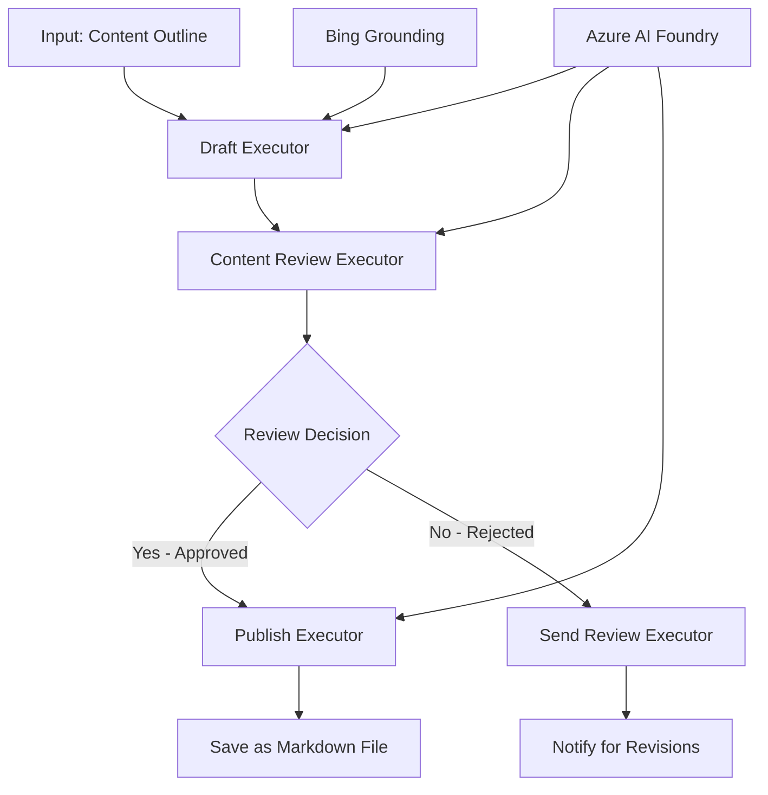

<!--
CO_OP_TRANSLATOR_METADATA:
{
  "original_hash": "8abd335151cee553293b637ee3d80d10",
  "translation_date": "2025-11-11T12:20:41+00:00",
  "source_file": "08-multi-agent/code_samples/workflows-agent-framework/dotNET/04.dotnet-agent-framework-workflow-aifoundry-condition.md",
  "language_code": "fi"
}
-->
# 🔀 Ehdolliset agenttityönkulut Azure AI Foundrylla (.NET)

## 📋 Älykäs päätöksentekoon perustuva työnkulkuopas

Tämä notebook esittelee **ehdollisia työnkulkuja** käyttäen Azure AI Foundrya ja Microsoft Agent Frameworkia .NET:lle. Opit rakentamaan kehittyneitä, päätöksentekoon perustuvia työnkulkuja, jotka ohjaavat käsittelyä älykkäästi AI-analyysin, liiketoimintasääntöjen ja dynaamisten ehtojen perusteella yritystason automaatiota varten.

## 🎯 Oppimistavoitteet

### 🧠 **Älykäs päätöksentekoarkkitehtuuri**
- **Ehdollisen logiikan toteutus**: Rakenna monimutkaisia päätöspuita, joissa on useita haarautumispisteitä
- **AI-ohjattu reititys**: Käytä Azure AI Foundryn malleja älykkäiden reitityspäätösten tekemiseen
- **Dynaaminen työnkulun mukauttaminen**: Muokkaa työnkulun käyttäytymistä ajonaikaisten analyysien ja ehtojen perusteella
- **Liiketoimintasääntöjen integrointi**: Sisällytä työnkulkuihin liiketoimintalogiikkaa ja vaatimustenmukaisuusvaatimuksia

### 🔀 **Kehittyneet ehdolliset mallit**
- **Monikriteerinen päätöksenteko**: Arvioi useita tekijöitä reitityspäätösten tekemiseksi
- **Kontekstin huomioiva käsittely**: Tee päätöksiä työnkulun kertyneen kontekstin ja historian perusteella
- **Mukautuva työnkulun muokkaus**: Säädä käsittelypolkuja reaaliaikaisten ehtojen perusteella
- **Sääntömoottorin integrointi**: Toteuta kehittyneitä liiketoimintasääntömoottoreita työnkulkuihin

### 🏢 **Yritystason ehdolliset sovellukset**
- **Asiakirjojen luokittelu ja reititys**: Luokittele ja ohjaa asiakirjat automaattisesti sopiviin työnkulkuihin
- **Asiakaspalvelun triage**: Ohjaa asiakaskyselyt älykkäästi erikoistuneille käsittelytiimeille
- **Vaatimustenmukaisuus ja riskikäsittely**: Sovella erilaisia validointi- ja tarkistusprosesseja riskinarvioinnin perusteella
- **Laadunvarmistuksen työnkulut**: Ohjaa sisältöä sopiviin tarkistusprosesseihin laatumittareiden perusteella

## ⚙️ Esivaatimukset ja asennus

### 📦 **Vaaditut NuGet-paketit**

Kehittyneet paketit ehdolliseen työnkulun käsittelyyn:

```xml
<!-- Core AI Framework -->
<PackageReference Include="Microsoft.Extensions.AI" Version="9.9.0" />

<!-- Azure AI Agents with Persistent State -->
<PackageReference Include="Azure.AI.Agents.Persistent" Version="1.2.0-beta.5" />

<!-- Azure Identity and Utilities -->
<PackageReference Include="Azure.Identity" Version="1.15.0" />
<PackageReference Include="System.Linq.Async" Version="6.0.3" />
<PackageReference Include="DotNetEnv" Version="3.1.1" />

<!-- Local Workflow Framework References -->
<!-- Microsoft.Agents.Workflows.dll - Advanced workflow orchestration -->
<!-- Microsoft.Agents.AI.AzureAI.dll - Azure AI Foundry integration -->
<!-- Microsoft.Agents.AI.dll - Core agent abstractions -->
```

### 🔑 **Azure AI Foundryn konfigurointi**

**Vaaditut Azure-resurssit:**
- Azure AI Foundry -työtila ehdollisten käsittelymallien kanssa
- Azure-tilaus, jossa on tarvittavat laskentakiintiöt ja käyttöoikeudet
- Päätöksentekoon ja sisällön analysointiin käytettävät AI-mallit
- (Valinnainen) Bing Search API -yhteys taustatietojen hankkimiseksi

**Ympäristön konfigurointi (.env-tiedosto):**
```env
# Azure AI Foundry Configuration
AZURE_AI_PROJECT_ENDPOINT=https://your-project.cognitiveservices.azure.com/
BING_CONNECTION_ID=your-bing-connection-id
```

**Autentikointiasetukset:**
```csharp
// Azure CLI or Managed Identity authentication
using Azure.Identity;
var credential = new AzureCliCredential();

// Load environment configuration
DotNetEnv.Env.Load("../../../.env");
```

### 🏗️ **Ehdollisen työnkulun arkkitehtuuri**



**Keskeiset komponentit:**
- **Draft Executor**: AI-agentti, joka luo alustavat sisällön luonnokset
- **Content Review Executor**: AI-agentti, joka arvioi luonnoksen laatua ja vaatimustenmukaisuutta
- **Ehdollinen reititys**: Päätöslogiikka, joka ohjaa tarkistustulosten perusteella
- **Julkaisu-/tarkistuspolut**: Erilliset käsittelypolut hyväksytylle ja hylätylle sisällölle
- **Tilanhallinta**: Säilyttää sisällön ja tarkistuksen kontekstin työnkulun aikana

## 🎨 **Ehdolliset työnkulun suunnittelumallit**

### 📋 **Sisällöntuotanto laatukynnyksillä**
```
Outline → Draft Creation → Quality Review → {Approve: Publish | Reject: Revise}
```

### 🎯 **Riskiperusteinen asiakirjakäsittely**
```
Document → Risk Assessment → {Low: Standard | High: Enhanced Review}
```

### 🔍 **Älykäs asiakaspalvelun reititys**
```
Customer Query → Analysis → {Simple: FAQ Bot | Complex: Human Agent}
```

### 💼 **Vaatimustenmukaisuuteen perustuvat työnkulut**
```
Content → Compliance Check → {Pass: Publish | Fail: Legal Review}
```

## 🏢 **Yritystason ehdolliset hyödyt**

### 🎯 **Älykäs automaatio**
- **Älykäs päätöksenteko**: AI-ohjatut reitityspäätökset sisällön analyysin ja kontekstin perusteella
- **Mukautuva käsittely**: Työnkulut, jotka mukautuvat automaattisesti muuttuvien ehtojen mukaan
- **Liiketoimintasääntöjen noudattaminen**: Monimutkaisten liiketoimintasääntöjen ja käytäntöjen automaattinen soveltaminen
- **Kontekstin huomioiva reititys**: Päätökset työnkulun historian ja kertyneen kontekstin perusteella

### 📈 **Toiminnallinen huippuosaaminen**
- **Resurssien optimointi**: Ohjaa työt sopivimmille asiantuntijoille ja prosesseille
- **Vähennetty manuaalinen puuttuminen**: Automaattinen päätöksenteko minimoi ihmisen tekemän reitityksen tarpeen
- **Nopeammat ratkaisuajat**: Suora reititys sopivaan asiantuntemukseen ja käsittelykapasiteettiin
- **Johdonmukainen soveltaminen**: Liiketoimintasääntöjen ja päätöskriteerien yhtenäinen soveltaminen

### 🛡️ **Riskienhallinta ja vaatimustenmukaisuus**
- **Automaattinen riskinarviointi**: AI-ohjattu sisällön ja tilanteen riskitasojen arviointi
- **Vaatimustenmukaisuuden noudattaminen**: Automaattinen reititys vaadittujen sääntelyprosessien läpi
- **Turvaprotokollien soveltaminen**: Tehostetut turvatoimenpiteet riskinarvioinnin perusteella
- **Auditointijäljen ylläpito**: Kaikkien reitityspäätösten ja perustelujen täydellinen dokumentointi

### 📊 **Analytiikka ja jatkuva parantaminen**
- **Päätösanalytiikka**: Seuraa reitityspäätösten tehokkuutta ja tarkkuutta
- **Kaavojen tunnistaminen**: Tunnista reitityspäätösten trendit ja kaavat ajan myötä
- **Suorituskyvyn optimointi**: Päätöskriteerien ja reitityksen tehokkuuden jatkuva parantaminen
- **Liiketoimintatiedot**: Näkemyksiä sisällön ominaisuuksista ja käsittelyvaatimuksista

### 🔧 **Tekninen huippuosaaminen**
- **Pysyvä tilanhallinta**: Säilytä monimutkainen tila työnkulun suorituksen aikana
- **Skaalautuva arkkitehtuuri**: Käsittele suurivolyymista ehdollista käsittelyä
- **Integrointikyvyt**: Saumaton integrointi olemassa oleviin liiketoimintajärjestelmiin ja -prosesseihin
- **Seuranta ja havaittavuus**: Työnkulun suorituskyvyn ja päätösten kattava seuranta

Rakennetaan älykkäitä, päätöksentekoon perustuvia yritystason työnkulkuja .NET:llä! 🚀

## 💻 Koodin suorittaminen

Täydellinen toteutus löytyy tiedostosta `04.dotnet-agent-framework-workflow-aifoundry-condition.cs`. Tämä esittelee **sisällöntuotannon työnkulun laatukynnyksillä**:

### 🏗️ **Työnkulun arkkitehtuuri**

```
Content Outline → Draft Creation → Quality Review → Conditional Routing:
                                                      ├─ Approved (>200 words) → Publish
                                                      └─ Rejected (<200 words) → Review Notification
```

**Työnkulun agentit:**
1. **Evangelist Agent**: Luo opetusmateriaalin luonnoksia Bingin taustatiedoin
2. **Content Reviewer Agent**: Arvioi luonnoksen laatua (sanamäärä, täydellisyys)
3. **Publisher Agent**: Tallentaa hyväksytyn sisällön aikaleimattuina Markdown-tiedostoina

**Mukautetut suorittajat:**
1. **DraftExecutor**: Orkestroi luonnoksen luomisen
2. **ContentReviewExecutor**: Suorittaa laadun arvioinnin
3. **PublishExecutor**: Käsittelee hyväksytyn sisällön julkaisemisen
4. **SendReviewExecutor**: Hallinnoi hylätyn sisällön ilmoituksia

### 🚀 Esimerkin suorittaminen

**Esivaatimukset:**
- Azure AI Foundry -työtila konfiguroitu
- Azure CLI -autentikointi (`az login`)
- (Valinnainen) Bing Search -yhteys taustatietojen hankkimiseksi

```bash
# Make the script executable (Unix/Linux/macOS)
chmod +x 04.dotnet-agent-framework-workflow-aifoundry-condition.cs

# Run the conditional workflow
./04.dotnet-agent-framework-workflow-aifoundry-condition.cs
```

Tai Windowsissa:
```powershell
dotnet run 04.dotnet-agent-framework-workflow-aifoundry-condition.cs
```

### 📝 Odotettu tulos

Työnkulku:
1. **Luo agentit**: Alustaa kolme erikoistunutta Azure AI Foundry -agenttia
2. **Luo luonnos**: Evangelist-agentti luo opetusmateriaalin luonnoksen
3. **Arvioi sisältö**: Content Reviewer arvioi luonnoksen laatua
4. **Ehdollinen reititys**:
   - **Jos hyväksytty (>200 sanaa)**: Publish Executor tallentaa Markdown-tiedostona
   - **Jos hylätty (<200 sanaa)**: Send Review -ilmoitus lähetetään
5. **Näytä tulokset**: Näyttää työnkulun lopputuloksen

### 🔧 Mukautusvaihtoehdot

**Muokkaa tarkistuskriteerejä:**
```csharp
const string ContentReviewerInstructions = @"
You are a content reviewer...
1. Check if content is more than 500 words (instead of 200)
2. Verify technical accuracy
3. Ensure proper formatting
...";
```

**Lisää ehdollisia polkuja:**
```csharp
var workflow = new WorkflowBuilder(draftExecutor)
    .AddEdge(draftExecutor, contentReviewerExecutor)
    .AddEdge(contentReviewerExecutor, publishExecutor, condition: GetCondition("Excellent"))
    .AddEdge(contentReviewerExecutor, editExecutor, condition: GetCondition("Good"))
    .AddEdge(contentReviewerExecutor, sendReviewerExecutor, condition: GetCondition("Poor"))
    .Build();
```

**Muuta sisältövaatimuksia:**
```csharp
string OUTLINE_Content = @"
# Your Custom Topic
## Section 1
https://your-reference-url
## Section 2
...
";
```

### 🎯 Reaaliaikaiset sovellukset

Tämä ehdollinen työnkulku sopii erityisesti:
- **Sisällönhallintajärjestelmät**: Automatisoidut toimitukselliset työnkulut laatukynnyksillä
- **Asiakirjakäsittely**: Reititä asiakirjat luokittelun ja vaatimustenmukaisuuden perusteella
- **Asiakastuki**: Älykäs tikettien reititys monimutkaisuuden ja kiireellisyyden perusteella
- **Oikeudellinen tarkistus**: Reititä sopimukset riskinarvioinnin ja arvon perusteella
- **HR-prosessit**: Reititä hakemukset sopivien seulontatyönkulkujen läpi

### 🔍 Ehdollisen logiikan ymmärtäminen

**Ehtofunktio:**
```csharp
public Func<object?, bool> GetCondition(string expectedResult) =>
    reviewResult => reviewResult is ReviewResult review && review.Result == expectedResult;
```

Tämä funktio luo predikaatin, joka:
1. Tarkistaa, onko tulos tyyppiä `ReviewResult`
2. Vertaa `Result`-ominaisuutta odotettuun arvoon
3. Palauttaa true/false reitityksen määrittämiseksi

**Työnkulun reunat ehdoilla:**
```csharp
.AddEdge(contentReviewerExecutor, publishExecutor, condition: GetCondition("Yes"))
.AddEdge(contentReviewerExecutor, sendReviewerExecutor, condition: GetCondition("No"))
```

### 📊 Kehittyneet ominaisuudet

**JSON-skeeman validointi:**
Työnkulku käyttää JSON-skeemoja rakenteellisten vastausten varmistamiseksi:

```csharp
// Define response structure
public class ReviewResult
{
    [JsonPropertyName("review_result")]
    public string Result { get; set; } = string.Empty;
    
    [JsonPropertyName("reason")]
    public string Reason { get; set; } = string.Empty;
    
    [JsonPropertyName("draft_content")]
    public string DraftContent { get; set; } = string.Empty;
}

// Apply to agent
ResponseFormat = ChatResponseFormat.ForJsonSchema(
    AIJsonUtilities.CreateJsonSchema(typeof(ReviewResult)), 
    "ReviewResult", 
    "Review Result From DraftContent"
)
```

**Bing Grounding -integraatio:**
Evangelist-agentti käyttää Bing Groundingia reaaliaikaisen tiedon hankkimiseen:

```csharp
var bingGroundingConfig = new BingGroundingSearchConfiguration(bing_conn_id);
BingGroundingToolDefinition bingGroundingTool = new(
    new BingGroundingSearchToolParameters([bingGroundingConfig])
);
```

Tämä mahdollistaa agentin seuraamaan outline-linkkejä ja poimimaan ajankohtaista tietoa.

### 🛡️ Virheenkäsittely

Työnkulku sisältää vankan virheenkäsittelyn hylätylle sisällölle:
- Tarkistuksen epäonnistuminen käynnistää vaihtoehtoisen polun
- Ilmoitukset tarjoavat selkeät hylkäyssyyt
- Sisältö säilytetään uudelleenkäsittelyä varten

### 🔄 Työnkulun laajentaminen

**Lisää palautesilmukka:**
Luo palautesilmukka, joka luo sisällön uudelleen automaattisesti:

```csharp
.AddEdge(contentReviewerExecutor, publishExecutor, condition: GetCondition("Yes"))
.AddEdge(contentReviewerExecutor, draftExecutor, condition: GetCondition("No")) // Loop back
```

**Toteuta monitasoinen tarkistus:**
Lisää useita tarkistusvaiheita eri kriteereillä:

```csharp
.AddEdge(draftExecutor, technicalReviewer)
.AddEdge(technicalReviewer, editorialReviewer, condition: GetCondition("TechPass"))
.AddEdge(editorialReviewer, publishExecutor, condition: GetCondition("EditPass"))
```

Tämä ehdollinen työnkulku tarjoaa perustan kehittyneiden, älykkäiden yritysautomaation järjestelmien rakentamiseen! 🚀

---

<!-- CO-OP TRANSLATOR DISCLAIMER START -->
**Vastuuvapauslauseke**:  
Tämä asiakirja on käännetty käyttämällä tekoälypohjaista käännöspalvelua [Co-op Translator](https://github.com/Azure/co-op-translator). Vaikka pyrimme tarkkuuteen, huomioithan, että automaattiset käännökset voivat sisältää virheitä tai epätarkkuuksia. Alkuperäinen asiakirja sen alkuperäisellä kielellä tulisi pitää ensisijaisena lähteenä. Kriittisen tiedon osalta suositellaan ammattimaista ihmiskäännöstä. Emme ole vastuussa väärinkäsityksistä tai virhetulkinnoista, jotka johtuvat tämän käännöksen käytöstä.
<!-- CO-OP TRANSLATOR DISCLAIMER END -->