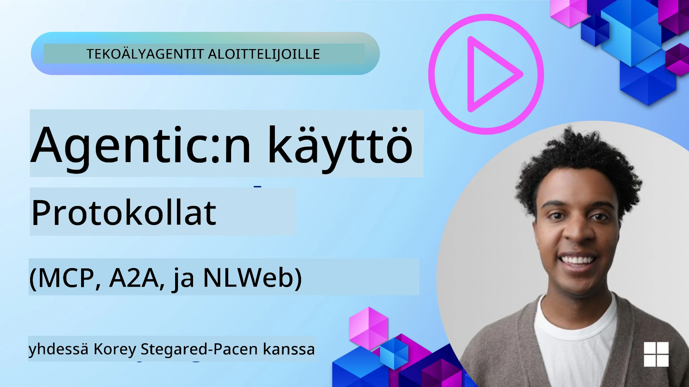
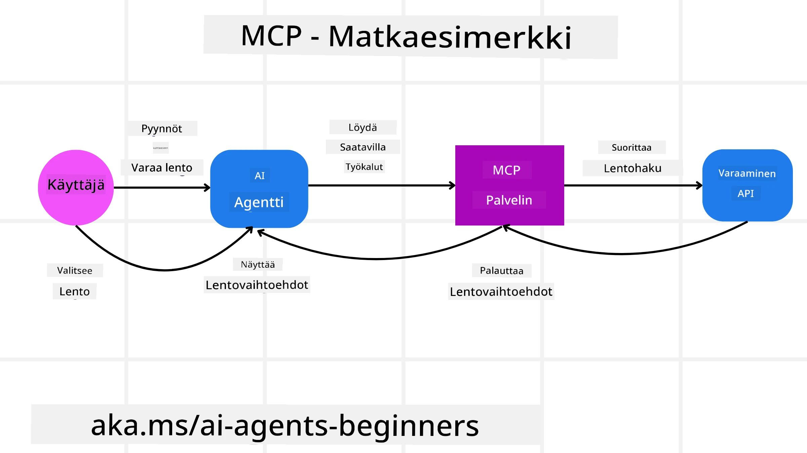
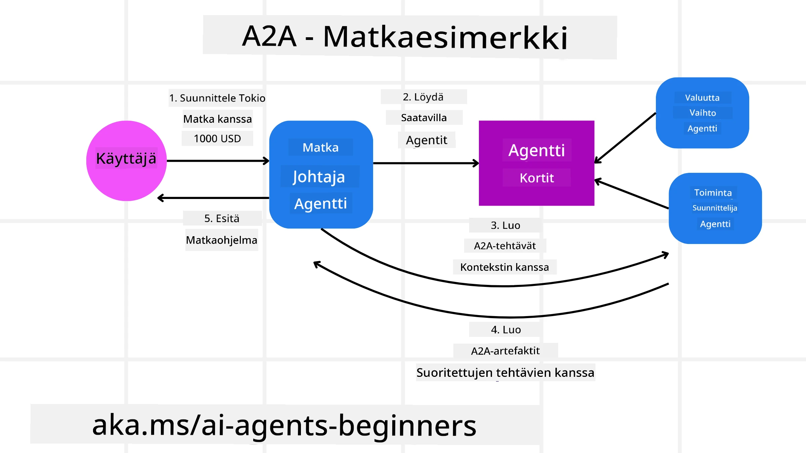
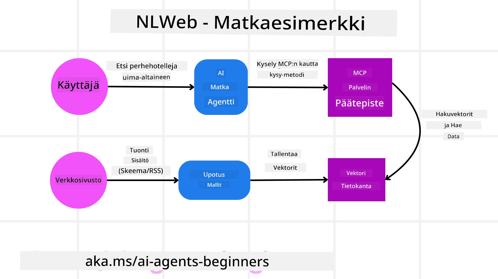

<!--
CO_OP_TRANSLATOR_METADATA:
{
  "original_hash": "aff92c6f019b4627ca9399c6e3882e17",
  "translation_date": "2025-09-18T15:08:59+00:00",
  "source_file": "11-agentic-protocols/README.md",
  "language_code": "fi"
}
-->
# Agenttisten protokollien käyttö (MCP, A2A ja NLWeb)

> _(Klikkaa yllä olevaa kuvaa nähdäksesi tämän oppitunnin videon)_

Kun tekoälyagenttien käyttö kasvaa, myös tarve protokollille, jotka varmistavat standardoinnin, turvallisuuden ja tukevat avointa innovaatiota, kasvaa. Tässä oppitunnissa käsittelemme kolmea protokollaa, jotka pyrkivät vastaamaan tähän tarpeeseen: Model Context Protocol (MCP), Agent to Agent (A2A) ja Natural Language Web (NLWeb).

## Johdanto

Tässä oppitunnissa käsitellään:

• Kuinka **MCP** mahdollistaa tekoälyagenttien pääsyn ulkoisiin työkaluihin ja tietoihin käyttäjän tehtävien suorittamiseksi.

• Kuinka **A2A** mahdollistaa viestinnän ja yhteistyön eri tekoälyagenttien välillä.

• Kuinka **NLWeb** tuo luonnollisen kielen käyttöliittymät mihin tahansa verkkosivustoon, mahdollistaen tekoälyagenttien sisällön löytämisen ja vuorovaikutuksen sen kanssa.

## Oppimistavoitteet

• **Tunnista** MCP:n, A2A:n ja NLWebin keskeinen tarkoitus ja hyödyt tekoälyagenttien kontekstissa.

• **Selitä**, kuinka kukin protokolla helpottaa viestintää ja vuorovaikutusta LLM:ien, työkalujen ja muiden agenttien välillä.

• **Tunnista** kunkin protokollan erilliset roolit monimutkaisten agenttijärjestelmien rakentamisessa.

## Model Context Protocol

**Model Context Protocol (MCP)** on avoin standardi, joka tarjoaa yhtenäisen tavan sovelluksille tarjota kontekstia ja työkaluja LLM:ille. Tämä mahdollistaa "universaalin sovittimen" eri tietolähteille ja työkaluille, joihin tekoälyagentit voivat yhdistyä johdonmukaisella tavalla.

Katsotaan MCP:n komponentteja, sen etuja verrattuna suoraan API:n käyttöön ja esimerkkiä siitä, kuinka tekoälyagentit voivat käyttää MCP-palvelinta.

### MCP:n keskeiset komponentit

MCP toimii **asiakas-palvelin-arkkitehtuurilla**, ja sen keskeiset komponentit ovat:

• **Isännät** ovat LLM-sovelluksia (esimerkiksi koodieditori kuten VSCode), jotka aloittavat yhteydet MCP-palvelimeen.

• **Asiakkaat** ovat isäntäsovelluksen komponentteja, jotka ylläpitävät yksi-yhteen-yhteyksiä palvelimiin.

• **Palvelimet** ovat kevyitä ohjelmia, jotka tarjoavat tiettyjä ominaisuuksia.

Protokollaan sisältyy kolme keskeistä perusominaisuutta, jotka ovat MCP-palvelimen kyvykkyyksiä:

• **Työkalut**: Nämä ovat yksittäisiä toimintoja tai tehtäviä, joita tekoälyagentti voi kutsua suorittaakseen toiminnon. Esimerkiksi säätietopalvelu voi tarjota "hae sää" -työkalun, tai verkkokaupan palvelin voi tarjota "osta tuote" -työkalun. MCP-palvelimet ilmoittavat kunkin työkalun nimen, kuvauksen ja syöte/tuloste-skeeman kyvykkyysluettelossaan.

• **Resurssit**: Nämä ovat vain luku -tietoja tai dokumentteja, joita MCP-palvelin voi tarjota, ja asiakkaat voivat hakea niitä tarpeen mukaan. Esimerkkejä ovat tiedostosisällöt, tietokantatiedot tai lokitiedostot. Resurssit voivat olla tekstiä (kuten koodia tai JSONia) tai binäärimuotoisia (kuten kuvia tai PDF:iä).

• **Kehoitukset**: Nämä ovat ennalta määriteltyjä malleja, jotka tarjoavat ehdotettuja kehoituksia, mahdollistaen monimutkaisempia työnkulkuja.

### MCP:n hyödyt

MCP tarjoaa merkittäviä etuja tekoälyagenteille:

• **Dynaaminen työkalujen löytäminen**: Agentit voivat dynaamisesti vastaanottaa luettelon saatavilla olevista työkaluista palvelimelta sekä kuvaukset niiden toiminnasta. Tämä eroaa perinteisistä API:ista, jotka usein vaativat staattista koodausta integraatioille, mikä tarkoittaa, että API-muutokset edellyttävät koodipäivityksiä. MCP tarjoaa "integroi kerran" -lähestymistavan, mikä lisää mukautuvuutta.

• **Yhteentoimivuus eri LLM:ien välillä**: MCP toimii eri LLM:ien kanssa, tarjoten joustavuutta vaihtaa keskeisiä malleja paremman suorituskyvyn arvioimiseksi.

• **Standardoitu turvallisuus**: MCP sisältää standardoidun todennusmenetelmän, mikä parantaa skaalautuvuutta lisättäessä pääsyä MCP-palvelimiin. Tämä on yksinkertaisempaa kuin hallita eri avaimia ja todennustyyppejä eri perinteisille API:ille.

### MCP-esimerkki

Kuvitellaan, että käyttäjä haluaa varata lennon tekoälyavustajan avulla, joka käyttää MCP:tä.

1. **Yhteys**: Tekoälyavustaja (MCP-asiakas) yhdistyy lentoyhtiön tarjoamaan MCP-palvelimeen.

2. **Työkalujen löytäminen**: Asiakas kysyy lentoyhtiön MCP-palvelimelta: "Mitä työkaluja teillä on saatavilla?" Palvelin vastaa työkaluilla, kuten "etsi lentoja" ja "varaa lentoja".

3. **Työkalun kutsuminen**: Käyttäjä pyytää tekoälyavustajaa: "Etsi lento Portlandista Honoluluun." Tekoälyavustaja, käyttäen LLM:äänsä, tunnistaa, että sen täytyy kutsua "etsi lentoja" -työkalu ja välittää asiaankuuluvat parametrit (lähtöpaikka, kohde) MCP-palvelimelle.

4. **Suoritus ja vastaus**: MCP-palvelin, joka toimii kääreenä, tekee varsinaisen kutsun lentoyhtiön sisäiseen varaus-API:iin. Se vastaanottaa lentotiedot (esim. JSON-dataa) ja lähettää ne takaisin tekoälyavustajalle.

5. **Lisävuorovaikutus**: Tekoälyavustaja esittää lentovaihtoehdot. Kun käyttäjä valitsee lennon, avustaja voi kutsua "varaa lento" -työkalun samalla MCP-palvelimella, viimeistellen varauksen.

## Agent-to-Agent Protocol (A2A)

Kun MCP keskittyy LLM:ien yhdistämiseen työkaluihin, **Agent-to-Agent (A2A) -protokolla** vie sen askeleen pidemmälle mahdollistamalla viestinnän ja yhteistyön eri tekoälyagenttien välillä. A2A yhdistää tekoälyagentit eri organisaatioiden, ympäristöjen ja teknologioiden välillä yhteisen tehtävän suorittamiseksi.

Tarkastelemme A2A:n komponentteja ja hyötyjä sekä esimerkkiä siitä, kuinka sitä voitaisiin soveltaa matkailusovelluksessamme.

### A2A:n keskeiset komponentit

A2A keskittyy mahdollistamaan viestinnän agenttien välillä ja saamaan ne työskentelemään yhdessä käyttäjän alitehtävän suorittamiseksi. Jokainen protokollan komponentti edistää tätä:

#### Agenttikortti

Samoin kuin MCP-palvelin jakaa työkaluluettelon, agenttikortti sisältää:
- Agentin nimi.
- **Yleinen kuvaus tehtävistä**, joita se suorittaa.
- **Luettelo erityisosaamisista** kuvauksineen, jotka auttavat muita agentteja (tai jopa ihmiskäyttäjiä) ymmärtämään, milloin ja miksi he haluaisivat kutsua kyseistä agenttia.
- Agentin **nykyinen päätepiste-URL**.
- Agentin **versio** ja **kyvykkyydet**, kuten suoratoistovastaukset ja push-ilmoitukset.

#### Agentin suorittaja

Agentin suorittaja vastaa **käyttäjän keskustelun kontekstin välittämisestä etäagentille**, jotta etäagentti ymmärtää tehtävän, joka täytyy suorittaa. A2A-palvelimessa agentti käyttää omaa Large Language Model (LLM) -malliaan saapuvien pyyntöjen jäsentämiseen ja tehtävien suorittamiseen omilla sisäisillä työkaluillaan.

#### Artefakti

Kun etäagentti on suorittanut pyydetyn tehtävän, sen työn tulos luodaan artefaktina. Artefakti **sisältää agentin työn tuloksen**, **kuvauksen siitä, mitä tehtiin**, ja **tekstikontekstin**, joka lähetetään protokollan kautta. Kun artefakti on lähetetty, yhteys etäagenttiin suljetaan, kunnes sitä tarvitaan uudelleen.

#### Tapahtumajono

Tätä komponenttia käytetään **päivitysten käsittelyyn ja viestien välittämiseen**. Se on erityisen tärkeä tuotantokäytössä agenttijärjestelmissä, jotta agenttien välinen yhteys ei sulkeudu ennen tehtävän valmistumista, erityisesti silloin, kun tehtävän suorittaminen voi kestää kauemmin.

### A2A:n hyödyt

• **Parannettu yhteistyö**: Mahdollistaa eri toimittajien ja alustojen agenttien vuorovaikutuksen, kontekstin jakamisen ja yhteistyön, helpottaen saumattoman automaation perinteisesti erillisten järjestelmien välillä.

• **Mallin valinnan joustavuus**: Jokainen A2A-agentti voi päättää, mitä LLM:ää se käyttää pyyntöjen käsittelyyn, mahdollistaen optimoidut tai hienosäädetyt mallit agenttia kohden, toisin kuin yksittäinen LLM-yhteys joissakin MCP-skenaarioissa.

• **Sisäänrakennettu todennus**: Todennus on integroitu suoraan A2A-protokollaan, tarjoten vahvan turvallisuuskehyksen agenttien väliselle vuorovaikutukselle.

### A2A-esimerkki

Laajennetaan matkavarauksen skenaariota, mutta tällä kertaa käytetään A2A:ta.

1. **Käyttäjän pyyntö monialustaiselle agentille**: Käyttäjä vuorovaikuttaa "Matka-agentti" A2A-asiakkaan/agentin kanssa, esimerkiksi sanomalla: "Varaa koko matka Honoluluun ensi viikoksi, mukaan lukien lennot, hotelli ja vuokra-auto."

2. **Matka-agentin orkestrointi**: Matka-agentti vastaanottaa tämän monimutkaisen pyynnön. Se käyttää LLM:äänsä tehtävän järkeistämiseen ja päättää, että sen täytyy vuorovaikuttaa muiden erikoistuneiden agenttien kanssa.

3. **Agenttien välinen viestintä**: Matka-agentti käyttää A2A-protokollaa yhdistyäkseen alaspäin oleviin agentteihin, kuten "Lentoyhtiö-agentti", "Hotelli-agentti" ja "Autovuokraamo-agentti", jotka on luotu eri yritysten toimesta.

4. **Delegoitu tehtävän suorittaminen**: Matka-agentti lähettää erityisiä tehtäviä näille erikoistuneille agenteille (esim. "Etsi lentoja Honoluluun", "Varaa hotelli", "Vuokraa auto"). Kukin näistä erikoistuneista agenteista, jotka käyttävät omia LLM:iään ja omia työkalujaan (jotka voivat olla MCP-palvelimia), suorittaa oman osansa varauksesta.

5. **Yhdistetty vastaus**: Kun kaikki alaspäin olevat agentit suorittavat tehtävänsä, matka-agentti kokoaa tulokset (lentotiedot, hotellivahvistus, autonvuokrausvaraus) ja lähettää kattavan, keskustelutyylisen vastauksen takaisin käyttäjälle.

## Natural Language Web (NLWeb)

Verkkosivustot ovat pitkään olleet ensisijainen tapa käyttäjille päästä käsiksi tietoihin ja dataan internetissä.

Katsotaan NLWebin eri komponentteja, sen hyötyjä ja esimerkkiä siitä, kuinka NLWeb toimii tarkastelemalla matkailusovellustamme.

### NLWebin komponentit

- **NLWeb-sovellus (ydinkoodipalvelu)**: Järjestelmä, joka käsittelee luonnollisen kielen kysymyksiä. Se yhdistää alustan eri osat luodakseen vastauksia. Voit ajatella sitä verkkosivuston luonnollisen kielen ominaisuuksien **moottorina**.

- **NLWeb-protokolla**: Tämä on **yksinkertainen sääntöjoukko luonnollisen kielen vuorovaikutukselle** verkkosivuston kanssa. Se lähettää vastaukset JSON-muodossa (usein käyttäen Schema.orgia). Sen tarkoitus on luoda yksinkertainen perusta "AI-verkolle", samalla tavalla kuin HTML mahdollisti dokumenttien jakamisen verkossa.

- **MCP-palvelin (Model Context Protocol -päätepiste)**: Jokainen NLWeb-asennus toimii myös **MCP-palvelimena**. Tämä tarkoittaa, että se voi **jakaa työkaluja (kuten "kysy"-menetelmä) ja dataa** muiden tekoälyjärjestelmien kanssa. Käytännössä tämä tekee verkkosivuston sisällöstä ja kyvyistä käytettävissä olevia tekoälyagenteille, mahdollistaen sivuston osaksi laajempaa "agenttiekosysteemiä".

- **Upotusmallit**: Näitä malleja käytetään **muuntamaan verkkosivuston sisältö numeerisiksi esityksiksi, joita kutsutaan vektoreiksi** (upotukset). Nämä vektorit tallentavat merkityksen tavalla, jota tietokoneet voivat verrata ja hakea. Ne tallennetaan erityiseen tietokantaan, ja käyttäjät voivat valita, mitä upotusmallia he haluavat käyttää.

- **Vektoripohjainen tietokanta (hakumekanismi)**: Tämä tietokanta **tallentaa verkkosivuston sisällön upotukset**. Kun joku esittää kysymyksen, NLWeb tarkistaa vektoripohjaisen tietokannan löytääkseen nopeasti relevanttia tietoa. Se antaa nopean listan mahdollisista vastauksista, järjestettynä samankaltaisuuden mukaan. NLWeb toimii eri vektorivarastojärjestelmien kanssa, kuten Qdrant, Snowflake, Milvus, Azure AI Search ja Elasticsearch.

### NLWeb esimerkin avulla

Tarkastellaan matkailuvarauksen verkkosivustoa, mutta tällä kertaa se on NLWebin voimin.

1. **Datan syöttäminen**: Matkailusivuston olemassa olevat tuotekatalogit (esim. lentolistaukset, hotellikuvaukset, matkailupaketit) muotoillaan Schema.orgin avulla tai ladataan RSS-syötteiden kautta. NLWebin työkalut syöttävät tämän rakenteellisen datan, luovat upotuksia ja tallentavat ne paikalliseen tai etävektoritietokantaan.

2. **Luonnollisen kielen kysely (ihminen)**: Käyttäjä vierailee verkkosivustolla ja kirjoittaa chat-käyttöliittymään: "Etsi perheystävällinen hotelli Honolulussa, jossa on uima-allas ensi viikoksi."

3. **NLWebin käsittely**: NLWeb-sovellus vastaanottaa tämän kyselyn. Se lähettää kyselyn LLM:lle ymmärtämistä varten ja samanaikaisesti etsii vektoripohjaisesta tietokannastaan relevantteja hotellilistauksia.

4. **Tarkat tulokset**: LLM auttaa tulkitsemaan hakutulokset tietokannasta, tunnistamaan parhaat osumat "perheystävällinen", "uima-allas" ja "Honolulu" -kriteerien perusteella, ja muotoilee luonnollisen kielen vastauksen. Tärkeää on, että vastaus viittaa verkkosivuston todellisiin hotelleihin, välttäen keksittyä tietoa.

5. **Tekoälyagentin vuorovaikutus**: Koska NLWeb toimii MCP-palvelimena, ulkoinen tekoälymatka-agentti voisi myös yhdistyä tämän verkkosivuston NLWeb-instanssiin. Tekoälyagentti voisi käyttää `kysy` MCP-menetelmää kysyäkseen verkkosivustolta suoraan: `kysy("Onko Honolulun alueella vegaaniystävällisiä ravintoloita, joita hotelli suosittelee?")`. NLWeb-instanssi käsittelisi tämän, hyödyntäen tietokantaansa ravintolatiedosta (jos ladattu), ja palauttaisi rakenteellisen JSON-vastauksen.

### Onko sinulla lisää kysymyksiä MCP:stä, A2A:sta tai NLWebistä?

Liity [Azure AI Foundry Discordiin](https://aka.ms/ai-agents/discord) tapaamaan muita oppijoita, osallistumaan toimistoaikoihin ja saamaan

---

**Vastuuvapauslauseke**:  
Tämä asiakirja on käännetty käyttämällä tekoälypohjaista käännöspalvelua [Co-op Translator](https://github.com/Azure/co-op-translator). Vaikka pyrimme tarkkuuteen, huomioithan, että automaattiset käännökset voivat sisältää virheitä tai epätarkkuuksia. Alkuperäistä asiakirjaa sen alkuperäisellä kielellä tulisi pitää ensisijaisena lähteenä. Kriittisen tiedon osalta suositellaan ammattimaista ihmiskäännöstä. Emme ole vastuussa väärinkäsityksistä tai virhetulkinnoista, jotka johtuvat tämän käännöksen käytöstä.