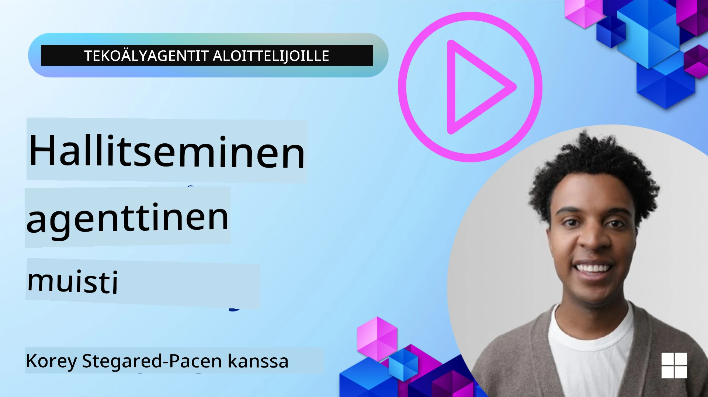

<!--
CO_OP_TRANSLATOR_METADATA:
{
  "original_hash": "a1d90991499ad697c4ad24decaf36968",
  "translation_date": "2025-12-09T12:29:29+00:00",
  "source_file": "13-agent-memory/README.md",
  "language_code": "fi"
}
-->
# Muisti tekoälyagenteille 

Kun puhutaan tekoälyagenttien ainutlaatuisista eduista, kaksi asiaa nousee usein esiin: kyky käyttää työkaluja tehtävien suorittamiseen ja kyky parantaa itseään ajan myötä. Muisti on keskeisessä roolissa itseään parantavien agenttien luomisessa, jotka voivat tarjota parempia kokemuksia käyttäjillemme.

Tässä oppitunnissa tarkastelemme, mitä muisti tarkoittaa tekoälyagenteille ja kuinka voimme hallita ja hyödyntää sitä sovellustemme hyväksi.

## Johdanto

Tämä oppitunti kattaa:

• **Tekoälyagenttien muistin ymmärtäminen**: Mitä muisti on ja miksi se on tärkeää agenteille.

• **Muistin toteuttaminen ja tallentaminen**: Käytännön menetelmiä muistikapasiteetin lisäämiseksi tekoälyagenteille, keskittyen lyhyt- ja pitkäkestoiseen muistiin.

• **Tekoälyagenttien itseoppiminen**: Kuinka muisti mahdollistaa oppimisen aiemmista vuorovaikutuksista ja parantumisen ajan myötä.

## Saatavilla olevat toteutukset

Tämä oppitunti sisältää kaksi kattavaa notebook-opasta:

• **[13-agent-memory.ipynb](./13-agent-memory.ipynb)**: Toteuttaa muistin Mem0:n ja Azure AI Searchin avulla Semantic Kernel -kehyksessä.

• **[13-agent-memory-cognee.ipynb](./13-agent-memory-cognee.ipynb)**: Toteuttaa rakenteellisen muistin Cognee-työkalulla, luoden automaattisesti tietämyskartan upotusten avulla, visualisoiden kartan ja mahdollistaen älykkään haun.

## Oppimistavoitteet

Oppitunnin jälkeen osaat:

• **Erotella erilaiset tekoälyagenttien muistityypit**, kuten työmuisti, lyhytkestoinen ja pitkäkestoinen muisti sekä erikoistuneet muodot, kuten persoonamuisti ja episodinen muisti.

• **Toteuttaa ja hallita lyhyt- ja pitkäkestoista muistia tekoälyagenteille** Semantic Kernel -kehyksen avulla, hyödyntäen työkaluja kuten Mem0, Cognee, Whiteboard-muisti ja integrointi Azure AI Searchin kanssa.

• **Ymmärtää itseään parantavien tekoälyagenttien periaatteet** ja kuinka vahvat muistinhallintajärjestelmät edistävät jatkuvaa oppimista ja sopeutumista.

## Tekoälyagenttien muistin ymmärtäminen

Ytimeltään **tekoälyagenttien muisti viittaa mekanismeihin, jotka mahdollistavat tiedon säilyttämisen ja muistamisen**. Tämä tieto voi olla yksityiskohtia keskustelusta, käyttäjän mieltymyksiä, aiempia toimia tai jopa opittuja kaavoja.

Ilman muistia tekoälysovellukset ovat usein tilattomia, mikä tarkoittaa, että jokainen vuorovaikutus alkaa alusta. Tämä johtaa toistuvaan ja turhauttavaan käyttäjäkokemukseen, jossa agentti "unohtaa" aiemman kontekstin tai mieltymykset.

### Miksi muisti on tärkeää?

Agentin älykkyys on tiiviisti sidoksissa sen kykyyn muistaa ja hyödyntää aiempaa tietoa. Muisti mahdollistaa, että agentit voivat olla:

• **Reflektiivisiä**: Oppia aiemmista toimista ja tuloksista.

• **Vuorovaikutteisia**: Säilyttää konteksti jatkuvan keskustelun aikana.

• **Proaktiivisia ja reaktiivisia**: Ennakoida tarpeita tai reagoida asianmukaisesti historiallisten tietojen perusteella.

• **Autonomisia**: Toimia itsenäisemmin hyödyntämällä tallennettua tietoa.

Muistin toteuttamisen tavoitteena on tehdä agenteista **luotettavampia ja kykenevämpiä**.

### Muistityypit

#### Työmuisti

Ajattele tätä kuin muistilappua, jota agentti käyttää yhden tehtävän tai ajatusprosessin aikana. Se sisältää välittömän tiedon, jota tarvitaan seuraavan askeleen laskemiseen.

Tekoälyagenteille työmuisti usein tallentaa keskustelun olennaisimmat tiedot, vaikka koko keskusteluhistoria olisi pitkä tai katkaistu. Se keskittyy keskeisten elementtien, kuten vaatimusten, ehdotusten, päätösten ja toimien, poimimiseen.

**Työmuistin esimerkki**

Matkavarausagentti voi tallentaa käyttäjän nykyisen pyynnön, kuten "Haluan varata matkan Pariisiin". Tämä erityinen vaatimus pidetään agentin välittömässä kontekstissa ohjaamaan nykyistä vuorovaikutusta.

#### Lyhytkestoinen muisti

Tämä muistityyppi säilyttää tiedon yhden keskustelun tai istunnon ajan. Se on nykyisen keskustelun konteksti, jonka avulla agentti voi viitata aiempiin vuoropuhelun osiin.

**Lyhytkestoisen muistin esimerkki**

Jos käyttäjä kysyy, "Paljonko lento Pariisiin maksaisi?" ja jatkaa "Entä majoitus siellä?", lyhytkestoinen muisti varmistaa, että agentti tietää "siellä" viittaavan "Pariisiin" saman keskustelun aikana.

#### Pitkäkestoinen muisti

Tämä on tietoa, joka säilyy useiden keskustelujen tai istuntojen yli. Se mahdollistaa agenttien muistavan käyttäjän mieltymykset, historialliset vuorovaikutukset tai yleisen tiedon pitkällä aikavälillä. Tämä on tärkeää personoinnin kannalta.

**Pitkäkestoisen muistin esimerkki**

Pitkäkestoinen muisti voi tallentaa, että "Ben pitää laskettelusta ja ulkoilusta, nauttii kahvista vuoristonäkymällä ja haluaa välttää vaativia laskettelurinteitä aiemman loukkaantumisen vuoksi". Tämä tieto, joka on opittu aiemmista vuorovaikutuksista, vaikuttaa tuleviin matkasuunnittelusuosituksiin, tehden niistä erittäin personoituja.

#### Persoonamuisti

Tämä erikoistunut muistityyppi auttaa agenttia kehittämään johdonmukaisen "persoonallisuuden" tai "roolin". Se mahdollistaa agentin muistavan yksityiskohtia itsestään tai tarkoitetusta roolistaan, tehden vuorovaikutuksesta sujuvampaa ja keskittyneempää.

**Persoonamuistin esimerkki**

Jos matkavarausagentti on suunniteltu olemaan "asiantuntija laskettelusuunnittelija", persoonamuisti voi vahvistaa tätä roolia, vaikuttaen sen vastauksiin asiantuntijan sävyllä ja tiedolla.

#### Työprosessi-/episodinen muisti

Tämä muisti tallentaa agentin suorittamien monimutkaisten tehtävien vaiheet, mukaan lukien onnistumiset ja epäonnistumiset. Se on kuin muistaisi tiettyjä "episodeja" tai aiempia kokemuksia oppiakseen niistä.

**Episodisen muistin esimerkki**

Jos agentti yritti varata tietyn lennon, mutta se epäonnistui saatavuuden puutteen vuoksi, episodinen muisti voisi tallentaa tämän epäonnistumisen, jolloin agentti voisi kokeilla vaihtoehtoisia lentoja tai tiedottaa käyttäjälle ongelmasta paremmin seuraavalla kerralla.

#### Entiteettimuisti

Tämä liittyy tiettyjen entiteettien (kuten ihmisten, paikkojen tai asioiden) ja tapahtumien poimimiseen ja muistamiseen keskusteluista. Se mahdollistaa agentin rakentaa rakenteellisen ymmärryksen keskusteltavista keskeisistä elementeistä.

**Entiteettimuistin esimerkki**

Keskustelusta aiemmasta matkasta agentti voisi poimia "Pariisi", "Eiffel-torni" ja "illallinen Le Chat Noir -ravintolassa" entiteetteinä. Tulevassa vuorovaikutuksessa agentti voisi muistaa "Le Chat Noir" ja tarjota tehdä uuden varauksen sinne.

#### Rakenteellinen RAG (Retrieval Augmented Generation)

Vaikka RAG on laajempi tekniikka, "Rakenteellinen RAG" korostuu tehokkaana muistiteknologiana. Se poimii tiivistä, rakenteellista tietoa eri lähteistä (keskustelut, sähköpostit, kuvat) ja käyttää sitä tarkkuuden, muistamisen ja nopeuden parantamiseen vastauksissa. Toisin kuin perinteinen RAG, joka perustuu pelkästään semanttiseen samankaltaisuuteen, Rakenteellinen RAG hyödyntää tiedon sisäistä rakennetta.

**Rakenteellisen RAG:n esimerkki**

Sen sijaan, että vain etsisi avainsanoja, Rakenteellinen RAG voisi analysoida lentotiedot (kohde, päivämäärä, aika, lentoyhtiö) sähköpostista ja tallentaa ne rakenteellisesti. Tämä mahdollistaa tarkat kyselyt, kuten "Minkä lennon varasin Pariisiin tiistaina?"

## Muistin toteuttaminen ja tallentaminen

Muistin toteuttaminen tekoälyagenteille sisältää systemaattisen **muistinhallintaprosessin**, joka kattaa tiedon luomisen, tallentamisen, hakemisen, integroinnin, päivittämisen ja jopa "unohtamisen" (tai poistamisen). Hakeminen on erityisen tärkeä osa.

### Erikoistuneet muistityökalut

#### Mem0

Yksi tapa tallentaa ja hallita agentin muistia on käyttää erikoistuneita työkaluja, kuten Mem0. Mem0 toimii pysyvänä muistikerroksena, joka mahdollistaa agenttien muistaa olennaiset vuorovaikutukset, tallentaa käyttäjän mieltymykset ja faktuaalisen kontekstin sekä oppia onnistumisista ja epäonnistumisista ajan myötä. Ajatuksena on, että tilattomat agentit muuttuvat tilallisiksi.

Se toimii **kaksivaiheisella muistiputkella: poiminta ja päivitys**. Ensin agentin ketjuun lisätyt viestit lähetetään Mem0-palveluun, joka käyttää suurta kielimallia (LLM) keskusteluhistorian tiivistämiseen ja uusien muistojen poimimiseen. Tämän jälkeen LLM-vetoinen päivitysvaihe päättää, lisätäänkö, muokataanko vai poistetaanko nämä muistot, tallentaen ne hybriditietokantaan, joka voi sisältää vektori-, graafi- ja avain-arvotietokantoja. Tämä järjestelmä tukee myös erilaisia muistityyppejä ja voi sisältää graafimuistin entiteettien välisten suhteiden hallintaan.

#### Cognee

Toinen tehokas lähestymistapa on käyttää **Cognee-työkalua**, avointa semanttista muistia tekoälyagenteille, joka muuntaa rakenteellisen ja rakenteettoman datan kyseltäviksi tietämyskartoiksi upotusten avulla. Cognee tarjoaa **kaksoistallennusarkkitehtuurin**, joka yhdistää vektorisimilaarisuushaun ja graafisuhteet, mahdollistaen agenttien ymmärtää paitsi mikä tieto on samanlaista, myös miten käsitteet liittyvät toisiinsa.

Se loistaa **hybridihakujen** avulla, jotka yhdistävät vektorisimilaarisuuden, graafirakenteen ja LLM-päättelyn – raakadatasta graafitietoiseen kysymysten ratkaisuun. Järjestelmä ylläpitää **elävää muistia**, joka kehittyy ja kasvaa pysyen samalla kyseltävissä yhtenäisenä graafina, tukien sekä lyhytaikaista istuntokontekstia että pitkäaikaista pysyvää muistia.

Cognee-notebook-opas ([13-agent-memory-cognee.ipynb](./13-agent-memory-cognee.ipynb)) esittelee tämän yhtenäisen muistikerroksen rakentamisen käytännön esimerkein, kuten monipuolisten tietolähteiden syöttämisen, tietämyskartan visualisoinnin ja erilaisten hakustrategioiden hyödyntämisen agentin tarpeisiin.

### Muistin tallentaminen RAG:n avulla

Erikoistuneiden muistityökalujen, kuten Mem0:n, lisäksi voit hyödyntää vankkoja hakupalveluita, kuten **Azure AI Searchia muistien tallentamiseen ja hakemiseen**, erityisesti rakenteellista RAG:ia varten.

Tämä mahdollistaa agentin vastausten perustamisen omaan dataasi, varmistaen relevantimmat ja tarkemmat vastaukset. Azure AI Searchia voidaan käyttää tallentamaan käyttäjäkohtaisia matkamuistoja, tuotekatalogeja tai mitä tahansa muuta alakohtaista tietoa.

Azure AI Search tukee ominaisuuksia, kuten **Rakenteellinen RAG**, joka loistaa tiiviin, rakenteellisen tiedon poimimisessa ja hakemisessa suurista tietoaineistoista, kuten keskusteluhistorioista, sähköposteista tai jopa kuvista. Tämä tarjoaa "yliluonnollista tarkkuutta ja muistamista" verrattuna perinteisiin tekstin pilkkomis- ja upotusmenetelmiin.

## Tekoälyagenttien itseoppiminen

Yleinen kaava itseään parantaville agenteille sisältää **"tietoagentin"** käyttöönoton. Tämä erillinen agentti tarkkailee pääkeskustelua käyttäjän ja ensisijaisen agentin välillä. Sen rooli on:

1. **Tunnistaa arvokas tieto**: Päätellä, onko keskustelun osassa jotain, joka kannattaa tallentaa yleisenä tietona tai käyttäjän erityisenä mieltymyksenä.

2. **Poimia ja tiivistää**: Tislaa keskustelusta olennaiset opit tai mieltymykset.

3. **Tallentaa tietokantaan**: Säilyttää poimittu tieto, usein vektoripohjaisessa tietokannassa, jotta se voidaan hakea myöhemmin.

4. **Laajentaa tulevia kyselyitä**: Kun käyttäjä aloittaa uuden kyselyn, tietoagentti hakee relevantin tallennetun tiedon ja liittää sen käyttäjän pyyntöön, tarjoten tärkeän kontekstin ensisijaiselle agentille (samanlainen kuin RAG).

### Muistin optimoinnit

• **Viiveen hallinta**: Välttääkseen käyttäjävuorovaikutusten hidastumista, voidaan aluksi käyttää halvempaa ja nopeampaa mallia tarkistamaan nopeasti, onko tieto arvokasta tallennettavaksi tai haettavaksi, ja käyttää monimutkaisempaa poiminta-/hakuprosessia vain tarvittaessa.

• **Tietokannan ylläpito**: Kasvavassa tietokannassa harvemmin käytetty tieto voidaan siirtää "kylmäsäilytykseen" kustannusten hallitsemiseksi.

## Onko sinulla lisää kysymyksiä agentin muistista?

Liity [Azure AI Foundry Discordiin](https://aka.ms/ai-agents/discord) tapaamaan muita oppijoita, osallistumaan toimistotunteihin ja saamaan vastauksia tekoälyagentteihin liittyviin kysymyksiisi.

---

<!-- CO-OP TRANSLATOR DISCLAIMER START -->
**Vastuuvapauslauseke**:  
Tämä asiakirja on käännetty käyttämällä tekoälypohjaista käännöspalvelua [Co-op Translator](https://github.com/Azure/co-op-translator). Vaikka pyrimme tarkkuuteen, huomioithan, että automaattiset käännökset voivat sisältää virheitä tai epätarkkuuksia. Alkuperäinen asiakirja sen alkuperäisellä kielellä tulisi pitää ensisijaisena lähteenä. Tärkeissä tiedoissa suositellaan ammattimaista ihmiskäännöstä. Emme ole vastuussa väärinkäsityksistä tai virhetulkinnoista, jotka johtuvat tämän käännöksen käytöstä.
<!-- CO-OP TRANSLATOR DISCLAIMER END -->