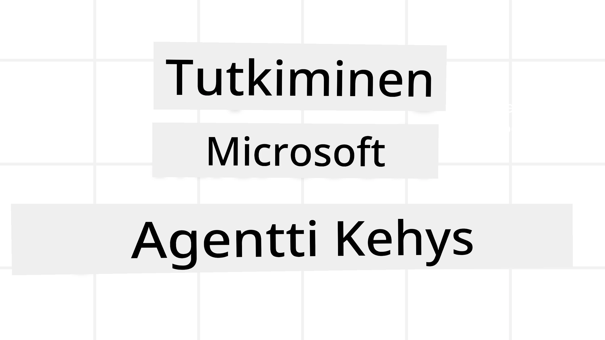
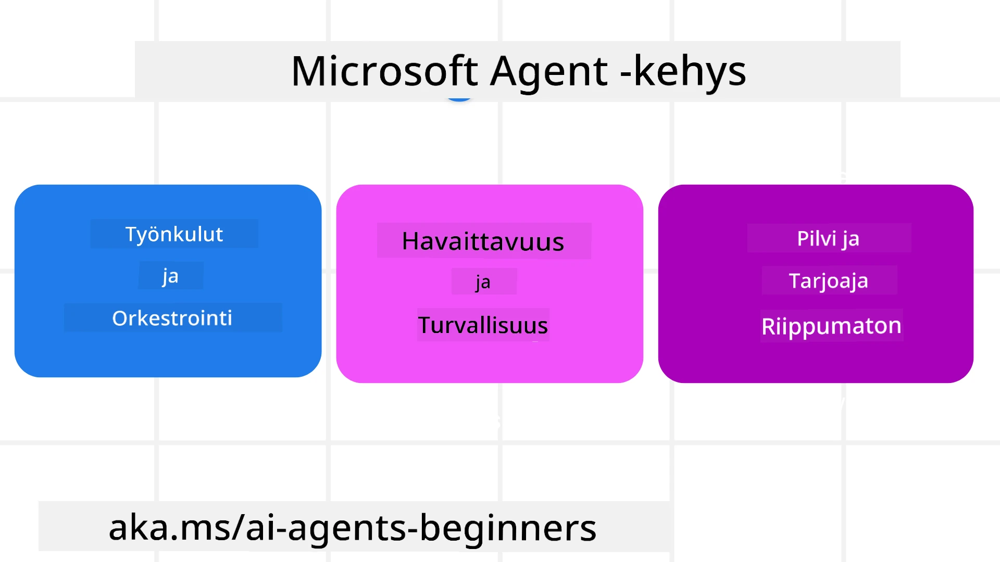
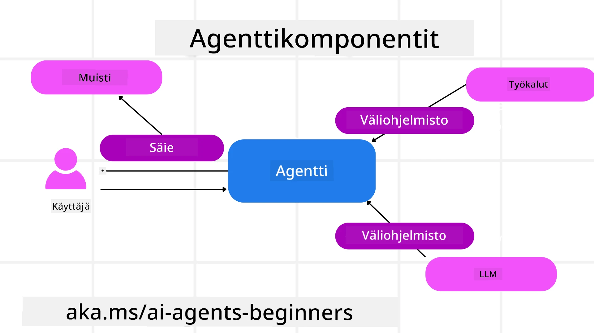

<!--
CO_OP_TRANSLATOR_METADATA:
{
  "original_hash": "19c4dab375acbc733855cc7f2f04edbc",
  "translation_date": "2025-10-02T17:25:12+00:00",
  "source_file": "14-microsoft-agent-framework/README.md",
  "language_code": "fi"
}
-->
# Microsoft Agent Frameworkin tutkiminen



### Johdanto

Tässä oppitunnissa käsitellään:

- Microsoft Agent Frameworkin ymmärtäminen: keskeiset ominaisuudet ja arvot  
- Microsoft Agent Frameworkin keskeisten käsitteiden tutkiminen
- MAF:n vertailu Semantic Kernel- ja AutoGen-tekniikoihin: siirtymisopas

## Oppimistavoitteet

Oppitunnin jälkeen osaat:

- Rakentaa tuotantovalmiita tekoälyagentteja Microsoft Agent Frameworkin avulla
- Soveltaa Microsoft Agent Frameworkin keskeisiä ominaisuuksia agenttipohjaisiin käyttötapauksiisi
- Siirtää ja integroida olemassa olevia agenttipohjaisia kehyksiä ja työkaluja  

## Koodiesimerkit 

Koodiesimerkit [Microsoft Agent Frameworkista (MAF)](https://aka.ms/ai-agents-beginners/agent-framewrok) löytyvät tästä repositoriosta `xx-python-agent-framework`- ja `xx-dotnet-agent-framework`-tiedostoista.

## Microsoft Agent Frameworkin ymmärtäminen



[Microsoft Agent Framework (MAF)](https://aka.ms/ai-agents-beginners/agent-framewrok) perustuu Semantic Kernel- ja AutoGen-tekniikoista saatuun kokemukseen ja oppimiseen. Se tarjoaa joustavuutta monenlaisten agenttipohjaisten käyttötapausten käsittelyyn sekä tuotanto- että tutkimusympäristöissä, mukaan lukien:

- **Peräkkäinen agenttien orkestrointi** tilanteissa, joissa tarvitaan vaiheittaisia työnkulkuja.
- **Samanaikainen orkestrointi** tilanteissa, joissa agenttien on suoritettava tehtäviä yhtä aikaa.
- **Ryhmäkeskustelun orkestrointi** tilanteissa, joissa agentit voivat tehdä yhteistyötä yhden tehtävän parissa.
- **Tehtävän siirto orkestrointi** tilanteissa, joissa agentit siirtävät tehtävän toisilleen, kun alatehtävät on suoritettu.
- **Magneettinen orkestrointi** tilanteissa, joissa hallinta-agentti luo ja muokkaa tehtävälistaa sekä koordinoi ala-agenttien toimintaa tehtävän suorittamiseksi.

Tuotantovalmiiden tekoälyagenttien toimittamiseksi MAF sisältää myös ominaisuuksia, kuten:

- **Havainnointi** OpenTelemetryn avulla, jossa tekoälyagentin kaikki toiminnot, kuten työkalujen käyttö, orkestrointivaiheet, päättelyprosessit ja suorituskyvyn seuranta, näkyvät Azure AI Foundry -koontinäytöissä.
- **Turvallisuus** isännöimällä agentteja natiivisti Azure AI Foundryssa, joka sisältää turvallisuuskontrollit, kuten roolipohjaisen pääsyn, yksityisten tietojen käsittelyn ja sisäänrakennetun sisällön turvallisuuden.
- **Kestävyys** agenttiketjujen ja työnkulkujen avulla, jotka voivat keskeyttää, jatkaa ja palautua virheistä, mikä mahdollistaa pitkäkestoiset prosessit.
- **Hallinta** ihmisen osallistumisen tukeminen työnkuluissa, joissa tehtävät merkitään vaativiksi ihmisen hyväksynnän.

Microsoft Agent Framework keskittyy myös yhteentoimivuuteen:

- **Pilvistä riippumattomuus** - Agentit voivat toimia konteissa, paikallisesti ja eri pilvipalveluissa.
- **Palveluntarjoajasta riippumattomuus** - Agentit voidaan luoda haluamallasi SDK:lla, mukaan lukien Azure OpenAI ja OpenAI.
- **Avoimien standardien integrointi** - Agentit voivat hyödyntää protokollia, kuten Agent-to-Agent (A2A) ja Model Context Protocol (MCP), löytääkseen ja käyttääkseen muita agentteja ja työkaluja.
- **Liitännäiset ja liittimet** - Yhteyksiä voidaan luoda data- ja muistipalveluihin, kuten Microsoft Fabric, SharePoint, Pinecone ja Qdrant.

Tarkastellaan, miten nämä ominaisuudet soveltuvat Microsoft Agent Frameworkin keskeisiin käsitteisiin.

## Microsoft Agent Frameworkin keskeiset käsitteet

### Agentit



**Agenttien luominen**

Agenttien luominen tapahtuu määrittämällä päättelypalvelu (LLM Provider), joukko ohjeita tekoälyagentille ja sille annettu `nimi`:

```python
agent = AzureOpenAIChatClient(credential=AzureCliCredential()).create_agent( instructions="You are good at recommending trips to customers based on their preferences.", name="TripRecommender" )
```

Yllä käytetään `Azure OpenAI`:ta, mutta agentteja voidaan luoda monilla eri palveluilla, mukaan lukien `Azure AI Foundry Agent Service`:

```python
AzureAIAgentClient(async_credential=credential).create_agent( name="HelperAgent", instructions="You are a helpful assistant." ) as agent
```

OpenAI:n `Responses`, `ChatCompletion` API:t

```python
agent = OpenAIResponsesClient().create_agent( name="WeatherBot", instructions="You are a helpful weather assistant.", )
```

```python
agent = OpenAIChatClient().create_agent( name="HelpfulAssistant", instructions="You are a helpful assistant.", )
```

tai etäagentit A2A-protokollan avulla:

```python
agent = A2AAgent( name=agent_card.name, description=agent_card.description, agent_card=agent_card, url="https://your-a2a-agent-host" )
```

**Agenttien suorittaminen**

Agentteja suoritetaan `.run`- tai `.run_stream`-menetelmillä joko ei-virtaaville tai virtaaville vastauksille.

```python
result = await agent.run("What are good places to visit in Amsterdam?")
print(result.text)
```

```python
async for update in agent.run_stream("What are the good places to visit in Amsterdam?"):
    if update.text:
        print(update.text, end="", flush=True)

```

Jokaisella agentin suorituksella voi myös olla vaihtoehtoja mukauttaa parametreja, kuten agentin käyttämät `max_tokens`, agentin käytettävissä olevat `tools` ja jopa agentin käyttämä `model`.

Tämä on hyödyllistä tilanteissa, joissa tiettyjä malleja tai työkaluja tarvitaan käyttäjän tehtävän suorittamiseen.

**Työkalut**

Työkalut voidaan määrittää sekä agenttia määritettäessä:

```python
def get_attractions( location: Annotated[str, Field(description="The location to get the top tourist attractions for")], ) -> str: """Get the top tourist attractions for a given location.""" return f"The top attractions for {location} are." 


# When creating a ChatAgent directly 

agent = ChatAgent( chat_client=OpenAIChatClient(), instructions="You are a helpful assistant", tools=[get_attractions]

```

että myös agenttia suoritettaessa:

```python

result1 = await agent.run( "What's the best place to visit in Seattle?", tools=[get_attractions] # Tool provided for this run only )
```

**Agenttiketjut**

Agenttiketjuja käytetään monikierroksisten keskustelujen käsittelyyn. Ketjuja voidaan luoda joko:

- Käyttämällä `get_new_thread()`, joka mahdollistaa ketjun tallentamisen ajan myötä.
- Luomalla ketju automaattisesti agenttia suoritettaessa, jolloin ketju kestää vain nykyisen suorituksen ajan.

Ketjun luominen näyttää tältä:

```python
# Create a new thread. 
thread = agent.get_new_thread() # Run the agent with the thread. 
response = await agent.run("Hello, I am here to help you book travel. Where would you like to go?", thread=thread)

```

Ketju voidaan sitten sarjoittaa myöhempää käyttöä varten:

```python
# Create a new thread. 
thread = agent.get_new_thread() 

# Run the agent with the thread. 

response = await agent.run("Hello, how are you?", thread=thread) 

# Serialize the thread for storage. 

serialized_thread = await thread.serialize() 

# Deserialize the thread state after loading from storage. 

resumed_thread = await agent.deserialize_thread(serialized_thread)
```

**Agenttien välimuisti**

Agentit vuorovaikuttavat työkalujen ja LLM:ien kanssa käyttäjän tehtävien suorittamiseksi. Tietyissä tilanteissa haluamme suorittaa tai seurata toimintoja näiden vuorovaikutusten välillä. Agenttien välimuisti mahdollistaa tämän seuraavasti:

*Toimintovälimuisti*

Tämä välimuisti mahdollistaa toiminnon suorittamisen agentin ja sen kutsuman työkalun välillä. Esimerkki käytöstä voisi olla lokituksen tekeminen työkalukutsusta.

Alla olevassa koodissa `next` määrittää, kutsutaanko seuraava välimuisti vai varsinainen toiminto.

```python
async def logging_function_middleware(
    context: FunctionInvocationContext,
    next: Callable[[FunctionInvocationContext], Awaitable[None]],
) -> None:
    """Function middleware that logs function execution."""
    # Pre-processing: Log before function execution
    print(f"[Function] Calling {context.function.name}")

    # Continue to next middleware or function execution
    await next(context)

    # Post-processing: Log after function execution
    print(f"[Function] {context.function.name} completed")
```

*Keskusteluvälimuisti*

Tämä välimuisti mahdollistaa toiminnon suorittamisen tai lokituksen agentin ja LLM:n välisten pyyntöjen välillä.

Tämä sisältää tärkeää tietoa, kuten tekoälypalvelulle lähetettävät `messages`.

```python
async def logging_chat_middleware(
    context: ChatContext,
    next: Callable[[ChatContext], Awaitable[None]],
) -> None:
    """Chat middleware that logs AI interactions."""
    # Pre-processing: Log before AI call
    print(f"[Chat] Sending {len(context.messages)} messages to AI")

    # Continue to next middleware or AI service
    await next(context)

    # Post-processing: Log after AI response
    print("[Chat] AI response received")

```

**Agenttien muisti**

Kuten `Agentic Memory` -oppitunnissa käsiteltiin, muisti on tärkeä elementti, joka mahdollistaa agentin toiminnan eri konteksteissa. MAF tarjoaa useita erilaisia muistityyppejä:

*Muisti sovelluksen aikana*

Tämä muisti tallennetaan ketjuihin sovelluksen suoritusajan aikana.

```python
# Create a new thread. 
thread = agent.get_new_thread() # Run the agent with the thread. 
response = await agent.run("Hello, I am here to help you book travel. Where would you like to go?", thread=thread)
```

*Pysyvät viestit*

Tätä muistia käytetään keskusteluhistorian tallentamiseen eri istuntojen välillä. Se määritetään käyttämällä `chat_message_store_factory`:

```python
from agent_framework import ChatMessageStore

# Create a custom message store
def create_message_store():
    return ChatMessageStore()

agent = ChatAgent(
    chat_client=OpenAIChatClient(),
    instructions="You are a Travel assistant.",
    chat_message_store_factory=create_message_store
)

```

*Dynaaminen muisti*

Tämä muisti lisätään kontekstiin ennen agenttien suorittamista. Nämä muistot voidaan tallentaa ulkoisiin palveluihin, kuten mem0:

```python
from agent_framework.mem0 import Mem0Provider

# Using Mem0 for advanced memory capabilities
memory_provider = Mem0Provider(
    api_key="your-mem0-api-key",
    user_id="user_123",
    application_id="my_app"
)

agent = ChatAgent(
    chat_client=OpenAIChatClient(),
    instructions="You are a helpful assistant with memory.",
    context_providers=memory_provider
)

```

**Agenttien havainnointi**

Havainnointi on tärkeää luotettavien ja ylläpidettävien agenttipohjaisten järjestelmien rakentamisessa. MAF integroituu OpenTelemetryyn tarjoten jäljitystä ja mittareita paremman havainnoinnin mahdollistamiseksi.

```python
from agent_framework.observability import get_tracer, get_meter

tracer = get_tracer()
meter = get_meter()
with tracer.start_as_current_span("my_custom_span"):
    # do something
    pass
counter = meter.create_counter("my_custom_counter")
counter.add(1, {"key": "value"})
```

### Työnkulut

MAF tarjoaa työnkulkuja, jotka ovat ennalta määriteltyjä vaiheita tehtävän suorittamiseksi ja sisältävät tekoälyagentteja osana näitä vaiheita.

Työnkulut koostuvat eri komponenteista, jotka mahdollistavat paremman ohjauksen. Työnkulut mahdollistavat myös **moniagenttien orkestroinnin** ja **tarkistuspisteiden** käytön työnkulun tilojen tallentamiseksi.

Työnkulun keskeiset komponentit ovat:

**Suorittajat**

Suorittajat vastaanottavat syöteviestejä, suorittavat niille määritetyt tehtävät ja tuottavat sitten lähtöviestin. Tämä vie työnkulkua eteenpäin kohti suuremman tehtävän suorittamista. Suorittajat voivat olla joko tekoälyagentteja tai mukautettua logiikkaa.

**Reunat**

Reunoja käytetään viestien kulun määrittämiseen työnkulussa. Nämä voivat olla:

*Suorat reunat* - Yksinkertaiset yksi-yhteen-yhteydet suorittajien välillä:

```python
from agent_framework import WorkflowBuilder

builder = WorkflowBuilder()
builder.add_edge(source_executor, target_executor)
builder.set_start_executor(source_executor)
workflow = builder.build()
```

*Ehdolliset reunat* - Aktivoituvat tietyn ehdon täyttyessä. Esimerkiksi, kun hotellihuoneet eivät ole saatavilla, suorittaja voi ehdottaa muita vaihtoehtoja.

*Switch-case reunat* - Ohjaavat viestit eri suorittajille määriteltyjen ehtojen perusteella. Esimerkiksi, jos matkustajalla on etuoikeutettu pääsy, hänen tehtävänsä käsitellään toisen työnkulun kautta.

*Fan-out reunat* - Lähettävät yhden viestin useille kohteille.

*Fan-in reunat* - Keräävät useita viestejä eri suorittajilta ja lähettävät ne yhdelle kohteelle.

**Tapahtumat**

Parempaa havainnointia työnkulkuihin varten MAF tarjoaa sisäänrakennettuja tapahtumia, kuten:

- `WorkflowStartedEvent` - Työnkulun suoritus alkaa
- `WorkflowOutputEvent` - Työnkulku tuottaa lähtöviestin
- `WorkflowErrorEvent` - Työnkulku kohtaa virheen
- `ExecutorInvokeEvent` - Suorittaja aloittaa käsittelyn
- `ExecutorCompleteEvent` - Suorittaja lopettaa käsittelyn
- `RequestInfoEvent` - Pyyntö lähetetään

## Siirtyminen muihin kehyksiin (Semantic Kernel ja AutoGen)

### Erot MAF:n ja Semantic Kernelin välillä

**Yksinkertaistettu agenttien luominen**

Semantic Kernel vaatii Kernel-instanssin luomisen jokaiselle agentille. MAF käyttää yksinkertaistettua lähestymistapaa laajennusten avulla pääpalveluntarjoajille.

```python
agent = AzureOpenAIChatClient(credential=AzureCliCredential()).create_agent( instructions="You are good at reccomending trips to customers based on their preferences.", name="TripRecommender" )
```

**Agenttiketjujen luominen**

Semantic Kernel vaatii ketjujen luomisen manuaalisesti. MAF:ssa agentille määritetään ketju suoraan.

```python
thread = agent.get_new_thread() # Run the agent with the thread. 
```

**Työkalujen rekisteröinti**

Semantic Kernelissä työkalut rekisteröidään Kernelille, ja Kernel välitetään sitten agentille. MAF:ssa työkalut rekisteröidään suoraan agentin luomisprosessin aikana.

```python
agent = ChatAgent( chat_client=OpenAIChatClient(), instructions="You are a helpful assistant", tools=[get_attractions]
```

### Erot MAF:n ja AutoGenin välillä

**Tiimit vs Työnkulut**

`Teams` ovat tapahtumarakenne tapahtumapohjaiselle toiminnalle AutoGenin agenteilla. MAF käyttää `Workflows`, jotka ohjaavat dataa suorittajille graafipohjaisen arkkitehtuurin kautta.

**Työkalujen luominen**

AutoGen käyttää `FunctionTool`-työkalua toimintojen käärimiseen agenttien kutsuttavaksi. MAF käyttää @ai_function, joka toimii samalla tavalla mutta myös päättelee automaattisesti jokaisen toiminnon skeemat.

**Agenttien käyttäytyminen**

Agentit ovat oletuksena yhden kierroksen agentteja AutoGenissa, ellei `max_tool_iterations` aseteta korkeammaksi. MAF:ssa `ChatAgent` on oletuksena monikierroksinen, mikä tarkoittaa, että se jatkaa työkalujen kutsumista, kunnes käyttäjän tehtävä on valmis.

## Koodiesimerkit 

Koodiesimerkit Microsoft Agent Frameworkista löytyvät tästä repositoriosta `xx-python-agent-framework`- ja `xx-dotnet-agent-framework`-tiedostoista.

## Onko sinulla lisää kysymyksiä Microsoft Agent Frameworkista?

Liity [Azure AI Foundry Discordiin](https://aka.ms/ai-agents/discord) tapaamaan muita oppijoita, osallistumaan toimistotunteihin ja saamaan vastauksia tekoälyagentteihin liittyviin kysymyksiisi.

---

**Vastuuvapauslauseke**:  
Tämä asiakirja on käännetty käyttämällä tekoälypohjaista käännöspalvelua [Co-op Translator](https://github.com/Azure/co-op-translator). Vaikka pyrimme tarkkuuteen, huomioithan, että automaattiset käännökset voivat sisältää virheitä tai epätarkkuuksia. Alkuperäinen asiakirja sen alkuperäisellä kielellä tulisi katsoa ensisijaiseksi lähteeksi. Kriittisen tiedon osalta suositellaan ammattimaista ihmiskäännöstä. Emme ole vastuussa väärinkäsityksistä tai virhetulkinnoista, jotka johtuvat tämän käännöksen käytöstä.