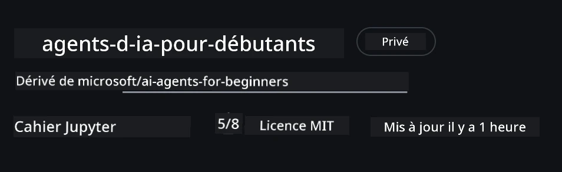
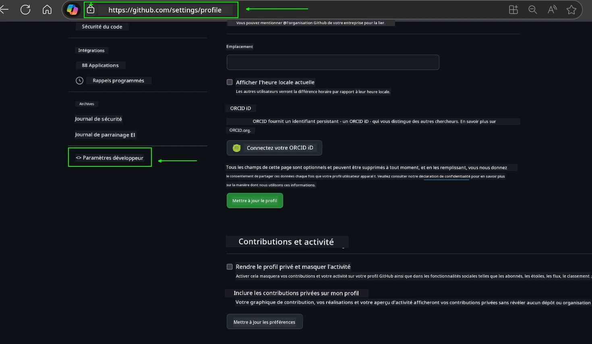
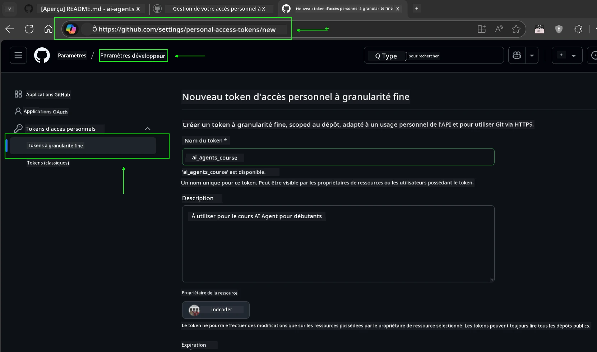
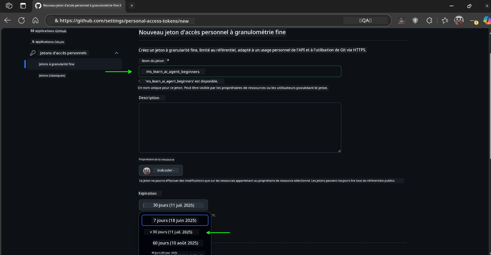
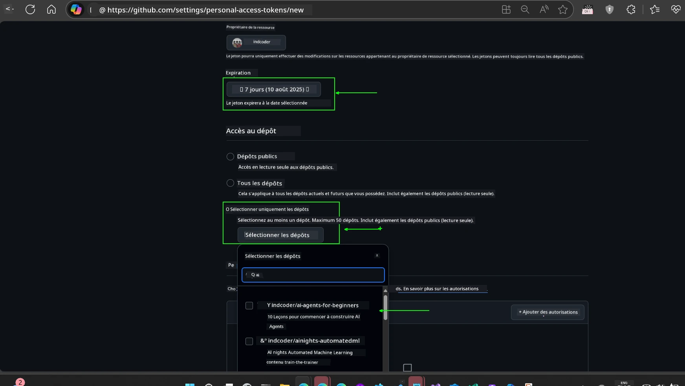
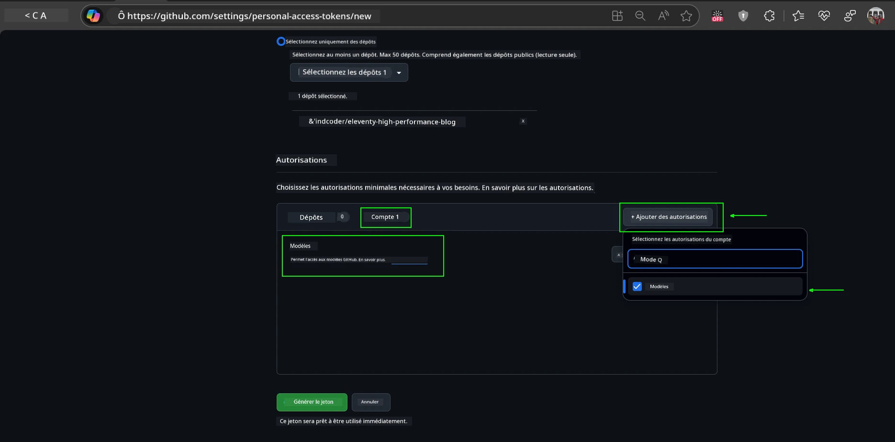
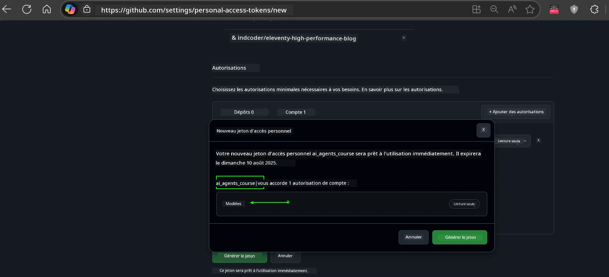
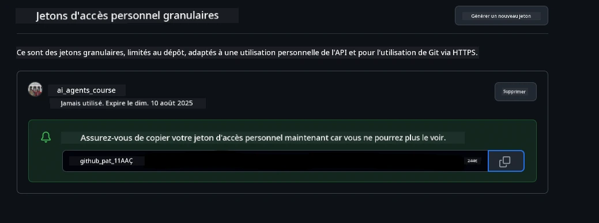
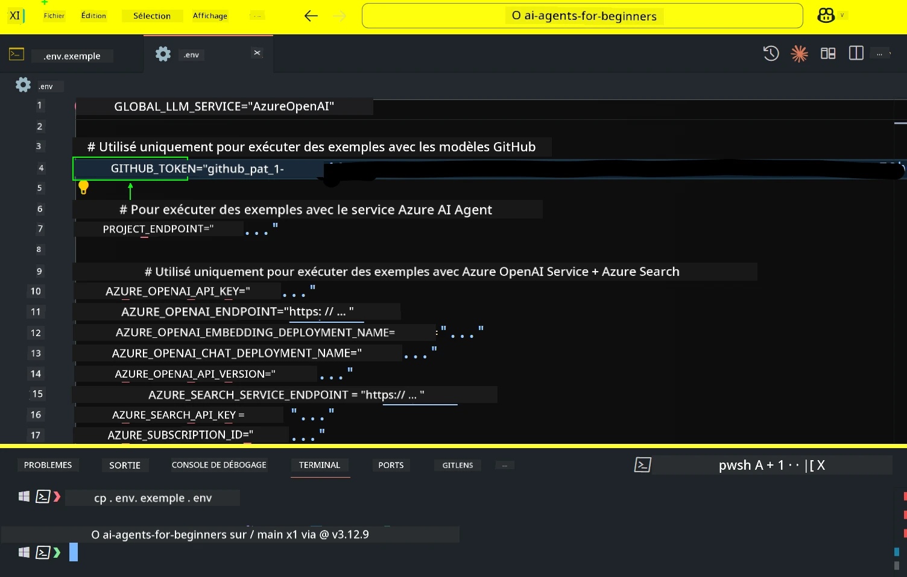

<!--
CO_OP_TRANSLATOR_METADATA:
{
  "original_hash": "63b1a8f6e840df15934935b728e569f0",
  "translation_date": "2025-12-03T13:41:07+00:00",
  "source_file": "00-course-setup/README.md",
  "language_code": "fr"
}
-->
# Configuration du cours

## Introduction

Cette leçon couvrira comment exécuter les exemples de code de ce cours.

## Rejoignez d'autres apprenants et obtenez de l'aide

Avant de cloner votre dépôt, rejoignez le [canal Discord AI Agents For Beginners](https://aka.ms/ai-agents/discord) pour obtenir de l'aide sur la configuration, poser des questions sur le cours ou entrer en contact avec d'autres apprenants.

## Cloner ou Forker ce dépôt

Pour commencer, veuillez cloner ou forker le dépôt GitHub. Cela vous permettra d'avoir votre propre version du matériel du cours afin de pouvoir exécuter, tester et modifier le code !

Cela peut être fait en cliquant sur le lien pour <a href="https://github.com/microsoft/ai-agents-for-beginners/fork" target="_blank">forker le dépôt</a>.

Vous devriez maintenant avoir votre propre version forkée de ce cours au lien suivant :



### Clone superficiel (recommandé pour les ateliers / Codespaces)

  >Le dépôt complet peut être volumineux (~3 Go) lorsque vous téléchargez tout l'historique et tous les fichiers. Si vous assistez uniquement à l'atelier ou avez seulement besoin de quelques dossiers de leçons, un clone superficiel (ou un clone partiel) évite la plupart de ce téléchargement en tronquant l'historique et/ou en sautant les blobs.

#### Clone superficiel rapide — historique minimal, tous les fichiers

Remplacez `<your-username>` dans les commandes ci-dessous par l'URL de votre fork (ou l'URL d'origine si vous préférez).

Pour cloner uniquement l'historique du dernier commit (téléchargement léger) :

```bash|powershell
git clone --depth 1 https://github.com/<your-username>/ai-agents-for-beginners.git
```

Pour cloner une branche spécifique :

```bash|powershell
git clone --depth 1 --branch <branch-name> https://github.com/<your-username>/ai-agents-for-beginners.git
```

#### Clone partiel (sparse) — blobs minimaux + seulement certains dossiers sélectionnés

Cela utilise un clone partiel et un sparse-checkout (nécessite Git 2.25+ et une version moderne de Git avec support du clone partiel recommandé) :

```bash|powershell
git clone --depth 1 --filter=blob:none --sparse https://github.com/<your-username>/ai-agents-for-beginners.git
```

Accédez au dossier du dépôt :

```bash|powershell
cd ai-agents-for-beginners
```

Ensuite, spécifiez les dossiers que vous souhaitez (l'exemple ci-dessous montre deux dossiers) :

```bash|powershell
git sparse-checkout set 00-course-setup 01-intro-to-ai-agents
```

Après avoir cloné et vérifié les fichiers, si vous n'avez besoin que des fichiers et souhaitez libérer de l'espace (sans historique Git), veuillez supprimer les métadonnées du dépôt (💀irréversible — vous perdrez toutes les fonctionnalités Git : pas de commits, pulls, pushes ou accès à l'historique).

```bash
# zsh/bash
rm -rf .git
```

```powershell
# PowerShell
Remove-Item -Recurse -Force .git
```

#### Utilisation de GitHub Codespaces (recommandé pour éviter les téléchargements volumineux locaux)

- Créez un nouveau Codespace pour ce dépôt via l'[interface GitHub](https://github.com/codespaces).  

- Dans le terminal du Codespace nouvellement créé, exécutez l'une des commandes de clone superficiel/partiel ci-dessus pour importer uniquement les dossiers de leçons dont vous avez besoin dans l'espace de travail Codespace.
- Optionnel : après le clonage dans Codespaces, supprimez `.git` pour récupérer de l'espace supplémentaire (voir les commandes de suppression ci-dessus).
- Remarque : Si vous préférez ouvrir directement le dépôt dans Codespaces (sans clone supplémentaire), sachez que Codespaces construira l'environnement devcontainer et pourrait encore provisionner plus que nécessaire. Cloner une copie superficielle dans un Codespace frais vous donne plus de contrôle sur l'utilisation du disque.

#### Conseils

- Remplacez toujours l'URL de clone par votre fork si vous souhaitez modifier/committer.
- Si vous avez besoin de plus d'historique ou de fichiers plus tard, vous pouvez les récupérer ou ajuster le sparse-checkout pour inclure des dossiers supplémentaires.

## Exécution du code

Ce cours propose une série de Jupyter Notebooks que vous pouvez exécuter pour acquérir une expérience pratique dans la création d'agents IA.

Les exemples de code utilisent soit :

**Nécessite un compte GitHub - Gratuit** :

1) Framework Semantic Kernel + Marketplace des modèles GitHub. Étiqueté comme (semantic-kernel.ipynb)
2) Framework AutoGen + Marketplace des modèles GitHub. Étiqueté comme (autogen.ipynb)

**Nécessite un abonnement Azure** :

3) Azure AI Foundry + Service Azure AI Agent. Étiqueté comme (azureaiagent.ipynb)

Nous vous encourageons à essayer les trois types d'exemples pour voir lequel fonctionne le mieux pour vous.

Quelle que soit l'option choisie, cela déterminera les étapes de configuration que vous devrez suivre ci-dessous :

## Prérequis

- Python 3.12+
  - **NOTE** : Si vous n'avez pas Python3.12 installé, assurez-vous de l'installer. Ensuite, créez votre venv en utilisant python3.12 pour garantir que les versions correctes sont installées à partir du fichier requirements.txt.
  
    >Exemple

    Créez un répertoire Python venv :

    ```bash|powershell
    python -m venv venv
    ```

    Ensuite, activez l'environnement venv pour :

    ```bash
    # zsh/bash
    source venv/bin/activate
    ```
  
    ```dos
    # Command Prompt for Windows
    venv\Scripts\activate
    ```

- .NET 10+ : Pour les exemples de code utilisant .NET, assurez-vous d'installer le [SDK .NET 10](https://dotnet.microsoft.com/download/dotnet/10.0) ou une version ultérieure. Ensuite, vérifiez la version du SDK .NET installée :

    ```bash|powershell
    dotnet --list-sdks
    ```

- Un compte GitHub - Pour accéder au Marketplace des modèles GitHub
- Un abonnement Azure - Pour accéder à Azure AI Foundry
- Un compte Azure AI Foundry - Pour accéder au service Azure AI Agent

Nous avons inclus un fichier `requirements.txt` à la racine de ce dépôt qui contient tous les packages Python nécessaires pour exécuter les exemples de code.

Vous pouvez les installer en exécutant la commande suivante dans votre terminal à la racine du dépôt :

```bash|powershell
pip install -r requirements.txt
```

Nous recommandons de créer un environnement virtuel Python pour éviter tout conflit ou problème.

## Configuration de VSCode

Assurez-vous d'utiliser la bonne version de Python dans VSCode.


## Configuration pour les exemples utilisant les modèles GitHub 

### Étape 1 : Récupérez votre jeton d'accès personnel GitHub (PAT)

Ce cours utilise le Marketplace des modèles GitHub, offrant un accès gratuit à des modèles de langage étendu (LLMs) que vous utiliserez pour créer des agents IA.

Pour utiliser les modèles GitHub, vous devrez créer un [jeton d'accès personnel GitHub](https://docs.github.com/en/authentication/keeping-your-account-and-data-secure/managing-your-personal-access-tokens).

Cela peut être fait en accédant à vos <a href="https://github.com/settings/personal-access-tokens" target="_blank">paramètres de jetons d'accès personnel</a> dans votre compte GitHub.

Veuillez suivre le [principe du moindre privilège](https://docs.github.com/en/get-started/learning-to-code/storing-your-secrets-safely) lors de la création de votre jeton. Cela signifie que vous ne devez donner au jeton que les permissions nécessaires pour exécuter les exemples de code de ce cours.

1. Sélectionnez l'option `Fine-grained tokens` sur le côté gauche de votre écran en accédant aux **paramètres du développeur**.

   

   Ensuite, sélectionnez `Generate new token`.

   

2. Entrez un nom descriptif pour votre jeton qui reflète son objectif, ce qui le rend facile à identifier plus tard.

    🔐 Recommandation de durée du jeton

    Durée recommandée : 30 jours  
    Pour une posture plus sécurisée, vous pouvez opter pour une période plus courte — comme 7 jours 🛡️  
    C'est une excellente façon de se fixer un objectif personnel et de terminer le cours tout en maintenant votre élan d'apprentissage 🚀.

    

3. Limitez la portée du jeton à votre fork de ce dépôt.

    

4. Restreignez les permissions du jeton : Sous l'onglet **Permissions**, cliquez sur **Account**, puis sur le bouton "+ Add permissions". Un menu déroulant apparaîtra. Recherchez **Models** et cochez la case correspondante.

    

5. Vérifiez les permissions requises avant de générer le jeton. 

6. Avant de générer le jeton, assurez-vous d'être prêt à le stocker dans un endroit sécurisé comme un gestionnaire de mots de passe, car il ne sera plus affiché après sa création. 

Copiez votre nouveau jeton que vous venez de créer. Vous l'ajouterez maintenant à votre fichier `.env` inclus dans ce cours.

### Étape 2 : Créez votre fichier `.env`

Pour créer votre fichier `.env`, exécutez la commande suivante dans votre terminal.

```bash
# zsh/bash
cp .env.example .env
```

```powershell
# PowerShell
Copy-Item .env.example .env
```

Cela copiera le fichier exemple et créera un `.env` dans votre répertoire où vous remplirez les valeurs des variables d'environnement.

Avec votre jeton copié, ouvrez le fichier `.env` dans votre éditeur de texte préféré et collez votre jeton dans le champ `GITHUB_TOKEN`.



Vous devriez maintenant être en mesure d'exécuter les exemples de code de ce cours.

## Configuration pour les exemples utilisant Azure AI Foundry et le service Azure AI Agent

### Étape 1 : Récupérez l'endpoint de votre projet Azure

Suivez les étapes pour créer un hub et un projet dans Azure AI Foundry ici : [Vue d'ensemble des ressources Hub](https://learn.microsoft.com/azure/ai-foundry/concepts/ai-resources)

Une fois votre projet créé, vous devrez récupérer la chaîne de connexion de votre projet.

Cela peut être fait en accédant à la page **Vue d'ensemble** de votre projet dans le portail Azure AI Foundry.


### Étape 2 : Créez votre fichier `.env`

Pour créer votre fichier `.env`, exécutez la commande suivante dans votre terminal.

```bash
# zsh/bash
cp .env.example .env
```

```powershell
# PowerShell
Copy-Item .env.example .env
```

Cela copiera le fichier exemple et créera un `.env` dans votre répertoire où vous remplirez les valeurs des variables d'environnement.

Avec votre jeton copié, ouvrez le fichier `.env` dans votre éditeur de texte préféré et collez votre jeton dans le champ `PROJECT_ENDPOINT`.

### Étape 3 : Connectez-vous à Azure

En tant que bonne pratique de sécurité, nous utiliserons [l'authentification sans clé](https://learn.microsoft.com/azure/developer/ai/keyless-connections?tabs=csharp%2Cazure-cli?WT.mc_id=academic-105485-koreyst) pour nous authentifier à Azure OpenAI avec Microsoft Entra ID. 

Ensuite, ouvrez un terminal et exécutez `az login --use-device-code` pour vous connecter à votre compte Azure.

Une fois connecté, sélectionnez votre abonnement dans le terminal.

## Variables d'environnement supplémentaires - Azure Search et Azure OpenAI 

Pour la leçon Agentic RAG - Leçon 5 - il existe des exemples utilisant Azure Search et Azure OpenAI.

Si vous souhaitez exécuter ces exemples, vous devrez ajouter les variables d'environnement suivantes à votre fichier `.env` :

### Page Vue d'ensemble (Projet)

- `AZURE_SUBSCRIPTION_ID` - Consultez les **Détails du projet** sur la page **Vue d'ensemble** de votre projet.

- `AZURE_AI_PROJECT_NAME` - Regardez en haut de la page **Vue d'ensemble** de votre projet.

- `AZURE_OPENAI_SERVICE` - Trouvez cela dans l'onglet **Capacités incluses** pour **Azure OpenAI Service** sur la page **Vue d'ensemble**.

### Centre de gestion

- `AZURE_OPENAI_RESOURCE_GROUP` - Allez dans **Propriétés du projet** sur la page **Vue d'ensemble** du **Centre de gestion**.

- `GLOBAL_LLM_SERVICE` - Sous **Ressources connectées**, trouvez le nom de connexion des **Services Azure AI**. Si non listé, vérifiez dans le **portail Azure** sous votre groupe de ressources pour le nom de la ressource des services AI.

### Page Modèles + Endpoints

- `AZURE_OPENAI_EMBEDDING_DEPLOYMENT_NAME` - Sélectionnez votre modèle d'embedding (par ex., `text-embedding-ada-002`) et notez le **Nom du déploiement** dans les détails du modèle.

- `AZURE_OPENAI_CHAT_DEPLOYMENT_NAME` - Sélectionnez votre modèle de chat (par ex., `gpt-4o-mini`) et notez le **Nom du déploiement** dans les détails du modèle.

### Portail Azure

- `AZURE_OPENAI_ENDPOINT` - Recherchez **Services Azure AI**, cliquez dessus, puis allez dans **Gestion des ressources**, **Clés et Endpoint**, faites défiler jusqu'aux "Endpoints Azure OpenAI" et copiez celui qui dit "APIs de langage".

- `AZURE_OPENAI_API_KEY` - Depuis le même écran, copiez la CLÉ 1 ou la CLÉ 2.

- `AZURE_SEARCH_SERVICE_ENDPOINT` - Trouvez votre ressource **Azure AI Search**, cliquez dessus, et consultez **Vue d'ensemble**.

- `AZURE_SEARCH_API_KEY` - Ensuite, allez dans **Paramètres** puis **Clés** pour copier la clé administrateur principale ou secondaire.

### Page externe

- `AZURE_OPENAI_API_VERSION` - Visitez la page [Cycle de vie des versions API](https://learn.microsoft.com/azure/ai-services/openai/api-version-deprecation#latest-ga-api-release) sous **Dernière version GA de l'API**.

### Configurer l'authentification sans clé

Plutôt que de coder en dur vos identifiants, nous utiliserons une connexion sans clé avec Azure OpenAI. Pour ce faire, nous importerons `DefaultAzureCredential` et appellerons ensuite la fonction `DefaultAzureCredential` pour obtenir l'identifiant.

```python
# Python
from azure.identity import DefaultAzureCredential, InteractiveBrowserCredential
```

## Bloqué quelque part ?
Si vous rencontrez des problèmes avec cette configuration, rejoignez notre <a href="https://discord.gg/kzRShWzttr" target="_blank">Discord de la communauté Azure AI</a> ou <a href="https://github.com/microsoft/ai-agents-for-beginners/issues?WT.mc_id=academic-105485-koreyst" target="_blank">créez une issue</a>.

## Leçon suivante

Vous êtes maintenant prêt à exécuter le code de ce cours. Bonne découverte du monde des agents IA !

[Introduction aux agents IA et cas d'utilisation des agents](../01-intro-to-ai-agents/README.md)

---

<!-- CO-OP TRANSLATOR DISCLAIMER START -->
**Avertissement** :  
Ce document a été traduit à l'aide du service de traduction IA [Co-op Translator](https://github.com/Azure/co-op-translator). Bien que nous nous efforcions d'assurer l'exactitude, veuillez noter que les traductions automatiques peuvent contenir des erreurs ou des inexactitudes. Le document original dans sa langue d'origine doit être considéré comme la source faisant autorité. Pour des informations critiques, il est recommandé de recourir à une traduction humaine professionnelle. Nous ne sommes pas responsables des malentendus ou des interprétations erronées résultant de l'utilisation de cette traduction.
<!-- CO-OP TRANSLATOR DISCLAIMER END -->