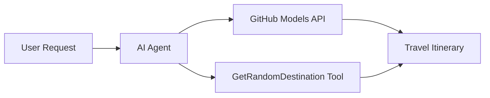

<!--
CO_OP_TRANSLATOR_METADATA:
{
  "original_hash": "5f351412e934f0833c8c821a0a60efaf",
  "translation_date": "2025-11-13T10:49:09+00:00",
  "source_file": "01-intro-to-ai-agents/code_samples/01-dotnet-agent-framework.md",
  "language_code": "fr"
}
-->
# 🌍 Agent de voyage IA avec Microsoft Agent Framework (.NET)

## 📋 Aperçu du scénario

Cet exemple montre comment créer un agent intelligent de planification de voyages en utilisant le Microsoft Agent Framework pour .NET. L'agent peut générer automatiquement des itinéraires personnalisés pour des excursions d'une journée vers des destinations aléatoires à travers le monde.

### Capacités principales :

- 🎲 **Sélection de destination aléatoire** : Utilise un outil personnalisé pour choisir des lieux de vacances
- 🗺️ **Planification intelligente de voyages** : Crée des itinéraires détaillés jour par jour
- 🔄 **Streaming en temps réel** : Prend en charge les réponses immédiates et en streaming
- 🛠️ **Intégration d'outils personnalisés** : Montre comment étendre les capacités de l'agent

## 🔧 Architecture technique

### Technologies principales

- **Microsoft Agent Framework** : Dernière implémentation .NET pour le développement d'agents IA
- **Intégration des modèles GitHub** : Utilise le service d'inférence de modèles IA de GitHub
- **Compatibilité avec l'API OpenAI** : Exploite les bibliothèques client OpenAI avec des points de terminaison personnalisés
- **Configuration sécurisée** : Gestion des clés API basée sur l'environnement

### Composants clés

1. **AIAgent** : L'orchestrateur principal de l'agent qui gère le flux de conversation
2. **Outils personnalisés** : Fonction `GetRandomDestination()` disponible pour l'agent
3. **Client de chat** : Interface de conversation soutenue par les modèles GitHub
4. **Support de streaming** : Capacités de génération de réponses en temps réel

### Modèle d'intégration



## 🚀 Premiers pas

### Prérequis

- [.NET 10 SDK](https://dotnet.microsoft.com/download/dotnet/10.0) ou version ultérieure
- [Jeton d'accès API des modèles GitHub](https://docs.github.com/github-models/github-models-at-scale/using-your-own-api-keys-in-github-models)

### Variables d'environnement requises

```bash
# zsh/bash
export GH_TOKEN=<your_github_token>
export GH_ENDPOINT=https://models.github.ai/inference
export GH_MODEL_ID=openai/gpt-5-mini
```

```powershell
# PowerShell
$env:GH_TOKEN = "<your_github_token>"
$env:GH_ENDPOINT = "https://models.github.ai/inference"
$env:GH_MODEL_ID = "openai/gpt-5-mini"
```

### Exemple de code

Pour exécuter l'exemple de code,

```bash
# zsh/bash
chmod +x ./01-dotnet-agent-framework.cs
./01-dotnet-agent-framework.cs
```

Ou en utilisant le CLI dotnet :

```bash
dotnet run ./01-dotnet-agent-framework.cs
```

Voir [`01-dotnet-agent-framework.cs`](../../../../01-intro-to-ai-agents/code_samples/01-dotnet-agent-framework.cs) pour le code complet.

```csharp
#!/usr/bin/dotnet run

#:package Microsoft.Extensions.AI@9.*
#:package Microsoft.Agents.AI.OpenAI@1.*-*

using System.ClientModel;
using System.ComponentModel;

using Microsoft.Agents.AI;
using Microsoft.Extensions.AI;

using OpenAI;

// Tool Function: Random Destination Generator
// This static method will be available to the agent as a callable tool
// The [Description] attribute helps the AI understand when to use this function
// This demonstrates how to create custom tools for AI agents
[Description("Provides a random vacation destination.")]
static string GetRandomDestination()
{
    // List of popular vacation destinations around the world
    // The agent will randomly select from these options
    var destinations = new List<string>
    {
        "Paris, France",
        "Tokyo, Japan",
        "New York City, USA",
        "Sydney, Australia",
        "Rome, Italy",
        "Barcelona, Spain",
        "Cape Town, South Africa",
        "Rio de Janeiro, Brazil",
        "Bangkok, Thailand",
        "Vancouver, Canada"
    };

    // Generate random index and return selected destination
    // Uses System.Random for simple random selection
    var random = new Random();
    int index = random.Next(destinations.Count);
    return destinations[index];
}

// Extract configuration from environment variables
// Retrieve the GitHub Models API endpoint, defaults to https://models.github.ai/inference if not specified
// Retrieve the model ID, defaults to openai/gpt-5-mini if not specified
// Retrieve the GitHub token for authentication, throws exception if not specified
var github_endpoint = Environment.GetEnvironmentVariable("GH_ENDPOINT") ?? "https://models.github.ai/inference";
var github_model_id = Environment.GetEnvironmentVariable("GH_MODEL_ID") ?? "openai/gpt-5-mini";
var github_token = Environment.GetEnvironmentVariable("GH_TOKEN") ?? throw new InvalidOperationException("GH_TOKEN is not set.");

// Configure OpenAI Client Options
// Create configuration options to point to GitHub Models endpoint
// This redirects OpenAI client calls to GitHub's model inference service
var openAIOptions = new OpenAIClientOptions()
{
    Endpoint = new Uri(github_endpoint)
};

// Initialize OpenAI Client with GitHub Models Configuration
// Create OpenAI client using GitHub token for authentication
// Configure it to use GitHub Models endpoint instead of OpenAI directly
var openAIClient = new OpenAIClient(new ApiKeyCredential(github_token), openAIOptions);

// Create AI Agent with Travel Planning Capabilities
// Initialize OpenAI client, get chat client for specified model, and create AI agent
// Configure agent with travel planning instructions and random destination tool
// The agent can now plan trips using the GetRandomDestination function
AIAgent agent = openAIClient
    .GetChatClient(github_model_id)
    .CreateAIAgent(
        instructions: "You are a helpful AI Agent that can help plan vacations for customers at random destinations",
        tools: [AIFunctionFactory.Create(GetRandomDestination)]
    );

// Execute Agent: Plan a Day Trip
// Run the agent with streaming enabled for real-time response display
// Shows the agent's thinking and response as it generates the content
// Provides better user experience with immediate feedback
await foreach (var update in agent.RunStreamingAsync("Plan me a day trip"))
{
    await Task.Delay(10);
    Console.Write(update);
}
```

## 🎓 Points clés à retenir

1. **Architecture de l'agent** : Le Microsoft Agent Framework offre une approche propre et typée pour créer des agents IA en .NET
2. **Intégration d'outils** : Les fonctions décorées avec des attributs `[Description]` deviennent des outils disponibles pour l'agent
3. **Gestion de la configuration** : Les variables d'environnement et la gestion sécurisée des identifiants suivent les meilleures pratiques .NET
4. **Compatibilité OpenAI** : L'intégration des modèles GitHub fonctionne parfaitement via des API compatibles OpenAI

## 🔗 Ressources supplémentaires

- [Documentation du Microsoft Agent Framework](https://learn.microsoft.com/agent-framework)
- [Marketplace des modèles GitHub](https://github.com/marketplace?type=models)
- [Microsoft.Extensions.AI](https://learn.microsoft.com/dotnet/ai/microsoft-extensions-ai)
- [Applications mono-fichier .NET](https://devblogs.microsoft.com/dotnet/announcing-dotnet-run-app)

---

<!-- CO-OP TRANSLATOR DISCLAIMER START -->
**Avertissement** :  
Ce document a été traduit à l'aide du service de traduction IA [Co-op Translator](https://github.com/Azure/co-op-translator). Bien que nous nous efforcions d'assurer l'exactitude, veuillez noter que les traductions automatiques peuvent contenir des erreurs ou des inexactitudes. Le document original dans sa langue d'origine doit être considéré comme la source faisant autorité. Pour des informations critiques, il est recommandé de recourir à une traduction humaine professionnelle. Nous ne sommes pas responsables des malentendus ou des interprétations erronées résultant de l'utilisation de cette traduction.
<!-- CO-OP TRANSLATOR DISCLAIMER END -->