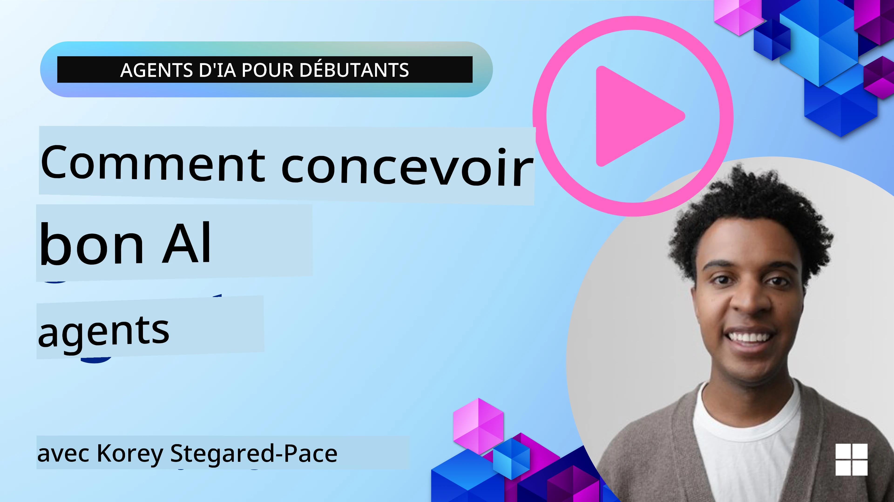
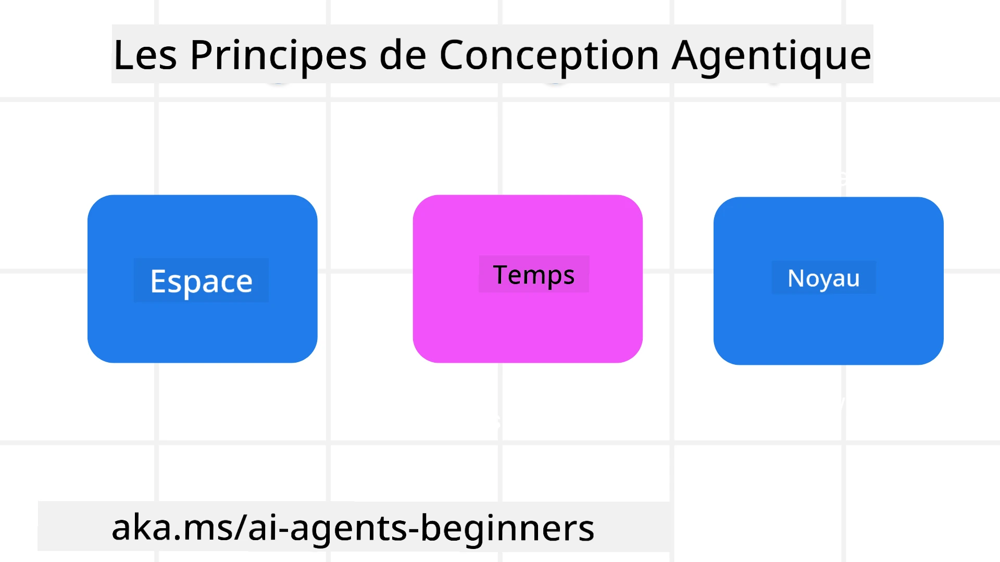

<!--
CO_OP_TRANSLATOR_METADATA:
{
  "original_hash": "d71524fe83a23829ae7a23b4031aaac8",
  "translation_date": "2025-11-13T10:50:40+00:00",
  "source_file": "03-agentic-design-patterns/README.md",
  "language_code": "fr"
}
-->

> _(Cliquez sur l'image ci-dessus pour visionner la vidéo de cette leçon)_
# Principes de conception des agents IA

## Introduction

Il existe de nombreuses façons d'aborder la création de systèmes d'agents IA. Étant donné que l'ambiguïté est une caractéristique et non un défaut dans la conception de l'IA générative, il est parfois difficile pour les ingénieurs de savoir par où commencer. Nous avons élaboré un ensemble de principes de conception UX centrés sur l'humain pour permettre aux développeurs de créer des systèmes d'agents centrés sur le client afin de répondre à leurs besoins professionnels. Ces principes de conception ne constituent pas une architecture prescriptive, mais plutôt un point de départ pour les équipes qui définissent et développent des expériences d'agents.

En général, les agents devraient :

- Élargir et amplifier les capacités humaines (brainstorming, résolution de problèmes, automatisation, etc.)
- Combler les lacunes en matière de connaissances (me mettre à jour sur des domaines de connaissances, traduction, etc.)
- Faciliter et soutenir la collaboration de manière à respecter nos préférences individuelles pour travailler avec les autres
- Faire de nous de meilleures versions de nous-mêmes (par exemple, coach de vie/gestionnaire de tâches, nous aider à apprendre des compétences de régulation émotionnelle et de pleine conscience, renforcer la résilience, etc.)

## Cette leçon couvrira

- Quels sont les principes de conception des agents
- Quelles sont les directives à suivre lors de la mise en œuvre de ces principes de conception
- Quels sont des exemples d'utilisation de ces principes de conception

## Objectifs d'apprentissage

Après avoir terminé cette leçon, vous serez capable de :

1. Expliquer ce que sont les principes de conception des agents
2. Expliquer les directives pour utiliser les principes de conception des agents
3. Comprendre comment construire un agent en utilisant les principes de conception des agents

## Les principes de conception des agents

### Agent (Espace)

C'est l'environnement dans lequel l'agent opère. Ces principes guident la conception des agents pour interagir dans les mondes physiques et numériques.

- **Connecter, pas effacer** – aider à connecter les gens à d'autres personnes, événements et connaissances exploitables pour permettre la collaboration et la connexion.
- Les agents aident à connecter événements, connaissances et personnes.
- Les agents rapprochent les gens. Ils ne sont pas conçus pour remplacer ou diminuer les humains.
- **Facilement accessible mais parfois invisible** – l'agent fonctionne principalement en arrière-plan et n'intervient que lorsqu'il est pertinent et approprié.
  - L'agent est facilement repérable et accessible pour les utilisateurs autorisés sur n'importe quel appareil ou plateforme.
  - L'agent prend en charge des entrées et sorties multimodales (son, voix, texte, etc.).
  - L'agent peut passer sans effort de l'avant-plan à l'arrière-plan ; entre proactif et réactif, en fonction de sa perception des besoins de l'utilisateur.
  - L'agent peut fonctionner de manière invisible, mais son processus en arrière-plan et sa collaboration avec d'autres agents sont transparents et contrôlables par l'utilisateur.

### Agent (Temps)

C'est ainsi que l'agent fonctionne dans le temps. Ces principes guident la conception des agents interagissant à travers le passé, le présent et le futur.

- **Passé** : Réfléchir à l'histoire qui inclut à la fois l'état et le contexte.
  - L'agent fournit des résultats plus pertinents basés sur l'analyse de données historiques plus riches au-delà de l'événement, des personnes ou des états.
  - L'agent crée des connexions à partir d'événements passés et réfléchit activement à la mémoire pour interagir avec les situations actuelles.
- **Présent** : Suggérer plus que notifier.
  - L'agent adopte une approche globale pour interagir avec les gens. Lorsqu'un événement se produit, l'agent va au-delà d'une simple notification statique ou autre formalité statique. Il peut simplifier les flux ou générer dynamiquement des indices pour attirer l'attention de l'utilisateur au bon moment.
  - L'agent fournit des informations basées sur l'environnement contextuel, les changements sociaux et culturels, et adaptées à l'intention de l'utilisateur.
  - L'interaction avec l'agent peut être progressive, évoluant en complexité pour autonomiser les utilisateurs sur le long terme.
- **Futur** : S'adapter et évoluer.
  - L'agent s'adapte à divers appareils, plateformes et modalités.
  - L'agent s'adapte au comportement de l'utilisateur, aux besoins d'accessibilité, et est librement personnalisable.
  - L'agent est façonné par et évolue grâce à une interaction continue avec l'utilisateur.

### Agent (Noyau)

Ce sont les éléments clés au cœur de la conception d'un agent.

- **Accepter l'incertitude mais établir la confiance**.
  - Un certain niveau d'incertitude de l'agent est attendu. L'incertitude est un élément clé de la conception des agents.
  - La confiance et la transparence sont des couches fondamentales de la conception des agents.
  - Les humains contrôlent quand l'agent est activé/désactivé et le statut de l'agent est clairement visible à tout moment.

## Les directives pour mettre en œuvre ces principes

Lorsque vous utilisez les principes de conception précédents, suivez les directives suivantes :

1. **Transparence** : Informez l'utilisateur que l'IA est impliquée, comment elle fonctionne (y compris les actions passées), et comment donner un retour d'information et modifier le système.
2. **Contrôle** : Permettez à l'utilisateur de personnaliser, spécifier ses préférences et personnaliser, et de contrôler le système et ses attributs (y compris la possibilité d'oublier).
3. **Cohérence** : Visez des expériences cohérentes et multimodales sur les appareils et points d'accès. Utilisez des éléments d'interface utilisateur/UX familiers lorsque c'est possible (par exemple, une icône de microphone pour l'interaction vocale) et réduisez autant que possible la charge cognitive du client (par exemple, visez des réponses concises, des aides visuelles et du contenu « En savoir plus »).

## Comment concevoir un agent de voyage en utilisant ces principes et directives

Imaginez que vous concevez un agent de voyage, voici comment vous pourriez envisager d'utiliser les principes de conception et les directives :

1. **Transparence** – Informez l'utilisateur que l'agent de voyage est un agent activé par l'IA. Fournissez des instructions de base pour commencer (par exemple, un message de « Bonjour », des exemples de requêtes). Documentez cela clairement sur la page produit. Affichez la liste des requêtes posées par l'utilisateur dans le passé. Expliquez clairement comment donner un retour d'information (pouce levé ou baissé, bouton Envoyer un retour, etc.). Indiquez clairement si l'agent a des restrictions d'utilisation ou de sujet.
2. **Contrôle** – Assurez-vous qu'il est clair comment l'utilisateur peut modifier l'agent après sa création avec des éléments comme l'invite système. Permettez à l'utilisateur de choisir le niveau de détail de l'agent, son style d'écriture, et toute restriction sur les sujets que l'agent ne devrait pas aborder. Autorisez l'utilisateur à consulter et supprimer les fichiers ou données associés, les requêtes et les conversations passées.
3. **Cohérence** – Assurez-vous que les icônes pour Partager une requête, ajouter un fichier ou une photo, et taguer quelqu'un ou quelque chose sont standard et reconnaissables. Utilisez l'icône de trombone pour indiquer le téléchargement/partage de fichiers avec l'agent, et une icône d'image pour indiquer le téléchargement de graphiques.

## Exemples de codes

- Python : [Cadre d'agent](./code_samples/03-python-agent-framework.ipynb)
- .NET : [Cadre d'agent](./code_samples/03-dotnet-agent-framework.md)

## Vous avez d'autres questions sur les modèles de conception des agents IA ?

Rejoignez le [Discord Azure AI Foundry](https://aka.ms/ai-agents/discord) pour rencontrer d'autres apprenants, assister à des heures de bureau et obtenir des réponses à vos questions sur les agents IA.

## Ressources supplémentaires

- <a href="https://openai.com" target="_blank">Pratiques pour la gouvernance des systèmes IA agentiques | OpenAI</a>
- <a href="https://microsoft.com" target="_blank">Projet HAX Toolkit - Microsoft Research</a>
- <a href="https://responsibleaitoolbox.ai" target="_blank">Boîte à outils pour une IA responsable</a>

## Leçon précédente

[Explorer les cadres agentiques](../02-explore-agentic-frameworks/README.md)

## Leçon suivante

[Modèle de conception pour l'utilisation d'outils](../04-tool-use/README.md)

---

<!-- CO-OP TRANSLATOR DISCLAIMER START -->
**Avertissement** :  
Ce document a été traduit à l'aide du service de traduction IA [Co-op Translator](https://github.com/Azure/co-op-translator). Bien que nous nous efforcions d'assurer l'exactitude, veuillez noter que les traductions automatisées peuvent contenir des erreurs ou des inexactitudes. Le document original dans sa langue d'origine doit être considéré comme la source faisant autorité. Pour des informations critiques, il est recommandé de recourir à une traduction humaine professionnelle. Nous ne sommes pas responsables des malentendus ou des interprétations erronées résultant de l'utilisation de cette traduction.
<!-- CO-OP TRANSLATOR DISCLAIMER END -->