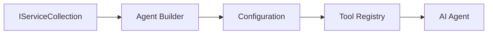

<!--
CO_OP_TRANSLATOR_METADATA:
{
  "original_hash": "bcc874e190347bd6a095aed56dc16de8",
  "translation_date": "2025-11-13T10:51:37+00:00",
  "source_file": "03-agentic-design-patterns/code_samples/03-dotnet-agent-framework.md",
  "language_code": "fr"
}
-->
# 🎨 Modèles de conception agentique avec les modèles GitHub (.NET)

## 📋 Objectifs d'apprentissage

Cet exemple illustre des modèles de conception de niveau entreprise pour créer des agents intelligents en utilisant le Microsoft Agent Framework en .NET avec l'intégration des modèles GitHub. Vous apprendrez des modèles professionnels et des approches architecturales qui rendent les agents prêts pour la production, maintenables et évolutifs.

### Modèles de conception d'entreprise

- 🏭 **Modèle de fabrique** : Création standardisée d'agents avec injection de dépendances
- 🔧 **Modèle de constructeur** : Configuration et mise en place fluide des agents
- 🧵 **Modèles thread-safe** : Gestion concurrente des conversations
- 📋 **Modèle de dépôt** : Gestion organisée des outils et des capacités

## 🎯 Avantages architecturaux spécifiques à .NET

### Fonctionnalités d'entreprise

- **Typage fort** : Validation à la compilation et prise en charge IntelliSense
- **Injection de dépendances** : Intégration du conteneur DI intégré
- **Gestion de la configuration** : Modèles IConfiguration et Options
- **Async/Await** : Prise en charge native de la programmation asynchrone

### Modèles prêts pour la production

- **Intégration de la journalisation** : Prise en charge de ILogger et de la journalisation structurée
- **Vérifications de santé** : Surveillance et diagnostics intégrés
- **Validation de la configuration** : Typage fort avec annotations de données
- **Gestion des erreurs** : Gestion structurée des exceptions

## 🔧 Architecture technique

### Composants principaux de .NET

- **Microsoft.Extensions.AI** : Abstractions de services IA unifiées
- **Microsoft.Agents.AI** : Cadre d'orchestration d'agents d'entreprise
- **Intégration des modèles GitHub** : Modèles de client API haute performance
- **Système de configuration** : Intégration de appsettings.json et des environnements

### Mise en œuvre des modèles de conception



## 🏗️ Modèles d'entreprise démontrés

### 1. **Modèles de création**

- **Fabrique d'agents** : Création centralisée d'agents avec configuration cohérente
- **Modèle de constructeur** : API fluide pour la configuration complexe des agents
- **Modèle Singleton** : Gestion des ressources et de la configuration partagées
- **Injection de dépendances** : Couplage lâche et testabilité

### 2. **Modèles comportementaux**

- **Modèle de stratégie** : Stratégies interchangeables d'exécution d'outils
- **Modèle de commande** : Opérations d'agents encapsulées avec annulation/rétablissement
- **Modèle observateur** : Gestion du cycle de vie des agents basée sur les événements
- **Méthode template** : Flux de travail standardisés pour l'exécution des agents

### 3. **Modèles structurels**

- **Modèle adaptateur** : Couche d'intégration de l'API des modèles GitHub
- **Modèle décorateur** : Amélioration des capacités des agents
- **Modèle façade** : Interfaces simplifiées pour l'interaction avec les agents
- **Modèle proxy** : Chargement paresseux et mise en cache pour la performance

## 📚 Principes de conception .NET

### Principes SOLID

- **Responsabilité unique** : Chaque composant a un objectif clair
- **Ouvert/Fermé** : Extensible sans modification
- **Substitution de Liskov** : Implémentations d'outils basées sur des interfaces
- **Segregation des interfaces** : Interfaces ciblées et cohérentes
- **Inversion des dépendances** : Dépendre des abstractions, pas des concrétions

### Architecture propre

- **Couche domaine** : Abstractions principales des agents et outils
- **Couche application** : Orchestration et flux de travail des agents
- **Couche infrastructure** : Intégration des modèles GitHub et services externes
- **Couche présentation** : Interaction utilisateur et formatage des réponses

## 🔒 Considérations d'entreprise

### Sécurité

- **Gestion des identifiants** : Gestion sécurisée des clés API avec IConfiguration
- **Validation des entrées** : Typage fort et validation par annotations de données
- **Sanitisation des sorties** : Traitement et filtrage sécurisés des réponses
- **Journalisation des audits** : Suivi complet des opérations

### Performance

- **Modèles asynchrones** : Opérations d'E/S non bloquantes
- **Pooling de connexions** : Gestion efficace des clients HTTP
- **Mise en cache** : Mise en cache des réponses pour améliorer les performances
- **Gestion des ressources** : Modèles appropriés de nettoyage et de disposition

### Scalabilité

- **Sécurité des threads** : Prise en charge de l'exécution concurrente des agents
- **Pooling des ressources** : Utilisation efficace des ressources
- **Gestion de la charge** : Limitation du débit et gestion de la pression
- **Surveillance** : Métriques de performance et vérifications de santé

## 🚀 Déploiement en production

- **Gestion de la configuration** : Paramètres spécifiques à l'environnement
- **Stratégie de journalisation** : Journalisation structurée avec ID de corrélation
- **Gestion des erreurs** : Gestion globale des exceptions avec récupération appropriée
- **Surveillance** : Insights applicatifs et compteurs de performance
- **Tests** : Tests unitaires, tests d'intégration et modèles de tests de charge

Prêt à créer des agents intelligents de niveau entreprise avec .NET ? Architecturons quelque chose de robuste ! 🏢✨

## 🚀 Pour commencer

### Prérequis

- [SDK .NET 10](https://dotnet.microsoft.com/download/dotnet/10.0) ou supérieur
- [Jeton d'accès API des modèles GitHub](https://docs.github.com/github-models/github-models-at-scale/using-your-own-api-keys-in-github-models)

### Variables d'environnement requises

```bash
# zsh/bash
export GH_TOKEN=<your_github_token>
export GH_ENDPOINT=https://models.github.ai/inference
export GH_MODEL_ID=openai/gpt-5-mini
```

```powershell
# PowerShell
$env:GH_TOKEN = "<your_github_token>"
$env:GH_ENDPOINT = "https://models.github.ai/inference"
$env:GH_MODEL_ID = "openai/gpt-5-mini"
```

### Exemple de code

Pour exécuter l'exemple de code,

```bash
# zsh/bash
chmod +x ./03-dotnet-agent-framework.cs
./03-dotnet-agent-framework.cs
```

Ou en utilisant l'interface CLI dotnet :

```bash
dotnet run ./03-dotnet-agent-framework.cs
```

Voir [`03-dotnet-agent-framework.cs`](../../../../03-agentic-design-patterns/code_samples/03-dotnet-agent-framework.cs) pour le code complet.

```csharp
#!/usr/bin/dotnet run

#:package Microsoft.Extensions.AI@10.*
#:package Microsoft.Agents.AI.OpenAI@1.*-*

using System.ClientModel;
using System.ComponentModel;

using Microsoft.Agents.AI;
using Microsoft.Extensions.AI;

using OpenAI;

// Tool Function: Random Destination Generator
// This static method will be available to the agent as a callable tool
// The [Description] attribute helps the AI understand when to use this function
// This demonstrates how to create custom tools for AI agents
[Description("Provides a random vacation destination.")]
static string GetRandomDestination()
{
    // List of popular vacation destinations around the world
    // The agent will randomly select from these options
    var destinations = new List<string>
    {
        "Paris, France",
        "Tokyo, Japan",
        "New York City, USA",
        "Sydney, Australia",
        "Rome, Italy",
        "Barcelona, Spain",
        "Cape Town, South Africa",
        "Rio de Janeiro, Brazil",
        "Bangkok, Thailand",
        "Vancouver, Canada"
    };

    // Generate random index and return selected destination
    // Uses System.Random for simple random selection
    var random = new Random();
    int index = random.Next(destinations.Count);
    return destinations[index];
}

// Extract configuration from environment variables
// Retrieve the GitHub Models API endpoint, defaults to https://models.github.ai/inference if not specified
// Retrieve the model ID, defaults to openai/gpt-5-mini if not specified
// Retrieve the GitHub token for authentication, throws exception if not specified
var github_endpoint = Environment.GetEnvironmentVariable("GH_ENDPOINT") ?? "https://models.github.ai/inference";
var github_model_id = Environment.GetEnvironmentVariable("GH_MODEL_ID") ?? "openai/gpt-5-mini";
var github_token = Environment.GetEnvironmentVariable("GH_TOKEN") ?? throw new InvalidOperationException("GH_TOKEN is not set.");

// Configure OpenAI Client Options
// Create configuration options to point to GitHub Models endpoint
// This redirects OpenAI client calls to GitHub's model inference service
var openAIOptions = new OpenAIClientOptions()
{
    Endpoint = new Uri(github_endpoint)
};

// Initialize OpenAI Client with GitHub Models Configuration
// Create OpenAI client using GitHub token for authentication
// Configure it to use GitHub Models endpoint instead of OpenAI directly
var openAIClient = new OpenAIClient(new ApiKeyCredential(github_token), openAIOptions);

// Define Agent Identity and Comprehensive Instructions
// Agent name for identification and logging purposes
var AGENT_NAME = "TravelAgent";

// Detailed instructions that define the agent's personality, capabilities, and behavior
// This system prompt shapes how the agent responds and interacts with users
var AGENT_INSTRUCTIONS = """
You are a helpful AI Agent that can help plan vacations for customers.

Important: When users specify a destination, always plan for that location. Only suggest random destinations when the user hasn't specified a preference.

When the conversation begins, introduce yourself with this message:
"Hello! I'm your TravelAgent assistant. I can help plan vacations and suggest interesting destinations for you. Here are some things you can ask me:
1. Plan a day trip to a specific location
2. Suggest a random vacation destination
3. Find destinations with specific features (beaches, mountains, historical sites, etc.)
4. Plan an alternative trip if you don't like my first suggestion

What kind of trip would you like me to help you plan today?"

Always prioritize user preferences. If they mention a specific destination like "Bali" or "Paris," focus your planning on that location rather than suggesting alternatives.
""";

// Create AI Agent with Advanced Travel Planning Capabilities
// Initialize complete agent pipeline: OpenAI client → Chat client → AI agent
// Configure agent with name, detailed instructions, and available tools
// This demonstrates the .NET agent creation pattern with full configuration
AIAgent agent = openAIClient
    .GetChatClient(github_model_id)
    .CreateAIAgent(
        name: AGENT_NAME,
        instructions: AGENT_INSTRUCTIONS,
        tools: [AIFunctionFactory.Create(GetRandomDestination)]
    );

// Create New Conversation Thread for Context Management
// Initialize a new conversation thread to maintain context across multiple interactions
// Threads enable the agent to remember previous exchanges and maintain conversational state
// This is essential for multi-turn conversations and contextual understanding
AgentThread thread = agent.GetNewThread();

// Execute Agent: First Travel Planning Request
// Run the agent with an initial request that will likely trigger the random destination tool
// The agent will analyze the request, use the GetRandomDestination tool, and create an itinerary
// Using the thread parameter maintains conversation context for subsequent interactions
await foreach (var update in agent.RunStreamingAsync("Plan me a day trip", thread))
{
    await Task.Delay(10);
    Console.Write(update);
}

Console.WriteLine();

// Execute Agent: Follow-up Request with Context Awareness
// Demonstrate contextual conversation by referencing the previous response
// The agent remembers the previous destination suggestion and will provide an alternative
// This showcases the power of conversation threads and contextual understanding in .NET agents
await foreach (var update in agent.RunStreamingAsync("I don't like that destination. Plan me another vacation.", thread))
{
    await Task.Delay(10);
    Console.Write(update);
}
```

---

<!-- CO-OP TRANSLATOR DISCLAIMER START -->
**Avertissement** :  
Ce document a été traduit à l'aide du service de traduction IA [Co-op Translator](https://github.com/Azure/co-op-translator). Bien que nous nous efforcions d'assurer l'exactitude, veuillez noter que les traductions automatisées peuvent contenir des erreurs ou des inexactitudes. Le document original dans sa langue d'origine doit être considéré comme la source faisant autorité. Pour des informations critiques, il est recommandé de recourir à une traduction humaine professionnelle. Nous ne sommes pas responsables des malentendus ou des interprétations erronées résultant de l'utilisation de cette traduction.
<!-- CO-OP TRANSLATOR DISCLAIMER END -->