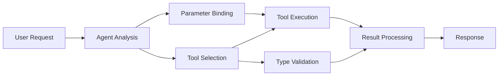

<!--
CO_OP_TRANSLATOR_METADATA:
{
  "original_hash": "91d6061e402489603f2ec8b528cae59b",
  "translation_date": "2025-11-18T16:29:00+00:00",
  "source_file": "04-tool-use/code_samples/04-dotnet-agent-framework.md",
  "language_code": "fr"
}
-->
# 🛠️ Utilisation avancée des outils avec les modèles GitHub (.NET)

## 📋 Objectifs d'apprentissage

Ce notebook illustre les modèles d'intégration d'outils de niveau entreprise en utilisant le Microsoft Agent Framework en .NET avec les modèles GitHub. Vous apprendrez à créer des agents sophistiqués dotés de plusieurs outils spécialisés, en tirant parti du typage fort de C# et des fonctionnalités d'entreprise de .NET.

### Capacités avancées des outils que vous maîtriserez

- 🔧 **Architecture multi-outils** : Construire des agents avec plusieurs capacités spécialisées
- 🎯 **Exécution d'outils type-safe** : Exploiter la validation au moment de la compilation de C#
- 📊 **Modèles d'outils d'entreprise** : Conception d'outils prêts pour la production et gestion des erreurs
- 🔗 **Composition d'outils** : Combiner des outils pour des workflows métier complexes

## 🎯 Avantages de l'architecture d'outils .NET

### Fonctionnalités d'outils d'entreprise

- **Validation au moment de la compilation** : Le typage fort garantit la correction des paramètres des outils
- **Injection de dépendances** : Intégration du conteneur IoC pour la gestion des outils
- **Modèles Async/Await** : Exécution non bloquante des outils avec une gestion appropriée des ressources
- **Journalisation structurée** : Intégration de la journalisation pour le suivi de l'exécution des outils

### Modèles prêts pour la production

- **Gestion des exceptions** : Gestion complète des erreurs avec des exceptions typées
- **Gestion des ressources** : Modèles de disposition appropriés et gestion de la mémoire
- **Surveillance des performances** : Métriques intégrées et compteurs de performance
- **Gestion de la configuration** : Configuration type-safe avec validation

## 🔧 Architecture technique

### Composants principaux des outils .NET

- **Microsoft.Extensions.AI** : Couche d'abstraction unifiée pour les outils
- **Microsoft.Agents.AI** : Orchestration d'outils de niveau entreprise
- **Intégration des modèles GitHub** : Client API haute performance avec gestion des connexions

### Pipeline d'exécution des outils



## 🛠️ Catégories et modèles d'outils

### 1. **Outils de traitement des données**

- **Validation des entrées** : Typage fort avec annotations de données
- **Opérations de transformation** : Conversion et formatage des données type-safe
- **Logique métier** : Outils de calcul et d'analyse spécifiques au domaine
- **Formatage des sorties** : Génération de réponses structurées

### 2. **Outils d'intégration**

- **Connecteurs API** : Intégration de services RESTful avec HttpClient
- **Outils de base de données** : Intégration d'Entity Framework pour l'accès aux données
- **Opérations sur les fichiers** : Opérations sécurisées sur le système de fichiers avec validation
- **Services externes** : Modèles d'intégration de services tiers

### 3. **Outils utilitaires**

- **Traitement de texte** : Manipulation et formatage de chaînes de caractères
- **Opérations sur les dates/heures** : Calculs de dates/heures tenant compte des cultures
- **Outils mathématiques** : Calculs précis et opérations statistiques
- **Outils de validation** : Validation des règles métier et vérification des données

Prêt à créer des agents de niveau entreprise avec des capacités d'outils puissantes et type-safe en .NET ? Architecturons des solutions professionnelles ! 🏢⚡

## 🚀 Premiers pas

### Prérequis

- [.NET 10 SDK](https://dotnet.microsoft.com/download/dotnet/10.0) ou version ultérieure
- [Jeton d'accès API des modèles GitHub](https://docs.github.com/github-models/github-models-at-scale/using-your-own-api-keys-in-github-models)

### Variables d'environnement requises

```bash
# zsh/bash
export GH_TOKEN=<your_github_token>
export GH_ENDPOINT=https://models.github.ai/inference
export GH_MODEL_ID=openai/gpt-5-mini
```

```powershell
# PowerShell
$env:GH_TOKEN = "<your_github_token>"
$env:GH_ENDPOINT = "https://models.github.ai/inference"
$env:GH_MODEL_ID = "openai/gpt-5-mini"
```

### Exemple de code

Pour exécuter l'exemple de code,

```bash
# zsh/bash
chmod +x ./04-dotnet-agent-framework.cs
./04-dotnet-agent-framework.cs
```

Ou en utilisant la CLI dotnet :

```bash
dotnet run ./04-dotnet-agent-framework.cs
```

Voir [`04-dotnet-agent-framework.cs`](../../../../04-tool-use/code_samples/04-dotnet-agent-framework.cs) pour le code complet.

```csharp
#!/usr/bin/dotnet run

#:package Microsoft.Extensions.AI@10.*
#:package Microsoft.Agents.AI.OpenAI@1.*-*

using System.ClientModel;
using System.ComponentModel;

using Microsoft.Agents.AI;
using Microsoft.Extensions.AI;

using OpenAI;

// Tool Function: Random Destination Generator
// This static method will be available to the agent as a callable tool
// The [Description] attribute helps the AI understand when to use this function
// This demonstrates how to create custom tools for AI agents
[Description("Provides a random vacation destination.")]
static string GetRandomDestination()
{
    // List of popular vacation destinations around the world
    // The agent will randomly select from these options
    var destinations = new List<string>
    {
        "Paris, France",
        "Tokyo, Japan",
        "New York City, USA",
        "Sydney, Australia",
        "Rome, Italy",
        "Barcelona, Spain",
        "Cape Town, South Africa",
        "Rio de Janeiro, Brazil",
        "Bangkok, Thailand",
        "Vancouver, Canada"
    };

    // Generate random index and return selected destination
    // Uses System.Random for simple random selection
    var random = new Random();
    int index = random.Next(destinations.Count);
    return destinations[index];
}

// Extract configuration from environment variables
// Retrieve the GitHub Models API endpoint, defaults to https://models.github.ai/inference if not specified
// Retrieve the model ID, defaults to openai/gpt-5-mini if not specified
// Retrieve the GitHub token for authentication, throws exception if not specified
var github_endpoint = Environment.GetEnvironmentVariable("GH_ENDPOINT") ?? "https://models.github.ai/inference";
var github_model_id = Environment.GetEnvironmentVariable("GH_MODEL_ID") ?? "openai/gpt-5-mini";
var github_token = Environment.GetEnvironmentVariable("GH_TOKEN") ?? throw new InvalidOperationException("GH_TOKEN is not set.");

// Configure OpenAI Client Options
// Create configuration options to point to GitHub Models endpoint
// This redirects OpenAI client calls to GitHub's model inference service
var openAIOptions = new OpenAIClientOptions()
{
    Endpoint = new Uri(github_endpoint)
};

// Initialize OpenAI Client with GitHub Models Configuration
// Create OpenAI client using GitHub token for authentication
// Configure it to use GitHub Models endpoint instead of OpenAI directly
var openAIClient = new OpenAIClient(new ApiKeyCredential(github_token), openAIOptions);

// Define Agent Identity and Comprehensive Instructions
// Agent name for identification and logging purposes
var AGENT_NAME = "TravelAgent";

// Detailed instructions that define the agent's personality, capabilities, and behavior
// This system prompt shapes how the agent responds and interacts with users
var AGENT_INSTRUCTIONS = """
You are a helpful AI Agent that can help plan vacations for customers.

Important: When users specify a destination, always plan for that location. Only suggest random destinations when the user hasn't specified a preference.

When the conversation begins, introduce yourself with this message:
"Hello! I'm your TravelAgent assistant. I can help plan vacations and suggest interesting destinations for you. Here are some things you can ask me:
1. Plan a day trip to a specific location
2. Suggest a random vacation destination
3. Find destinations with specific features (beaches, mountains, historical sites, etc.)
4. Plan an alternative trip if you don't like my first suggestion

What kind of trip would you like me to help you plan today?"

Always prioritize user preferences. If they mention a specific destination like "Bali" or "Paris," focus your planning on that location rather than suggesting alternatives.
""";

// Create AI Agent with Advanced Travel Planning Capabilities
// Initialize complete agent pipeline: OpenAI client → Chat client → AI agent
// Configure agent with name, detailed instructions, and available tools
// This demonstrates the .NET agent creation pattern with full configuration
AIAgent agent = openAIClient
    .GetChatClient(github_model_id)
    .CreateAIAgent(
        name: AGENT_NAME,
        instructions: AGENT_INSTRUCTIONS,
        tools: [AIFunctionFactory.Create(GetRandomDestination)]
    );

// Create New Conversation Thread for Context Management
// Initialize a new conversation thread to maintain context across multiple interactions
// Threads enable the agent to remember previous exchanges and maintain conversational state
// This is essential for multi-turn conversations and contextual understanding
AgentThread thread = agent.GetNewThread();

// Execute Agent: First Travel Planning Request
// Run the agent with an initial request that will likely trigger the random destination tool
// The agent will analyze the request, use the GetRandomDestination tool, and create an itinerary
// Using the thread parameter maintains conversation context for subsequent interactions
await foreach (var update in agent.RunStreamingAsync("Plan me a day trip", thread))
{
    await Task.Delay(10);
    Console.Write(update);
}

Console.WriteLine();

// Execute Agent: Follow-up Request with Context Awareness
// Demonstrate contextual conversation by referencing the previous response
// The agent remembers the previous destination suggestion and will provide an alternative
// This showcases the power of conversation threads and contextual understanding in .NET agents
await foreach (var update in agent.RunStreamingAsync("I don't like that destination. Plan me another vacation.", thread))
{
    await Task.Delay(10);
    Console.Write(update);
}
```

---

<!-- CO-OP TRANSLATOR DISCLAIMER START -->
**Avertissement** :  
Ce document a été traduit à l'aide du service de traduction IA [Co-op Translator](https://github.com/Azure/co-op-translator). Bien que nous nous efforcions d'assurer l'exactitude, veuillez noter que les traductions automatisées peuvent contenir des erreurs ou des inexactitudes. Le document original dans sa langue d'origine doit être considéré comme la source faisant autorité. Pour des informations critiques, il est recommandé de recourir à une traduction humaine professionnelle. Nous ne sommes pas responsables des malentendus ou des interprétations erronées résultant de l'utilisation de cette traduction.
<!-- CO-OP TRANSLATOR DISCLAIMER END -->