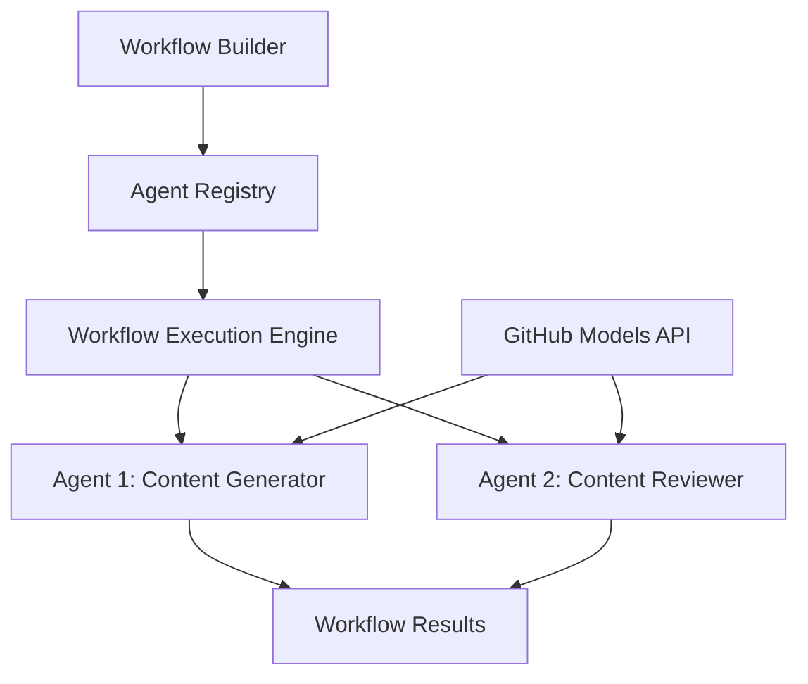

<!--
CO_OP_TRANSLATOR_METADATA:
{
  "original_hash": "034158688d0a45aae06dcbb21b0da5ae",
  "translation_date": "2025-11-11T12:38:40+00:00",
  "source_file": "08-multi-agent/code_samples/workflows-agent-framework/dotNET/01.dotnet-agent-framework-workflow-ghmodel-basic.md",
  "language_code": "fr"
}
-->
# 🔄 Flux de travail de base avec les modèles GitHub (.NET)

## 📋 Tutoriel sur l'orchestration des flux de travail

Ce notebook montre comment créer des **flux de travail d'agents sophistiqués** en utilisant le Microsoft Agent Framework pour .NET et les modèles GitHub. Vous apprendrez à concevoir des processus métier multi-étapes où des agents IA collaborent pour accomplir des tâches complexes grâce à des modèles d'orchestration structurés.

## 🎯 Objectifs d'apprentissage

### 🏗️ **Principes fondamentaux de l'architecture des flux de travail**
- **Workflow Builder** : Concevoir et orchestrer des processus IA complexes multi-étapes
- **Coordination des agents** : Coordonner plusieurs agents spécialisés au sein des flux de travail
- **Intégration des modèles GitHub** : Exploiter le service d'inférence des modèles IA de GitHub dans les flux de travail
- **Conception visuelle des flux de travail** : Créer et visualiser les structures de flux de travail pour une meilleure compréhension

### 🔄 **Modèles d'orchestration des processus**
- **Traitement séquentiel** : Enchaîner plusieurs tâches d'agents dans un ordre logique
- **Gestion des états** : Maintenir le contexte et le flux de données entre les étapes du flux de travail
- **Gestion des erreurs** : Mettre en œuvre une récupération robuste des erreurs et une résilience des flux de travail
- **Optimisation des performances** : Concevoir des flux de travail efficaces pour des opérations à l'échelle de l'entreprise

### 🏢 **Applications des flux de travail en entreprise**
- **Automatisation des processus métier** : Automatiser des flux de travail organisationnels complexes
- **Pipeline de production de contenu** : Flux éditoriaux avec étapes de révision et d'approbation
- **Automatisation du service client** : Résolution multi-étapes des demandes des clients
- **Flux de traitement des données** : Flux ETL avec transformation assistée par IA

## ⚙️ Prérequis et configuration

### 📦 **Packages NuGet requis**

Cette démonstration de flux de travail utilise plusieurs packages clés .NET :

```xml
<!-- Core AI Framework -->
<PackageReference Include="Microsoft.Extensions.AI" Version="9.9.0" />

<!-- Agent Framework (Local Development) -->
<!-- Microsoft.Agents.AI.dll - Core agent abstractions -->
<!-- Microsoft.Agents.AI.OpenAI.dll - OpenAI/GitHub Models integration -->

<!-- Configuration and Environment -->
<PackageReference Include="DotNetEnv" Version="3.1.1" />
```

### 🔑 **Configuration des modèles GitHub**

**Configuration de l'environnement (fichier .env) :**
```env
GITHUB_TOKEN=your_github_personal_access_token
GITHUB_ENDPOINT=https://models.inference.ai.azure.com
GITHUB_MODEL_ID=gpt-4o-mini
```

**Accès aux modèles GitHub :**
1. Inscrivez-vous aux modèles GitHub (actuellement en aperçu)
2. Générez un jeton d'accès personnel avec des permissions d'accès aux modèles
3. Configurez les variables d'environnement comme indiqué ci-dessus

### 🏗️ **Aperçu de l'architecture des flux de travail**



**Composants clés :**
- **WorkflowBuilder** : Moteur principal d'orchestration pour concevoir des flux de travail
- **AIAgent** : Agents spécialisés individuels avec des capacités spécifiques
- **Client des modèles GitHub** : Intégration du service d'inférence des modèles IA
- **Contexte d'exécution** : Gère l'état et le flux de données entre les étapes du flux de travail

## 🎨 **Modèles de conception des flux de travail en entreprise**

### 📝 **Flux de production de contenu**
```
User Request → Content Generation → Quality Review → Final Output
```

### 🔍 **Pipeline de traitement des documents**
```
Document Input → Analysis → Extraction → Validation → Structured Output
```

### 💼 **Flux de travail en intelligence d'affaires**
```
Data Collection → Processing → Analysis → Report Generation → Distribution
```

### 🤝 **Automatisation du service client**
```
Customer Inquiry → Classification → Processing → Response Generation → Follow-up
```

## 🏢 **Avantages pour l'entreprise**

### 🎯 **Fiabilité et évolutivité**
- **Exécution déterministe** : Résultats de flux de travail cohérents et reproductibles
- **Récupération des erreurs** : Gestion élégante des échecs à n'importe quelle étape du flux de travail
- **Surveillance des performances** : Suivi des métriques d'exécution et des opportunités d'optimisation
- **Gestion des ressources** : Allocation et utilisation efficaces des ressources des modèles IA

### 🔒 **Sécurité et conformité**
- **Authentification sécurisée** : Authentification basée sur des jetons GitHub pour l'accès à l'API
- **Traçabilité** : Journalisation complète de l'exécution des flux de travail et des points de décision
- **Contrôle d'accès** : Permissions granulaires pour l'exécution et la surveillance des flux de travail
- **Confidentialité des données** : Gestion sécurisée des informations sensibles tout au long des flux de travail

### 📊 **Observabilité et gestion**
- **Conception visuelle des flux de travail** : Représentation claire des flux de processus et des dépendances
- **Surveillance de l'exécution** : Suivi en temps réel de la progression et des performances des flux de travail
- **Rapports d'erreurs** : Analyse détaillée des erreurs et capacités de débogage
- **Analyse des performances** : Métriques pour l'optimisation et la planification des capacités

Construisons votre premier flux de travail IA prêt pour l'entreprise ! 🚀

## 💻 Exécution du code

L'implémentation complète est disponible dans `01.dotnet-agent-framework-workflow-ghmodel-basic.cs`. Ce fichier montre :

1. **Configuration de l'environnement** - Chargement des identifiants des modèles GitHub depuis le fichier `.env`
2. **Configuration du client OpenAI** - Configuration du client pour utiliser le point de terminaison des modèles GitHub
3. **Création d'agents** - Définition d'agents spécialisés (Front Desk et Concierge)
4. **Workflow Builder** - Création d'un flux de travail multi-agents avec traitement séquentiel
5. **Exécution du flux de travail** - Exécution du flux de travail avec résultats en streaming

### 🚀 Exécution de l'exemple

```bash
# Make the script executable (Unix/Linux/macOS)
chmod +x 01.dotnet-agent-framework-workflow-ghmodel-basic.cs

# Run the workflow
./01.dotnet-agent-framework-workflow-ghmodel-basic.cs
```

Ou sur Windows :
```powershell
dotnet run 01.dotnet-agent-framework-workflow-ghmodel-basic.cs
```

### 📝 Résultat attendu

Le flux de travail :
1. Acceptera votre demande de destination de voyage ("Je voudrais aller à Paris")
2. L'agent Front Desk fournira une recommandation initiale
3. L'agent Concierge examinera et affinera la recommandation
4. Le résultat final affichera le flux complet de la conversation

### 🔧 Personnalisation

Vous pouvez personnaliser le flux de travail en :
- Modifiant les instructions des agents pour changer leur comportement
- Ajoutant davantage d'agents pour créer des flux de travail multi-étapes complexes
- Changeant le message utilisateur pour tester différents scénarios
- Ajustant les connexions du flux de travail pour créer différents modèles d'exécution

---

<!-- CO-OP TRANSLATOR DISCLAIMER START -->
**Avertissement** :  
Ce document a été traduit à l'aide du service de traduction automatique [Co-op Translator](https://github.com/Azure/co-op-translator). Bien que nous nous efforcions d'assurer l'exactitude, veuillez noter que les traductions automatisées peuvent contenir des erreurs ou des inexactitudes. Le document original dans sa langue d'origine doit être considéré comme la source faisant autorité. Pour des informations critiques, il est recommandé de recourir à une traduction humaine professionnelle. Nous ne sommes pas responsables des malentendus ou des interprétations erronées résultant de l'utilisation de cette traduction.
<!-- CO-OP TRANSLATOR DISCLAIMER END -->