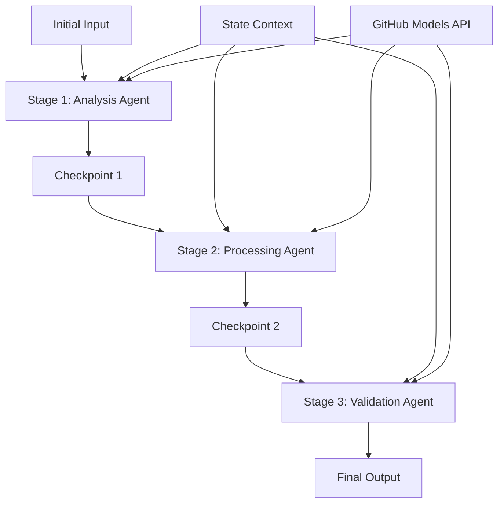

<!--
CO_OP_TRANSLATOR_METADATA:
{
  "original_hash": "1be9c8dcbd79a02d33d2c138684c1394",
  "translation_date": "2025-11-11T13:39:10+00:00",
  "source_file": "08-multi-agent/code_samples/workflows-agent-framework/dotNET/02.dotnet-agent-framework-workflow-ghmodel-sequential.md",
  "language_code": "fr"
}
-->
# ⏩ Flux de travail séquentiel des agents avec les modèles GitHub (.NET)

## 📋 Tutoriel avancé sur le traitement séquentiel

Ce notebook illustre les **modèles de flux de travail séquentiel** en utilisant le Microsoft Agent Framework pour .NET et les modèles GitHub. Vous apprendrez à construire des pipelines de traitement sophistiqués et étape par étape où les agents s'exécutent dans un ordre spécifique, chaque étape s'appuyant sur les résultats de l'étape précédente.

## 🎯 Objectifs d'apprentissage

### 🔄 **Architecture de traitement séquentiel**
- **Conception de flux de travail linéaire** : Créez des pipelines de traitement étape par étape avec des dépendances claires
- **Gestion de l'état** : Maintenez le contexte et le flux de données à travers les étapes du flux de travail séquentiel
- **Intégration des modèles GitHub** : Exploitez les modèles d'IA de GitHub dans des flux de travail .NET multi-étapes
- **Modèles de pipeline d'entreprise** : Construisez des systèmes de traitement séquentiel prêts pour la production

### 🏗️ **Modèles séquentiels avancés**
- **Traitement par étapes** : Implémentez des points de validation entre les étapes du flux de travail
- **Préservation du contexte** : Maintenez l'état et les connaissances accumulées à travers toutes les étapes
- **Propagation des erreurs** : Gérez les échecs de manière élégante dans les chaînes de traitement séquentiel
- **Optimisation des performances** : Exécution séquentielle efficace avec un minimum de surcharge

### 🏢 **Applications séquentielles en entreprise**
- **Pipeline de traitement de documents** : Analyse, transformation et validation de documents en plusieurs étapes
- **Flux de travail d'assurance qualité** : Processus de révision, validation et approbation séquentiels
- **Pipeline de production de contenu** : Recherche → Rédaction → Édition → Révision → Publication
- **Automatisation des processus métier** : Flux de travail métier en plusieurs étapes avec des dépendances claires entre les étapes

## ⚙️ Prérequis et configuration

### 📦 **Packages NuGet requis**

Packages essentiels pour les flux de travail séquentiels .NET :

```xml
<!-- Core AI Framework -->
<PackageReference Include="Microsoft.Extensions.AI" Version="9.9.0" />

<!-- Client Model Abstractions -->
<PackageReference Include="System.ClientModel" Version="1.6.1.0" />

<!-- Azure Identity and Async LINQ Support -->
<PackageReference Include="Azure.Identity" Version="1.15.0" />
<PackageReference Include="System.Linq.Async" Version="6.0.3" />

<!-- Local Agent Framework References -->
<!-- Microsoft.Agents.AI.dll - Core agent abstractions -->
<!-- Microsoft.Agents.AI.OpenAI.dll - GitHub Models integration -->
```

### 🔑 **Configuration des modèles GitHub**

**Configuration de l'environnement (fichier .env) :**
```env
GITHUB_TOKEN=your_github_personal_access_token
GITHUB_ENDPOINT=https://models.inference.ai.azure.com
GITHUB_MODEL_ID=gpt-4o-mini
```

**Gestion de la configuration :**
```csharp
// Load environment variables securely
Env.Load("../../../.env");
var githubToken = Environment.GetEnvironmentVariable("GITHUB_TOKEN");
var githubEndpoint = Environment.GetEnvironmentVariable("GITHUB_ENDPOINT");
var modelId = Environment.GetEnvironmentVariable("GITHUB_MODEL_ID");
```

### 🏗️ **Architecture de flux de travail séquentiel**



**Composants clés :**
- **Agents séquentiels** : Agents spécialisés pour chaque étape de traitement
- **Contexte d'état** : Maintient les données accumulées et les décisions à travers les étapes
- **Points de contrôle** : Points de validation entre les étapes pour garantir la qualité et la cohérence
- **Client des modèles GitHub** : Accès cohérent aux modèles d'IA à travers toutes les étapes du flux de travail

## 🎨 **Modèles de conception de flux de travail séquentiel**

### 📝 **Pipeline de traitement de documents**
```
Raw Document → Content Extraction → Analysis → Validation → Structured Output
```

### 🎯 **Flux de création de contenu**
```
Brief/Requirements → Research → Content Creation → Review → Final Polish
```

### 🔍 **Pipeline d'assurance qualité**
```
Initial Review → Technical Validation → Compliance Check → Final Approval
```

### 💼 **Flux de travail en intelligence d'affaires**
```
Data Collection → Processing → Analysis → Report Generation → Distribution
```

## 🏢 **Avantages des flux séquentiels en entreprise**

### 🎯 **Fiabilité et qualité**
- **Traitement déterministe** : Résultats cohérents et reproductibles grâce à des étapes structurées
- **Portes de qualité** : Les points de validation garantissent la qualité à chaque étape
- **Isolation des erreurs** : Les problèmes dans une étape ne se propagent pas aux étapes suivantes
- **Traçabilité** : Suivi complet des décisions et des transformations à chaque étape

### 📈 **Évolutivité et performance**
- **Conception modulaire** : Chaque étape peut être optimisée indépendamment
- **Gestion des ressources** : Allocation efficace des ressources des modèles d'IA à travers les étapes
- **Optimisation de l'état** : Transfert minimal d'état entre les étapes pour des performances optimales
- **Groupes d'étapes parallèles** : Plusieurs flux de travail séquentiels peuvent s'exécuter en parallèle

### 🔒 **Sécurité et conformité**
- **Sécurité au niveau des étapes** : Politiques de sécurité différentes pour les différentes étapes de traitement
- **Validation des données** : Garantir l'intégrité des données et la conformité à chaque point de contrôle
- **Contrôle d'accès** : Permissions granulaires pour les différentes étapes du flux de travail
- **Conformité réglementaire** : Respect des exigences réglementaires grâce à un traitement structuré

### 📊 **Surveillance et analyses**
- **Métriques au niveau des étapes** : Surveillance des performances pour chaque étape du flux de travail
- **Identification des goulots d'étranglement** : Identifier et optimiser les étapes lentes
- **Métriques de qualité** : Suivre la qualité et les taux de réussite à chaque étape
- **Optimisation des processus** : Amélioration continue basée sur les analyses au niveau des étapes

Construisons des pipelines de traitement d'IA séquentiels robustes ! 🚀

## 💻 Exécution du code

L'implémentation complète est disponible dans `02.dotnet-agent-framework-workflow-ghmodel-sequential.cs`. Ce fichier illustre un **flux de travail d'analyse de meubles en trois étapes** :

1. **Étape 1 - Agent des ventes** : Analyse les images de meubles et fournit des suggestions d'achat
2. **Étape 2 - Agent des prix** : Fournit des analyses détaillées des prix et des options budgétaires
3. **Étape 3 - Agent de devis** : Génère un document de devis professionnel au format Markdown

### 🏗️ **Architecture du flux de travail**

```
Image Input → Sales Analysis → Price Estimation → Quote Generation → Final Output
```

Chaque agent :
- Reçoit la sortie de l'étape précédente comme contexte
- S'appuie sur l'analyse précédente avec une expertise spécialisée
- Maintient la continuité du flux de travail grâce à la gestion de l'état

### 🚀 Exécution de l'exemple

**Prérequis :**
- Placez une image de meuble à `../imgs/home.png` (ou mettez à jour la variable `imgPath`)
- Configurez votre fichier `.env` avec les identifiants des modèles GitHub

```bash
# Make the script executable (Unix/Linux/macOS)
chmod +x 02.dotnet-agent-framework-workflow-ghmodel-sequential.cs

# Run the sequential workflow
./02.dotnet-agent-framework-workflow-ghmodel-sequential.cs
```

Ou sur Windows :
```powershell
dotnet run 02.dotnet-agent-framework-workflow-ghmodel-sequential.cs
```

### 📝 Résultat attendu

Le flux de travail :
1. **Agent des ventes** : Identifie les meubles sur l'image et fournit des recommandations
2. **Agent des prix** : Ajoute une analyse détaillée des prix avec des niveaux de budget et des recommandations d'achat
3. **Agent de devis** : Génère un document de devis formaté avec toutes les informations synthétisées

Le résultat final sera un devis de meubles complet et professionnel basé sur l'analyse de l'image.

### 🔧 Options de personnalisation

**Modifier le comportement des agents :**
```csharp
// Adjust agent instructions to change their focus
const string SalesAgentInstructions = "Your custom instructions...";
```

**Changer le flux séquentiel :**
```csharp
// Add or reorder workflow stages
var workflow = new WorkflowBuilder(salesagent)
    .AddEdge(salesagent, priceagent)
    .AddEdge(priceagent, quoteagent)
    .AddEdge(quoteagent, newAgent)  // Add another stage
    .Build();
```

**Utiliser une entrée différente :**
```csharp
// Process text instead of images
ChatMessage userMessage = new ChatMessage(ChatRole.User, [
    new TextContent("Analyze pricing for a modern living room set")
]);
```

### 🎯 Applications réelles

Ce modèle séquentiel est idéal pour :
- **E-commerce** : Analyse de produits → Tarification → Génération de devis
- **Immobilier** : Analyse de propriétés → Évaluation → Création d'annonces
- **Assurance** : Analyse de réclamations → Évaluation → Génération de devis
- **Création de contenu** : Recherche → Rédaction → Édition → Publication

### 🔍 Comprendre le flux d'état

Chaque agent dans la séquence reçoit :
- **Entrée originale** : Le message initial de l'utilisateur (image + texte)
- **Sorties des agents précédents** : Toutes les réponses des agents précédents dans l'historique de la conversation
- **Contexte accumulé** : État complet maintenu tout au long du flux de travail

Cela permet un traitement multi-étapes sophistiqué où chaque agent s'appuie sur un contexte complet provenant de toutes les étapes précédentes.

---

<!-- CO-OP TRANSLATOR DISCLAIMER START -->
**Avertissement** :  
Ce document a été traduit à l'aide du service de traduction automatique [Co-op Translator](https://github.com/Azure/co-op-translator). Bien que nous nous efforcions d'assurer l'exactitude, veuillez noter que les traductions automatisées peuvent contenir des erreurs ou des inexactitudes. Le document original dans sa langue d'origine doit être considéré comme la source faisant autorité. Pour des informations critiques, il est recommandé de recourir à une traduction humaine professionnelle. Nous ne sommes pas responsables des malentendus ou des interprétations erronées résultant de l'utilisation de cette traduction.
<!-- CO-OP TRANSLATOR DISCLAIMER END -->