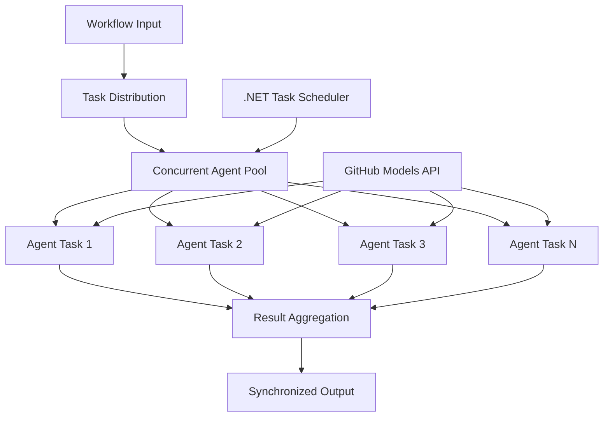

<!--
CO_OP_TRANSLATOR_METADATA:
{
  "original_hash": "b9c6e32c9b5f2fed20b6916984440d88",
  "translation_date": "2025-11-11T13:04:37+00:00",
  "source_file": "08-multi-agent/code_samples/workflows-agent-framework/dotNET/03.dotnet-agent-framework-workflow-ghmodel-concurrent.md",
  "language_code": "fr"
}
-->
# ⚡ Flux de travail d'agents concurrents avec les modèles GitHub (.NET)

## 📋 Tutoriel sur le traitement parallèle haute performance

Ce notebook illustre les **modèles de flux de travail concurrents** en utilisant le Microsoft Agent Framework pour .NET et les modèles GitHub. Vous apprendrez à construire des flux de travail de traitement parallèle haute performance qui maximisent le débit en exécutant plusieurs agents IA simultanément tout en maintenant la coordination et la cohérence des données.

## 🎯 Objectifs d'apprentissage

### 🚀 **Principes fondamentaux du traitement concurrent**
- **Exécution parallèle des agents** : Exécutez plusieurs agents IA simultanément pour des performances maximales
- **Modèles Async/Await** : Exploitez le modèle de programmation asynchrone de .NET pour une concurrence efficace
- **Intégration des modèles GitHub** : Coordonnez plusieurs appels concurrents au service d'inférence des modèles IA de GitHub
- **Gestion des ressources** : Gérez efficacement les ressources des modèles IA dans les opérations concurrentes

### 🏗️ **Architecture avancée de la concurrence**
- **Parallélisme basé sur les tâches** : Utilisez la bibliothèque de tâches parallèles de .NET pour une exécution concurrente optimale
- **Modèles de synchronisation** : Coordonnez les agents concurrents tout en évitant les conditions de concurrence
- **Répartition de la charge** : Distribuez efficacement le travail sur la capacité de traitement concurrent disponible
- **Tolérance aux pannes** : Gérez les échecs individuels des agents sans arrêter l'ensemble du flux de travail

### 🏢 **Applications concurrentes en entreprise**
- **Traitement de documents à haut volume** : Traitez plusieurs documents simultanément
- **Analyse de contenu en temps réel** : Analyse concurrente des flux de données entrants
- **Optimisation du traitement par lots** : Maximisez le débit pour les opérations de traitement de données à grande échelle
- **Analyse multimodale** : Traitement parallèle de différents types et formats de contenu

## ⚙️ Prérequis et configuration

### 📦 **Packages NuGet requis**

Packages essentiels pour les flux de travail concurrents haute performance :

```xml
<!-- Core AI Framework with Async Support -->
<PackageReference Include="Microsoft.Extensions.AI" Version="9.9.0" />

<!-- Client Model Abstractions for API Communication -->
<PackageReference Include="System.ClientModel" Version="1.6.1.0" />

<!-- Azure Identity and Async LINQ for Advanced Operations -->
<PackageReference Include="Azure.Identity" Version="1.15.0" />
<PackageReference Include="System.Linq.Async" Version="6.0.3" />

<!-- Local Agent Framework References -->
<!-- Microsoft.Agents.AI.dll - Core agent abstractions with async support -->
<!-- Microsoft.Agents.AI.OpenAI.dll - GitHub Models integration with concurrency -->
```

### 🔑 **Configuration des modèles GitHub**

**Configuration de l'environnement (.env file) :**
```env
GITHUB_TOKEN=your_github_personal_access_token
GITHUB_ENDPOINT=https://models.inference.ai.azure.com
GITHUB_MODEL_ID=gpt-4o-mini
```

**Considérations sur le traitement concurrent :**
```csharp
// Configure for concurrent operations
var clientOptions = new OpenAIClientOptions()
{
    Endpoint = new Uri(githubEndpoint),
    // Configure connection pooling for concurrent requests
    NetworkTimeout = TimeSpan.FromMinutes(5)
};
```

### 🏗️ **Architecture du flux de travail concurrent**



**Composants clés :**
- **Bibliothèque de tâches parallèles** : Support intégré de .NET pour les opérations concurrentes
- **Pool d'agents** : Plusieurs instances d'agents pour le traitement parallèle
- **Agrégation des résultats** : Coordination et fusion des résultats des agents concurrents
- **Points de synchronisation** : Assurez la cohérence des données dans les opérations concurrentes

## 🎨 **Modèles de conception de flux de travail concurrent**

### 🔍 **Recherche et analyse parallèles**
```
Research Topic → Concurrent Research Agents → Result Synthesis → Final Report
```

### 📊 **Traitement de données multi-sources**
```
Data Sources → Parallel Processing Agents → Data Integration → Unified Output
```

### 🎭 **Pipeline de génération de contenu**
```
Content Requirements → Concurrent Content Generators → Quality Review → Final Content
```

### 🔄 **Traitement Fan-Out/Fan-In**
```
Single Input → Multiple Concurrent Processors → Result Aggregation → Single Output
```

## 🏢 **Avantages de performance en entreprise**

### ⚡ **Débit et évolutivité**
- **Évolutivité linéaire des performances** : Ajoutez plus d'agents concurrents pour augmenter le débit
- **Utilisation des ressources** : Efficacité maximale de la capacité des modèles IA disponibles
- **Réduction du temps de traitement** : Réduction significative du temps grâce à l'exécution parallèle
- **Évolutivité élastique** : Ajustez dynamiquement le nombre d'agents concurrents en fonction de la charge de travail

### 🛡️ **Fiabilité et résilience**
- **Isolation des pannes** : Les échecs individuels des agents n'affectent pas les autres opérations concurrentes
- **Dégradation progressive** : Le système continue de fonctionner avec une capacité réduite des agents
- **Récupération des erreurs** : Mécanismes de reprise automatique pour les opérations concurrentes échouées
- **Répartition de la charge** : Répartition uniforme du travail entre les agents disponibles

### 📊 **Surveillance des performances**
- **Métriques d'exécution concurrente** : Suivez les performances de toutes les opérations parallèles
- **Analyse de l'utilisation des ressources** : Surveillez l'utilisation du CPU, de la mémoire et du réseau
- **Analyse du débit** : Mesurez les gains d'efficacité du traitement concurrent
- **Détection des goulets d'étranglement** : Identifiez et résolvez les contraintes de performance

### 🔧 **Développement et opérations**
- **Modèle de programmation asynchrone** : Exploitez les modèles matures async/await de .NET
- **Coordination des tâches** : Capacités intégrées de gestion et de coordination des tâches
- **Gestion des exceptions** : Gestion complète des erreurs pour les opérations concurrentes
- **Support de débogage** : Outils de débogage Visual Studio pour les flux de travail concurrents

Construisons des flux de travail IA concurrents haute performance avec .NET ! 🚀

## 💻 Exécution du code

L'implémentation complète est disponible dans `03.dotnet-agent-framework-workflow-ghmodel-concurrent.cs`. Ce fichier illustre un **flux de travail concurrent Fan-Out/Fan-In** pour la planification de voyages :

### 🏗️ **Architecture du flux de travail**

```
User Request → ConcurrentStartExecutor → [Researcher Agent || Planner Agent] → ConcurrentAggregationExecutor → Final Output
```

**Composants clés :**

1. **ConcurrentStartExecutor** : Diffuse la demande utilisateur à tous les agents simultanément
2. **Agent chercheur** : Analyse les destinations et attractions en parallèle
3. **Agent planificateur** : Crée des plans de voyage détaillés en parallèle
4. **ConcurrentAggregationExecutor** : Collecte et fusionne les résultats des deux agents

### 🎯 **Modèle Fan-Out/Fan-In**

Ce flux de travail illustre le modèle classique **Fan-Out/Fan-In** :
- **Fan-Out** : Un message d'entrée est diffusé à plusieurs agents simultanément
- **Traitement concurrent** : Plusieurs agents travaillent en parallèle sur la même tâche
- **Fan-In** : Les résultats de tous les agents sont collectés et agrégés en une seule sortie

### 🚀 Exécution de l'exemple

```bash
# Make the script executable (Unix/Linux/macOS)
chmod +x 03.dotnet-agent-framework-workflow-ghmodel-concurrent.cs

# Run the concurrent workflow
./03.dotnet-agent-framework-workflow-ghmodel-concurrent.cs
```

Ou sur Windows :
```powershell
dotnet run 03.dotnet-agent-framework-workflow-ghmodel-concurrent.cs
```

### 📝 Résultat attendu

Le flux de travail :
1. **Diffuse la demande** : Envoie "Planifiez un voyage à Seattle en décembre" à deux agents
2. **Traitement concurrent** : Les deux agents travaillent simultanément :
   - Le chercheur identifie les attractions et les détails
   - Le planificateur crée l'itinéraire et la logistique
3. **Agrégation** : Combine les deux réponses en une sortie complète
4. **Affiche les résultats** : Montre le plan de voyage fusionné avec toutes les informations

### 🔧 Options de personnalisation

**Ajoutez plus d'agents concurrents :**
```csharp
// Create additional specialized agents
AIAgent budgetAgent = openAIClient.GetChatClient(github_model_id).CreateAIAgent(
    name: "Budget-Agent", instructions: "Calculate travel costs...");

// Add to fan-out
var workflow = new WorkflowBuilder(startExecutor)
    .AddFanOutEdge(startExecutor, targets: [researcherAgent, plannerAgent, budgetAgent])
    .AddFanInEdge(aggregationExecutor, sources: [researcherAgent, plannerAgent, budgetAgent])
    .WithOutputFrom(aggregationExecutor)
    .Build();

// Update aggregation count
if (this._messages.Count == 3) { ... }
```

**Modifiez les instructions des agents :**
```csharp
const string ResearcherAgentInstructions = "Your custom instructions for research...";
const string PlanAgentInstructions = "Your custom instructions for planning...";
```

**Changez la tâche :**
```csharp
StreamingRun run = await InProcessExecution.StreamAsync(
    workflow, 
    "Plan a European vacation for 2 weeks in summer"
);
```

### 🎯 Applications réelles

Ce modèle concurrent est idéal pour :
- **Création de contenu** : Plusieurs rédacteurs créant différentes sections simultanément
- **Revue de code** : Plusieurs réviseurs analysant le code sous différents angles
- **Étude de marché** : Analyse parallèle de différents segments de marché
- **Traitement de documents** : Extraction, analyse et validation simultanées
- **Analyse multi-perspectives** : Obtenir des points de vue divers sur la même entrée

### 🔍 Comprendre les exécuteurs personnalisés

**ConcurrentStartExecutor :**
- Implémente `IMessageHandler<string>` pour accepter une entrée de type chaîne
- Diffuse les messages à tous les agents connectés
- Envoie `TurnToken` pour déclencher le traitement concurrent

**ConcurrentAggregationExecutor :**
- Implémente `IMessageHandler<ChatMessage>` pour recevoir les réponses des agents
- Collecte les messages de manière thread-safe
- Agrège lorsque toutes les réponses attendues sont arrivées
- Produit la sortie finale en utilisant `context.YieldOutputAsync()`

### ⚡ Avantages de performance

**Concurrent vs Séquentiel :**
- Séquentiel : Agent1 (30s) → Agent2 (30s) = **60 secondes au total**
- Concurrent : Agent1 (30s) || Agent2 (30s) = **30 secondes au total**

**Amélioration du débit** : Jusqu'à N× plus rapide pour N agents concurrents (selon la charge de travail et les ressources)

### 🛡️ Gestion des erreurs

Le flux de travail gère les échecs individuels des agents de manière élégante :
- Si un agent échoue, les autres continuent de traiter
- L'agrégateur peut implémenter une logique de délai d'attente
- Des résultats partiels peuvent être retournés si nécessaire

### 📊 Fonctionnalités avancées

**Nombre d'agents dynamiques :**
Modifiez la logique d'agrégation pour prendre en charge un nombre variable d'agents :

```csharp
private int _expectedAgentCount;
private readonly List<ChatMessage> _messages = [];

public async ValueTask HandleAsync(ChatMessage message, IWorkflowContext context)
{
    this._messages.Add(message);
    if (this._messages.Count == _expectedAgentCount)
    {
        // Process aggregation
    }
}
```

Ce modèle de flux de travail concurrent est essentiel pour construire des systèmes d'agents IA haute performance et évolutifs !

---

<!-- CO-OP TRANSLATOR DISCLAIMER START -->
**Avertissement** :  
Ce document a été traduit à l'aide du service de traduction automatique [Co-op Translator](https://github.com/Azure/co-op-translator). Bien que nous nous efforcions d'assurer l'exactitude, veuillez noter que les traductions automatisées peuvent contenir des erreurs ou des inexactitudes. Le document original dans sa langue d'origine doit être considéré comme la source faisant autorité. Pour des informations critiques, il est recommandé de recourir à une traduction humaine professionnelle. Nous ne sommes pas responsables des malentendus ou des interprétations erronées résultant de l'utilisation de cette traduction.
<!-- CO-OP TRANSLATOR DISCLAIMER END -->