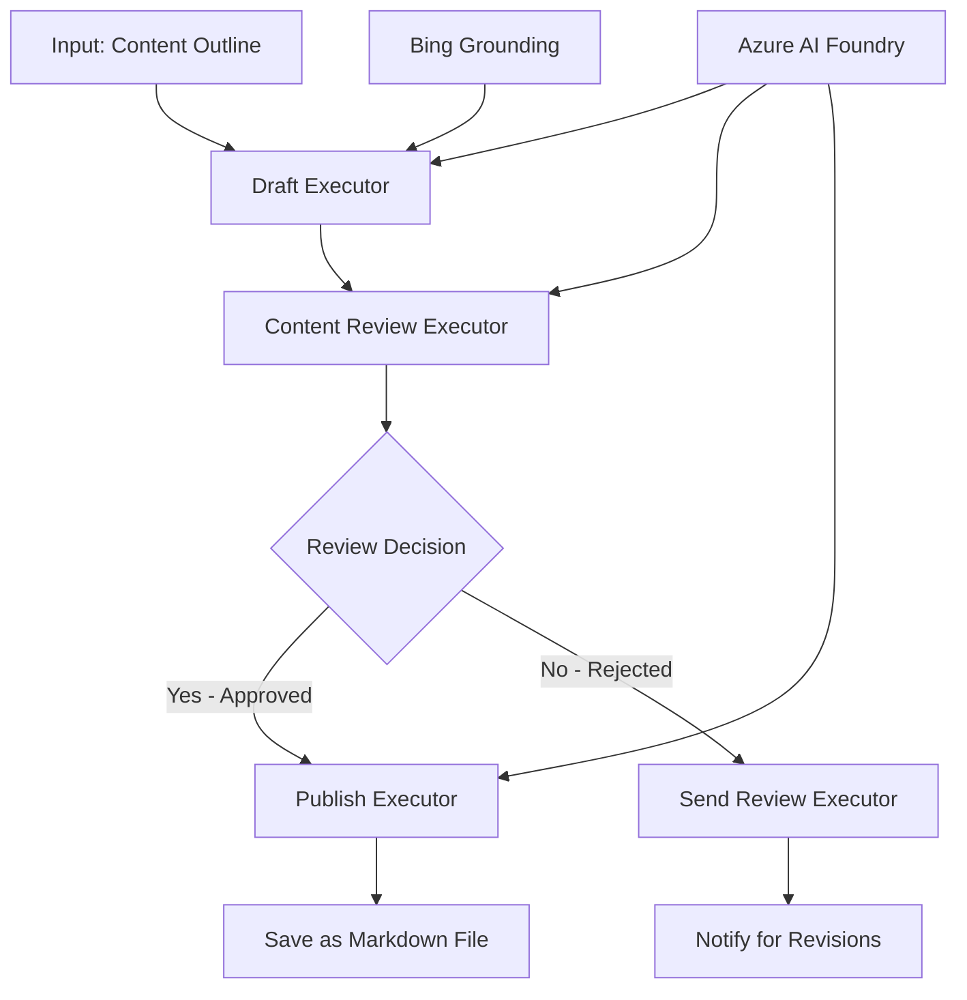

<!--
CO_OP_TRANSLATOR_METADATA:
{
  "original_hash": "8abd335151cee553293b637ee3d80d10",
  "translation_date": "2025-11-11T11:59:50+00:00",
  "source_file": "08-multi-agent/code_samples/workflows-agent-framework/dotNET/04.dotnet-agent-framework-workflow-aifoundry-condition.md",
  "language_code": "fr"
}
-->
# 🔀 Flux de travail conditionnel des agents avec Azure AI Foundry (.NET)

## 📋 Tutoriel sur les flux de travail basés sur des décisions intelligentes

Ce notebook démontre des **modèles de flux de travail conditionnels** en utilisant Azure AI Foundry et le Microsoft Agent Framework pour .NET. Vous apprendrez à construire des flux de travail sophistiqués, basés sur des décisions, qui orientent intelligemment le traitement en fonction de l'analyse IA, des règles métier et des conditions dynamiques pour une automatisation de niveau entreprise.

## 🎯 Objectifs d'apprentissage

### 🧠 **Architecture de décision intelligente**
- **Implémentation de logique conditionnelle** : Construire des arbres de décision complexes avec plusieurs points de branchement
- **Routage alimenté par l'IA** : Utiliser les modèles Azure AI Foundry pour prendre des décisions de routage intelligentes
- **Adaptation dynamique des flux de travail** : Modifier le comportement des flux de travail en fonction de l'analyse et des conditions en temps réel
- **Intégration des règles d'entreprise** : Incorporer la logique métier et les exigences de conformité dans les flux de travail

### 🔀 **Modèles conditionnels avancés**
- **Prise de décision multicritères** : Évaluer plusieurs facteurs pour les décisions de routage
- **Traitement contextuel** : Prendre des décisions basées sur le contexte et l'historique accumulés du flux de travail
- **Modification adaptative des flux de travail** : Ajuster dynamiquement les chemins de traitement en fonction des conditions en temps réel
- **Intégration de moteur de règles** : Implémenter des moteurs de règles métier sophistiqués dans les flux de travail

### 🏢 **Applications conditionnelles en entreprise**
- **Classification et routage des documents** : Classer et acheminer automatiquement les documents vers les flux de travail appropriés
- **Triage du service client** : Routage intelligent des demandes des clients vers des équipes spécialisées
- **Traitement de conformité et des risques** : Appliquer différents processus de validation et de révision en fonction de l'évaluation des risques
- **Flux de travail d'assurance qualité** : Acheminer le contenu à travers les processus de révision appropriés en fonction des métriques de qualité

## ⚙️ Prérequis et configuration

### 📦 **Packages NuGet requis**

Packages avancés pour le traitement des flux de travail conditionnels :

```xml
<!-- Core AI Framework -->
<PackageReference Include="Microsoft.Extensions.AI" Version="9.9.0" />

<!-- Azure AI Agents with Persistent State -->
<PackageReference Include="Azure.AI.Agents.Persistent" Version="1.2.0-beta.5" />

<!-- Azure Identity and Utilities -->
<PackageReference Include="Azure.Identity" Version="1.15.0" />
<PackageReference Include="System.Linq.Async" Version="6.0.3" />
<PackageReference Include="DotNetEnv" Version="3.1.1" />

<!-- Local Workflow Framework References -->
<!-- Microsoft.Agents.Workflows.dll - Advanced workflow orchestration -->
<!-- Microsoft.Agents.AI.AzureAI.dll - Azure AI Foundry integration -->
<!-- Microsoft.Agents.AI.dll - Core agent abstractions -->
```

### 🔑 **Configuration Azure AI Foundry**

**Ressources Azure requises :**
- Espace de travail Azure AI Foundry avec des modèles de traitement conditionnel
- Abonnement Azure avec quotas de calcul et autorisations appropriés
- Modèles IA déployés pour la prise de décision et l'analyse de contenu
- (Optionnel) Connexion à l'API Bing Search pour des capacités de recherche contextuelle

**Configuration de l'environnement (fichier .env) :**
```env
# Azure AI Foundry Configuration
AZURE_AI_PROJECT_ENDPOINT=https://your-project.cognitiveservices.azure.com/
BING_CONNECTION_ID=your-bing-connection-id
```

**Configuration de l'authentification :**
```csharp
// Azure CLI or Managed Identity authentication
using Azure.Identity;
var credential = new AzureCliCredential();

// Load environment configuration
DotNetEnv.Env.Load("../../../.env");
```

### 🏗️ **Architecture des flux de travail conditionnels**



**Composants clés :**
- **Draft Executor** : Agent IA qui crée des brouillons de contenu à partir de plans
- **Content Review Executor** : Agent IA qui évalue la qualité et la conformité des brouillons
- **Routage conditionnel** : Logique de décision qui oriente en fonction des résultats de la révision
- **Chemins de publication/révision** : Chemins de traitement séparés pour le contenu approuvé ou rejeté
- **Gestion des états** : Maintient le contexte du contenu et de la révision tout au long du flux de travail

## 🎨 **Modèles de conception de flux de travail conditionnels**

### 📋 **Production de contenu avec des seuils de qualité**
```
Outline → Draft Creation → Quality Review → {Approve: Publish | Reject: Revise}
```

### 🎯 **Traitement des documents basé sur les risques**
```
Document → Risk Assessment → {Low: Standard | High: Enhanced Review}
```

### 🔍 **Routage intelligent du service client**
```
Customer Query → Analysis → {Simple: FAQ Bot | Complex: Human Agent}
```

### 💼 **Flux de travail axés sur la conformité**
```
Content → Compliance Check → {Pass: Publish | Fail: Legal Review}
```

## 🏢 **Avantages conditionnels pour l'entreprise**

### 🎯 **Automatisation intelligente**
- **Prise de décision intelligente** : Décisions de routage alimentées par l'IA basées sur l'analyse du contenu et le contexte
- **Traitement adaptatif** : Flux de travail qui s'ajustent automatiquement en fonction des conditions changeantes
- **Application des règles métier** : Application automatique de logiques métier complexes et de politiques
- **Routage contextuel** : Décisions basées sur l'historique complet du flux de travail et le contexte accumulé

### 📈 **Excellence opérationnelle**
- **Allocation optimisée des ressources** : Acheminer le travail vers les spécialistes et processus les plus appropriés
- **Réduction de l'intervention manuelle** : La prise de décision automatisée minimise le besoin de routage humain
- **Temps de résolution plus rapides** : Routage direct vers l'expertise et les capacités de traitement appropriées
- **Application cohérente** : Application uniforme des règles métier et des critères de décision

### 🛡️ **Gestion des risques et conformité**
- **Évaluation automatisée des risques** : Évaluation alimentée par l'IA des niveaux de risque du contenu et des situations
- **Application de la conformité** : Routage automatique à travers les processus réglementaires requis
- **Application des protocoles de sécurité** : Mesures de sécurité renforcées appliquées en fonction de l'évaluation des risques
- **Maintien des traces d'audit** : Documentation complète des décisions de routage et de leur justification

### 📊 **Analytique et amélioration continue**
- **Analytique des décisions** : Suivre l'efficacité et la précision des décisions de routage
- **Reconnaissance des modèles** : Identifier les tendances et les modèles dans les décisions de routage au fil du temps
- **Optimisation des performances** : Amélioration continue des critères de décision et de l'efficacité du routage
- **Intelligence d'affaires** : Aperçus sur les caractéristiques du contenu et les exigences de traitement

### 🔧 **Excellence technique**
- **Gestion persistante des états** : Maintenir des états complexes tout au long de l'exécution du flux de travail
- **Architecture évolutive** : Gérer des exigences de traitement conditionnel à haut volume
- **Capacités d'intégration** : Intégration transparente avec les systèmes et processus métier existants
- **Surveillance et observabilité** : Suivi complet des performances et des décisions du flux de travail

Construisons des flux de travail intelligents et basés sur des décisions pour les entreprises avec .NET ! 🚀

## 💻 Exécution du code

La mise en œuvre complète est disponible dans `04.dotnet-agent-framework-workflow-aifoundry-condition.cs`. Cela démontre un **flux de travail de production de contenu avec des seuils de qualité** :

### 🏗️ **Architecture du flux de travail**

```
Content Outline → Draft Creation → Quality Review → Conditional Routing:
                                                      ├─ Approved (>200 words) → Publish
                                                      └─ Rejected (<200 words) → Review Notification
```

**Agents dans le flux de travail :**
1. **Agent Évangéliste** : Crée des brouillons de tutoriels à partir de plans avec Bing grounding
2. **Agent Réviseur de contenu** : Évalue la qualité des brouillons (nombre de mots, complétude)
3. **Agent Éditeur** : Enregistre le contenu approuvé sous forme de fichiers Markdown horodatés

**Exécuteurs personnalisés :**
1. **DraftExecutor** : Orchestre la création de brouillons
2. **ContentReviewExecutor** : Effectue l'évaluation de la qualité
3. **PublishExecutor** : Gère la publication du contenu approuvé
4. **SendReviewExecutor** : Gère les notifications de contenu rejeté

### 🚀 Exécution de l'exemple

**Prérequis :**
- Espace de travail Azure AI Foundry configuré
- Authentification Azure CLI (`az login`)
- (Optionnel) Connexion Bing Search pour grounding

```bash
# Make the script executable (Unix/Linux/macOS)
chmod +x 04.dotnet-agent-framework-workflow-aifoundry-condition.cs

# Run the conditional workflow
./04.dotnet-agent-framework-workflow-aifoundry-condition.cs
```

Ou sur Windows :
```powershell
dotnet run 04.dotnet-agent-framework-workflow-aifoundry-condition.cs
```

### 📝 Résultat attendu

Le flux de travail :
1. **Crée des agents** : Initialise trois agents spécialisés Azure AI Foundry
2. **Génère un brouillon** : L'agent Évangéliste crée un brouillon de tutoriel à partir d'un plan
3. **Révise le contenu** : L'agent Réviseur de contenu évalue la qualité du brouillon
4. **Routage conditionnel** :
   - **Si approuvé (>200 mots)** : L'exécuteur de publication enregistre sous forme de fichier Markdown
   - **Si rejeté (<200 mots)** : Notification de révision envoyée
5. **Affiche les résultats** : Montre le résultat final du flux de travail

### 🔧 Options de personnalisation

**Modifier les critères de révision :**
```csharp
const string ContentReviewerInstructions = @"
You are a content reviewer...
1. Check if content is more than 500 words (instead of 200)
2. Verify technical accuracy
3. Ensure proper formatting
...";
```

**Ajouter plus de chemins conditionnels :**
```csharp
var workflow = new WorkflowBuilder(draftExecutor)
    .AddEdge(draftExecutor, contentReviewerExecutor)
    .AddEdge(contentReviewerExecutor, publishExecutor, condition: GetCondition("Excellent"))
    .AddEdge(contentReviewerExecutor, editExecutor, condition: GetCondition("Good"))
    .AddEdge(contentReviewerExecutor, sendReviewerExecutor, condition: GetCondition("Poor"))
    .Build();
```

**Changer les exigences de contenu :**
```csharp
string OUTLINE_Content = @"
# Your Custom Topic
## Section 1
https://your-reference-url
## Section 2
...
";
```

### 🎯 Applications réelles

Ce modèle de flux de travail conditionnel est idéal pour :
- **Systèmes de gestion de contenu** : Flux éditoriaux automatisés avec seuils de qualité
- **Traitement de documents** : Acheminer les documents en fonction de la classification et de la conformité
- **Support client** : Routage intelligent des tickets en fonction de la complexité et de l'urgence
- **Révision juridique** : Acheminer les contrats en fonction de l'évaluation des risques et de la valeur
- **Processus RH** : Acheminer les candidatures à travers des flux de sélection appropriés

### 🔍 Comprendre la logique conditionnelle

**Fonction de condition :**
```csharp
public Func<object?, bool> GetCondition(string expectedResult) =>
    reviewResult => reviewResult is ReviewResult review && review.Result == expectedResult;
```

Cette fonction crée un prédicat qui :
1. Vérifie si le résultat est de type `ReviewResult`
2. Compare la propriété `Result` à la valeur attendue
3. Retourne vrai/faux pour déterminer le routage

**Bords du flux de travail avec conditions :**
```csharp
.AddEdge(contentReviewerExecutor, publishExecutor, condition: GetCondition("Yes"))
.AddEdge(contentReviewerExecutor, sendReviewerExecutor, condition: GetCondition("No"))
```

### 📊 Fonctionnalités avancées

**Validation du schéma JSON :**
Le flux de travail utilise des schémas JSON pour garantir des réponses structurées :

```csharp
// Define response structure
public class ReviewResult
{
    [JsonPropertyName("review_result")]
    public string Result { get; set; } = string.Empty;
    
    [JsonPropertyName("reason")]
    public string Reason { get; set; } = string.Empty;
    
    [JsonPropertyName("draft_content")]
    public string DraftContent { get; set; } = string.Empty;
}

// Apply to agent
ResponseFormat = ChatResponseFormat.ForJsonSchema(
    AIJsonUtilities.CreateJsonSchema(typeof(ReviewResult)), 
    "ReviewResult", 
    "Review Result From DraftContent"
)
```

**Intégration Bing Grounding :**
L'agent Évangéliste utilise Bing grounding pour accéder à des informations en temps réel :

```csharp
var bingGroundingConfig = new BingGroundingSearchConfiguration(bing_conn_id);
BingGroundingToolDefinition bingGroundingTool = new(
    new BingGroundingSearchToolParameters([bingGroundingConfig])
);
```

Cela permet à l'agent de suivre les URL dans le plan et d'extraire des informations actuelles.

### 🛡️ Gestion des erreurs

Le flux de travail inclut une gestion robuste des erreurs pour le contenu rejeté :
- Les échecs de révision déclenchent le chemin alternatif
- Les notifications fournissent des raisons claires de rejet
- Le contenu est conservé pour révision

### 🔄 Extension du flux de travail

**Ajouter une boucle de révision :**
Créer une boucle de rétroaction qui recrée automatiquement le contenu :

```csharp
.AddEdge(contentReviewerExecutor, publishExecutor, condition: GetCondition("Yes"))
.AddEdge(contentReviewerExecutor, draftExecutor, condition: GetCondition("No")) // Loop back
```

**Implémenter une révision à plusieurs niveaux :**
Ajouter plusieurs étapes de révision avec différents critères :

```csharp
.AddEdge(draftExecutor, technicalReviewer)
.AddEdge(technicalReviewer, editorialReviewer, condition: GetCondition("TechPass"))
.AddEdge(editorialReviewer, publishExecutor, condition: GetCondition("EditPass"))
```

Ce modèle de flux de travail conditionnel fournit la base pour construire des systèmes d'automatisation sophistiqués et intelligents pour les entreprises ! 🚀

---

<!-- CO-OP TRANSLATOR DISCLAIMER START -->
**Avertissement** :  
Ce document a été traduit à l'aide du service de traduction automatique [Co-op Translator](https://github.com/Azure/co-op-translator). Bien que nous nous efforcions d'assurer l'exactitude, veuillez noter que les traductions automatisées peuvent contenir des erreurs ou des inexactitudes. Le document original dans sa langue d'origine doit être considéré comme la source faisant autorité. Pour des informations critiques, il est recommandé de recourir à une traduction humaine professionnelle. Nous ne sommes pas responsables des malentendus ou des interprétations erronées résultant de l'utilisation de cette traduction.
<!-- CO-OP TRANSLATOR DISCLAIMER END -->