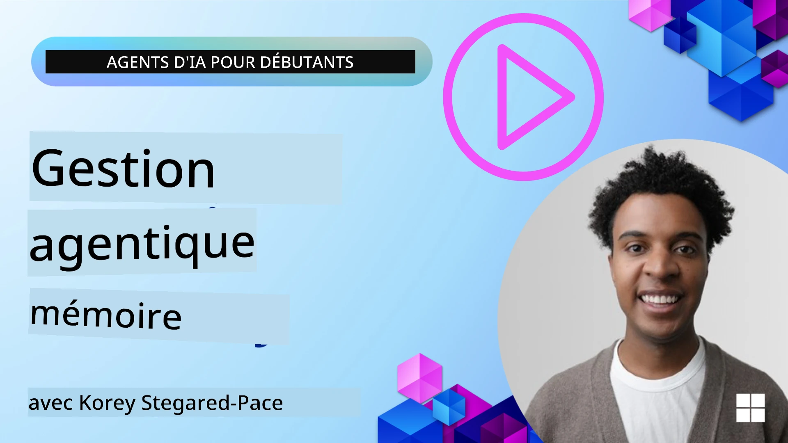

<!--
CO_OP_TRANSLATOR_METADATA:
{
  "original_hash": "a1d90991499ad697c4ad24decaf36968",
  "translation_date": "2025-12-09T11:45:55+00:00",
  "source_file": "13-agent-memory/README.md",
  "language_code": "fr"
}
-->
# Mémoire pour les Agents IA 

Lorsqu'on parle des avantages uniques de la création d'Agents IA, deux aspects sont principalement abordés : la capacité d'utiliser des outils pour accomplir des tâches et la capacité de s'améliorer avec le temps. La mémoire est au cœur de la création d'agents auto-améliorants qui peuvent offrir de meilleures expériences à nos utilisateurs.

Dans cette leçon, nous examinerons ce qu'est la mémoire pour les Agents IA, comment la gérer et l'utiliser pour améliorer nos applications.

## Introduction

Cette leçon couvrira :

• **Comprendre la mémoire des Agents IA** : Ce qu'est la mémoire et pourquoi elle est essentielle pour les agents.

• **Implémenter et stocker la mémoire** : Méthodes pratiques pour ajouter des capacités de mémoire à vos agents IA, en se concentrant sur la mémoire à court et à long terme.

• **Rendre les Agents IA auto-améliorants** : Comment la mémoire permet aux agents d'apprendre des interactions passées et de s'améliorer avec le temps.

## Implémentations disponibles

Cette leçon inclut deux tutoriels complets sous forme de notebooks :

• **[13-agent-memory.ipynb](./13-agent-memory.ipynb)** : Implémente la mémoire en utilisant Mem0 et Azure AI Search avec le framework Semantic Kernel.

• **[13-agent-memory-cognee.ipynb](./13-agent-memory-cognee.ipynb)** : Implémente une mémoire structurée avec Cognee, construisant automatiquement un graphe de connaissances basé sur des embeddings, visualisant le graphe et permettant une récupération intelligente.

## Objectifs d'apprentissage

Après avoir terminé cette leçon, vous saurez :

• **Différencier les différents types de mémoire des agents IA**, y compris la mémoire de travail, à court terme, à long terme, ainsi que des formes spécialisées comme la mémoire de persona et épisodique.

• **Implémenter et gérer la mémoire à court et à long terme pour les agents IA** en utilisant le framework Semantic Kernel, en exploitant des outils comme Mem0, Cognee, la mémoire Whiteboard, et en intégrant Azure AI Search.

• **Comprendre les principes des agents IA auto-améliorants** et comment des systèmes de gestion de mémoire robustes contribuent à l'apprentissage et à l'adaptation continus.

## Comprendre la mémoire des Agents IA

Au cœur de tout cela, **la mémoire pour les agents IA fait référence aux mécanismes qui leur permettent de retenir et de rappeler des informations**. Ces informations peuvent inclure des détails spécifiques sur une conversation, les préférences des utilisateurs, des actions passées ou même des schémas appris.

Sans mémoire, les applications IA sont souvent sans état, ce qui signifie que chaque interaction commence à zéro. Cela conduit à une expérience utilisateur répétitive et frustrante où l'agent "oublie" le contexte ou les préférences précédentes.

### Pourquoi la mémoire est-elle importante ?

L'intelligence d'un agent est étroitement liée à sa capacité à se souvenir et à utiliser des informations passées. La mémoire permet aux agents d'être :

• **Réfléchis** : Apprendre des actions et résultats passés.

• **Interactifs** : Maintenir le contexte au cours d'une conversation en cours.

• **Proactifs et réactifs** : Anticiper les besoins ou répondre de manière appropriée en fonction des données historiques.

• **Autonomes** : Fonctionner de manière plus indépendante en s'appuyant sur des connaissances stockées.

L'objectif de l'implémentation de la mémoire est de rendre les agents plus **fiables et compétents**.

### Types de mémoire

#### Mémoire de travail

Pensez à cela comme à une feuille de brouillon qu'un agent utilise pendant une tâche ou un processus de réflexion en cours. Elle contient les informations immédiates nécessaires pour calculer l'étape suivante.

Pour les agents IA, la mémoire de travail capture souvent les informations les plus pertinentes d'une conversation, même si l'historique complet du chat est long ou tronqué. Elle se concentre sur l'extraction des éléments clés comme les exigences, les propositions, les décisions et les actions.

**Exemple de mémoire de travail**

Dans un agent de réservation de voyage, la mémoire de travail pourrait capturer la demande actuelle de l'utilisateur, comme "Je veux réserver un voyage à Paris". Cette exigence spécifique est conservée dans le contexte immédiat de l'agent pour guider l'interaction en cours.

#### Mémoire à court terme

Ce type de mémoire conserve les informations pendant la durée d'une seule conversation ou session. C'est le contexte du chat actuel, permettant à l'agent de se référer aux tours précédents du dialogue.

**Exemple de mémoire à court terme**

Si un utilisateur demande : "Combien coûterait un vol pour Paris ?" puis enchaîne avec "Et pour l'hébergement là-bas ?", la mémoire à court terme garantit que l'agent sait que "là-bas" fait référence à "Paris" dans la même conversation.

#### Mémoire à long terme

C'est une information qui persiste à travers plusieurs conversations ou sessions. Elle permet aux agents de se souvenir des préférences des utilisateurs, des interactions historiques ou des connaissances générales sur de longues périodes. Cela est important pour la personnalisation.

**Exemple de mémoire à long terme**

Une mémoire à long terme pourrait stocker que "Ben aime le ski et les activités de plein air, préfère le café avec vue sur la montagne, et veut éviter les pistes de ski avancées en raison d'une blessure passée". Ces informations, apprises lors d'interactions précédentes, influencent les recommandations lors de futures sessions de planification de voyage, les rendant hautement personnalisées.

#### Mémoire de persona

Ce type de mémoire spécialisé aide un agent à développer une "personnalité" ou un "persona" cohérent. Elle permet à l'agent de se souvenir de détails sur lui-même ou sur son rôle prévu, rendant les interactions plus fluides et ciblées.

**Exemple de mémoire de persona**

Si l'agent de voyage est conçu pour être un "expert en planification de ski", la mémoire de persona pourrait renforcer ce rôle, influençant ses réponses pour qu'elles correspondent au ton et aux connaissances d'un expert.

#### Mémoire de workflow/épisodique

Cette mémoire stocke la séquence des étapes qu'un agent suit lors d'une tâche complexe, y compris les succès et les échecs. C'est comme se souvenir d'"épisodes" spécifiques ou d'expériences passées pour en tirer des leçons.

**Exemple de mémoire épisodique**

Si l'agent a tenté de réserver un vol spécifique mais a échoué en raison d'une indisponibilité, la mémoire épisodique pourrait enregistrer cet échec, permettant à l'agent d'essayer des vols alternatifs ou d'informer l'utilisateur du problème de manière plus éclairée lors d'une tentative ultérieure.

#### Mémoire d'entité

Cela implique d'extraire et de se souvenir d'entités spécifiques (comme des personnes, des lieux ou des objets) et d'événements issus des conversations. Cela permet à l'agent de construire une compréhension structurée des éléments clés discutés.

**Exemple de mémoire d'entité**

À partir d'une conversation sur un voyage passé, l'agent pourrait extraire "Paris", "Tour Eiffel" et "dîner au restaurant Le Chat Noir" comme entités. Lors d'une interaction future, l'agent pourrait se souvenir de "Le Chat Noir" et proposer de faire une nouvelle réservation là-bas.

#### RAG structuré (Retrieval Augmented Generation)

Bien que le RAG soit une technique plus large, le "RAG structuré" est mis en avant comme une technologie de mémoire puissante. Il extrait des informations denses et structurées de diverses sources (conversations, e-mails, images) et les utilise pour améliorer la précision, le rappel et la rapidité des réponses. Contrairement au RAG classique qui repose uniquement sur la similarité sémantique, le RAG structuré travaille avec la structure inhérente des informations.

**Exemple de RAG structuré**

Au lieu de simplement faire correspondre des mots-clés, le RAG structuré pourrait analyser les détails d'un vol (destination, date, heure, compagnie aérienne) à partir d'un e-mail et les stocker de manière structurée. Cela permet des requêtes précises comme "Quel vol ai-je réservé pour Paris mardi ?"

## Implémenter et stocker la mémoire

Implémenter la mémoire pour les agents IA implique un processus systématique de **gestion de la mémoire**, qui inclut la génération, le stockage, la récupération, l'intégration, la mise à jour, et même "l'oubli" (ou la suppression) des informations. La récupération est un aspect particulièrement crucial.

### Outils spécialisés pour la mémoire

#### Mem0

Une façon de stocker et de gérer la mémoire des agents est d'utiliser des outils spécialisés comme Mem0. Mem0 fonctionne comme une couche de mémoire persistante, permettant aux agents de rappeler des interactions pertinentes, de stocker les préférences des utilisateurs et le contexte factuel, et d'apprendre des succès et des échecs au fil du temps. L'idée ici est que les agents sans état deviennent des agents avec état.

Il fonctionne via un **pipeline de mémoire en deux phases : extraction et mise à jour**. Tout d'abord, les messages ajoutés au fil de discussion d'un agent sont envoyés au service Mem0, qui utilise un Large Language Model (LLM) pour résumer l'historique des conversations et extraire de nouveaux souvenirs. Ensuite, une phase de mise à jour pilotée par LLM détermine s'il faut ajouter, modifier ou supprimer ces souvenirs, en les stockant dans un magasin de données hybride qui peut inclure des bases de données vectorielles, graphiques et clé-valeur. Ce système prend également en charge divers types de mémoire et peut intégrer une mémoire graphique pour gérer les relations entre les entités.

#### Cognee

Une autre approche puissante consiste à utiliser **Cognee**, une mémoire sémantique open-source pour les agents IA qui transforme les données structurées et non structurées en graphes de connaissances interrogeables soutenus par des embeddings. Cognee offre une **architecture à double stockage** combinant la recherche par similarité vectorielle avec les relations graphiques, permettant aux agents de comprendre non seulement quelles informations sont similaires, mais aussi comment les concepts sont liés entre eux.

Il excelle dans la **récupération hybride** qui mélange la similarité vectorielle, la structure graphique et le raisonnement LLM - depuis la recherche brute de morceaux jusqu'à des réponses aux questions tenant compte du graphe. Le système maintient une **mémoire vivante** qui évolue et grandit tout en restant interrogeable comme un graphe connecté, prenant en charge à la fois le contexte de session à court terme et la mémoire persistante à long terme.

Le tutoriel du notebook Cognee ([13-agent-memory-cognee.ipynb](./13-agent-memory-cognee.ipynb)) démontre la construction de cette couche de mémoire unifiée, avec des exemples pratiques d'ingestion de diverses sources de données, de visualisation du graphe de connaissances et d'interrogation avec différentes stratégies de recherche adaptées aux besoins spécifiques des agents.

### Stocker la mémoire avec RAG

Au-delà des outils spécialisés comme Mem0, vous pouvez exploiter des services de recherche robustes comme **Azure AI Search en tant que backend pour stocker et récupérer des souvenirs**, en particulier pour le RAG structuré.

Cela vous permet d'ancrer les réponses de votre agent avec vos propres données, garantissant des réponses plus pertinentes et précises. Azure AI Search peut être utilisé pour stocker des souvenirs de voyage spécifiques à l'utilisateur, des catalogues de produits ou toute autre connaissance spécifique à un domaine.

Azure AI Search prend en charge des fonctionnalités comme le **RAG structuré**, qui excelle à extraire et récupérer des informations denses et structurées à partir de grands ensembles de données comme les historiques de conversation, les e-mails ou même les images. Cela offre une "précision et un rappel surhumains" par rapport aux approches traditionnelles de découpage de texte et d'embedding.

## Rendre les Agents IA auto-améliorants

Un modèle courant pour les agents auto-améliorants consiste à introduire un **"agent de connaissances"**. Cet agent distinct observe la conversation principale entre l'utilisateur et l'agent principal. Son rôle est de :

1. **Identifier les informations précieuses** : Déterminer si une partie de la conversation mérite d'être sauvegardée comme connaissance générale ou préférence spécifique de l'utilisateur.

2. **Extraire et résumer** : Distinguer l'apprentissage ou la préférence essentielle de la conversation.

3. **Stocker dans une base de connaissances** : Conserver ces informations extraites, souvent dans une base de données vectorielle, pour qu'elles puissent être récupérées plus tard.

4. **Augmenter les requêtes futures** : Lorsque l'utilisateur initie une nouvelle requête, l'agent de connaissances récupère les informations stockées pertinentes et les ajoute à l'invite de l'utilisateur, fournissant un contexte crucial à l'agent principal (similaire au RAG).

### Optimisations pour la mémoire

• **Gestion de la latence** : Pour éviter de ralentir les interactions utilisateur, un modèle moins coûteux et plus rapide peut être utilisé initialement pour vérifier rapidement si une information vaut la peine d'être stockée ou récupérée, en n'invoquant le processus d'extraction/récupération plus complexe que si nécessaire.

• **Maintenance de la base de connaissances** : Pour une base de connaissances en croissance, les informations moins fréquemment utilisées peuvent être déplacées vers un "stockage à froid" pour gérer les coûts.

## Vous avez d'autres questions sur la mémoire des agents ?

Rejoignez le [Discord Azure AI Foundry](https://aka.ms/ai-agents/discord) pour rencontrer d'autres apprenants, assister à des heures de bureau et obtenir des réponses à vos questions sur les Agents IA.

---

<!-- CO-OP TRANSLATOR DISCLAIMER START -->
**Avertissement** :  
Ce document a été traduit à l'aide du service de traduction automatique [Co-op Translator](https://github.com/Azure/co-op-translator). Bien que nous nous efforcions d'assurer l'exactitude, veuillez noter que les traductions automatisées peuvent contenir des erreurs ou des inexactitudes. Le document original dans sa langue d'origine doit être considéré comme la source faisant autorité. Pour des informations critiques, il est recommandé de recourir à une traduction humaine professionnelle. Nous ne sommes pas responsables des malentendus ou des interprétations erronées résultant de l'utilisation de cette traduction.
<!-- CO-OP TRANSLATOR DISCLAIMER END -->