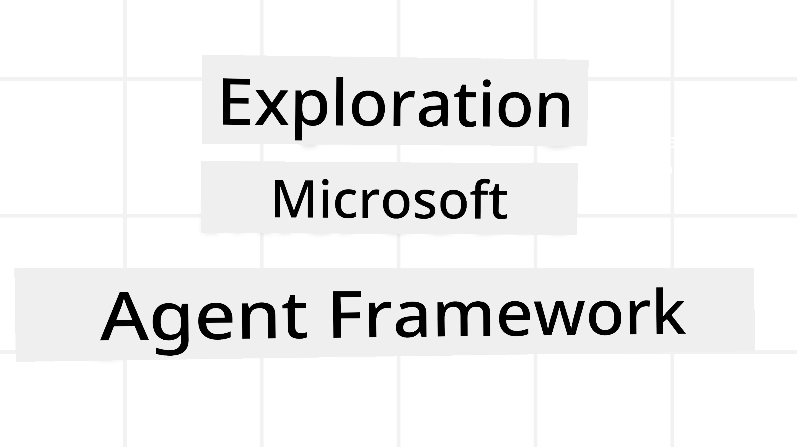
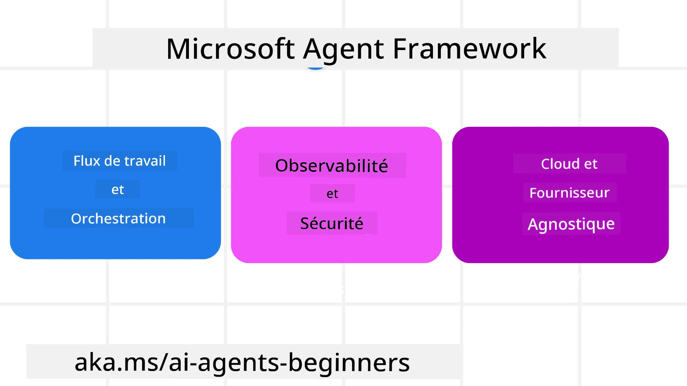
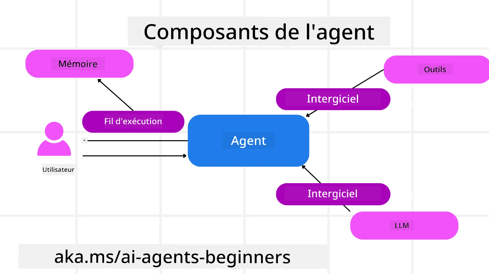

<!--
CO_OP_TRANSLATOR_METADATA:
{
  "original_hash": "19c4dab375acbc733855cc7f2f04edbc",
  "translation_date": "2025-10-01T21:43:48+00:00",
  "source_file": "14-microsoft-agent-framework/README.md",
  "language_code": "fr"
}
-->
# Exploration du Microsoft Agent Framework



### Introduction

Cette leçon couvrira :

- Comprendre le Microsoft Agent Framework : caractéristiques clés et valeur ajoutée  
- Explorer les concepts clés du Microsoft Agent Framework
- Comparer MAF au Semantic Kernel et à AutoGen : guide de migration

## Objectifs d'apprentissage

Après avoir terminé cette leçon, vous saurez :

- Construire des agents IA prêts pour la production en utilisant le Microsoft Agent Framework
- Appliquer les fonctionnalités principales du Microsoft Agent Framework à vos cas d'utilisation agentiques
- Migrer et intégrer des frameworks et outils agentiques existants  

## Exemples de code 

Les exemples de code pour le [Microsoft Agent Framework (MAF)](https://aka.ms/ai-agents-beginners/agent-framewrok) se trouvent dans ce dépôt sous les fichiers `xx-python-agent-framework` et `xx-dotnet-agent-framework`.

## Comprendre le Microsoft Agent Framework



Le [Microsoft Agent Framework (MAF)](https://aka.ms/ai-agents-beginners/agent-framewrok) s'appuie sur l'expérience et les enseignements tirés du Semantic Kernel et d'AutoGen. Il offre la flexibilité nécessaire pour répondre à une grande variété de cas d'utilisation agentiques, tant en production qu'en recherche, notamment :

- **Orchestration séquentielle des agents** dans des scénarios nécessitant des workflows étape par étape.
- **Orchestration concurrente** dans des scénarios où les agents doivent accomplir des tâches simultanément.
- **Orchestration de chat de groupe** dans des scénarios où les agents collaborent sur une tâche commune.
- **Orchestration par transfert** dans des scénarios où les agents se transmettent les tâches une fois les sous-tâches terminées.
- **Orchestration magnétique** dans des scénarios où un agent gestionnaire crée et modifie une liste de tâches et coordonne les sous-agents pour accomplir ces tâches.

Pour déployer des agents IA en production, MAF inclut également des fonctionnalités telles que :

- **Observabilité** grâce à l'utilisation d'OpenTelemetry, permettant de suivre chaque action de l'agent IA, y compris l'invocation d'outils, les étapes d'orchestration, les flux de raisonnement et la surveillance des performances via les tableaux de bord Azure AI Foundry.
- **Sécurité** en hébergeant les agents nativement sur Azure AI Foundry, avec des contrôles de sécurité tels que l'accès basé sur les rôles, la gestion des données privées et la sécurité intégrée des contenus.
- **Durabilité** permettant aux threads et workflows des agents de se mettre en pause, de reprendre et de récupérer après des erreurs, ce qui facilite les processus de longue durée.
- **Contrôle** grâce au support des workflows avec intervention humaine, où les tâches nécessitent une approbation humaine.

Le Microsoft Agent Framework est également conçu pour être interopérable grâce à :

- **Une indépendance vis-à-vis du cloud** - Les agents peuvent fonctionner dans des conteneurs, sur site et sur différents clouds.
- **Une indépendance vis-à-vis des fournisseurs** - Les agents peuvent être créés via votre SDK préféré, y compris Azure OpenAI et OpenAI.
- **L'intégration de standards ouverts** - Les agents peuvent utiliser des protocoles tels que Agent-to-Agent (A2A) et Model Context Protocol (MCP) pour découvrir et utiliser d'autres agents et outils.
- **Plugins et connecteurs** - Des connexions peuvent être établies avec des services de données et de mémoire tels que Microsoft Fabric, SharePoint, Pinecone et Qdrant.

Voyons comment ces fonctionnalités s'appliquent à certains des concepts clés du Microsoft Agent Framework.

## Concepts clés du Microsoft Agent Framework

### Agents



**Créer des agents**

La création d'agents se fait en définissant le service d'inférence (fournisseur LLM), un ensemble d'instructions que l'agent IA doit suivre, et un `nom` assigné :

```python
agent = AzureOpenAIChatClient(credential=AzureCliCredential()).create_agent( instructions="You are good at recommending trips to customers based on their preferences.", name="TripRecommender" )
```

L'exemple ci-dessus utilise `Azure OpenAI`, mais les agents peuvent être créés en utilisant divers services, y compris `Azure AI Foundry Agent Service` :

```python
AzureAIAgentClient(async_credential=credential).create_agent( name="HelperAgent", instructions="You are a helpful assistant." ) as agent
```

Les API `Responses` et `ChatCompletion` d'OpenAI

```python
agent = OpenAIResponsesClient().create_agent( name="WeatherBot", instructions="You are a helpful weather assistant.", )
```

```python
agent = OpenAIChatClient().create_agent( name="HelpfulAssistant", instructions="You are a helpful assistant.", )
```

ou des agents distants utilisant le protocole A2A :

```python
agent = A2AAgent( name=agent_card.name, description=agent_card.description, agent_card=agent_card, url="https://your-a2a-agent-host" )
```

**Exécuter des agents**

Les agents sont exécutés en utilisant les méthodes `.run` ou `.run_stream` pour des réponses non-streaming ou streaming.

```python
result = await agent.run("What are good places to visit in Amsterdam?")
print(result.text)
```

```python
async for update in agent.run_stream("What are the good places to visit in Amsterdam?"):
    if update.text:
        print(update.text, end="", flush=True)

```

Chaque exécution d'agent peut également inclure des options pour personnaliser des paramètres tels que `max_tokens` utilisés par l'agent, les `tools` que l'agent peut appeler, et même le `model` lui-même utilisé par l'agent.

Cela est utile dans les cas où des modèles ou outils spécifiques sont nécessaires pour accomplir une tâche utilisateur.

**Outils**

Les outils peuvent être définis à la fois lors de la définition de l'agent :

```python
def get_attractions( location: Annotated[str, Field(description="The location to get the top tourist attractions for")], ) -> str: """Get the top tourist attractions for a given location.""" return f"The top attractions for {location} are." 


# When creating a ChatAgent directly 

agent = ChatAgent( chat_client=OpenAIChatClient(), instructions="You are a helpful assistant", tools=[get_attractions]

```

et également lors de l'exécution de l'agent :

```python

result1 = await agent.run( "What's the best place to visit in Seattle?", tools=[get_attractions] # Tool provided for this run only )
```

**Threads d'agents**

Les threads d'agents sont utilisés pour gérer des conversations multi-tours. Les threads peuvent être créés soit en utilisant `get_new_thread()` qui permet de sauvegarder le thread au fil du temps, soit en créant automatiquement un thread lors de l'exécution d'un agent, le thread ne durant que pendant l'exécution en cours.

Pour créer un thread, le code ressemble à ceci :

```python
# Create a new thread. 
thread = agent.get_new_thread() # Run the agent with the thread. 
response = await agent.run("Hello, I am here to help you book travel. Where would you like to go?", thread=thread)

```

Vous pouvez ensuite sérialiser le thread pour le stocker et l'utiliser ultérieurement :

```python
# Create a new thread. 
thread = agent.get_new_thread() 

# Run the agent with the thread. 

response = await agent.run("Hello, how are you?", thread=thread) 

# Serialize the thread for storage. 

serialized_thread = await thread.serialize() 

# Deserialize the thread state after loading from storage. 

resumed_thread = await agent.deserialize_thread(serialized_thread)
```

**Middleware d'agents**

Les agents interagissent avec des outils et des LLMs pour accomplir les tâches des utilisateurs. Dans certains scénarios, nous souhaitons exécuter ou suivre des actions entre ces interactions. Le middleware d'agents nous permet de le faire via :

*Middleware de fonction*

Ce middleware nous permet d'exécuter une action entre l'agent et une fonction/un outil qu'il va appeler. Un exemple d'utilisation serait de vouloir enregistrer des journaux sur l'appel de la fonction.

Dans le code ci-dessous, `next` définit si le prochain middleware ou la fonction réelle doit être appelé.

```python
async def logging_function_middleware(
    context: FunctionInvocationContext,
    next: Callable[[FunctionInvocationContext], Awaitable[None]],
) -> None:
    """Function middleware that logs function execution."""
    # Pre-processing: Log before function execution
    print(f"[Function] Calling {context.function.name}")

    # Continue to next middleware or function execution
    await next(context)

    # Post-processing: Log after function execution
    print(f"[Function] {context.function.name} completed")
```

*Middleware de chat*

Ce middleware nous permet d'exécuter ou d'enregistrer une action entre l'agent et les requêtes entre le LLM.

Cela contient des informations importantes telles que les `messages` envoyés au service IA.

```python
async def logging_chat_middleware(
    context: ChatContext,
    next: Callable[[ChatContext], Awaitable[None]],
) -> None:
    """Chat middleware that logs AI interactions."""
    # Pre-processing: Log before AI call
    print(f"[Chat] Sending {len(context.messages)} messages to AI")

    # Continue to next middleware or AI service
    await next(context)

    # Post-processing: Log after AI response
    print("[Chat] AI response received")

```

**Mémoire d'agents**

Comme abordé dans la leçon sur la `mémoire agentique`, la mémoire est un élément important pour permettre à l'agent d'opérer dans différents contextes. MAF propose plusieurs types de mémoires :

*Stockage en mémoire*

C'est la mémoire stockée dans les threads pendant l'exécution de l'application.

```python
# Create a new thread. 
thread = agent.get_new_thread() # Run the agent with the thread. 
response = await agent.run("Hello, I am here to help you book travel. Where would you like to go?", thread=thread)
```

*Messages persistants*

Cette mémoire est utilisée pour stocker l'historique des conversations entre différentes sessions. Elle est définie en utilisant le `chat_message_store_factory` :

```python
from agent_framework import ChatMessageStore

# Create a custom message store
def create_message_store():
    return ChatMessageStore()

agent = ChatAgent(
    chat_client=OpenAIChatClient(),
    instructions="You are a Travel assistant.",
    chat_message_store_factory=create_message_store
)

```

*Mémoire dynamique*

Cette mémoire est ajoutée au contexte avant l'exécution des agents. Ces mémoires peuvent être stockées dans des services externes tels que mem0 :

```python
from agent_framework.mem0 import Mem0Provider

# Using Mem0 for advanced memory capabilities
memory_provider = Mem0Provider(
    api_key="your-mem0-api-key",
    user_id="user_123",
    application_id="my_app"
)

agent = ChatAgent(
    chat_client=OpenAIChatClient(),
    instructions="You are a helpful assistant with memory.",
    context_providers=memory_provider
)

```

**Observabilité des agents**

L'observabilité est essentielle pour construire des systèmes agentiques fiables et maintenables. MAF s'intègre à OpenTelemetry pour fournir des traces et des métriques pour une meilleure observabilité.

```python
from agent_framework.observability import get_tracer, get_meter

tracer = get_tracer()
meter = get_meter()
with tracer.start_as_current_span("my_custom_span"):
    # do something
    pass
counter = meter.create_counter("my_custom_counter")
counter.add(1, {"key": "value"})
```

### Workflows

MAF propose des workflows qui sont des étapes prédéfinies pour accomplir une tâche et incluent des agents IA comme composants de ces étapes.

Les workflows sont composés de différents composants permettant un meilleur contrôle du flux. Les workflows permettent également **l'orchestration multi-agents** et **le checkpointing** pour sauvegarder les états des workflows.

Les composants principaux d'un workflow sont :

**Exécuteurs**

Les exécuteurs reçoivent des messages d'entrée, accomplissent leurs tâches assignées, puis produisent un message de sortie. Cela fait avancer le workflow vers l'accomplissement de la tâche globale. Les exécuteurs peuvent être des agents IA ou une logique personnalisée.

**Arêtes**

Les arêtes sont utilisées pour définir le flux des messages dans un workflow. Elles peuvent être :

*Arêtes directes* - Connexions simples un-à-un entre les exécuteurs :

```python
from agent_framework import WorkflowBuilder

builder = WorkflowBuilder()
builder.add_edge(source_executor, target_executor)
builder.set_start_executor(source_executor)
workflow = builder.build()
```

*Arêtes conditionnelles* - Activées après qu'une certaine condition est remplie. Par exemple, lorsque des chambres d'hôtel ne sont pas disponibles, un exécuteur peut suggérer d'autres options.

*Arêtes switch-case* - Acheminent les messages vers différents exécuteurs en fonction de conditions définies. Par exemple, si un client voyageur a un accès prioritaire, ses tâches seront traitées via un autre workflow.

*Arêtes fan-out* - Envoient un message à plusieurs cibles.

*Arêtes fan-in* - Collectent plusieurs messages de différents exécuteurs et les envoient à une seule cible.

**Événements**

Pour offrir une meilleure observabilité dans les workflows, MAF propose des événements intégrés pour l'exécution, notamment :

- `WorkflowStartedEvent`  - Début de l'exécution du workflow
- `WorkflowOutputEvent` - Le workflow produit une sortie
- `WorkflowErrorEvent` - Le workflow rencontre une erreur
- `ExecutorInvokeEvent`  - L'exécuteur commence le traitement
- `ExecutorCompleteEvent`  - L'exécuteur termine le traitement
- `RequestInfoEvent` - Une requête est émise

## Migration depuis d'autres frameworks (Semantic Kernel et AutoGen)

### Différences entre MAF et Semantic Kernel

**Création simplifiée d'agents**

Semantic Kernel repose sur la création d'une instance de Kernel pour chaque agent. MAF utilise une approche simplifiée en utilisant des extensions pour les principaux fournisseurs.

```python
agent = AzureOpenAIChatClient(credential=AzureCliCredential()).create_agent( instructions="You are good at reccomending trips to customers based on their preferences.", name="TripRecommender" )
```

**Création de threads d'agents**

Semantic Kernel nécessite que les threads soient créés manuellement. Dans MAF, l'agent est directement assigné à un thread.

```python
thread = agent.get_new_thread() # Run the agent with the thread. 
```

**Enregistrement des outils**

Dans Semantic Kernel, les outils sont enregistrés dans le Kernel, qui est ensuite passé à l'agent. Dans MAF, les outils sont enregistrés directement lors de la création de l'agent.

```python
agent = ChatAgent( chat_client=OpenAIChatClient(), instructions="You are a helpful assistant", tools=[get_attractions]
```

### Différences entre MAF et AutoGen

**Équipes vs Workflows**

Les `Teams` sont la structure événementielle pour les activités basées sur des événements avec des agents dans AutoGen. MAF utilise des `Workflows` qui acheminent les données vers les exécuteurs via une architecture basée sur des graphes.

**Création d'outils**

AutoGen utilise `FunctionTool` pour encapsuler des fonctions que les agents peuvent appeler. MAF utilise @ai_function qui fonctionne de manière similaire mais infère également automatiquement les schémas pour chaque fonction.

**Comportement des agents**

Les agents sont des agents à tour unique par défaut dans AutoGen, sauf si `max_tool_iterations` est défini sur une valeur supérieure. Dans MAF, le `ChatAgent` est multi-tours par défaut, ce qui signifie qu'il continuera à appeler des outils jusqu'à ce que la tâche de l'utilisateur soit terminée.

## Exemples de code 

Les exemples de code pour le Microsoft Agent Framework se trouvent dans ce dépôt sous les fichiers `xx-python-agent-framework` et `xx-dotnet-agent-framework`.

## Vous avez d'autres questions sur le Microsoft Agent Framework ?

Rejoignez le [Discord Azure AI Foundry](https://aka.ms/ai-agents/discord) pour rencontrer d'autres apprenants, assister à des heures de bureau et obtenir des réponses à vos questions sur les agents IA.

---

**Avertissement** :  
Ce document a été traduit à l'aide du service de traduction automatique [Co-op Translator](https://github.com/Azure/co-op-translator). Bien que nous nous efforcions d'assurer l'exactitude, veuillez noter que les traductions automatisées peuvent contenir des erreurs ou des inexactitudes. Le document original dans sa langue d'origine doit être considéré comme la source faisant autorité. Pour des informations critiques, il est recommandé de recourir à une traduction humaine professionnelle. Nous déclinons toute responsabilité en cas de malentendus ou d'interprétations erronées résultant de l'utilisation de cette traduction.