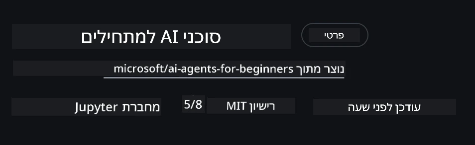
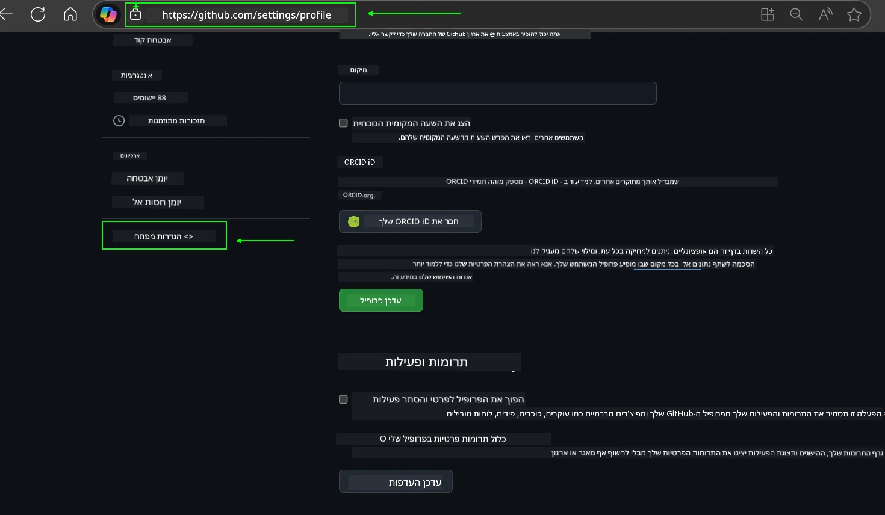
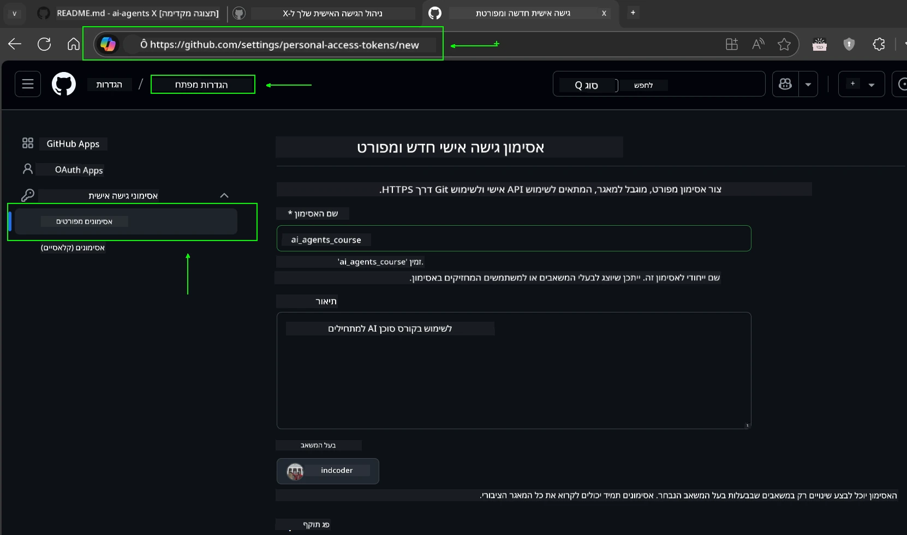
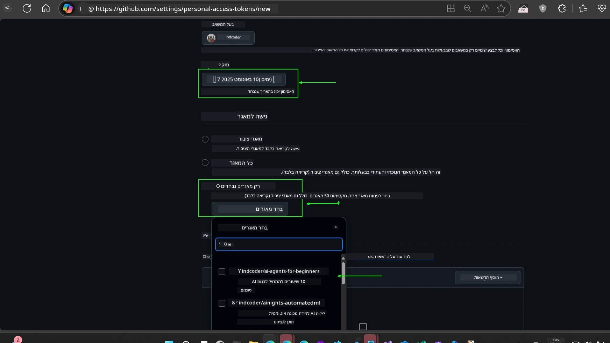
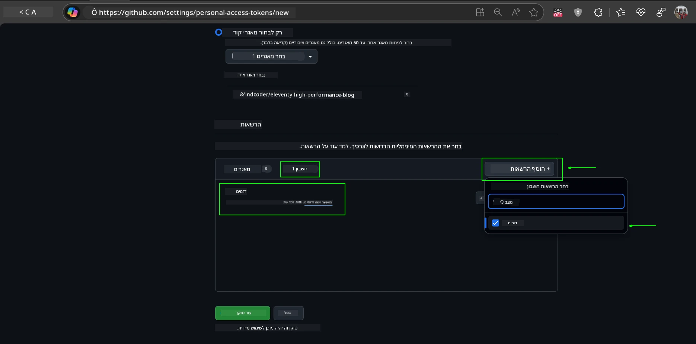
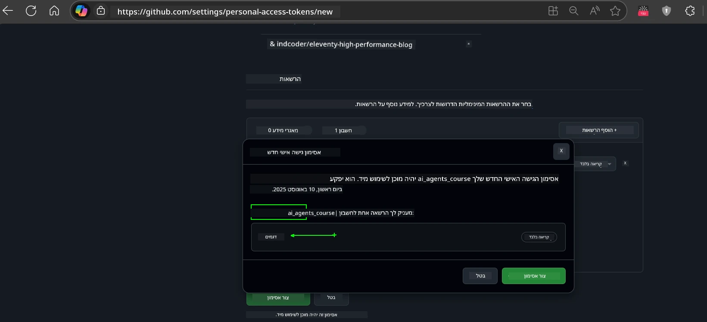
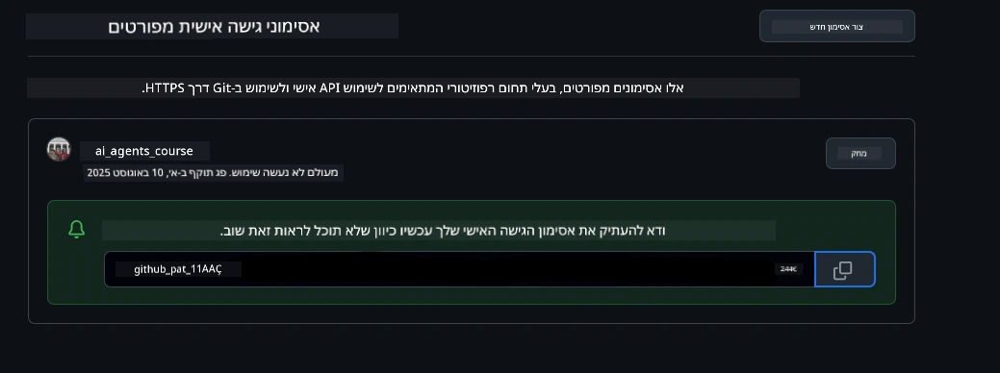
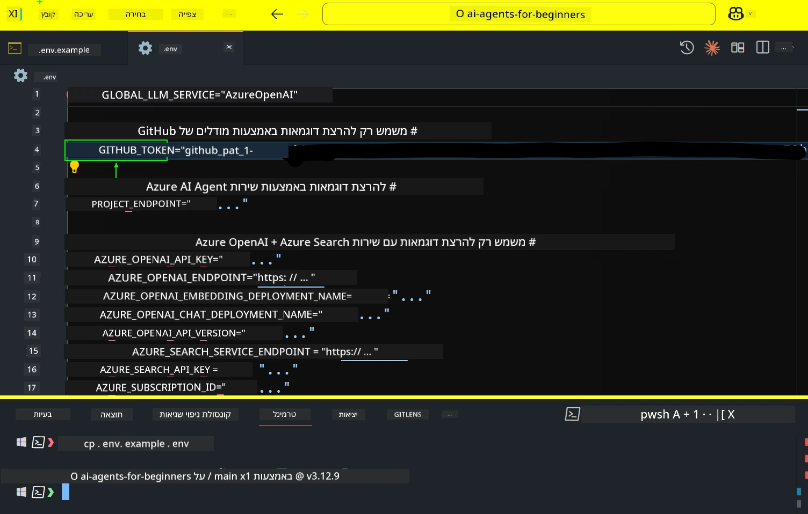
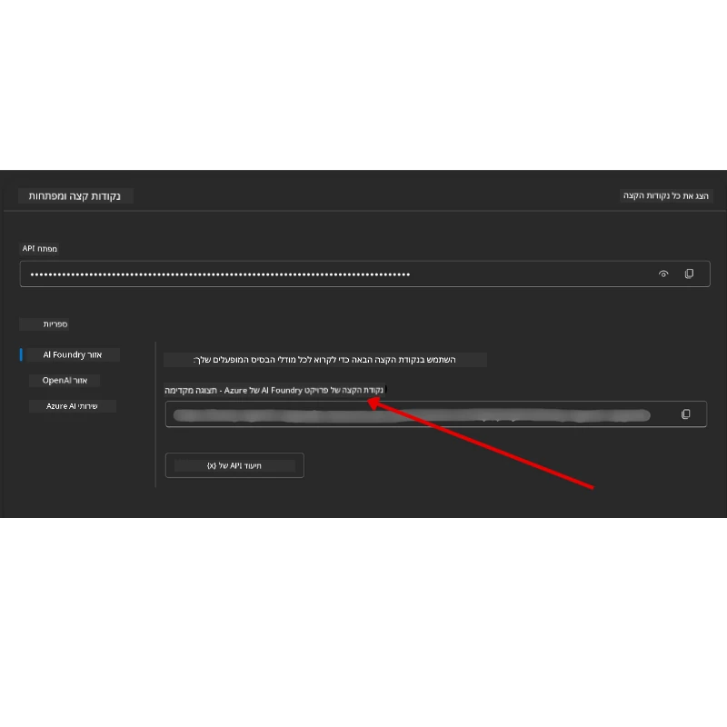

<!--
CO_OP_TRANSLATOR_METADATA:
{
  "original_hash": "63b1a8f6e840df15934935b728e569f0",
  "translation_date": "2025-12-03T14:39:23+00:00",
  "source_file": "00-course-setup/README.md",
  "language_code": "he"
}
-->
# הגדרת הקורס

## הקדמה

בשיעור זה נלמד כיצד להפעיל את דוגמאות הקוד של הקורס.

## הצטרפות ללומדים אחרים וקבלת עזרה

לפני שתתחילו לשכפל את המאגר שלכם, הצטרפו לערוץ [AI Agents For Beginners Discord](https://aka.ms/ai-agents/discord) כדי לקבל עזרה בהגדרות, לשאול שאלות על הקורס או להתחבר ללומדים אחרים.

## שכפול או יצירת מאגר משלכם

כדי להתחיל, אנא שכפלו או צרו מאגר משלכם מתוך מאגר GitHub. זה יאפשר לכם ליצור גרסה משלכם של חומרי הקורס כך שתוכלו להפעיל, לבדוק ולשנות את הקוד!

ניתן לעשות זאת על ידי לחיצה על הקישור ל-<a href="https://github.com/microsoft/ai-agents-for-beginners/fork" target="_blank">יצירת מאגר משלכם</a>

כעת אמור להיות לכם מאגר משלכם בקישור הבא:



### שכפול רדוד (מומלץ לסדנאות / Codespaces)

  >המאגר המלא יכול להיות גדול (~3 GB) כאשר מורידים את כל ההיסטוריה וכל הקבצים. אם אתם משתתפים רק בסדנה או זקוקים רק לתיקיות של שיעורים מסוימים, שכפול רדוד (או שכפול חלקי) ימנע את רוב ההורדה על ידי קיצור ההיסטוריה ו/או דילוג על קבצים גדולים.

#### שכפול רדוד מהיר — היסטוריה מינימלית, כל הקבצים

החליפו `<your-username>` בפקודות הבאות עם כתובת המאגר שלכם (או כתובת המקור אם אתם מעדיפים).

לשכפול רק ההיסטוריה של ההתחייבות האחרונה (הורדה קטנה):

```bash|powershell
git clone --depth 1 https://github.com/<your-username>/ai-agents-for-beginners.git
```

לשכפול ענף מסוים:

```bash|powershell
git clone --depth 1 --branch <branch-name> https://github.com/<your-username>/ai-agents-for-beginners.git
```

#### שכפול חלקי — קבצים מינימליים + רק תיקיות נבחרות

שיטה זו משתמשת בשכפול חלקי וב-sparse-checkout (דורש Git 2.25+ ומומלץ להשתמש בגרסה מודרנית של Git עם תמיכה בשכפול חלקי):

```bash|powershell
git clone --depth 1 --filter=blob:none --sparse https://github.com/<your-username>/ai-agents-for-beginners.git
```

היכנסו לתיקיית המאגר:

```bash|powershell
cd ai-agents-for-beginners
```

לאחר מכן ציינו אילו תיקיות אתם רוצים (הדוגמה למטה מציגה שתי תיקיות):

```bash|powershell
git sparse-checkout set 00-course-setup 01-intro-to-ai-agents
```

לאחר השכפול ואימות הקבצים, אם אתם זקוקים רק לקבצים ורוצים לפנות מקום (ללא היסטוריית Git), אנא מחקו את המטא-נתונים של המאגר (💀בלתי הפיך — תאבדו את כל הפונקציונליות של Git: אין התחייבויות, משיכות, דחיפות או גישה להיסטוריה).

```bash
# zsh/bash
rm -rf .git
```

```powershell
# פאוורשל
Remove-Item -Recurse -Force .git
```

#### שימוש ב-GitHub Codespaces (מומלץ כדי להימנע מהורדות גדולות מקומיות)

- צרו Codespace חדש עבור המאגר הזה דרך [ממשק המשתמש של GitHub](https://github.com/codespaces).  

- בטרמינל של ה-Codespace החדש שנוצר, הריצו אחת מפקודות השכפול הרדוד/חלקי לעיל כדי להביא רק את תיקיות השיעורים שאתם צריכים לתוך סביבת העבודה של Codespace.
- אופציונלי: לאחר השכפול בתוך Codespaces, הסירו את .git כדי לשחרר מקום נוסף (ראו פקודות הסרה לעיל).
- הערה: אם אתם מעדיפים לפתוח את המאגר ישירות ב-Codespaces (ללא שכפול נוסף), שימו לב ש-Codespaces יבנה את סביבת devcontainer וייתכן שעדיין יספק יותר ממה שאתם צריכים. שכפול עותק רדוד בתוך Codespace חדש נותן לכם יותר שליטה על השימוש בדיסק.

#### טיפים

- תמיד החליפו את כתובת השכפול עם המאגר שלכם אם אתם רוצים לערוך/להתחייב.
- אם תצטרכו מאוחר יותר יותר היסטוריה או קבצים, תוכלו להביא אותם או להתאים את sparse-checkout לכלול תיקיות נוספות.

## הפעלת הקוד

הקורס מציע סדרת מחברות Jupyter שתוכלו להפעיל כדי לקבל ניסיון מעשי בבניית סוכני AI.

דוגמאות הקוד משתמשות באחת מהאפשרויות הבאות:

**דורש חשבון GitHub - חינם**:

1) Semantic Kernel Agent Framework + GitHub Models Marketplace. מסומן כ-(semantic-kernel.ipynb)
2) AutoGen Framework + GitHub Models Marketplace. מסומן כ-(autogen.ipynb)

**דורש מנוי Azure**:

3) Azure AI Foundry + Azure AI Agent Service. מסומן כ-(azureaiagent.ipynb)

אנו ממליצים לכם לנסות את כל שלושת סוגי הדוגמאות כדי לראות מה עובד הכי טוב עבורכם.

האפשרות שתבחרו תקבע אילו שלבי הגדרה תצטרכו לבצע בהמשך:

## דרישות

- Python 3.12+
  - **NOTE**: אם אין לכם Python3.12 מותקן, ודאו שאתם מתקינים אותו. לאחר מכן צרו את venv שלכם באמצעות python3.12 כדי להבטיח שהגרסאות הנכונות יותקנו מקובץ requirements.txt.
  
    >דוגמה

    יצירת תיקיית Python venv:

    ```bash|powershell
    python -m venv venv
    ```

    לאחר מכן הפעילו את סביבת venv עבור:

    ```bash
    # zsh/bash
    source venv/bin/activate
    ```
  
    ```dos
    # Command Prompt for Windows
    venv\Scripts\activate
    ```

- .NET 10+: עבור דוגמאות הקוד המשתמשות ב-.NET, ודאו שאתם מתקינים את [.NET 10 SDK](https://dotnet.microsoft.com/download/dotnet/10.0) או גרסה מאוחרת יותר. לאחר מכן, בדקו את גרסת ה-.NET SDK המותקנת:

    ```bash|powershell
    dotnet --list-sdks
    ```

- חשבון GitHub - לגישה ל-GitHub Models Marketplace
- מנוי Azure - לגישה ל-Azure AI Foundry
- חשבון Azure AI Foundry - לגישה ל-Azure AI Agent Service

הוספנו קובץ `requirements.txt` בתיקיית השורש של המאגר הזה שמכיל את כל חבילות ה-Python הנדרשות להפעלת דוגמאות הקוד.

תוכלו להתקין אותן על ידי הרצת הפקודה הבאה בטרמינל בתיקיית השורש של המאגר:

```bash|powershell
pip install -r requirements.txt
```

אנו ממליצים ליצור סביבת Python וירטואלית כדי להימנע מקונפליקטים ובעיות.

## הגדרת VSCode

ודאו שאתם משתמשים בגרסה הנכונה של Python ב-VSCode.


## הגדרה לדוגמאות המשתמשות ב-GitHub Models 

### שלב 1: קבלת GitHub Personal Access Token (PAT)

הקורס הזה משתמש ב-GitHub Models Marketplace, המספק גישה חינמית למודלים של שפה גדולה (LLMs) שתשתמשו בהם לבניית סוכני AI.

כדי להשתמש ב-GitHub Models, תצטרכו ליצור [GitHub Personal Access Token](https://docs.github.com/en/authentication/keeping-your-account-and-data-secure/managing-your-personal-access-tokens).

ניתן לעשות זאת על ידי מעבר ל<a href="https://github.com/settings/personal-access-tokens" target="_blank">הגדרות Personal Access Tokens</a> בחשבון GitHub שלכם.

אנא עקבו אחר [Principle of Least Privilege](https://docs.github.com/en/get-started/learning-to-code/storing-your-secrets-safely) בעת יצירת הטוקן. משמעות הדבר היא שעליכם לתת לטוקן רק את ההרשאות שהוא צריך כדי להפעיל את דוגמאות הקוד בקורס הזה.

1. בחרו באפשרות `Fine-grained tokens` בצד השמאלי של המסך על ידי מעבר ל-**Developer settings**

   

   לאחר מכן בחרו `Generate new token`.

   

2. הזינו שם תיאורי לטוקן שלכם שמשקף את מטרתו, כך שיהיה קל לזהות אותו מאוחר יותר.

    🔐 המלצה על משך הטוקן

    משך מומלץ: 30 ימים
    למען אבטחה גבוהה יותר, תוכלו לבחור תקופה קצרה יותר—כמו 7 ימים 🛡️
    זו דרך מצוינת להציב יעד אישי ולהשלים את הקורס בזמן שהמומנטום הלימודי שלכם גבוה 🚀.

    

3. הגבילו את תחום הטוקן למאגר המשוכפל שלכם.

    

4. הגבלות הרשאות הטוקן: תחת **Permissions**, לחצו על לשונית **Account**, ולחצו על כפתור "+ Add permissions". תופיע רשימה נפתחת. חפשו **Models** וסמנו את התיבה עבורו.

    

5. ודאו את ההרשאות הנדרשות לפני יצירת הטוקן. 

6. לפני יצירת הטוקן, ודאו שאתם מוכנים לשמור את הטוקן במקום בטוח כמו כספת מנהל סיסמאות, מכיוון שהוא לא יוצג שוב לאחר יצירתו. 

העתיקו את הטוקן החדש שיצרתם. כעת תוסיפו אותו לקובץ `.env` הכלול בקורס הזה.

### שלב 2: יצירת קובץ `.env`

כדי ליצור את קובץ `.env`, הריצו את הפקודה הבאה בטרמינל שלכם.

```bash
# zsh/bash
cp .env.example .env
```

```powershell
# פאוורשל
Copy-Item .env.example .env
```

זה יעתיק את קובץ הדוגמה ויצור `.env` בתיקייה שלכם, שם תמלאו את הערכים עבור משתני הסביבה.

עם הטוקן שהעתקתם, פתחו את קובץ `.env` בעורך הטקסט המועדף עליכם והדביקו את הטוקן בשדה `GITHUB_TOKEN`.



כעת תוכלו להפעיל את דוגמאות הקוד של הקורס הזה.

## הגדרה לדוגמאות המשתמשות ב-Azure AI Foundry וב-Azure AI Agent Service

### שלב 1: קבלת נקודת הקצה של פרויקט Azure שלכם

עקבו אחר השלבים ליצירת hub ופרויקט ב-Azure AI Foundry שנמצאים כאן: [סקירת משאבי hub](https://learn.microsoft.com/azure/ai-foundry/concepts/ai-resources)

לאחר שיצרתם את הפרויקט שלכם, תצטרכו לקבל את מחרוזת החיבור עבור הפרויקט שלכם.

ניתן לעשות זאת על ידי מעבר לדף **Overview** של הפרויקט שלכם בפורטל Azure AI Foundry.



### שלב 2: יצירת קובץ `.env`

כדי ליצור את קובץ `.env`, הריצו את הפקודה הבאה בטרמינל שלכם.

```bash
# zsh/bash
cp .env.example .env
```

```powershell
# פאוורשל
Copy-Item .env.example .env
```

זה יעתיק את קובץ הדוגמה ויצור `.env` בתיקייה שלכם, שם תמלאו את הערכים עבור משתני הסביבה.

עם הטוקן שהעתקתם, פתחו את קובץ `.env` בעורך הטקסט המועדף עליכם והדביקו את הטוקן בשדה `PROJECT_ENDPOINT`.

### שלב 3: התחברות ל-Azure

כפרקטיקה בטיחותית, נשתמש ב-[keyless authentication](https://learn.microsoft.com/azure/developer/ai/keyless-connections?tabs=csharp%2Cazure-cli?WT.mc_id=academic-105485-koreyst) כדי לאמת ל-Azure OpenAI עם Microsoft Entra ID. 

לאחר מכן, פתחו טרמינל והריצו `az login --use-device-code` כדי להתחבר לחשבון Azure שלכם.

לאחר שהתחברתם, בחרו את המנוי שלכם בטרמינל.

## משתני סביבה נוספים - Azure Search ו-Azure OpenAI 

עבור שיעור Agentic RAG - שיעור 5 - יש דוגמאות שמשתמשות ב-Azure Search וב-Azure OpenAI.

אם אתם רוצים להפעיל את הדוגמאות הללו, תצטרכו להוסיף את משתני הסביבה הבאים לקובץ `.env` שלכם:

### דף סקירה (פרויקט)

- `AZURE_SUBSCRIPTION_ID` - בדקו **פרטי פרויקט** בדף **Overview** של הפרויקט שלכם.

- `AZURE_AI_PROJECT_NAME` - הסתכלו בראש דף **Overview** של הפרויקט שלכם.

- `AZURE_OPENAI_SERVICE` - מצאו זאת בלשונית **Included capabilities** עבור **Azure OpenAI Service** בדף **Overview**.

### מרכז ניהול

- `AZURE_OPENAI_RESOURCE_GROUP` - עברו ל-**פרטי פרויקט** בדף **Overview** של **מרכז הניהול**.

- `GLOBAL_LLM_SERVICE` - תחת **משאבים מחוברים**, מצאו את שם החיבור של **Azure AI Services**. אם לא מופיע, בדקו את **פורטל Azure** תחת קבוצת המשאבים שלכם עבור שם משאב AI Services.

### דף מודלים + נקודות קצה

- `AZURE_OPENAI_EMBEDDING_DEPLOYMENT_NAME` - בחרו את מודל ההטמעה שלכם (לדוגמה, `text-embedding-ada-002`) ורשמו את **שם הפריסה** מפרטי המודל.

- `AZURE_OPENAI_CHAT_DEPLOYMENT_NAME` - בחרו את מודל הצ'אט שלכם (לדוגמה, `gpt-4o-mini`) ורשמו את **שם הפריסה** מפרטי המודל.

### פורטל Azure

- `AZURE_OPENAI_ENDPOINT` - חפשו **שירותי Azure AI**, לחצו עליו, ואז עברו ל-**ניהול משאבים**, **מפתחות ונקודות קצה**, גללו למטה ל-"נקודות הקצה של Azure OpenAI", והעתיקו את זו שאומרת "Language APIs".

- `AZURE_OPENAI_API_KEY` - מאותו מסך, העתיקו KEY 1 או KEY 2.

- `AZURE_SEARCH_SERVICE_ENDPOINT` - מצאו את משאב **Azure AI Search** שלכם, לחצו עליו, וראו **סקירה**.

- `AZURE_SEARCH_API_KEY` - לאחר מכן עברו ל-**הגדרות** ואז ל-**מפתחות** כדי להעתיק את המפתח הראשי או המשני של מנהל המערכת.

### דף חיצוני

- `AZURE_OPENAI_API_VERSION` - בקרו בדף [מחזור חיי גרסת API](https://learn.microsoft.com/azure/ai-services/openai/api-version-deprecation#latest-ga-api-release) תחת **גרסת GA האחרונה של API**.

### הגדרת אימות ללא מפתח

במקום להקשיח את האישורים שלכם, נשתמש בחיבור ללא מפתח עם Azure OpenAI. לשם כך, נייבא `DefaultAzureCredential` ולאחר מכן נקרא לפונקציה `DefaultAzureCredential` כדי לקבל את האישורים.

```python
# פייתון
from azure.identity import DefaultAzureCredential, InteractiveBrowserCredential
```

## נתקעתם איפשהו?
אם יש לכם בעיות בהפעלת ההגדרה הזו, הצטרפו ל-<a href="https://discord.gg/kzRShWzttr" target="_blank">Azure AI Community Discord</a> שלנו או <a href="https://github.com/microsoft/ai-agents-for-beginners/issues?WT.mc_id=academic-105485-koreyst" target="_blank">צרו בעיה חדשה</a>.

## השיעור הבא

אתם עכשיו מוכנים להריץ את הקוד עבור הקורס הזה. למידה מהנה על עולם סוכני הבינה המלאכותית!

[מבוא לסוכני בינה מלאכותית ושימושים בסוכנים](../01-intro-to-ai-agents/README.md)

---

<!-- CO-OP TRANSLATOR DISCLAIMER START -->
**כתב ויתור**:  
מסמך זה תורגם באמצעות שירות תרגום מבוסס בינה מלאכותית [Co-op Translator](https://github.com/Azure/co-op-translator). למרות שאנו שואפים לדיוק, יש לקחת בחשבון שתרגומים אוטומטיים עשויים להכיל שגיאות או אי-דיוקים. המסמך המקורי בשפתו המקורית צריך להיחשב כמקור הסמכותי. למידע קריטי, מומלץ להשתמש בתרגום מקצועי על ידי בני אדם. איננו אחראים לאי-הבנות או לפרשנויות שגויות הנובעות משימוש בתרגום זה.
<!-- CO-OP TRANSLATOR DISCLAIMER END -->