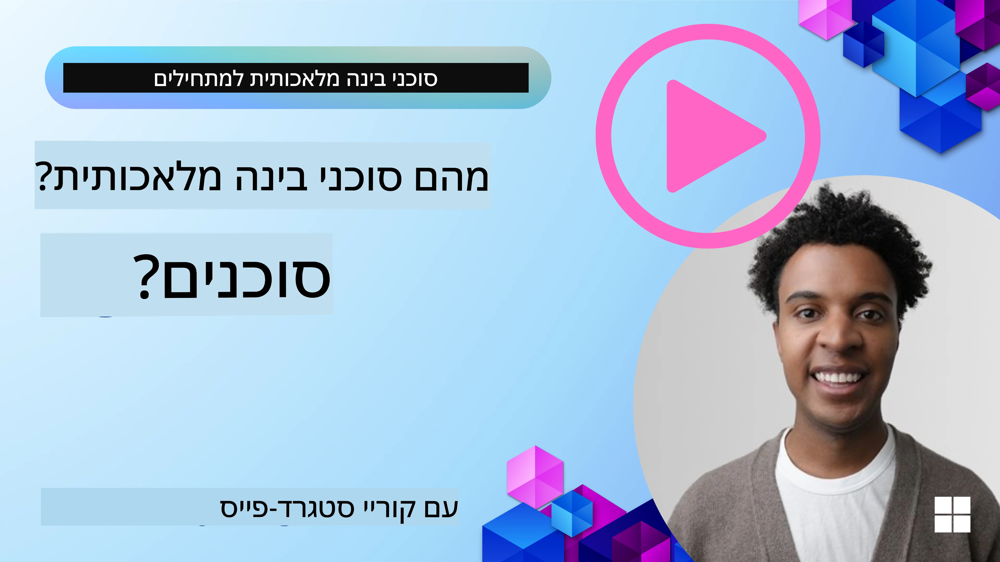
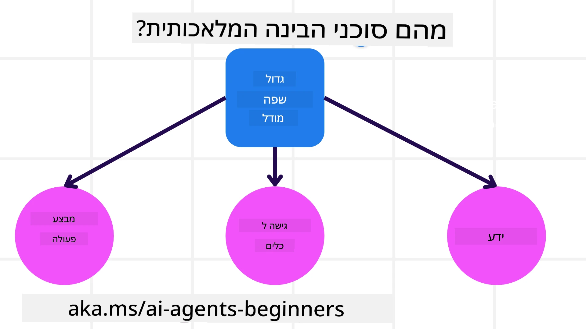
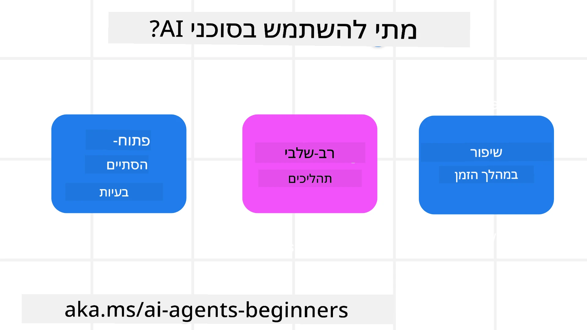

<!--
CO_OP_TRANSLATOR_METADATA:
{
  "original_hash": "cdd28bc00816d2773bb2b5968d782abc",
  "translation_date": "2025-11-11T11:26:01+00:00",
  "source_file": "01-intro-to-ai-agents/README.md",
  "language_code": "he"
}
-->

> _(לחצו על התמונה למעלה לצפייה בסרטון של השיעור הזה)_

# מבוא לסוכנים מבוססי AI ושימושים אפשריים

ברוכים הבאים לקורס "סוכנים מבוססי AI למתחילים"! הקורס מספק ידע בסיסי ודוגמאות יישומיות לבניית סוכנים מבוססי AI.

הצטרפו ל<a href="https://discord.gg/kzRShWzttr" target="_blank">קהילת Azure AI ב-Discord</a> כדי לפגוש לומדים אחרים ובוני סוכנים מבוססי AI, ולשאול כל שאלה שיש לכם על הקורס.

כדי להתחיל את הקורס, נתחיל בהבנה טובה יותר של מה הם סוכנים מבוססי AI וכיצד ניתן להשתמש בהם באפליקציות ובתהליכי עבודה שאנחנו בונים.

## מבוא

השיעור הזה מכסה:

- מה הם סוכנים מבוססי AI ומהם הסוגים השונים של סוכנים?
- אילו שימושים מתאימים ביותר לסוכנים מבוססי AI וכיצד הם יכולים לעזור לנו?
- מהם כמה מהיסודות הבסיסיים בעיצוב פתרונות מבוססי סוכנים?

## מטרות למידה
לאחר השלמת השיעור הזה, תוכלו:

- להבין את מושגי הסוכנים מבוססי AI וכיצד הם שונים מפתרונות AI אחרים.
- ליישם סוכנים מבוססי AI בצורה יעילה.
- לעצב פתרונות מבוססי סוכנים בצורה פרודוקטיבית עבור משתמשים ולקוחות.

## הגדרת סוכנים מבוססי AI וסוגי סוכנים מבוססי AI

### מה הם סוכנים מבוססי AI?

סוכנים מבוססי AI הם **מערכות** שמאפשרות ל**מודלים שפתיים גדולים (LLMs)** **לבצע פעולות** על ידי הרחבת היכולות שלהם באמצעות מתן **גישה לכלים** ו**ידע**.

בואו נפרק את ההגדרה הזו לחלקים קטנים יותר:

- **מערכת** - חשוב לחשוב על סוכנים לא רק כמרכיב יחיד אלא כמערכת של מרכיבים רבים. ברמה הבסיסית, המרכיבים של סוכן מבוסס AI הם:
  - **סביבה** - המרחב המוגדר שבו הסוכן מבוסס AI פועל. לדוגמה, אם היה לנו סוכן להזמנת נסיעות, הסביבה יכולה להיות מערכת הזמנת הנסיעות שהסוכן משתמש בה כדי להשלים משימות.
  - **חיישנים** - סביבות מכילות מידע ומספקות משוב. סוכנים מבוססי AI משתמשים בחיישנים כדי לאסוף ולפרש את המידע על מצב הסביבה הנוכחי. בדוגמה של סוכן הזמנת נסיעות, מערכת הזמנת הנסיעות יכולה לספק מידע כמו זמינות מלונות או מחירי טיסות.
  - **מפעילים** - לאחר שהסוכן מבוסס AI מקבל את מצב הסביבה הנוכחי, עבור המשימה הנוכחית הסוכן קובע איזו פעולה לבצע כדי לשנות את הסביבה. בדוגמה של סוכן הזמנת נסיעות, זה יכול להיות הזמנת חדר פנוי עבור המשתמש.

**מודלים שפתיים גדולים** - הרעיון של סוכנים התקיים לפני יצירת LLMs. היתרון בבניית סוכנים מבוססי AI עם LLMs הוא היכולת שלהם לפרש שפה אנושית ונתונים. יכולת זו מאפשרת ל-LLMs לפרש מידע סביבתי ולהגדיר תוכנית לשינוי הסביבה.

**ביצוע פעולות** - מחוץ למערכות סוכנים מבוססי AI, LLMs מוגבלים למצבים שבהם הפעולה היא יצירת תוכן או מידע על בסיס בקשת המשתמש. בתוך מערכות סוכנים מבוססי AI, LLMs יכולים להשלים משימות על ידי פירוש בקשת המשתמש ושימוש בכלים הזמינים בסביבתם.

**גישה לכלים** - אילו כלים יש ל-LLM גישה אליהם מוגדרים על ידי 1) הסביבה שבה הוא פועל ו-2) המפתח של הסוכן מבוסס AI. בדוגמה של סוכן הנסיעות, הכלים של הסוכן מוגבלים על ידי הפעולות הזמינות במערכת ההזמנות, ו/או המפתח יכול להגביל את גישת הסוכן לכלים מסוימים כמו טיסות.

**זיכרון+ידע** - זיכרון יכול להיות קצר טווח בהקשר של השיחה בין המשתמש לסוכן. לטווח ארוך, מחוץ למידע המסופק על ידי הסביבה, סוכנים מבוססי AI יכולים גם לאחזר ידע ממערכות, שירותים, כלים ואפילו סוכנים אחרים. בדוגמה של סוכן הנסיעות, ידע זה יכול להיות מידע על העדפות הנסיעה של המשתמש שנמצא במאגר לקוחות.

### הסוגים השונים של סוכנים

עכשיו כשיש לנו הגדרה כללית של סוכנים מבוססי AI, בואו נבחן כמה סוגים ספציפיים של סוכנים וכיצד הם ייושמו בסוכן הזמנת נסיעות מבוסס AI.

| **סוג סוכן**                 | **תיאור**                                                                                                                       | **דוגמה**                                                                                                                                                                                                                   |
| ----------------------------- | ------------------------------------------------------------------------------------------------------------------------------------- | ----------------------------------------------------------------------------------------------------------------------------------------------------------------------------------------------------------------------------- |
| **סוכנים רפלקסיים פשוטים**      | מבצעים פעולות מיידיות על בסיס כללים מוגדרים מראש.                                                                                  | סוכן נסיעות מפרש את ההקשר של האימייל ומעביר תלונות נסיעה לשירות לקוחות.                                                                                                                          |
| **סוכנים רפלקסיים מבוססי מודל** | מבצעים פעולות על בסיס מודל של העולם ושינויים במודל זה.                                                              | סוכן נסיעות נותן עדיפות לנתיבים עם שינויים משמעותיים במחירים על בסיס גישה לנתוני מחירים היסטוריים.                                                                                                             |
| **סוכנים מבוססי מטרות**         | יוצרים תוכניות להשגת מטרות ספציפיות על ידי פירוש המטרה וקביעת פעולות להשגתה.                                  | סוכן נסיעות מזמין מסע על ידי קביעת סידורי נסיעה נחוצים (רכב, תחבורה ציבורית, טיסות) מהמיקום הנוכחי ליעד.                                                                                |
| **סוכנים מבוססי תועלת**      | שוקלים העדפות ושוקלים פשרות באופן מספרי כדי לקבוע כיצד להשיג מטרות.                                               | סוכן נסיעות ממקסם תועלת על ידי שקילת נוחות מול עלות בעת הזמנת נסיעה.                                                                                                                                          |
| **סוכנים לומדים**           | משתפרים עם הזמן על ידי תגובה למשוב והתאמת פעולות בהתאם.                                                        | סוכן נסיעות משתפר על ידי שימוש במשוב לקוחות מסקרים לאחר נסיעה כדי לבצע התאמות להזמנות עתידיות.                                                                                                               |
| **סוכנים היררכיים**       | כוללים מספר סוכנים במערכת מדורגת, כאשר סוכנים ברמה גבוהה יותר מחלקים משימות למשימות משנה עבור סוכנים ברמה נמוכה יותר להשלמה. | סוכן נסיעות מבטל נסיעה על ידי חלוקת המשימה למשימות משנה (לדוגמה, ביטול הזמנות ספציפיות) וסוכנים ברמה נמוכה יותר משלימים אותן, מדווחים בחזרה לסוכן ברמה גבוהה יותר.                                     |
| **מערכות רב-סוכנים (MAS)** | סוכנים משלימים משימות באופן עצמאי, או בשיתוף פעולה או בתחרות.                                                           | שיתוף פעולה: מספר סוכנים מזמינים שירותי נסיעות ספציפיים כמו מלונות, טיסות ובידור. תחרות: מספר סוכנים מנהלים ומתחרים על לוח הזמנות מלונות משותף כדי להזמין לקוחות למלון. |

## מתי להשתמש בסוכנים מבוססי AI

בקטע הקודם, השתמשנו בדוגמת סוכן הנסיעות כדי להסביר כיצד ניתן להשתמש בסוגים השונים של סוכנים בתרחישים שונים של הזמנת נסיעות. נמשיך להשתמש ביישום זה לאורך הקורס.

בואו נבחן את סוגי השימושים שבהם סוכנים מבוססי AI מתאימים ביותר:

- **בעיות פתוחות** - מאפשרים ל-LLM לקבוע את הצעדים הנדרשים להשלמת משימה מכיוון שלא תמיד ניתן לקודד אותם מראש בתהליך עבודה.
- **תהליכים מרובי שלבים** - משימות שדורשות רמה של מורכבות שבה הסוכן מבוסס AI צריך להשתמש בכלים או במידע לאורך מספר שלבים במקום אחזור חד-פעמי.  
- **שיפור עם הזמן** - משימות שבהן הסוכן יכול להשתפר עם הזמן על ידי קבלת משוב מהסביבה או מהמשתמשים כדי לספק תועלת טובה יותר.

אנו מכסים שיקולים נוספים לשימוש בסוכנים מבוססי AI בשיעור בניית סוכנים מבוססי AI אמינים.

## יסודות פתרונות מבוססי סוכנים

### פיתוח סוכנים

השלב הראשון בעיצוב מערכת סוכן מבוסס AI הוא להגדיר את הכלים, הפעולות וההתנהגויות. בקורס זה, אנו מתמקדים בשימוש ב-**Azure AI Agent Service** כדי להגדיר את הסוכנים שלנו. הוא מציע תכונות כמו:

- בחירת מודלים פתוחים כמו OpenAI, Mistral ו-Llama
- שימוש בנתונים מורשים דרך ספקים כמו Tripadvisor
- שימוש בכלים סטנדרטיים של OpenAPI 3.0

### דפוסי סוכנים

תקשורת עם LLMs מתבצעת דרך הנחיות. בהתחשב באופי החצי-אוטונומי של סוכנים מבוססי AI, לא תמיד אפשרי או נדרש להנחות מחדש את ה-LLM לאחר שינוי בסביבה. אנו משתמשים ב-**דפוסי סוכנים** שמאפשרים לנו להנחות את ה-LLM לאורך מספר שלבים בצורה יותר ניתנת להרחבה.

הקורס מחולק לכמה מהדפוסים הפופולריים הנוכחיים של סוכנים.

### מסגרות סוכנים

מסגרות סוכנים מאפשרות למפתחים ליישם דפוסי סוכנים דרך קוד. מסגרות אלו מציעות תבניות, תוספים וכלים לשיתוף פעולה טוב יותר של סוכנים מבוססי AI. יתרונות אלו מספקים יכולות לתצפית טובה יותר ולפתרון בעיות של מערכות סוכנים מבוססי AI.

בקורס זה, נחקור את מסגרת AutoGen המבוססת מחקר ואת מסגרת Agent המוכנה לייצור מ-Semantic Kernel.

## דוגמאות קוד

- Python: [מסגרת סוכנים](./code_samples/01-python-agent-framework.ipynb)
- .NET: [מסגרת סוכנים](./code_samples/01-dotnet-agent-framework.md)

## יש לכם עוד שאלות על סוכנים מבוססי AI?

הצטרפו ל-[Azure AI Foundry Discord](https://aka.ms/ai-agents/discord) כדי לפגוש לומדים אחרים, להשתתף בשעות קבלה ולקבל תשובות לשאלות שלכם על סוכנים מבוססי AI.

## שיעור קודם

[הגדרת הקורס](../00-course-setup/README.md)

## שיעור הבא

[חקירת מסגרות סוכנים](../02-explore-agentic-frameworks/README.md)

---

<!-- CO-OP TRANSLATOR DISCLAIMER START -->
**כתב ויתור**:  
מסמך זה תורגם באמצעות שירות תרגום AI [Co-op Translator](https://github.com/Azure/co-op-translator). למרות שאנו שואפים לדיוק, יש להיות מודעים לכך שתרגומים אוטומטיים עשויים להכיל שגיאות או אי דיוקים. המסמך המקורי בשפתו המקורית צריך להיחשב כמקור סמכותי. עבור מידע קריטי, מומלץ להשתמש בתרגום מקצועי אנושי. איננו אחראים לאי הבנות או לפרשנויות שגויות הנובעות משימוש בתרגום זה.
<!-- CO-OP TRANSLATOR DISCLAIMER END -->