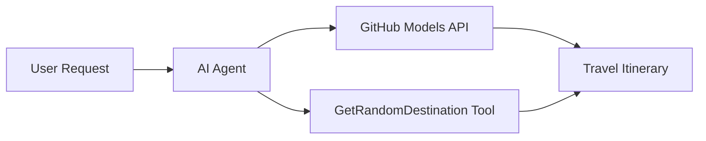

<!--
CO_OP_TRANSLATOR_METADATA:
{
  "original_hash": "5f351412e934f0833c8c821a0a60efaf",
  "translation_date": "2025-11-13T13:07:49+00:00",
  "source_file": "01-intro-to-ai-agents/code_samples/01-dotnet-agent-framework.md",
  "language_code": "he"
}
-->
# 🌍 סוכן נסיעות מבוסס AI עם Microsoft Agent Framework (.NET)

## 📋 סקירה כללית של התרחיש

דוגמה זו מדגימה כיצד לבנות סוכן חכם לתכנון נסיעות באמצעות Microsoft Agent Framework עבור .NET. הסוכן יכול ליצור באופן אוטומטי מסלולי טיול מותאמים אישית ליעדים אקראיים ברחבי העולם.

### יכולות עיקריות:

- 🎲 **בחירת יעד אקראי**: משתמש בכלי מותאם לבחירת מקומות חופשה
- 🗺️ **תכנון טיול חכם**: יוצר מסלולים מפורטים לפי ימים
- 🔄 **שידור בזמן אמת**: תומך בתגובות מיידיות ובשידור רציף
- 🛠️ **שילוב כלים מותאמים**: מדגים כיצד להרחיב את יכולות הסוכן

## 🔧 ארכיטקטורה טכנית

### טכנולוגיות ליבה

- **Microsoft Agent Framework**: יישום .NET העדכני לפיתוח סוכני AI
- **שילוב מודלים של GitHub**: משתמש בשירות ההסקה של מודלי AI של GitHub
- **תאימות ל-OpenAI API**: מנצל ספריות לקוח של OpenAI עם נקודות קצה מותאמות
- **תצורה מאובטחת**: ניהול מפתחות API מבוסס סביבה

### רכיבים עיקריים

1. **AIAgent**: מתזמר הסוכן הראשי שמנהל את זרימת השיחה
2. **כלים מותאמים**: פונקציית `GetRandomDestination()` זמינה לסוכן
3. **לקוח שיחה**: ממשק שיחה מבוסס מודלים של GitHub
4. **תמיכה בשידור**: יכולות יצירת תגובות בזמן אמת

### תבנית שילוב



## 🚀 תחילת העבודה

### דרישות מוקדמות

- [.NET 10 SDK](https://dotnet.microsoft.com/download/dotnet/10.0) או גרסה מתקדמת יותר
- [אסימון גישה ל-API של מודלים של GitHub](https://docs.github.com/github-models/github-models-at-scale/using-your-own-api-keys-in-github-models)

### משתני סביבה נדרשים

```bash
# zsh/bash
export GH_TOKEN=<your_github_token>
export GH_ENDPOINT=https://models.github.ai/inference
export GH_MODEL_ID=openai/gpt-5-mini
```

```powershell
# PowerShell
$env:GH_TOKEN = "<your_github_token>"
$env:GH_ENDPOINT = "https://models.github.ai/inference"
$env:GH_MODEL_ID = "openai/gpt-5-mini"
```

### קוד לדוגמה

כדי להריץ את דוגמת הקוד,

```bash
# zsh/bash
chmod +x ./01-dotnet-agent-framework.cs
./01-dotnet-agent-framework.cs
```

או באמצעות CLI של dotnet:

```bash
dotnet run ./01-dotnet-agent-framework.cs
```

ראו את [`01-dotnet-agent-framework.cs`](../../../../01-intro-to-ai-agents/code_samples/01-dotnet-agent-framework.cs) עבור הקוד המלא.

```csharp
#!/usr/bin/dotnet run

#:package Microsoft.Extensions.AI@9.*
#:package Microsoft.Agents.AI.OpenAI@1.*-*

using System.ClientModel;
using System.ComponentModel;

using Microsoft.Agents.AI;
using Microsoft.Extensions.AI;

using OpenAI;

// Tool Function: Random Destination Generator
// This static method will be available to the agent as a callable tool
// The [Description] attribute helps the AI understand when to use this function
// This demonstrates how to create custom tools for AI agents
[Description("Provides a random vacation destination.")]
static string GetRandomDestination()
{
    // List of popular vacation destinations around the world
    // The agent will randomly select from these options
    var destinations = new List<string>
    {
        "Paris, France",
        "Tokyo, Japan",
        "New York City, USA",
        "Sydney, Australia",
        "Rome, Italy",
        "Barcelona, Spain",
        "Cape Town, South Africa",
        "Rio de Janeiro, Brazil",
        "Bangkok, Thailand",
        "Vancouver, Canada"
    };

    // Generate random index and return selected destination
    // Uses System.Random for simple random selection
    var random = new Random();
    int index = random.Next(destinations.Count);
    return destinations[index];
}

// Extract configuration from environment variables
// Retrieve the GitHub Models API endpoint, defaults to https://models.github.ai/inference if not specified
// Retrieve the model ID, defaults to openai/gpt-5-mini if not specified
// Retrieve the GitHub token for authentication, throws exception if not specified
var github_endpoint = Environment.GetEnvironmentVariable("GH_ENDPOINT") ?? "https://models.github.ai/inference";
var github_model_id = Environment.GetEnvironmentVariable("GH_MODEL_ID") ?? "openai/gpt-5-mini";
var github_token = Environment.GetEnvironmentVariable("GH_TOKEN") ?? throw new InvalidOperationException("GH_TOKEN is not set.");

// Configure OpenAI Client Options
// Create configuration options to point to GitHub Models endpoint
// This redirects OpenAI client calls to GitHub's model inference service
var openAIOptions = new OpenAIClientOptions()
{
    Endpoint = new Uri(github_endpoint)
};

// Initialize OpenAI Client with GitHub Models Configuration
// Create OpenAI client using GitHub token for authentication
// Configure it to use GitHub Models endpoint instead of OpenAI directly
var openAIClient = new OpenAIClient(new ApiKeyCredential(github_token), openAIOptions);

// Create AI Agent with Travel Planning Capabilities
// Initialize OpenAI client, get chat client for specified model, and create AI agent
// Configure agent with travel planning instructions and random destination tool
// The agent can now plan trips using the GetRandomDestination function
AIAgent agent = openAIClient
    .GetChatClient(github_model_id)
    .CreateAIAgent(
        instructions: "You are a helpful AI Agent that can help plan vacations for customers at random destinations",
        tools: [AIFunctionFactory.Create(GetRandomDestination)]
    );

// Execute Agent: Plan a Day Trip
// Run the agent with streaming enabled for real-time response display
// Shows the agent's thinking and response as it generates the content
// Provides better user experience with immediate feedback
await foreach (var update in agent.RunStreamingAsync("Plan me a day trip"))
{
    await Task.Delay(10);
    Console.Write(update);
}
```

## 🎓 תובנות עיקריות

1. **ארכיטקטורת סוכן**: Microsoft Agent Framework מספק גישה נקייה ובטוחה מבחינת טיפוסים לבניית סוכני AI ב-.NET
2. **שילוב כלים**: פונקציות המעוטרות בתכונת `[Description]` הופכות לכלים זמינים עבור הסוכן
3. **ניהול תצורה**: משתני סביבה וטיפול מאובטח באישורים עוקבים אחר שיטות העבודה המומלצות של .NET
4. **תאימות ל-OpenAI**: שילוב מודלים של GitHub פועל בצורה חלקה דרך APIs תואמי OpenAI

## 🔗 משאבים נוספים

- [תיעוד Microsoft Agent Framework](https://learn.microsoft.com/agent-framework)
- [שוק מודלים של GitHub](https://github.com/marketplace?type=models)
- [Microsoft.Extensions.AI](https://learn.microsoft.com/dotnet/ai/microsoft-extensions-ai)
- [.NET Single File Apps](https://devblogs.microsoft.com/dotnet/announcing-dotnet-run-app)

---

<!-- CO-OP TRANSLATOR DISCLAIMER START -->
**כתב ויתור**:  
מסמך זה תורגם באמצעות שירות תרגום AI [Co-op Translator](https://github.com/Azure/co-op-translator). למרות שאנו שואפים לדיוק, יש לקחת בחשבון שתרגומים אוטומטיים עשויים להכיל שגיאות או אי דיוקים. המסמך המקורי בשפתו המקורית צריך להיחשב כמקור סמכותי. עבור מידע קריטי, מומלץ להשתמש בתרגום מקצועי אנושי. איננו נושאים באחריות לאי הבנות או לפרשנויות שגויות הנובעות משימוש בתרגום זה.
<!-- CO-OP TRANSLATOR DISCLAIMER END -->