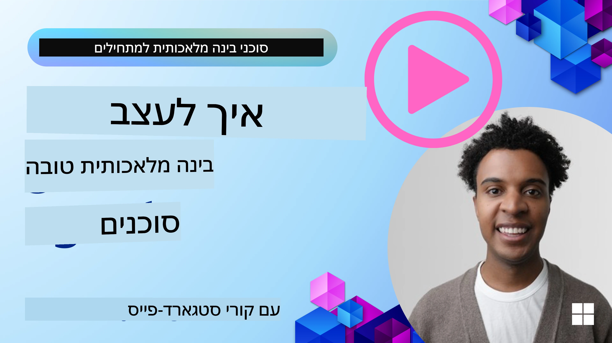
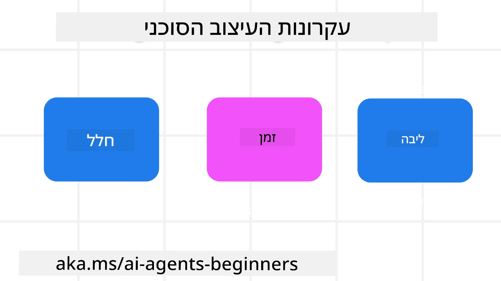

<!--
CO_OP_TRANSLATOR_METADATA:
{
  "original_hash": "d71524fe83a23829ae7a23b4031aaac8",
  "translation_date": "2025-11-13T13:10:40+00:00",
  "source_file": "03-agentic-design-patterns/README.md",
  "language_code": "he"
}
-->

> _(לחצו על התמונה למעלה לצפייה בסרטון של השיעור הזה)_
# עקרונות עיצוב סוכני AI

## מבוא

ישנן דרכים רבות לחשוב על בניית מערכות סוכני AI. מכיוון שעמימות היא תכונה ולא באג בעיצוב AI גנרטיבי, לעיתים קשה למהנדסים להבין מאיפה להתחיל. יצרנו סט של עקרונות עיצוב UX ממוקדי אדם כדי לאפשר למפתחים לבנות מערכות סוכנים ממוקדות לקוח שיענו על הצרכים העסקיים שלהם. עקרונות עיצוב אלו אינם ארכיטקטורה מחייבת אלא נקודת התחלה לצוותים שמגדירים ובונים חוויות סוכנים.

באופן כללי, סוכנים צריכים:

- להרחיב ולהגדיל את היכולות האנושיות (סיעור מוחות, פתרון בעיות, אוטומציה וכו').
- למלא פערי ידע (להביא אותי לעדכון בתחומי ידע, תרגום וכו').
- להקל ולתמוך בשיתוף פעולה בדרכים שבהן אנו כפרטים מעדיפים לעבוד עם אחרים.
- להפוך אותנו לגרסאות טובות יותר של עצמנו (למשל, מאמן חיים/מנהל משימות, עוזר לנו ללמוד מיומנויות ויסות רגשי ומודעות, בניית חוסן וכו').

## מה יכסה השיעור הזה

- מהם עקרונות עיצוב סוכנים
- מהן ההנחיות שיש לעקוב אחריהן בעת יישום עקרונות עיצוב אלו
- דוגמאות לשימוש בעקרונות העיצוב

## מטרות למידה

לאחר השלמת השיעור הזה, תוכלו:

1. להסביר מהם עקרונות עיצוב סוכנים
2. להסביר את ההנחיות לשימוש בעקרונות עיצוב סוכנים
3. להבין כיצד לבנות סוכן באמצעות עקרונות עיצוב סוכנים

## עקרונות עיצוב סוכנים

### סוכן (מרחב)

זהו הסביבה שבה הסוכן פועל. עקרונות אלו מנחים כיצד לעצב סוכנים לפעולה בעולם הפיזי והדיגיטלי.

- **לחבר, לא לקרוס** – לעזור לחבר אנשים לאנשים אחרים, לאירועים ולידע מעשי כדי לאפשר שיתוף פעולה וחיבור.
- סוכנים עוזרים לחבר אירועים, ידע ואנשים.
- סוכנים מקרבים אנשים זה לזה. הם לא נועדו להחליף או להמעיט בערכם של אנשים.
- **נגיש בקלות אך לעיתים בלתי נראה** – הסוכן פועל בעיקר ברקע ומעיר אותנו רק כשהוא רלוונטי ומתאים.
  - הסוכן נגיש וניתן לגילוי בקלות למשתמשים מורשים בכל מכשיר או פלטפורמה.
  - הסוכן תומך בקלטים ופלטים מרובי-מודלים (צליל, קול, טקסט וכו').
  - הסוכן יכול לעבור בצורה חלקה בין רקע לחזית; בין יוזמה לתגובה, בהתאם לצרכים של המשתמש.
  - הסוכן עשוי לפעול בצורה בלתי נראית, אך תהליך הרקע שלו ושיתוף הפעולה עם סוכנים אחרים שקופים ונשלטים על ידי המשתמש.

### סוכן (זמן)

זהו האופן שבו הסוכן פועל לאורך זמן. עקרונות אלו מנחים כיצד לעצב סוכנים הפועלים על פני העבר, ההווה והעתיד.

- **עבר**: התבוננות בהיסטוריה הכוללת גם מצב וגם הקשר.
  - הסוכן מספק תוצאות רלוונטיות יותר על סמך ניתוח נתונים היסטוריים עשירים מעבר לאירוע, אנשים או מצבים בלבד.
  - הסוכן יוצר חיבורים מאירועים בעבר ומשקף באופן פעיל זיכרון כדי להתמודד עם מצבים נוכחיים.
- **עכשיו**: לעורר יותר מאשר להודיע.
  - הסוכן מגלם גישה מקיפה לאינטראקציה עם אנשים. כאשר מתרחש אירוע, הסוכן חורג מהודעה סטטית או פורמליות סטטית אחרת. הסוכן יכול לפשט תהליכים או ליצור רמזים דינמיים כדי לכוון את תשומת הלב של המשתמש ברגע הנכון.
  - הסוכן מספק מידע בהתבסס על סביבה הקשרית, שינויים חברתיים ותרבותיים ומותאם לכוונת המשתמש.
  - האינטראקציה עם הסוכן יכולה להיות הדרגתית, מתפתחת/גדלה במורכבות כדי להעצים משתמשים לאורך זמן.
- **עתיד**: הסתגלות והתפתחות.
  - הסוכן מסתגל למכשירים, פלטפורמות ומודלים שונים.
  - הסוכן מסתגל להתנהגות המשתמש, לצרכי נגישות וניתן להתאמה אישית חופשית.
  - הסוכן מעוצב ומתפתח באמצעות אינטראקציה מתמשכת עם המשתמש.

### סוכן (ליבה)

אלו הם האלמנטים המרכזיים בליבת עיצוב הסוכן.

- **לאמץ אי-ודאות אך לבסס אמון**.
  - רמה מסוימת של אי-ודאות בסוכן היא צפויה. אי-ודאות היא אלמנט מפתח בעיצוב סוכן.
  - אמון ושקיפות הם שכבות יסוד בעיצוב סוכן.
  - בני אדם שולטים מתי הסוכן פועל/כבוי ומצב הסוכן גלוי בבירור בכל עת.

## ההנחיות ליישום עקרונות אלו

כאשר אתם משתמשים בעקרונות העיצוב הקודמים, השתמשו בהנחיות הבאות:

1. **שקיפות**: ידעו את המשתמש ש-AI מעורב, כיצד הוא פועל (כולל פעולות עבר), וכיצד לתת משוב ולשנות את המערכת.
2. **שליטה**: אפשרו למשתמש להתאים אישית, לציין העדפות ולשלוט במערכת ובמאפייניה (כולל היכולת לשכוח).
3. **עקביות**: שאפו לחוויות עקביות, מרובות-מודלים, על פני מכשירים ונקודות קצה. השתמשו באלמנטים UI/UX מוכרים היכן שאפשר (למשל, אייקון מיקרופון לאינטראקציה קולית) והפחיתו את העומס הקוגניטיבי של הלקוח ככל האפשר (למשל, שאפו לתשובות תמציתיות, עזרים חזותיים ותוכן 'למידע נוסף').

## כיצד לעצב סוכן נסיעות באמצעות עקרונות והנחיות אלו

דמיינו שאתם מעצבים סוכן נסיעות, כך תוכלו לחשוב על שימוש בעקרונות העיצוב וההנחיות:

1. **שקיפות** – ידעו את המשתמש שסוכן הנסיעות הוא סוכן מבוסס AI. ספקו הוראות בסיסיות כיצד להתחיל (למשל, הודעת "שלום", דוגמאות להנחיות). תעדו זאת בבירור בדף המוצר. הציגו את רשימת ההנחיות שהמשתמש שאל בעבר. הבהירו כיצד לתת משוב (אגודל למעלה ולמטה, כפתור שלח משוב וכו'). ציינו בבירור אם לסוכן יש מגבלות שימוש או נושאים.
2. **שליטה** – ודאו שהמשתמש מבין כיצד ניתן לשנות את הסוכן לאחר שנוצר, עם דברים כמו הנחיית מערכת. אפשרו למשתמש לבחור כמה מפורט הסוכן, סגנון הכתיבה שלו וכל מגבלות על מה שהסוכן לא צריך לדבר עליו. אפשרו למשתמש לצפות ולמחוק קבצים או נתונים קשורים, הנחיות ושיחות עבר.
3. **עקביות** – ודאו שהאייקונים לשיתוף הנחיה, הוספת קובץ או תמונה ותיוג מישהו או משהו הם סטנדרטיים ומוכרים. השתמשו באייקון אטב נייר כדי לציין העלאת/שיתוף קובץ עם הסוכן, ובאייקון תמונה כדי לציין העלאת גרפיקה.

## דוגמאות קוד

- Python: [מסגרת סוכן](./code_samples/03-python-agent-framework.ipynb)
- .NET: [מסגרת סוכן](./code_samples/03-dotnet-agent-framework.md)

## יש לכם עוד שאלות על דפוסי עיצוב סוכני AI?

הצטרפו ל-[Azure AI Foundry Discord](https://aka.ms/ai-agents/discord) כדי לפגוש לומדים אחרים, להשתתף בשעות קבלה ולקבל תשובות לשאלות על סוכני AI.

## משאבים נוספים

- <a href="https://openai.com" target="_blank">שיטות לניהול מערכות AI סוכניות | OpenAI</a>
- <a href="https://microsoft.com" target="_blank">פרויקט HAX Toolkit - Microsoft Research</a>
- <a href="https://responsibleaitoolbox.ai" target="_blank">Responsible AI Toolbox</a>

## שיעור קודם

[חקר מסגרות סוכנים](../02-explore-agentic-frameworks/README.md)

## שיעור הבא

[דפוס עיצוב שימוש בכלים](../04-tool-use/README.md)

---

<!-- CO-OP TRANSLATOR DISCLAIMER START -->
**כתב ויתור**:  
מסמך זה תורגם באמצעות שירות תרגום AI [Co-op Translator](https://github.com/Azure/co-op-translator). למרות שאנו שואפים לדיוק, יש לקחת בחשבון שתרגומים אוטומטיים עשויים להכיל שגיאות או אי דיוקים. המסמך המקורי בשפתו המקורית צריך להיחשב כמקור סמכותי. עבור מידע קריטי, מומלץ להשתמש בתרגום מקצועי אנושי. איננו אחראים לאי הבנות או לפרשנויות שגויות הנובעות משימוש בתרגום זה.
<!-- CO-OP TRANSLATOR DISCLAIMER END -->