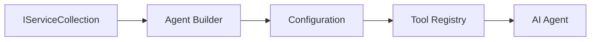

<!--
CO_OP_TRANSLATOR_METADATA:
{
  "original_hash": "bcc874e190347bd6a095aed56dc16de8",
  "translation_date": "2025-11-13T13:12:04+00:00",
  "source_file": "03-agentic-design-patterns/code_samples/03-dotnet-agent-framework.md",
  "language_code": "he"
}
-->
# 🎨 תבניות עיצוב סוכנים עם מודלים של GitHub (.NET)

## 📋 מטרות למידה

דוגמה זו מציגה תבניות עיצוב ברמה ארגונית לבניית סוכנים חכמים באמצעות Microsoft Agent Framework ב-.NET עם אינטגרציה של מודלים של GitHub. תלמדו תבניות מקצועיות וגישות ארכיטקטוניות שהופכות סוכנים למוכנים לייצור, ניתנים לתחזוקה ולסקיילביליות.

### תבניות עיצוב ארגוניות

- 🏭 **תבנית מפעל**: יצירת סוכנים סטנדרטית עם הזרקת תלות
- 🔧 **תבנית בונה**: הגדרה והגדרה שוטפת של סוכנים
- 🧵 **תבניות בטוחות לשרשור**: ניהול שיחות מקבילי
- 📋 **תבנית מאגר**: ניהול כלים ויכולות מאורגן

## 🎯 יתרונות ארכיטקטוניים ספציפיים ל-.NET

### תכונות ארגוניות

- **הקלדה חזקה**: אימות בזמן קומפילציה ותמיכה ב-IntelliSense
- **הזרקת תלות**: אינטגרציה מובנית של מיכל DI
- **ניהול תצורה**: תבניות IConfiguration ו-Options
- **Async/Await**: תמיכה בתכנות אסינכרוני ברמה ראשונה

### תבניות מוכנות לייצור

- **אינטגרציית לוגים**: תמיכה ב-ILogger ולוגים מובנים
- **בדיקות בריאות**: ניטור ואבחון מובנים
- **אימות תצורה**: הקלדה חזקה עם הערות נתונים
- **טיפול בשגיאות**: ניהול חריגים מובנה

## 🔧 ארכיטקטורה טכנית

### רכיבי ליבה של .NET

- **Microsoft.Extensions.AI**: הפשטות שירות AI מאוחדות
- **Microsoft.Agents.AI**: מסגרת תזמור סוכנים ארגונית
- **אינטגרציה של מודלים של GitHub**: תבניות לקוח API בעלות ביצועים גבוהים
- **מערכת תצורה**: אינטגרציה של appsettings.json וסביבה

### יישום תבניות עיצוב



## 🏗️ תבניות ארגוניות מוצגות

### 1. **תבניות יצירה**

- **מפעל סוכנים**: יצירת סוכנים מרכזית עם תצורה עקבית
- **תבנית בונה**: API שוטף להגדרת סוכנים מורכבת
- **תבנית סינגלטון**: ניהול משאבים ותצורה משותפים
- **הזרקת תלות**: צימוד רופף ויכולת בדיקה

### 2. **תבניות התנהגותיות**

- **תבנית אסטרטגיה**: אסטרטגיות ביצוע כלים ניתנות להחלפה
- **תבנית פקודה**: פעולות סוכן מקופסות עם ביטול/חזרה
- **תבנית משקיף**: ניהול מחזור חיים של סוכן מונע אירועים
- **תבנית שיטת תבנית**: זרימות עבודה סטנדרטיות לביצוע סוכן

### 3. **תבניות מבניות**

- **תבנית מתאם**: שכבת אינטגרציה של API מודלים של GitHub
- **תבנית דקורטור**: שיפור יכולות סוכן
- **תבנית חזית**: ממשקי אינטראקציה פשוטים עם סוכן
- **תבנית פרוקסי**: טעינה עצלה וקשירה לשיפור ביצועים

## 📚 עקרונות עיצוב ב-.NET

### עקרונות SOLID

- **אחריות יחידה**: לכל רכיב יש מטרה ברורה אחת
- **פתוח/סגור**: ניתן להרחבה ללא שינוי
- **החלפת ליסקוב**: יישומי כלים מבוססי ממשק
- **הפרדת ממשקים**: ממשקים ממוקדים וקוהרנטיים
- **היפוך תלות**: תלות בהפשטות, לא במימושים

### ארכיטקטורה נקייה

- **שכבת דומיין**: הפשטות ליבה של סוכן וכלים
- **שכבת אפליקציה**: תזמור סוכנים וזרימות עבודה
- **שכבת תשתית**: אינטגרציה של מודלים של GitHub ושירותים חיצוניים
- **שכבת הצגה**: אינטראקציה עם משתמש ועיצוב תגובות

## 🔒 שיקולים ארגוניים

### אבטחה

- **ניהול אישורים**: טיפול מאובטח במפתחות API עם IConfiguration
- **אימות קלט**: הקלדה חזקה ואימות הערות נתונים
- **סינון פלט**: עיבוד תגובות מאובטח וסינון
- **לוגים למעקב**: מעקב מקיף אחר פעולות

### ביצועים

- **תבניות אסינכרוניות**: פעולות I/O לא חוסמות
- **מאגר חיבורים**: ניהול יעיל של לקוח HTTP
- **קשירה**: קשירת תגובות לשיפור ביצועים
- **ניהול משאבים**: דפוסי סילוק וניקוי נכונים

### סקיילביליות

- **בטיחות שרשור**: תמיכה בביצוע סוכנים מקבילי
- **מאגר משאבים**: ניצול משאבים יעיל
- **ניהול עומס**: הגבלת קצב וטיפול בלחץ
- **ניטור**: מדדי ביצועים ובדיקות בריאות

## 🚀 פריסת ייצור

- **ניהול תצורה**: הגדרות ספציפיות לסביבה
- **אסטרטגיית לוגים**: לוגים מובנים עם מזהי קורלציה
- **טיפול בשגיאות**: טיפול חריגים גלובלי עם התאוששות נכונה
- **ניטור**: Application Insights ומוני ביצועים
- **בדיקות**: בדיקות יחידה, בדיקות אינטגרציה ודפוסי בדיקות עומס

מוכנים לבנות סוכנים חכמים ברמה ארגונית עם .NET? בואו נבנה משהו חזק! 🏢✨

## 🚀 תחילת עבודה

### דרישות מוקדמות

- [.NET 10 SDK](https://dotnet.microsoft.com/download/dotnet/10.0) או גרסה גבוהה יותר
- [אסימון גישה ל-API של מודלים של GitHub](https://docs.github.com/github-models/github-models-at-scale/using-your-own-api-keys-in-github-models)

### משתני סביבה נדרשים

```bash
# zsh/bash
export GH_TOKEN=<your_github_token>
export GH_ENDPOINT=https://models.github.ai/inference
export GH_MODEL_ID=openai/gpt-5-mini
```

```powershell
# PowerShell
$env:GH_TOKEN = "<your_github_token>"
$env:GH_ENDPOINT = "https://models.github.ai/inference"
$env:GH_MODEL_ID = "openai/gpt-5-mini"
```

### קוד לדוגמה

כדי להפעיל את דוגמת הקוד,

```bash
# zsh/bash
chmod +x ./03-dotnet-agent-framework.cs
./03-dotnet-agent-framework.cs
```

או באמצעות CLI של dotnet:

```bash
dotnet run ./03-dotnet-agent-framework.cs
```

ראו [`03-dotnet-agent-framework.cs`](../../../../03-agentic-design-patterns/code_samples/03-dotnet-agent-framework.cs) עבור הקוד המלא.

```csharp
#!/usr/bin/dotnet run

#:package Microsoft.Extensions.AI@10.*
#:package Microsoft.Agents.AI.OpenAI@1.*-*

using System.ClientModel;
using System.ComponentModel;

using Microsoft.Agents.AI;
using Microsoft.Extensions.AI;

using OpenAI;

// Tool Function: Random Destination Generator
// This static method will be available to the agent as a callable tool
// The [Description] attribute helps the AI understand when to use this function
// This demonstrates how to create custom tools for AI agents
[Description("Provides a random vacation destination.")]
static string GetRandomDestination()
{
    // List of popular vacation destinations around the world
    // The agent will randomly select from these options
    var destinations = new List<string>
    {
        "Paris, France",
        "Tokyo, Japan",
        "New York City, USA",
        "Sydney, Australia",
        "Rome, Italy",
        "Barcelona, Spain",
        "Cape Town, South Africa",
        "Rio de Janeiro, Brazil",
        "Bangkok, Thailand",
        "Vancouver, Canada"
    };

    // Generate random index and return selected destination
    // Uses System.Random for simple random selection
    var random = new Random();
    int index = random.Next(destinations.Count);
    return destinations[index];
}

// Extract configuration from environment variables
// Retrieve the GitHub Models API endpoint, defaults to https://models.github.ai/inference if not specified
// Retrieve the model ID, defaults to openai/gpt-5-mini if not specified
// Retrieve the GitHub token for authentication, throws exception if not specified
var github_endpoint = Environment.GetEnvironmentVariable("GH_ENDPOINT") ?? "https://models.github.ai/inference";
var github_model_id = Environment.GetEnvironmentVariable("GH_MODEL_ID") ?? "openai/gpt-5-mini";
var github_token = Environment.GetEnvironmentVariable("GH_TOKEN") ?? throw new InvalidOperationException("GH_TOKEN is not set.");

// Configure OpenAI Client Options
// Create configuration options to point to GitHub Models endpoint
// This redirects OpenAI client calls to GitHub's model inference service
var openAIOptions = new OpenAIClientOptions()
{
    Endpoint = new Uri(github_endpoint)
};

// Initialize OpenAI Client with GitHub Models Configuration
// Create OpenAI client using GitHub token for authentication
// Configure it to use GitHub Models endpoint instead of OpenAI directly
var openAIClient = new OpenAIClient(new ApiKeyCredential(github_token), openAIOptions);

// Define Agent Identity and Comprehensive Instructions
// Agent name for identification and logging purposes
var AGENT_NAME = "TravelAgent";

// Detailed instructions that define the agent's personality, capabilities, and behavior
// This system prompt shapes how the agent responds and interacts with users
var AGENT_INSTRUCTIONS = """
You are a helpful AI Agent that can help plan vacations for customers.

Important: When users specify a destination, always plan for that location. Only suggest random destinations when the user hasn't specified a preference.

When the conversation begins, introduce yourself with this message:
"Hello! I'm your TravelAgent assistant. I can help plan vacations and suggest interesting destinations for you. Here are some things you can ask me:
1. Plan a day trip to a specific location
2. Suggest a random vacation destination
3. Find destinations with specific features (beaches, mountains, historical sites, etc.)
4. Plan an alternative trip if you don't like my first suggestion

What kind of trip would you like me to help you plan today?"

Always prioritize user preferences. If they mention a specific destination like "Bali" or "Paris," focus your planning on that location rather than suggesting alternatives.
""";

// Create AI Agent with Advanced Travel Planning Capabilities
// Initialize complete agent pipeline: OpenAI client → Chat client → AI agent
// Configure agent with name, detailed instructions, and available tools
// This demonstrates the .NET agent creation pattern with full configuration
AIAgent agent = openAIClient
    .GetChatClient(github_model_id)
    .CreateAIAgent(
        name: AGENT_NAME,
        instructions: AGENT_INSTRUCTIONS,
        tools: [AIFunctionFactory.Create(GetRandomDestination)]
    );

// Create New Conversation Thread for Context Management
// Initialize a new conversation thread to maintain context across multiple interactions
// Threads enable the agent to remember previous exchanges and maintain conversational state
// This is essential for multi-turn conversations and contextual understanding
AgentThread thread = agent.GetNewThread();

// Execute Agent: First Travel Planning Request
// Run the agent with an initial request that will likely trigger the random destination tool
// The agent will analyze the request, use the GetRandomDestination tool, and create an itinerary
// Using the thread parameter maintains conversation context for subsequent interactions
await foreach (var update in agent.RunStreamingAsync("Plan me a day trip", thread))
{
    await Task.Delay(10);
    Console.Write(update);
}

Console.WriteLine();

// Execute Agent: Follow-up Request with Context Awareness
// Demonstrate contextual conversation by referencing the previous response
// The agent remembers the previous destination suggestion and will provide an alternative
// This showcases the power of conversation threads and contextual understanding in .NET agents
await foreach (var update in agent.RunStreamingAsync("I don't like that destination. Plan me another vacation.", thread))
{
    await Task.Delay(10);
    Console.Write(update);
}
```

---

<!-- CO-OP TRANSLATOR DISCLAIMER START -->
**כתב ויתור**:  
מסמך זה תורגם באמצעות שירות תרגום מבוסס בינה מלאכותית [Co-op Translator](https://github.com/Azure/co-op-translator). למרות שאנו שואפים לדיוק, יש לקחת בחשבון שתרגומים אוטומטיים עשויים להכיל שגיאות או אי-דיוקים. המסמך המקורי בשפתו המקורית צריך להיחשב כמקור הסמכותי. למידע קריטי, מומלץ להשתמש בתרגום מקצועי על ידי בני אדם. איננו אחראים לאי-הבנות או לפרשנויות שגויות הנובעות משימוש בתרגום זה.
<!-- CO-OP TRANSLATOR DISCLAIMER END -->