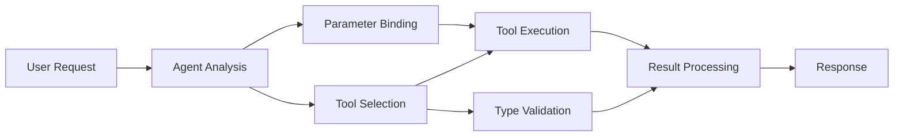

<!--
CO_OP_TRANSLATOR_METADATA:
{
  "original_hash": "91d6061e402489603f2ec8b528cae59b",
  "translation_date": "2025-11-18T17:52:51+00:00",
  "source_file": "04-tool-use/code_samples/04-dotnet-agent-framework.md",
  "language_code": "he"
}
-->
# 🛠️ שימוש מתקדם בכלים עם מודלים של GitHub (.NET)

## 📋 מטרות למידה

מחברת זו מציגה דפוסי אינטגרציה ברמה ארגונית באמצעות Microsoft Agent Framework ב-.NET עם מודלים של GitHub. תלמדו לבנות סוכנים מתקדמים עם כלים מתמחים מרובים, תוך ניצול ההקלדה החזקה של C# ותכונות הארגון של .NET.

### יכולות מתקדמות של כלים שתשלוט בהן

- 🔧 **ארכיטקטורת כלים מרובה**: בניית סוכנים עם יכולות מתמחות מרובות  
- 🎯 **ביצוע כלים בטוח-הקלדה**: ניצול אימות בזמן קומפילציה של C#  
- 📊 **דפוסי כלים ארגוניים**: עיצוב כלים מוכן לייצור וטיפול בשגיאות  
- 🔗 **הרכבת כלים**: שילוב כלים לזרימות עבודה עסקיות מורכבות  

## 🎯 יתרונות ארכיטקטורת כלים ב-.NET

### תכונות כלים ארגוניים

- **אימות בזמן קומפילציה**: הקלדה חזקה מבטיחה נכונות פרמטרים של כלים  
- **הזרקת תלות**: אינטגרציה של IoC לניהול כלים  
- **דפוסי Async/Await**: ביצוע כלים לא חוסם עם ניהול משאבים נכון  
- **לוג מובנה**: אינטגרציה מובנית לניטור ביצוע כלים  

### דפוסים מוכנים לייצור

- **טיפול בשגיאות**: ניהול שגיאות מקיף עם חריגים מוקלדים  
- **ניהול משאבים**: דפוסי סילוק נכונים וניהול זיכרון  
- **ניטור ביצועים**: מדדים מובנים ומוני ביצועים  
- **ניהול תצורה**: תצורה בטוחה-הקלדה עם אימות  

## 🔧 ארכיטקטורה טכנית

### רכיבי כלים מרכזיים ב-.NET

- **Microsoft.Extensions.AI**: שכבת הפשטה מאוחדת לכלים  
- **Microsoft.Agents.AI**: אורקסטרציה של כלים ברמה ארגונית  
- **אינטגרציה עם מודלים של GitHub**: לקוח API בעל ביצועים גבוהים עם ניהול חיבורים  

### צינור ביצוע כלים


  
## 🛠️ קטגוריות ודפוסי כלים

### 1. **כלי עיבוד נתונים**

- **אימות קלט**: הקלדה חזקה עם הערות נתונים  
- **פעולות טרנספורמציה**: המרת נתונים ועיצוב בטוח-הקלדה  
- **לוגיקה עסקית**: כלים לחישוב וניתוח ספציפיים לתחום  
- **עיצוב פלט**: יצירת תגובות מובנות  

### 2. **כלי אינטגרציה**

- **מחברי API**: אינטגרציה עם שירותי RESTful באמצעות HttpClient  
- **כלי בסיסי נתונים**: אינטגרציה עם Entity Framework לגישה לנתונים  
- **פעולות קבצים**: פעולות מערכת קבצים מאובטחות עם אימות  
- **שירותים חיצוניים**: דפוסי אינטגרציה עם שירותי צד שלישי  

### 3. **כלי עזר**

- **עיבוד טקסט**: כלי עיצוב ומניפולציה של מחרוזות  
- **פעולות תאריך/שעה**: חישובי תאריך/שעה מותאמים לתרבות  
- **כלים מתמטיים**: חישובים מדויקים ופעולות סטטיסטיות  
- **כלי אימות**: אימות כללי עסקי ובדיקת נתונים  

מוכנים לבנות סוכנים ברמה ארגונית עם יכולות כלים חזקים ובטוחים-הקלדה ב-.NET? בואו נבנה פתרונות מקצועיים! 🏢⚡  

## 🚀 תחילת העבודה

### דרישות מוקדמות

- [.NET 10 SDK](https://dotnet.microsoft.com/download/dotnet/10.0) או גרסה גבוהה יותר  
- [אסימון גישה ל-API של מודלים של GitHub](https://docs.github.com/github-models/github-models-at-scale/using-your-own-api-keys-in-github-models)  

### משתני סביבה נדרשים

```bash
# zsh/bash
export GH_TOKEN=<your_github_token>
export GH_ENDPOINT=https://models.github.ai/inference
export GH_MODEL_ID=openai/gpt-5-mini
```
  
```powershell
# PowerShell
$env:GH_TOKEN = "<your_github_token>"
$env:GH_ENDPOINT = "https://models.github.ai/inference"
$env:GH_MODEL_ID = "openai/gpt-5-mini"
```
  
### דוגמת קוד

כדי להריץ את דוגמת הקוד,

```bash
# zsh/bash
chmod +x ./04-dotnet-agent-framework.cs
./04-dotnet-agent-framework.cs
```
  
או באמצעות CLI של dotnet:

```bash
dotnet run ./04-dotnet-agent-framework.cs
```
  
ראו [`04-dotnet-agent-framework.cs`](../../../../04-tool-use/code_samples/04-dotnet-agent-framework.cs) עבור הקוד המלא.

```csharp
#!/usr/bin/dotnet run

#:package Microsoft.Extensions.AI@10.*
#:package Microsoft.Agents.AI.OpenAI@1.*-*

using System.ClientModel;
using System.ComponentModel;

using Microsoft.Agents.AI;
using Microsoft.Extensions.AI;

using OpenAI;

// Tool Function: Random Destination Generator
// This static method will be available to the agent as a callable tool
// The [Description] attribute helps the AI understand when to use this function
// This demonstrates how to create custom tools for AI agents
[Description("Provides a random vacation destination.")]
static string GetRandomDestination()
{
    // List of popular vacation destinations around the world
    // The agent will randomly select from these options
    var destinations = new List<string>
    {
        "Paris, France",
        "Tokyo, Japan",
        "New York City, USA",
        "Sydney, Australia",
        "Rome, Italy",
        "Barcelona, Spain",
        "Cape Town, South Africa",
        "Rio de Janeiro, Brazil",
        "Bangkok, Thailand",
        "Vancouver, Canada"
    };

    // Generate random index and return selected destination
    // Uses System.Random for simple random selection
    var random = new Random();
    int index = random.Next(destinations.Count);
    return destinations[index];
}

// Extract configuration from environment variables
// Retrieve the GitHub Models API endpoint, defaults to https://models.github.ai/inference if not specified
// Retrieve the model ID, defaults to openai/gpt-5-mini if not specified
// Retrieve the GitHub token for authentication, throws exception if not specified
var github_endpoint = Environment.GetEnvironmentVariable("GH_ENDPOINT") ?? "https://models.github.ai/inference";
var github_model_id = Environment.GetEnvironmentVariable("GH_MODEL_ID") ?? "openai/gpt-5-mini";
var github_token = Environment.GetEnvironmentVariable("GH_TOKEN") ?? throw new InvalidOperationException("GH_TOKEN is not set.");

// Configure OpenAI Client Options
// Create configuration options to point to GitHub Models endpoint
// This redirects OpenAI client calls to GitHub's model inference service
var openAIOptions = new OpenAIClientOptions()
{
    Endpoint = new Uri(github_endpoint)
};

// Initialize OpenAI Client with GitHub Models Configuration
// Create OpenAI client using GitHub token for authentication
// Configure it to use GitHub Models endpoint instead of OpenAI directly
var openAIClient = new OpenAIClient(new ApiKeyCredential(github_token), openAIOptions);

// Define Agent Identity and Comprehensive Instructions
// Agent name for identification and logging purposes
var AGENT_NAME = "TravelAgent";

// Detailed instructions that define the agent's personality, capabilities, and behavior
// This system prompt shapes how the agent responds and interacts with users
var AGENT_INSTRUCTIONS = """
You are a helpful AI Agent that can help plan vacations for customers.

Important: When users specify a destination, always plan for that location. Only suggest random destinations when the user hasn't specified a preference.

When the conversation begins, introduce yourself with this message:
"Hello! I'm your TravelAgent assistant. I can help plan vacations and suggest interesting destinations for you. Here are some things you can ask me:
1. Plan a day trip to a specific location
2. Suggest a random vacation destination
3. Find destinations with specific features (beaches, mountains, historical sites, etc.)
4. Plan an alternative trip if you don't like my first suggestion

What kind of trip would you like me to help you plan today?"

Always prioritize user preferences. If they mention a specific destination like "Bali" or "Paris," focus your planning on that location rather than suggesting alternatives.
""";

// Create AI Agent with Advanced Travel Planning Capabilities
// Initialize complete agent pipeline: OpenAI client → Chat client → AI agent
// Configure agent with name, detailed instructions, and available tools
// This demonstrates the .NET agent creation pattern with full configuration
AIAgent agent = openAIClient
    .GetChatClient(github_model_id)
    .CreateAIAgent(
        name: AGENT_NAME,
        instructions: AGENT_INSTRUCTIONS,
        tools: [AIFunctionFactory.Create(GetRandomDestination)]
    );

// Create New Conversation Thread for Context Management
// Initialize a new conversation thread to maintain context across multiple interactions
// Threads enable the agent to remember previous exchanges and maintain conversational state
// This is essential for multi-turn conversations and contextual understanding
AgentThread thread = agent.GetNewThread();

// Execute Agent: First Travel Planning Request
// Run the agent with an initial request that will likely trigger the random destination tool
// The agent will analyze the request, use the GetRandomDestination tool, and create an itinerary
// Using the thread parameter maintains conversation context for subsequent interactions
await foreach (var update in agent.RunStreamingAsync("Plan me a day trip", thread))
{
    await Task.Delay(10);
    Console.Write(update);
}

Console.WriteLine();

// Execute Agent: Follow-up Request with Context Awareness
// Demonstrate contextual conversation by referencing the previous response
// The agent remembers the previous destination suggestion and will provide an alternative
// This showcases the power of conversation threads and contextual understanding in .NET agents
await foreach (var update in agent.RunStreamingAsync("I don't like that destination. Plan me another vacation.", thread))
{
    await Task.Delay(10);
    Console.Write(update);
}
```  

---

<!-- CO-OP TRANSLATOR DISCLAIMER START -->
**כתב ויתור**:  
מסמך זה תורגם באמצעות שירות תרגום מבוסס בינה מלאכותית [Co-op Translator](https://github.com/Azure/co-op-translator). למרות שאנו שואפים לדיוק, יש לקחת בחשבון שתרגומים אוטומטיים עשויים להכיל שגיאות או אי-דיוקים. המסמך המקורי בשפתו המקורית צריך להיחשב כמקור הסמכותי. למידע קריטי, מומלץ להשתמש בתרגום מקצועי על ידי בני אדם. איננו אחראים לאי-הבנות או לפרשנויות שגויות הנובעות משימוש בתרגום זה.
<!-- CO-OP TRANSLATOR DISCLAIMER END -->