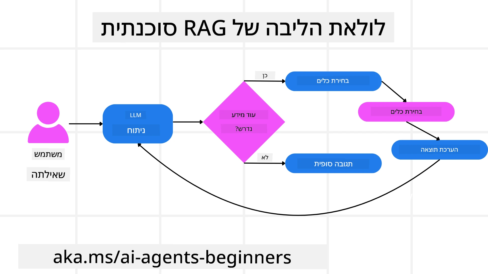
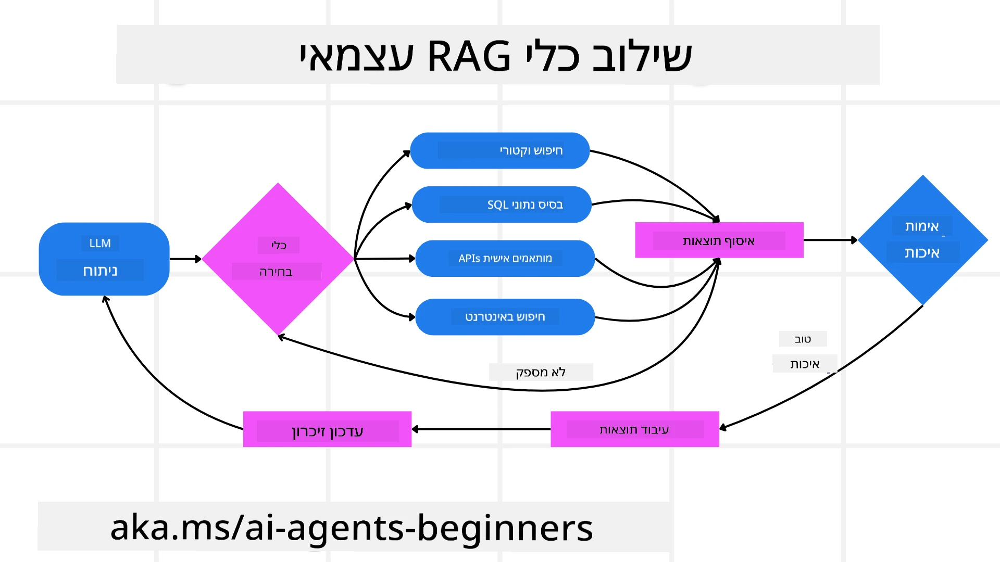
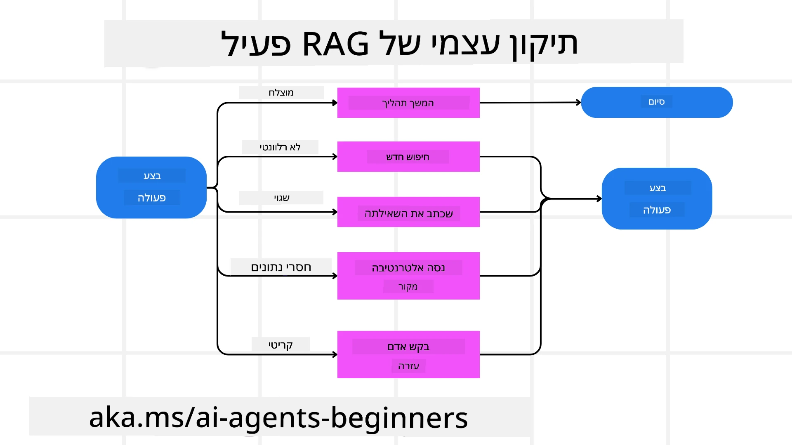
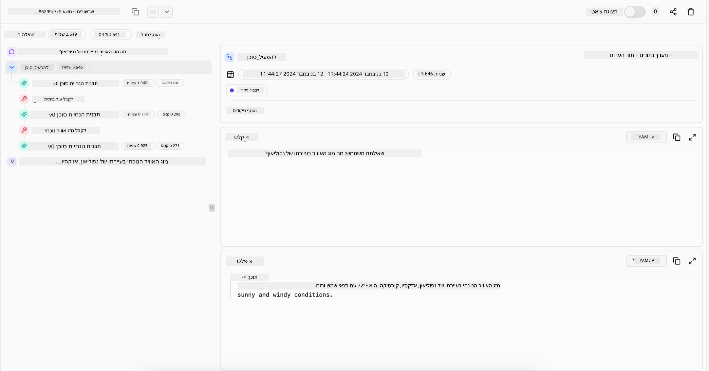

<!--
CO_OP_TRANSLATOR_METADATA:
{
  "original_hash": "0ebf6b2290db55dbf2d10cc49655523b",
  "translation_date": "2025-09-30T07:23:46+00:00",
  "source_file": "05-agentic-rag/README.md",
  "language_code": "he"
}
-->

> _(לחצו על התמונה למעלה לצפייה בסרטון של השיעור)_

# Agentic RAG

שיעור זה מספק סקירה מקיפה על Agentic Retrieval-Augmented Generation (Agentic RAG), פרדיגמה חדשה בתחום הבינה המלאכותית שבה מודלים שפה גדולים (LLMs) מתכננים באופן עצמאי את הצעדים הבאים שלהם תוך משיכת מידע ממקורות חיצוניים. בניגוד לדפוסי שליפה-קריאה סטטיים, Agentic RAG כולל קריאות חוזרות למודל השפה, משולבות עם קריאות לכלים או פונקציות ותוצרים מובנים. המערכת מעריכה תוצאות, משפרת שאילתות, מפעילה כלים נוספים במידת הצורך וממשיכה במחזור זה עד להשגת פתרון מספק.

## מבוא

שיעור זה יעסוק ב:

- **הבנת Agentic RAG:** למדו על הפרדיגמה החדשה בתחום הבינה המלאכותית שבה מודלים שפה גדולים (LLMs) מתכננים באופן עצמאי את הצעדים הבאים שלהם תוך משיכת מידע ממקורות נתונים חיצוניים.
- **סגנון יצרן-בודק איטרטיבי:** הבינו את מחזור הקריאות החוזרות למודל השפה, משולבות עם קריאות לכלים או פונקציות ותוצרים מובנים, שנועדו לשפר את הדיוק ולטפל בשאילתות פגומות.
- **חקירת יישומים מעשיים:** זיהוי תרחישים שבהם Agentic RAG מצטיין, כמו סביבות שבהן הדיוק הוא קריטי, אינטראקציות מורכבות עם מסדי נתונים ותהליכי עבודה מורחבים.

## מטרות למידה

לאחר השלמת השיעור, תדעו כיצד/תבינו:

- **הבנת Agentic RAG:** למדו על הפרדיגמה החדשה בתחום הבינה המלאכותית שבה מודלים שפה גדולים (LLMs) מתכננים באופן עצמאי את הצעדים הבאים שלהם תוך משיכת מידע ממקורות נתונים חיצוניים.
- **סגנון יצרן-בודק איטרטיבי:** הבינו את הרעיון של מחזור קריאות חוזרות למודל השפה, משולבות עם קריאות לכלים או פונקציות ותוצרים מובנים, שנועדו לשפר את הדיוק ולטפל בשאילתות פגומות.
- **שליטה בתהליך ההסקה:** הבינו את יכולת המערכת לשלוט בתהליך ההסקה שלה, לקבל החלטות כיצד לגשת לבעיות מבלי להסתמך על נתיבים מוגדרים מראש.
- **תהליך עבודה:** הבינו כיצד מודל אג'נטי מחליט באופן עצמאי לשלוף דוחות מגמות שוק, לזהות נתוני מתחרים, לקשר בין מדדי מכירות פנימיים, לסנתז ממצאים ולהעריך אסטרטגיה.
- **מחזורים איטרטיביים, שילוב כלים וזיכרון:** למדו על הסתמכות המערכת על דפוס אינטראקציה מחזורי, שמירה על מצב וזיכרון בין שלבים כדי להימנע ממחזוריות חוזרת ולקבל החלטות מושכלות.
- **התמודדות עם מצבי כשל ותיקון עצמי:** חקרו את מנגנוני התיקון העצמי החזקים של המערכת, כולל איטרציה ושאילתות חוזרות, שימוש בכלי אבחון והסתמכות על פיקוח אנושי.
- **גבולות האג'נטיות:** הבינו את המגבלות של Agentic RAG, תוך התמקדות באוטונומיה ספציפית לתחום, תלות בתשתית וכיבוד מגבלות.
- **מקרי שימוש מעשיים וערך:** זיהוי תרחישים שבהם Agentic RAG מצטיין, כמו סביבות שבהן הדיוק הוא קריטי, אינטראקציות מורכבות עם מסדי נתונים ותהליכי עבודה מורחבים.
- **ממשל, שקיפות ואמון:** למדו על חשיבות הממשל והשקיפות, כולל הסקה ניתנת להסבר, שליטה בהטיות ופיקוח אנושי.

## מהו Agentic RAG?

Agentic Retrieval-Augmented Generation (Agentic RAG) הוא פרדיגמה חדשה בתחום הבינה המלאכותית שבה מודלים שפה גדולים (LLMs) מתכננים באופן עצמאי את הצעדים הבאים שלהם תוך משיכת מידע ממקורות חיצוניים. בניגוד לדפוסי שליפה-קריאה סטטיים, Agentic RAG כולל קריאות חוזרות למודל השפה, משולבות עם קריאות לכלים או פונקציות ותוצרים מובנים. המערכת מעריכה תוצאות, משפרת שאילתות, מפעילה כלים נוספים במידת הצורך וממשיכה במחזור זה עד להשגת פתרון מספק. סגנון איטרטיבי זה, המכונה "יצרן-בודק", משפר את הדיוק, מטפל בשאילתות פגומות ומבטיח תוצאות איכותיות.

המערכת שולטת באופן פעיל בתהליך ההסקה שלה, משכתבת שאילתות שנכשלו, בוחרת שיטות שליפה שונות ומשלבת כלים מרובים—כגון חיפוש וקטורי ב-Azure AI Search, מסדי נתונים SQL או APIs מותאמים אישית—לפני שהיא מסיימת את תשובתה. התכונה המבדילה של מערכת אג'נטית היא יכולתה לשלוט בתהליך ההסקה שלה. יישומי RAG מסורתיים מסתמכים על נתיבים מוגדרים מראש, אך מערכת אג'נטית קובעת באופן עצמאי את רצף השלבים בהתבסס על איכות המידע שהיא מוצאת.

## הגדרת Agentic Retrieval-Augmented Generation (Agentic RAG)

Agentic Retrieval-Augmented Generation (Agentic RAG) הוא פרדיגמה חדשה בפיתוח בינה מלאכותית שבה מודלים שפה גדולים (LLMs) לא רק שולפים מידע ממקורות נתונים חיצוניים אלא גם מתכננים באופן עצמאי את הצעדים הבאים שלהם. בניגוד לדפוסי שליפה-קריאה סטטיים או רצפי הנחיות מתוסרטים בקפידה, Agentic RAG כולל מחזור של קריאות חוזרות למודל השפה, משולבות עם קריאות לכלים או פונקציות ותוצרים מובנים. בכל שלב, המערכת מעריכה את התוצאות שהשיגה, מחליטה אם לשפר את השאילתות, מפעילה כלים נוספים במידת הצורך וממשיכה במחזור זה עד שהיא משיגה פתרון מספק.

סגנון פעולה איטרטיבי זה, המכונה "יצרן-בודק", נועד לשפר את הדיוק, לטפל בשאילתות פגומות למסדי נתונים מובנים (לדוגמה, NL2SQL) ולהבטיח תוצאות מאוזנות ואיכותיות. במקום להסתמך רק על שרשראות הנחיות מתוכננות בקפידה, המערכת שולטת באופן פעיל בתהליך ההסקה שלה. היא יכולה לשכתב שאילתות שנכשלו, לבחור שיטות שליפה שונות ולשלב כלים מרובים—כגון חיפוש וקטורי ב-Azure AI Search, מסדי נתונים SQL או APIs מותאמים אישית—לפני שהיא מסיימת את תשובתה. הדבר מבטל את הצורך במסגרות תזמור מורכבות מדי. במקום זאת, מחזור פשוט יחסית של "קריאה למודל שפה → שימוש בכלי → קריאה למודל שפה → ..." יכול להניב תוצרים מתוחכמים ומבוססים היטב.

## שליטה בתהליך ההסקה

התכונה המבדילה שהופכת מערכת ל"אג'נטית" היא יכולתה לשלוט בתהליך ההסקה שלה. יישומי RAG מסורתיים מסתמכים לעיתים קרובות על בני אדם שמגדירים מראש נתיב עבור המודל: שרשרת מחשבה שמתארת מה לשלוף ומתי.  
אך כאשר מערכת היא באמת אג'נטית, היא מחליטה באופן פנימי כיצד לגשת לבעיה. היא לא רק מבצעת תסריט; היא קובעת באופן עצמאי את רצף השלבים בהתבסס על איכות המידע שהיא מוצאת.  
לדוגמה, אם היא מתבקשת ליצור אסטרטגיית השקת מוצר, היא לא מסתמכת רק על הנחיה שמפרטת את כל תהליך המחקר וקבלת ההחלטות. במקום זאת, המודל האג'נטי מחליט באופן עצמאי:

1. לשלוף דוחות מגמות שוק עדכניים באמצעות Bing Web Grounding.
2. לזהות נתוני מתחרים רלוונטיים באמצעות Azure AI Search.
3. לקשר בין מדדי מכירות פנימיים היסטוריים באמצעות Azure SQL Database.
4. לסנתז את הממצאים לאסטרטגיה מגובשת באמצעות Azure OpenAI Service.
5. להעריך את האסטרטגיה לאיתור פערים או אי-התאמות, וליזום סבב שליפה נוסף במידת הצורך.  
כל השלבים הללו—שיפור שאילתות, בחירת מקורות, איטרציה עד שהמודל "מרוצה" מהתשובה—מוחלטים על ידי המודל, ולא מתוסרטים מראש על ידי אדם.

## מחזורים איטרטיביים, שילוב כלים וזיכרון

מערכת אג'נטית מסתמכת על דפוס אינטראקציה מחזורי:

- **קריאה ראשונית:** המטרה של המשתמש (כלומר, ההנחיה) מוצגת למודל השפה.
- **הפעלת כלים:** אם המודל מזהה מידע חסר או הוראות מעורפלות, הוא בוחר כלי או שיטת שליפה—כמו שאילתה למסד נתונים וקטורי (לדוגמה, Azure AI Search Hybrid search על נתונים פרטיים) או קריאה מובנית ל-SQL—כדי לאסוף יותר הקשר.
- **הערכה ושיפור:** לאחר סקירת הנתונים שהוחזרו, המודל מחליט אם המידע מספיק. אם לא, הוא משפר את השאילתה, מנסה כלי אחר או מתאים את הגישה שלו.
- **חזרה עד לסיפוק:** מחזור זה ממשיך עד שהמודל קובע שיש לו מספיק בהירות וראיות כדי לספק תשובה סופית ומנומקת היטב.
- **זיכרון ומצב:** מכיוון שהמערכת שומרת על מצב וזיכרון בין השלבים, היא יכולה לזכור ניסיונות קודמים ותוצאותיהם, להימנע ממחזוריות חוזרת ולקבל החלטות מושכלות יותר ככל שהיא מתקדמת.

עם הזמן, הדבר יוצר תחושה של הבנה מתפתחת, ומאפשר למודל לנווט משימות מורכבות ורב-שלביות מבלי שאדם יצטרך להתערב או לעצב מחדש את ההנחיה באופן מתמיד.

## התמודדות עם מצבי כשל ותיקון עצמי

האג'נטיות של Agentic RAG כוללת גם מנגנוני תיקון עצמי חזקים. כאשר המערכת נתקלת במבוי סתום—כגון שליפת מסמכים לא רלוונטיים או שאילתות פגומות—היא יכולה:

- **לאתר ולשאול מחדש:** במקום להחזיר תשובות בעלות ערך נמוך, המודל מנסה אסטרטגיות חיפוש חדשות, משכתב שאילתות למסדי נתונים או בוחן מערכי נתונים חלופיים.
- **להשתמש בכלי אבחון:** המערכת עשויה להפעיל פונקציות נוספות שנועדו לעזור לה לאתר שגיאות בתהליך ההסקה שלה או לאשר את נכונות הנתונים שנשלפו. כלים כמו Azure AI Tracing יהיו חשובים כדי לאפשר תצפיתיות ומעקב חזקים.
- **להסתמך על פיקוח אנושי:** עבור תרחישים בעלי סיכון גבוה או כישלונות חוזרים, המודל עשוי לסמן אי-ודאות ולבקש הדרכה אנושית. לאחר שהאדם מספק משוב מתקן, המודל יכול לשלב את הלקח הזה להבא.

גישה איטרטיבית ודינמית זו מאפשרת למודל להשתפר באופן מתמיד, ומבטיחה שהוא לא רק מערכת חד-פעמית אלא כזו שלומדת מטעויותיה במהלך סשן נתון.

## גבולות האג'נטיות

למרות האוטונומיה שלה בתוך משימה, Agentic RAG אינה מקבילה לבינה מלאכותית כללית. יכולותיה ה"אג'נטיות" מוגבלות לכלים, מקורות הנתונים והמדיניות שסופקו על ידי מפתחים אנושיים. היא אינה יכולה להמציא כלים משלה או לצאת מחוץ לגבולות התחום שהוגדרו. במקום זאת, היא מצטיינת בתזמור דינמי של המשאבים הקיימים.

הבדלים מרכזיים מצורות מתקדמות יותר של בינה מלאכותית כוללים:

1. **אוטונומיה ספציפית לתחום:** מערכות Agentic RAG מתמקדות בהשגת מטרות שהוגדרו על ידי המשתמש בתוך תחום ידוע, תוך שימוש באסטרטגיות כמו שכתוב שאילתות או בחירת כלים כדי לשפר תוצאות.
2. **תלות בתשתית:** יכולות המערכת תלויות בכלים ובנתונים ששולבו על ידי מפתחים. היא אינה יכולה לחרוג מגבולות אלה ללא התערבות אנושית.
3. **כיבוד מגבלות:** הנחיות אתיות, כללי ציות ומדיניות עסקית נותרות חשובות מאוד. חופש הפעולה של הסוכן תמיד מוגבל על ידי אמצעי בטיחות ומנגנוני פיקוח (בתקווה).

## מקרי שימוש מעשיים וערך

Agentic RAG מצטיין בתרחישים הדורשים איטרציה ודיוק:

1. **סביבות שבהן הדיוק הוא קריטי:** בבדיקות ציות, ניתוח רגולטורי או מחקר משפטי, המודל האג'נטי יכול לאמת עובדות שוב ושוב, להתייעץ עם מקורות מרובים ולשכתב שאילתות עד שהוא מספק תשובה שנבדקה היטב.
2. **אינטראקציות מורכבות עם מסדי נתונים:** כאשר מתמודדים עם נתונים מובנים שבהם שאילתות עשויות להיכשל לעיתים קרובות או לדרוש התאמה, המערכת יכולה לשפר את שאילתותיה באופן עצמאי באמצעות Azure SQL או Microsoft Fabric OneLake, ולהבטיח שהשליפה הסופית תואמת את כוונת המשתמש.
3. **תהליכי עבודה מורחבים:** סשנים ארוכי טווח עשויים להתפתח ככל שמידע חדש עולה. Agentic RAG יכול לשלב באופן מתמיד נתונים חדשים, לשנות אסטרטגיות ככל שהוא לומד יותר על מרחב הבעיה.

## ממשל, שקיפות ואמון

ככל שמערכות אלו הופכות לאוטונומיות יותר בתהליך ההסקה שלהן, ממשל ושקיפות הם קריטיים:

- **הסקה ניתנת להסבר:** המודל יכול לספק תיעוד של השאילתות שביצע, המקורות שבהם התייעץ ושלבי ההסקה שעבר כדי להגיע למסקנה. כלים כמו Azure AI Content Safety ו-Azure AI Tracing / GenAIOps יכולים לעזור לשמור על שקיפות ולהפחית סיכונים.
- **שליטה בהטיות ושליפה מאוזנת:** מפתחים יכולים לכוון אסטרטגיות שליפה כדי להבטיח שמקורות נתונים מאוזנים ונציגים יילקחו בחשבון, ולבצע ביקורות קבועות על תוצרים כדי לזהות הטיות או דפוסים מוטים באמצעות מודלים מותאמים לארגוני מדע נתונים מתקדמים המשתמשים ב-Azure Machine Learning.
- **פיקוח אנושי וציות:** עבור משימות רגישות, סקירה אנושית נותרת חיונית. Agentic RAG אינו מחליף שיקול דעת אנושי בהחלטות בעלות סיכון גבוה—הוא משפר אותו על ידי אספקת אפשרויות שנבדקו היטב.

שימוש בכלים המספקים תיעוד ברור של פעולות הוא חיוני. בלעדיהם, איתור שגיאות בתהליך רב-שלבי יכול להיות קשה מאוד. ראו את הדוגמה הבאה מ-Literal AI (החברה מאחורי Chainlit) עבור הפעלת סוכן:

## סיכום

Agentic RAG מייצג התפתחות טבעית באופן שבו מערכות בינה מלאכותית מתמודדות עם משימות מורכבות ועשירות בנתונים. על ידי אימוץ דפוס אינטראקציה מחזורי, בחירה אוטונומית של כלים ושיפור שאילתות עד להשגת תוצאה איכותית, המערכת מתקדמת מעבר למעקב סטטי אחר הנחיות לכדי מקבל החלטות אדפטיבי ומודע להקשר. למרות שהיא עדיין מוגבלת על ידי תשתיות שהוגדרו על ידי בני אדם והנחיות אתיות, יכולות אג'נטיות אלו מאפשרות אינטראקציות עשירות, דינמיות ובסופו של דבר מועילות יותר עם בינה מלאכותית עבור ארגונים ומשתמשי קצה.

### יש לכם עוד שאלות על Agentic RAG?

הצטרפו ל-[Azure AI Foundry Discord](https://aka.ms/ai-agents/discord) כדי לפגוש לומדים אחרים, להשתתף בשעות קבלה ולקבל תשובות לשאלות שלכם על סוכני בינה מלאכותית.

## משאבים נוספים

- <a href="https://learn.microsoft.com/training/modules/use-own-data-azure-openai" target="_blank">יישום שליפה מוגברת (RAG)
- <a href="https://ragaboutit.com/agentic-rag-a-complete-guide-to-agent-based-retrieval-augmented-generation/" target="_blank">Agentic RAG: מדריך מלא ליצירת מידע מוגברת מבוססת סוכנים – חדשות מ-RAG</a>
- <a href="https://huggingface.co/learn/cookbook/agent_rag" target="_blank">Agentic RAG: שדרגו את RAG שלכם עם עיצוב שאילתות מחדש ושאילתות עצמאיות! Hugging Face Open-Source AI Cookbook</a>
- <a href="https://youtu.be/aQ4yQXeB1Ss?si=2HUqBzHoeB5tR04U" target="_blank">הוספת שכבות סוכנים ל-RAG</a>
- <a href="https://www.youtube.com/watch?v=zeAyuLc_f3Q&t=244s" target="_blank">עתיד עוזרי הידע: ג'רי ליו</a>
- <a href="https://www.youtube.com/watch?v=AOSjiXP1jmQ" target="_blank">איך לבנות מערכות Agentic RAG</a>
- <a href="https://ignite.microsoft.com/sessions/BRK102?source=sessions" target="_blank">שימוש בשירות הסוכנים של Azure AI Foundry להרחבת סוכני AI</a>

### מאמרים אקדמיים

- <a href="https://arxiv.org/abs/2303.17651" target="_blank">2303.17651 Self-Refine: שיפור איטרטיבי עם משוב עצמי</a>
- <a href="https://arxiv.org/abs/2303.11366" target="_blank">2303.11366 Reflexion: סוכני שפה עם למידת חיזוק מילולית</a>
- <a href="https://arxiv.org/abs/2305.11738" target="_blank">2305.11738 CRITIC: מודלים שפתיים גדולים יכולים לתקן את עצמם באמצעות ביקורת אינטראקטיבית עם כלים</a>
- <a href="https://arxiv.org/abs/2501.09136" target="_blank">2501.09136 Agentic Retrieval-Augmented Generation: סקירה על Agentic RAG</a>

## שיעור קודם

[תבנית עיצוב לשימוש בכלים](../04-tool-use/README.md)

## שיעור הבא

[בניית סוכני AI אמינים](../06-building-trustworthy-agents/README.md)

---

**כתב ויתור**:  
מסמך זה תורגם באמצעות שירות תרגום מבוסס בינה מלאכותית [Co-op Translator](https://github.com/Azure/co-op-translator). למרות שאנו שואפים לדיוק, יש לקחת בחשבון שתרגומים אוטומטיים עשויים להכיל שגיאות או אי דיוקים. המסמך המקורי בשפתו המקורית צריך להיחשב כמקור סמכותי. עבור מידע קריטי, מומלץ להשתמש בתרגום מקצועי אנושי. איננו נושאים באחריות לאי הבנות או לפרשנויות שגויות הנובעות משימוש בתרגום זה.