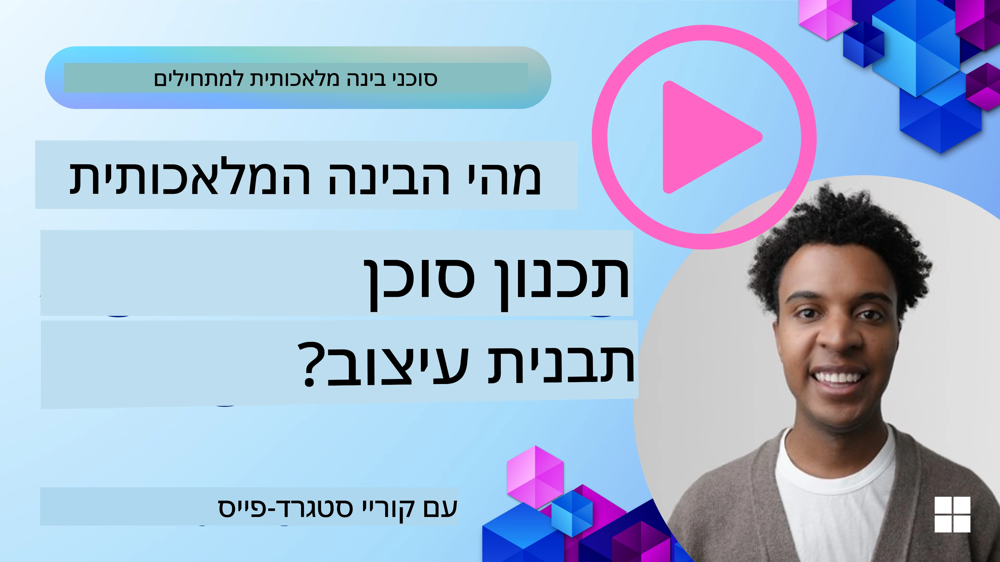
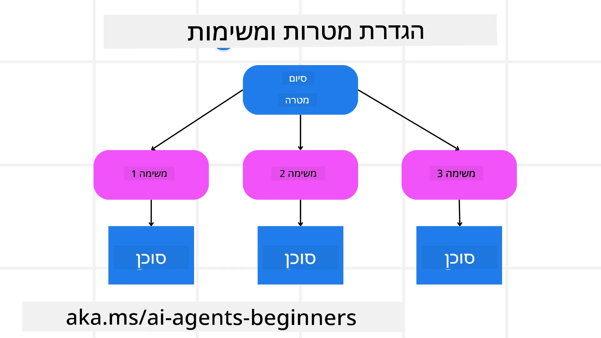

<!--
CO_OP_TRANSLATOR_METADATA:
{
  "original_hash": "43069833a0412210ad5c3cc93d9c2146",
  "translation_date": "2025-09-18T15:14:24+00:00",
  "source_file": "07-planning-design/README.md",
  "language_code": "he"
}
-->
[](https://youtu.be/kPfJ2BrBCMY?si=9pYpPXp0sSbK91Dr)

> _(לחצו על התמונה למעלה לצפייה בסרטון של השיעור הזה)_

# תכנון עיצוב

## מבוא

השיעור הזה יעסוק ב:

* הגדרת מטרה כללית ברורה ופירוק משימה מורכבת למשימות ניתנות לניהול.
* שימוש בפלט מובנה לתגובות אמינות וקריאות למכונה.
* יישום גישה מבוססת אירועים להתמודדות עם משימות דינמיות וקלטים בלתי צפויים.

## מטרות למידה

לאחר השלמת השיעור, תבינו:

* כיצד לזהות ולהגדיר מטרה כללית לסוכן AI, כך שידע בדיוק מה צריך להשיג.
* כיצד לפרק משימה מורכבת למשימות משנה ניתנות לניהול ולארגן אותן בסדר לוגי.
* כיצד לצייד סוכנים בכלים הנכונים (כגון כלי חיפוש או כלי ניתוח נתונים), להחליט מתי ואיך להשתמש בהם, ולהתמודד עם מצבים בלתי צפויים שעולים.
* כיצד להעריך את תוצאות משימות המשנה, למדוד ביצועים ולשפר את הפעולות כדי לשפר את התוצאה הסופית.

## הגדרת המטרה הכללית ופירוק משימה



רוב המשימות בעולם האמיתי מורכבות מדי מכדי להתמודד איתן בצעד אחד. סוכן AI זקוק למטרה תמציתית שתנחה את תכנון הפעולות שלו. לדוגמה, שקלו את המטרה:

    "יצירת מסלול טיול ל-3 ימים."

למרות שהמטרה פשוטה לניסוח, היא עדיין דורשת דיוק. ככל שהמטרה ברורה יותר, כך הסוכן (וכל שותף אנושי) יוכל להתמקד בהשגת התוצאה הנכונה, כמו יצירת מסלול מקיף עם אפשרויות טיסה, המלצות על מלונות והצעות לפעילויות.

### פירוק משימות

משימות גדולות או מורכבות הופכות לניתנות לניהול כאשר מפרקים אותן למשימות משנה ממוקדות מטרה. 
לדוגמה של מסלול הטיול, ניתן לפרק את המטרה ל:

* הזמנת טיסות
* הזמנת מלונות
* השכרת רכב
* התאמה אישית

כל משימת משנה יכולה להיות מטופלת על ידי סוכנים או תהליכים ייעודיים. סוכן אחד עשוי להתמחות בחיפוש אחר מבצעי טיסות, אחר יתמקד בהזמנת מלונות, וכן הלאה. סוכן מתאם או "downstream" יכול לאחר מכן לאחד את התוצאות למסלול אחד קוהרנטי עבור המשתמש הסופי.

גישה מודולרית זו מאפשרת גם שיפורים הדרגתיים. לדוגמה, ניתן להוסיף סוכנים ייעודיים להמלצות על אוכל או הצעות לפעילויות מקומיות ולשפר את המסלול לאורך זמן.

### פלט מובנה

מודלים של שפה גדולים (LLMs) יכולים לייצר פלט מובנה (כגון JSON) שקל יותר לסוכנים או שירותים אחרים לעבד. זה שימושי במיוחד בהקשר רב-סוכני, שבו ניתן לבצע פעולות על המשימות לאחר קבלת פלט התכנון. עיינו ב-

לקבלת סקירה מהירה.

קטע הקוד הבא ב-Python מדגים סוכן תכנון פשוט שמפרק מטרה למשימות משנה ומייצר תוכנית מובנית:

```python
from pydantic import BaseModel
from enum import Enum
from typing import List, Optional, Union
import json
import os
from typing import Optional
from pprint import pprint
from autogen_core.models import UserMessage, SystemMessage, AssistantMessage
from autogen_ext.models.azure import AzureAIChatCompletionClient
from azure.core.credentials import AzureKeyCredential

class AgentEnum(str, Enum):
    FlightBooking = "flight_booking"
    HotelBooking = "hotel_booking"
    CarRental = "car_rental"
    ActivitiesBooking = "activities_booking"
    DestinationInfo = "destination_info"
    DefaultAgent = "default_agent"
    GroupChatManager = "group_chat_manager"

# Travel SubTask Model
class TravelSubTask(BaseModel):
    task_details: str
    assigned_agent: AgentEnum  # we want to assign the task to the agent

class TravelPlan(BaseModel):
    main_task: str
    subtasks: List[TravelSubTask]
    is_greeting: bool

client = AzureAIChatCompletionClient(
    model="gpt-4o-mini",
    endpoint="https://models.inference.ai.azure.com",
    # To authenticate with the model you will need to generate a personal access token (PAT) in your GitHub settings.
    # Create your PAT token by following instructions here: https://docs.github.com/en/authentication/keeping-your-account-and-data-secure/managing-your-personal-access-tokens
    credential=AzureKeyCredential(os.environ["GITHUB_TOKEN"]),
    model_info={
        "json_output": False,
        "function_calling": True,
        "vision": True,
        "family": "unknown",
    },
)

# Define the user message
messages = [
    SystemMessage(content="""You are an planner agent.
    Your job is to decide which agents to run based on the user's request.
                      Provide your response in JSON format with the following structure:
{'main_task': 'Plan a family trip from Singapore to Melbourne.',
 'subtasks': [{'assigned_agent': 'flight_booking',
               'task_details': 'Book round-trip flights from Singapore to '
                               'Melbourne.'}
    Below are the available agents specialised in different tasks:
    - FlightBooking: For booking flights and providing flight information
    - HotelBooking: For booking hotels and providing hotel information
    - CarRental: For booking cars and providing car rental information
    - ActivitiesBooking: For booking activities and providing activity information
    - DestinationInfo: For providing information about destinations
    - DefaultAgent: For handling general requests""", source="system"),
    UserMessage(
        content="Create a travel plan for a family of 2 kids from Singapore to Melboune", source="user"),
]

response = await client.create(messages=messages, extra_create_args={"response_format": 'json_object'})

response_content: Optional[str] = response.content if isinstance(
    response.content, str) else None
if response_content is None:
    raise ValueError("Response content is not a valid JSON string" )

pprint(json.loads(response_content))

# # Ensure the response content is a valid JSON string before loading it
# response_content: Optional[str] = response.content if isinstance(
#     response.content, str) else None
# if response_content is None:
#     raise ValueError("Response content is not a valid JSON string")

# # Print the response content after loading it as JSON
# pprint(json.loads(response_content))

# Validate the response content with the MathReasoning model
# TravelPlan.model_validate(json.loads(response_content))
```

### סוכן תכנון עם תזמור רב-סוכני

בדוגמה זו, סוכן Semantic Router מקבל בקשת משתמש (לדוגמה, "אני צריך תוכנית מלון לטיול שלי.").

התכנון כולל:

* קבלת תוכנית מלון: הסוכן לוקח את הודעת המשתמש ובאמצעות הנחיית מערכת (כולל פרטי סוכנים זמינים), מייצר תוכנית טיול מובנית.
* רשימת סוכנים וכלי העבודה שלהם: רישום הסוכנים מחזיק רשימה של סוכנים (לדוגמה, לטיסות, מלונות, השכרת רכב ופעילויות) יחד עם הפונקציות או הכלים שהם מציעים.
* ניתוב התוכנית לסוכנים המתאימים: בהתאם למספר משימות המשנה, הסוכן שולח את ההודעה ישירות לסוכן ייעודי (במקרים של משימה אחת) או מתאם דרך מנהל צ'אט קבוצתי לשיתוף פעולה רב-סוכני.
* סיכום התוצאה: לבסוף, הסוכן מסכם את התוכנית שנוצרה לצורך בהירות.
קטע הקוד הבא ב-Python ממחיש את השלבים הללו:

```python

from pydantic import BaseModel

from enum import Enum
from typing import List, Optional, Union

class AgentEnum(str, Enum):
    FlightBooking = "flight_booking"
    HotelBooking = "hotel_booking"
    CarRental = "car_rental"
    ActivitiesBooking = "activities_booking"
    DestinationInfo = "destination_info"
    DefaultAgent = "default_agent"
    GroupChatManager = "group_chat_manager"

# Travel SubTask Model

class TravelSubTask(BaseModel):
    task_details: str
    assigned_agent: AgentEnum # we want to assign the task to the agent

class TravelPlan(BaseModel):
    main_task: str
    subtasks: List[TravelSubTask]
    is_greeting: bool
import json
import os
from typing import Optional

from autogen_core.models import UserMessage, SystemMessage, AssistantMessage
from autogen_ext.models.openai import AzureOpenAIChatCompletionClient

# Create the client with type-checked environment variables

client = AzureOpenAIChatCompletionClient(
    azure_deployment=os.getenv("AZURE_OPENAI_DEPLOYMENT_NAME"),
    model=os.getenv("AZURE_OPENAI_DEPLOYMENT_NAME"),
    api_version=os.getenv("AZURE_OPENAI_API_VERSION"),
    azure_endpoint=os.getenv("AZURE_OPENAI_ENDPOINT"),
    api_key=os.getenv("AZURE_OPENAI_API_KEY"),
)

from pprint import pprint

# Define the user message

messages = [
    SystemMessage(content="""You are an planner agent.
    Your job is to decide which agents to run based on the user's request.
    Below are the available agents specialized in different tasks:
    - FlightBooking: For booking flights and providing flight information
    - HotelBooking: For booking hotels and providing hotel information
    - CarRental: For booking cars and providing car rental information
    - ActivitiesBooking: For booking activities and providing activity information
    - DestinationInfo: For providing information about destinations
    - DefaultAgent: For handling general requests""", source="system"),
    UserMessage(content="Create a travel plan for a family of 2 kids from Singapore to Melbourne", source="user"),
]

response = await client.create(messages=messages, extra_create_args={"response_format": TravelPlan})

# Ensure the response content is a valid JSON string before loading it

response_content: Optional[str] = response.content if isinstance(response.content, str) else None
if response_content is None:
    raise ValueError("Response content is not a valid JSON string")

# Print the response content after loading it as JSON

pprint(json.loads(response_content))
```

מה שמתקבל הוא הפלט מהקוד הקודם, וניתן להשתמש בפלט המובנה הזה כדי לנתב ל-`assigned_agent` ולסכם את תוכנית הטיול למשתמש הסופי.

```json
{
    "is_greeting": "False",
    "main_task": "Plan a family trip from Singapore to Melbourne.",
    "subtasks": [
        {
            "assigned_agent": "flight_booking",
            "task_details": "Book round-trip flights from Singapore to Melbourne."
        },
        {
            "assigned_agent": "hotel_booking",
            "task_details": "Find family-friendly hotels in Melbourne."
        },
        {
            "assigned_agent": "car_rental",
            "task_details": "Arrange a car rental suitable for a family of four in Melbourne."
        },
        {
            "assigned_agent": "activities_booking",
            "task_details": "List family-friendly activities in Melbourne."
        },
        {
            "assigned_agent": "destination_info",
            "task_details": "Provide information about Melbourne as a travel destination."
        }
    ]
}
```

מחברת לדוגמה עם קטע הקוד הקודם זמינה [כאן](07-autogen.ipynb).

### תכנון איטרטיבי

חלק מהמשימות דורשות תהליך של חזרה או תכנון מחדש, שבו תוצאת משימת משנה אחת משפיעה על הבאה. לדוגמה, אם הסוכן מגלה פורמט נתונים בלתי צפוי בזמן הזמנת טיסות, ייתכן שיצטרך להתאים את האסטרטגיה שלו לפני המעבר להזמנת מלונות.

בנוסף, משוב משתמש (לדוגמה, אדם שמחליט שהוא מעדיף טיסה מוקדמת יותר) יכול להפעיל תכנון חלקי מחדש. גישה דינמית ואיטרטיבית זו מבטיחה שהפתרון הסופי יתאים למגבלות העולם האמיתי ולהעדפות המשתמש המשתנות.

לדוגמה, קוד לדוגמה:

```python
from autogen_core.models import UserMessage, SystemMessage, AssistantMessage
#.. same as previous code and pass on the user history, current plan
messages = [
    SystemMessage(content="""You are a planner agent to optimize the
    Your job is to decide which agents to run based on the user's request.
    Below are the available agents specialized in different tasks:
    - FlightBooking: For booking flights and providing flight information
    - HotelBooking: For booking hotels and providing hotel information
    - CarRental: For booking cars and providing car rental information
    - ActivitiesBooking: For booking activities and providing activity information
    - DestinationInfo: For providing information about destinations
    - DefaultAgent: For handling general requests""", source="system"),
    UserMessage(content="Create a travel plan for a family of 2 kids from Singapore to Melbourne", source="user"),
    AssistantMessage(content=f"Previous travel plan - {TravelPlan}", source="assistant")
]
# .. re-plan and send the tasks to respective agents
```

לתכנון מקיף יותר, עיינו ב-Magnetic One

לפתרון משימות מורכבות.

## סיכום

במאמר זה הסתכלנו על דוגמה כיצד ניתן ליצור מתכנן שיכול לבחור באופן דינמי את הסוכנים הזמינים שהוגדרו. הפלט של המתכנן מפרק את המשימות ומקצה את הסוכנים כך שניתן יהיה לבצע אותן. ההנחה היא שלסוכנים יש גישה לפונקציות/כלים הנדרשים לביצוע המשימה. בנוסף לסוכנים, ניתן לכלול תבניות אחרות כמו רפלקציה, מסכם, וצ'אט סבב לשם התאמה אישית נוספת.

## משאבים נוספים

AutoGen Magnetic One - מערכת רב-סוכנים כללית לפתרון משימות מורכבות שהשיגה תוצאות מרשימות על מספר מדדי סוכנים מאתגרים. עיינו ב-

ביישום זה, המתאם יוצר תוכנית ספציפית למשימה ומאציל את המשימות לסוכנים הזמינים. בנוסף לתכנון, המתאם גם משתמש במנגנון מעקב כדי לפקח על התקדמות המשימה ולתכנן מחדש לפי הצורך.

### יש לכם שאלות נוספות על תבנית תכנון עיצוב?

הצטרפו ל-[Azure AI Foundry Discord](https://aka.ms/ai-agents/discord) כדי לפגוש לומדים אחרים, להשתתף בשעות קבלה ולקבל תשובות לשאלות שלכם על סוכני AI.

## שיעור קודם

[בניית סוכני AI אמינים](../06-building-trustworthy-agents/README.md)

## שיעור הבא

[תבנית עיצוב רב-סוכנים](../08-multi-agent/README.md)

---

**כתב ויתור**:  
מסמך זה תורגם באמצעות שירות תרגום מבוסס בינה מלאכותית [Co-op Translator](https://github.com/Azure/co-op-translator). למרות שאנו שואפים לדיוק, יש להיות מודעים לכך שתרגומים אוטומטיים עשויים להכיל שגיאות או אי דיוקים. המסמך המקורי בשפתו המקורית צריך להיחשב כמקור הסמכותי. עבור מידע קריטי, מומלץ להשתמש בתרגום מקצועי על ידי אדם. אנו לא נושאים באחריות לאי הבנות או לפרשנויות שגויות הנובעות משימוש בתרגום זה.