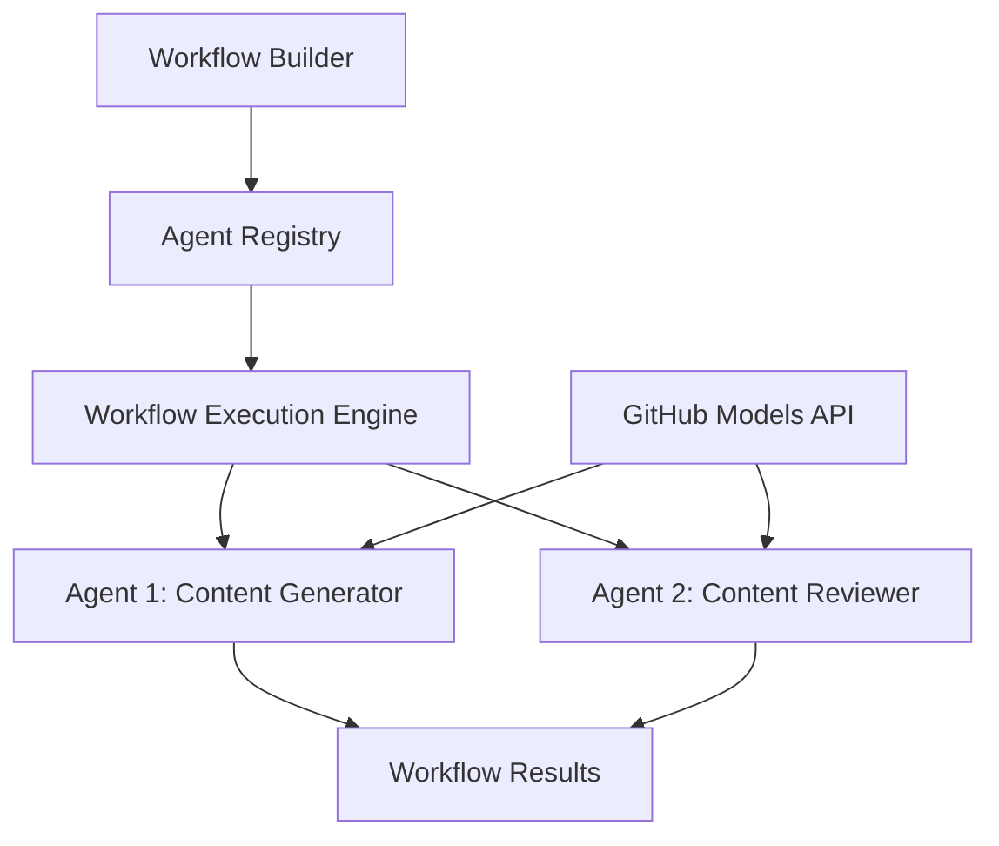

<!--
CO_OP_TRANSLATOR_METADATA:
{
  "original_hash": "034158688d0a45aae06dcbb21b0da5ae",
  "translation_date": "2025-11-11T12:53:28+00:00",
  "source_file": "08-multi-agent/code_samples/workflows-agent-framework/dotNET/01.dotnet-agent-framework-workflow-ghmodel-basic.md",
  "language_code": "he"
}
-->
# 🔄 זרימות עבודה בסיסיות עם מודלים של GitHub (.NET)

## 📋 מדריך לתזמור זרימות עבודה

מחברת זו מדגימה כיצד לבנות **זרימות עבודה של סוכנים** מתקדמות באמצעות מסגרת הסוכנים של Microsoft עבור .NET ומודלים של GitHub. תלמדו ליצור תהליכים עסקיים מרובי שלבים שבהם סוכני AI משתפים פעולה כדי להשלים משימות מורכבות באמצעות דפוסי תזמור מובנים.

## 🎯 מטרות למידה

### 🏗️ **יסודות ארכיטקטורת זרימות עבודה**
- **בונה זרימות עבודה**: תכנון ותזמור תהליכי AI מורכבים מרובי שלבים
- **תיאום סוכנים**: תיאום בין סוכנים מתמחים שונים בתוך זרימות עבודה
- **שילוב מודלים של GitHub**: ניצול שירות ההסקה של מודלים של GitHub בתוך זרימות עבודה
- **עיצוב חזותי של זרימות עבודה**: יצירה והמחשה של מבני זרימות עבודה להבנה טובה יותר

### 🔄 **דפוסי תזמור תהליכים**
- **עיבוד רציף**: שרשור משימות סוכנים בסדר לוגי
- **ניהול מצב**: שמירה על הקשר וזרימת נתונים בין שלבי זרימת העבודה
- **טיפול בשגיאות**: יישום התאוששות שגיאות חזקה ועמידות זרימת עבודה
- **אופטימיזציה ביצועית**: תכנון זרימות עבודה יעילות לפעולות בקנה מידה ארגוני

### 🏢 **יישומי זרימות עבודה ארגוניות**
- **אוטומציה של תהליכים עסקיים**: אוטומציה של זרימות עבודה ארגוניות מורכבות
- **צינור ייצור תוכן**: זרימות עבודה עריכתיות עם שלבי סקירה ואישור
- **אוטומציה של שירות לקוחות**: פתרון פניות לקוחות מרובי שלבים
- **זרימות עבודה לעיבוד נתונים**: זרימות ETL עם טרנספורמציה מבוססת AI

## ⚙️ דרישות והגדרות

### 📦 **חבילות NuGet נדרשות**

הדגמת זרימת עבודה זו משתמשת בכמה חבילות .NET מרכזיות:

```xml
<!-- Core AI Framework -->
<PackageReference Include="Microsoft.Extensions.AI" Version="9.9.0" />

<!-- Agent Framework (Local Development) -->
<!-- Microsoft.Agents.AI.dll - Core agent abstractions -->
<!-- Microsoft.Agents.AI.OpenAI.dll - OpenAI/GitHub Models integration -->

<!-- Configuration and Environment -->
<PackageReference Include="DotNetEnv" Version="3.1.1" />
```

### 🔑 **הגדרת מודלים של GitHub**

**הגדרת סביבה (קובץ .env):**
```env
GITHUB_TOKEN=your_github_personal_access_token
GITHUB_ENDPOINT=https://models.inference.ai.azure.com
GITHUB_MODEL_ID=gpt-4o-mini
```

**גישה למודלים של GitHub:**
1. הירשמו למודלים של GitHub (כרגע בתצוגה מקדימה)
2. צרו אסימון גישה אישי עם הרשאות גישה למודלים
3. הגדירו משתני סביבה כפי שמוצג לעיל

### 🏗️ **סקירה כללית של ארכיטקטורת זרימת עבודה**



**רכיבים מרכזיים:**
- **WorkflowBuilder**: מנוע התזמור הראשי לתכנון זרימות עבודה
- **AIAgent**: סוכנים מתמחים ביכולות ספציפיות
- **GitHub Models Client**: שילוב שירות ההסקה של מודלים של AI
- **Execution Context**: ניהול מצב וזרימת נתונים בין שלבי זרימת העבודה

## 🎨 **דפוסי עיצוב זרימות עבודה ארגוניות**

### 📝 **זרימת עבודה לייצור תוכן**
```
User Request → Content Generation → Quality Review → Final Output
```

### 🔍 **צינור עיבוד מסמכים**
```
Document Input → Analysis → Extraction → Validation → Structured Output
```

### 💼 **זרימת עבודה למודיעין עסקי**
```
Data Collection → Processing → Analysis → Report Generation → Distribution
```

### 🤝 **אוטומציה של שירות לקוחות**
```
Customer Inquiry → Classification → Processing → Response Generation → Follow-up
```

## 🏢 **יתרונות ארגוניים**

### 🎯 **אמינות ויכולת הרחבה**
- **ביצוע דטרמיניסטי**: תוצאות זרימת עבודה עקביות וניתנות לשחזור
- **התאוששות שגיאות**: טיפול אלגנטי בכשלים בכל שלב של זרימת העבודה
- **מעקב ביצועים**: מעקב אחר מדדי ביצוע והזדמנויות אופטימיזציה
- **ניהול משאבים**: הקצאה וניצול יעילים של משאבי מודלים של AI

### 🔒 **אבטחה וציות**
- **אימות מאובטח**: אימות מבוסס אסימון של GitHub לגישה ל-API
- **עקבות ביקורת**: רישום מלא של ביצוע זרימות עבודה ונקודות החלטה
- **שליטה בגישה**: הרשאות גרנולריות לביצוע ומעקב אחר זרימות עבודה
- **פרטיות נתונים**: טיפול מאובטח במידע רגיש לאורך זרימות עבודה

### 📊 **תצפית וניהול**
- **עיצוב חזותי של זרימות עבודה**: ייצוג ברור של זרימות תהליכים ותלות
- **מעקב ביצוע**: מעקב בזמן אמת אחר התקדמות וביצועי זרימות עבודה
- **דיווח שגיאות**: ניתוח שגיאות מפורט ויכולות דיבוג
- **אנליטיקה ביצועית**: מדדים לאופטימיזציה ותכנון קיבולת

בואו נבנה את זרימת העבודה הארגונית הראשונה שלכם עם AI! 🚀

## 💻 הפעלת הקוד

היישום המלא זמין בקובץ `01.dotnet-agent-framework-workflow-ghmodel-basic.cs`. קובץ זה מדגים:

1. **הגדרת סביבה** - טעינת אישורי מודלים של GitHub מקובץ `.env`
2. **הגדרת לקוח OpenAI** - הגדרת הלקוח לשימוש בנקודת הקצה של מודלים של GitHub
3. **יצירת סוכנים** - הגדרת סוכנים מתמחים (Front Desk ו-Concierge)
4. **בונה זרימות עבודה** - יצירת זרימת עבודה מרובת סוכנים עם עיבוד רציף
5. **ביצוע זרימת עבודה** - הפעלת זרימת העבודה עם תוצאות בזמן אמת

### 🚀 הפעלת הדוגמה

```bash
# Make the script executable (Unix/Linux/macOS)
chmod +x 01.dotnet-agent-framework-workflow-ghmodel-basic.cs

# Run the workflow
./01.dotnet-agent-framework-workflow-ghmodel-basic.cs
```

או ב-Windows:
```powershell
dotnet run 01.dotnet-agent-framework-workflow-ghmodel-basic.cs
```

### 📝 תוצאה צפויה

זרימת העבודה תבצע:
1. קבלת בקשת יעד הנסיעה שלך ("אני רוצה לנסוע לפריז")
2. סוכן Front Desk יספק המלצה ראשונית
3. סוכן Concierge יסקור וישפר את ההמלצה
4. התוצאה הסופית תציג את זרם השיחה המלא

### 🔧 התאמה אישית

ניתן להתאים את זרימת העבודה על ידי:
- שינוי הוראות הסוכנים כדי לשנות את התנהגותם
- הוספת סוכנים נוספים ליצירת זרימות עבודה מורכבות מרובות שלבים
- שינוי הודעת המשתמש כדי לבדוק תרחישים שונים
- התאמת הקצוות של זרימת העבודה ליצירת דפוסי ביצוע שונים

---

<!-- CO-OP TRANSLATOR DISCLAIMER START -->
**כתב ויתור**:  
מסמך זה תורגם באמצעות שירות תרגום AI [Co-op Translator](https://github.com/Azure/co-op-translator). למרות שאנו שואפים לדיוק, יש לקחת בחשבון שתרגומים אוטומטיים עשויים להכיל שגיאות או אי דיוקים. המסמך המקורי בשפתו המקורית צריך להיחשב כמקור סמכותי. עבור מידע קריטי, מומלץ להשתמש בתרגום מקצועי אנושי. איננו אחראים לאי הבנות או לפרשנויות שגויות הנובעות משימוש בתרגום זה.
<!-- CO-OP TRANSLATOR DISCLAIMER END -->