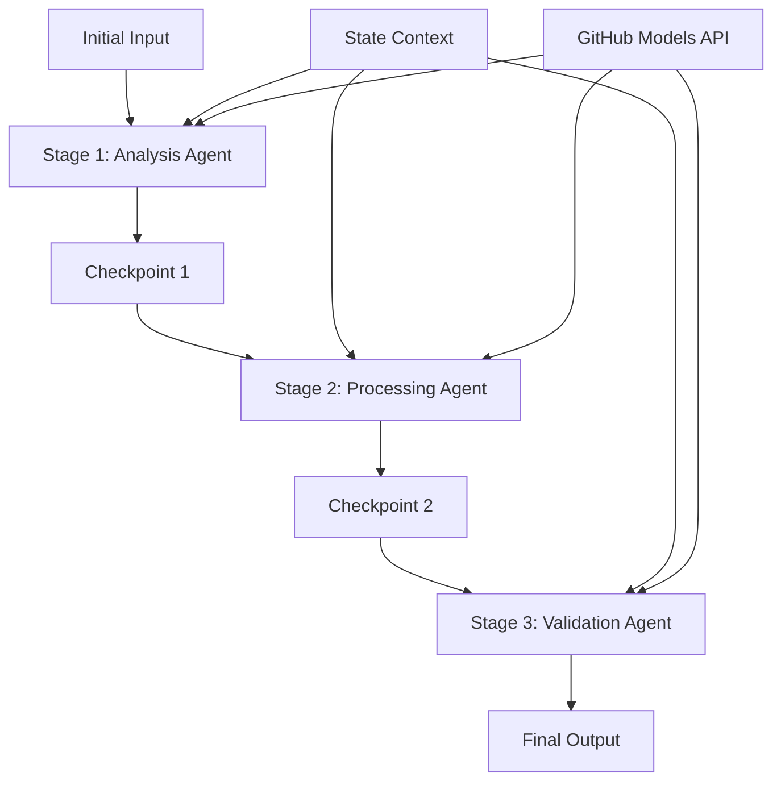

<!--
CO_OP_TRANSLATOR_METADATA:
{
  "original_hash": "1be9c8dcbd79a02d33d2c138684c1394",
  "translation_date": "2025-11-11T13:57:20+00:00",
  "source_file": "08-multi-agent/code_samples/workflows-agent-framework/dotNET/02.dotnet-agent-framework-workflow-ghmodel-sequential.md",
  "language_code": "he"
}
-->
# ⏩ זרימות עבודה רציפות עם מודלים של GitHub (.NET)

## 📋 מדריך מתקדם לעיבוד רציף

מחברת זו מדגימה **דפוסי זרימת עבודה רציפה** באמצעות מסגרת Microsoft Agent עבור .NET ומודלים של GitHub. תלמדו כיצד לבנות צינורות עיבוד מתוחכמים, שלב אחר שלב, שבהם סוכנים פועלים בסדר מסוים, וכל שלב מתבסס על תוצאות השלב הקודם.

## 🎯 מטרות למידה

### 🔄 **ארכיטקטורת עיבוד רציף**
- **עיצוב זרימת עבודה ליניארית**: יצירת צינורות עיבוד שלב אחר שלב עם תלות ברורה
- **ניהול מצב**: שמירה על הקשר וזרימת נתונים בין שלבי זרימת העבודה הרציפה
- **שילוב מודלים של GitHub**: ניצול מודלים של AI של GitHub בזרימות עבודה מרובות שלבים ב-.NET
- **דפוסי צינורות ארגוניים**: בניית מערכות עיבוד רציפות מוכנות לייצור

### 🏗️ **דפוסים רציפים מתקדמים**
- **עיבוד שלב-שער**: יישום נקודות בדיקה לאימות בין שלבי זרימת העבודה
- **שימור הקשר**: שמירה על מצב וידע מצטבר לאורך כל השלבים
- **הפצת שגיאות**: טיפול בכשלים בצורה חלקה בשרשראות עיבוד רציפות
- **אופטימיזציה ביצועית**: ביצוע רציף יעיל עם מינימום עומס

### 🏢 **יישומים רציפים ארגוניים**
- **צינור עיבוד מסמכים**: ניתוח, טרנספורמציה ואימות מסמכים מרובי שלבים
- **זרימות עבודה להבטחת איכות**: סקירה, אימות ותהליכי אישור רציפים
- **צינור הפקת תוכן**: מחקר → כתיבה → עריכה → סקירה → פרסום
- **אוטומציה של תהליכים עסקיים**: זרימות עבודה עסקיות מרובות שלבים עם תלות שלבים ברורה

## ⚙️ דרישות והגדרות

### 📦 **חבילות NuGet נדרשות**

חבילות חיוניות לזרימות עבודה רציפות ב-.NET:

```xml
<!-- Core AI Framework -->
<PackageReference Include="Microsoft.Extensions.AI" Version="9.9.0" />

<!-- Client Model Abstractions -->
<PackageReference Include="System.ClientModel" Version="1.6.1.0" />

<!-- Azure Identity and Async LINQ Support -->
<PackageReference Include="Azure.Identity" Version="1.15.0" />
<PackageReference Include="System.Linq.Async" Version="6.0.3" />

<!-- Local Agent Framework References -->
<!-- Microsoft.Agents.AI.dll - Core agent abstractions -->
<!-- Microsoft.Agents.AI.OpenAI.dll - GitHub Models integration -->
```

### 🔑 **הגדרת מודלים של GitHub**

**הגדרת סביבה (קובץ .env):**
```env
GITHUB_TOKEN=your_github_personal_access_token
GITHUB_ENDPOINT=https://models.inference.ai.azure.com
GITHUB_MODEL_ID=gpt-4o-mini
```

**ניהול תצורה:**
```csharp
// Load environment variables securely
Env.Load("../../../.env");
var githubToken = Environment.GetEnvironmentVariable("GITHUB_TOKEN");
var githubEndpoint = Environment.GetEnvironmentVariable("GITHUB_ENDPOINT");
var modelId = Environment.GetEnvironmentVariable("GITHUB_MODEL_ID");
```

### 🏗️ **ארכיטקטורת זרימת עבודה רציפה**



**רכיבים מרכזיים:**
- **סוכנים רציפים**: סוכנים מיוחדים לכל שלב עיבוד
- **הקשר מצב**: שמירה על נתונים והחלטות מצטברים בין שלבים
- **נקודות בדיקה**: נקודות אימות בין שלבים להבטחת איכות ועקביות
- **לקוח מודלים של GitHub**: גישה עקבית למודלי AI בכל שלבי זרימת העבודה

## 🎨 **דפוסי עיצוב של זרימת עבודה רציפה**

### 📝 **צינור עיבוד מסמכים**
```
Raw Document → Content Extraction → Analysis → Validation → Structured Output
```

### 🎯 **זרימת עבודה ליצירת תוכן**
```
Brief/Requirements → Research → Content Creation → Review → Final Polish
```

### 🔍 **צינור הבטחת איכות**
```
Initial Review → Technical Validation → Compliance Check → Final Approval
```

### 💼 **זרימת עבודה למודיעין עסקי**
```
Data Collection → Processing → Analysis → Report Generation → Distribution
```

## 🏢 **יתרונות רציפים ארגוניים**

### 🎯 **אמינות ואיכות**
- **עיבוד דטרמיניסטי**: תוצאות עקביות וניתנות לשחזור באמצעות שלבים מובנים
- **שערי איכות**: נקודות בדיקה לאימות מבטיחות איכות בכל שלב
- **בידוד שגיאות**: בעיות בשלב אחד אינן מתפשטות לשלבים הבאים
- **עקבות ביקורת**: מעקב מלא אחר החלטות וטרנספורמציות בכל שלב

### 📈 **יכולת הרחבה וביצועים**
- **עיצוב מודולרי**: כל שלב ניתן לאופטימיזציה באופן עצמאי
- **ניהול משאבים**: הקצאה יעילה של משאבי מודלי AI בין שלבים
- **אופטימיזציית מצב**: העברת מצב מינימלית בין שלבים לביצועים מיטביים
- **קבוצות שלבים מקבילות**: זרימות עבודה רציפות מרובות יכולות לפעול במקביל

### 🔒 **אבטחה וציות**
- **אבטחה ברמת שלב**: מדיניות אבטחה שונות לשלבי עיבוד שונים
- **אימות נתונים**: הבטחת שלמות נתונים וציות בכל נקודת בדיקה
- **שליטה בגישה**: הרשאות גרעיניות לשלבי זרימת עבודה שונים
- **ציות רגולטורי**: עמידה בדרישות רגולטוריות באמצעות עיבוד מובנה

### 📊 **מעקב וניתוח**
- **מדדים ברמת שלב**: מעקב ביצועים לכל שלב בזרימת העבודה
- **זיהוי צווארי בקבוק**: זיהוי ואופטימיזציה של שלבים איטיים
- **מדדי איכות**: מעקב אחר איכות ושיעורי הצלחה בכל שלב
- **אופטימיזציית תהליך**: שיפור מתמשך בהתבסס על ניתוח ברמת שלב

בואו נבנה צינורות עיבוד AI רציפים חזקים! 🚀

## 💻 הפעלת הקוד

היישום המלא זמין בקובץ `02.dotnet-agent-framework-workflow-ghmodel-sequential.cs`. קובץ זה מדגים **זרימת עבודה לניתוח רהיטים בשלושה שלבים**:

1. **שלב 1 - סוכן מכירות**: מנתח תמונות רהיטים ומספק הצעות רכישה
2. **שלב 2 - סוכן מחירים**: מספק פירוט מחירים מפורט ואפשרויות תקציב
3. **שלב 3 - סוכן הצעות מחיר**: יוצר מסמך הצעת מחיר מקצועי בפורמט Markdown

### 🏗️ **ארכיטקטורת זרימת עבודה**

```
Image Input → Sales Analysis → Price Estimation → Quote Generation → Final Output
```

כל סוכן:
- מקבל את הפלט מהשלב הקודם כהקשר
- מתבסס על ניתוח קודם עם מומחיות מיוחדת
- שומר על רציפות זרימת העבודה באמצעות ניהול מצב

### 🚀 הפעלת הדוגמה

**דרישות מוקדמות:**
- הניחו תמונת רהיטים בנתיב `../imgs/home.png` (או עדכנו את המשתנה `imgPath`)
- הגדירו את קובץ `.env` עם אישורי מודלים של GitHub

```bash
# Make the script executable (Unix/Linux/macOS)
chmod +x 02.dotnet-agent-framework-workflow-ghmodel-sequential.cs

# Run the sequential workflow
./02.dotnet-agent-framework-workflow-ghmodel-sequential.cs
```

או ב-Windows:
```powershell
dotnet run 02.dotnet-agent-framework-workflow-ghmodel-sequential.cs
```

### 📝 פלט צפוי

זרימת העבודה תבצע:
1. **סוכן מכירות**: זיהוי פריטי רהיטים מהתמונה ומתן המלצות
2. **סוכן מחירים**: הוספת ניתוח מחירים מפורט עם רמות תקציב והמלצות קנייה
3. **סוכן הצעות מחיר**: יצירת מסמך הצעת מחיר מעוצב עם כל המידע המסונכרן

הפלט הסופי יהיה הצעת מחיר מקצועית ומקיפה לרהיטים המבוססת על ניתוח תמונה.

### 🔧 אפשרויות התאמה אישית

**שינוי התנהגות סוכן:**
```csharp
// Adjust agent instructions to change their focus
const string SalesAgentInstructions = "Your custom instructions...";
```

**שינוי זרימה רציפה:**
```csharp
// Add or reorder workflow stages
var workflow = new WorkflowBuilder(salesagent)
    .AddEdge(salesagent, priceagent)
    .AddEdge(priceagent, quoteagent)
    .AddEdge(quoteagent, newAgent)  // Add another stage
    .Build();
```

**שימוש בקלט שונה:**
```csharp
// Process text instead of images
ChatMessage userMessage = new ChatMessage(ChatRole.User, [
    new TextContent("Analyze pricing for a modern living room set")
]);
```

### 🎯 יישומים בעולם האמיתי

דפוס רציף זה אידיאלי עבור:
- **מסחר אלקטרוני**: ניתוח מוצרים → תמחור → יצירת הצעת מחיר
- **נדל"ן**: ניתוח נכסים → הערכת שווי → יצירת רשימה
- **ביטוח**: ניתוח תביעות → הערכה → יצירת הצעת מחיר
- **יצירת תוכן**: מחקר → כתיבה → עריכה → פרסום

### 🔍 הבנת זרימת מצב

כל סוכן ברצף מקבל:
- **קלט מקורי**: הודעת המשתמש הראשונית (תמונה + טקסט)
- **פלטים של סוכנים קודמים**: כל התגובות הקודמות של הסוכנים בהיסטוריית השיחה
- **הקשר מצטבר**: מצב מלא נשמר לאורך כל זרימת העבודה

זה מאפשר עיבוד מרובה שלבים מתוחכם שבו כל סוכן מתבסס על הקשר מקיף מכל השלבים הקודמים.

---

<!-- CO-OP TRANSLATOR DISCLAIMER START -->
**כתב ויתור**:  
מסמך זה תורגם באמצעות שירות תרגום AI [Co-op Translator](https://github.com/Azure/co-op-translator). למרות שאנו שואפים לדיוק, יש לקחת בחשבון שתרגומים אוטומטיים עשויים להכיל שגיאות או אי דיוקים. המסמך המקורי בשפתו המקורית צריך להיחשב כמקור סמכותי. עבור מידע קריטי, מומלץ להשתמש בתרגום מקצועי אנושי. איננו אחראים לאי הבנות או לפרשנויות שגויות הנובעות משימוש בתרגום זה.
<!-- CO-OP TRANSLATOR DISCLAIMER END -->