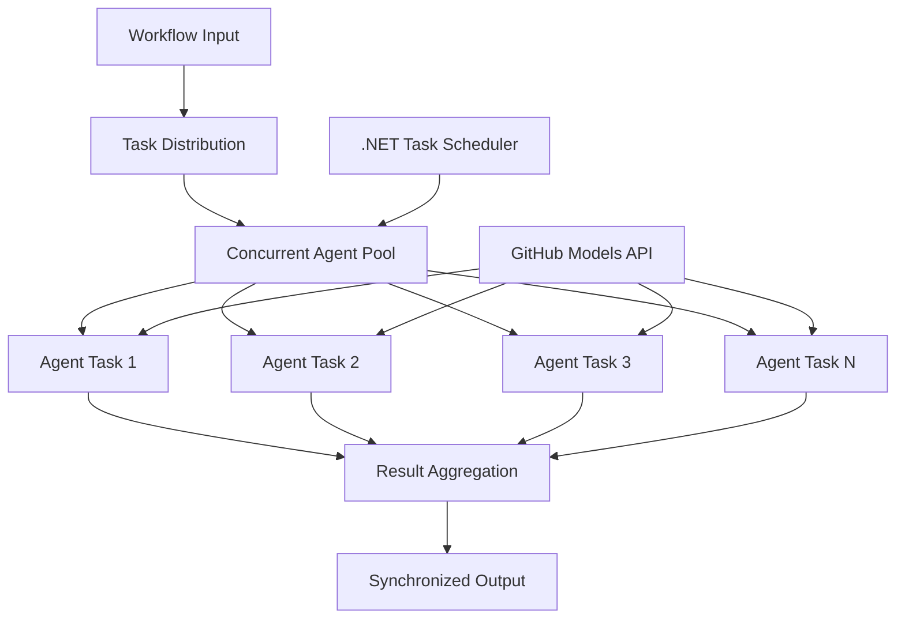

<!--
CO_OP_TRANSLATOR_METADATA:
{
  "original_hash": "b9c6e32c9b5f2fed20b6916984440d88",
  "translation_date": "2025-11-11T13:24:21+00:00",
  "source_file": "08-multi-agent/code_samples/workflows-agent-framework/dotNET/03.dotnet-agent-framework-workflow-ghmodel-concurrent.md",
  "language_code": "he"
}
-->
# ⚡ זרימות עבודה מקבילות עם מודלים של GitHub (.NET)

## 📋 מדריך לעיבוד מקבילי בעל ביצועים גבוהים

מחברת זו מדגימה **דפוסי זרימת עבודה מקבילים** באמצעות מסגרת Microsoft Agent עבור .NET ומודלים של GitHub. תלמדו כיצד לבנות זרימות עבודה בעלות ביצועים גבוהים לעיבוד מקבילי, שממקסמות את התפוקה על ידי הפעלת סוכני AI מרובים בו-זמנית תוך שמירה על תיאום ועקביות נתונים.

## 🎯 מטרות למידה

### 🚀 **יסודות עיבוד מקבילי**
- **הפעלת סוכנים במקביל**: הפעלת סוכני AI מרובים בו-זמנית לביצועים מקסימליים
- **דפוסי Async/Await**: ניצול מודל התכנות האסינכרוני של .NET לעיבוד מקבילי יעיל
- **שילוב מודלים של GitHub**: תיאום קריאות מקבילות למערכת ההסקה של מודלים של GitHub
- **ניהול משאבים**: ניהול יעיל של משאבי מודלים של AI במהלך פעולות מקבילות

### 🏗️ **ארכיטקטורת עיבוד מקבילי מתקדמת**
- **מקביליות מבוססת משימות**: שימוש בספריית Task Parallel של .NET לביצוע מקבילי אופטימלי
- **דפוסי סנכרון**: תיאום סוכנים מקבילים תוך הימנעות מתנאי מרוץ
- **איזון עומסים**: חלוקת עבודה יעילה על פני יכולת עיבוד מקבילי זמינה
- **סיבולת תקלות**: טיפול בכשלים של סוכנים בודדים מבלי לעצור את כל זרימת העבודה

### 🏢 **יישומים מקבילים ארגוניים**
- **עיבוד מסמכים בנפח גבוה**: עיבוד מסמכים מרובים בו-זמנית
- **ניתוח תוכן בזמן אמת**: ניתוח מקבילי של זרמי נתונים נכנסים
- **אופטימיזציה של עיבוד אצווה**: מקסום תפוקה עבור פעולות עיבוד נתונים בקנה מידה גדול
- **ניתוח רב-מודאלי**: עיבוד מקבילי של סוגי תוכן ופורמטים שונים

## ⚙️ דרישות והגדרות

### 📦 **חבילות NuGet נדרשות**

חבילות חיוניות לזרימות עבודה מקבילות בעלות ביצועים גבוהים:

```xml
<!-- Core AI Framework with Async Support -->
<PackageReference Include="Microsoft.Extensions.AI" Version="9.9.0" />

<!-- Client Model Abstractions for API Communication -->
<PackageReference Include="System.ClientModel" Version="1.6.1.0" />

<!-- Azure Identity and Async LINQ for Advanced Operations -->
<PackageReference Include="Azure.Identity" Version="1.15.0" />
<PackageReference Include="System.Linq.Async" Version="6.0.3" />

<!-- Local Agent Framework References -->
<!-- Microsoft.Agents.AI.dll - Core agent abstractions with async support -->
<!-- Microsoft.Agents.AI.OpenAI.dll - GitHub Models integration with concurrency -->
```

### 🔑 **הגדרת מודלים של GitHub**

**הגדרת סביבה (קובץ .env):**
```env
GITHUB_TOKEN=your_github_personal_access_token
GITHUB_ENDPOINT=https://models.inference.ai.azure.com
GITHUB_MODEL_ID=gpt-4o-mini
```

**שיקולים לעיבוד מקבילי:**
```csharp
// Configure for concurrent operations
var clientOptions = new OpenAIClientOptions()
{
    Endpoint = new Uri(githubEndpoint),
    // Configure connection pooling for concurrent requests
    NetworkTimeout = TimeSpan.FromMinutes(5)
};
```

### 🏗️ **ארכיטקטורת זרימת עבודה מקבילה**



**רכיבים מרכזיים:**
- **ספריית Task Parallel**: תמיכה מובנית של .NET לפעולות מקבילות
- **Pool של סוכנים**: מופעים מרובים של סוכנים לעיבוד מקבילי
- **אגרגציית תוצאות**: תיאום ומיזוג תוצאות של סוכנים מקבילים
- **נקודות סנכרון**: הבטחת עקביות נתונים במהלך פעולות מקבילות

## 🎨 **דפוסי עיצוב לזרימות עבודה מקבילות**

### 🔍 **מחקר וניתוח מקבילי**
```
Research Topic → Concurrent Research Agents → Result Synthesis → Final Report
```

### 📊 **עיבוד נתונים ממקורות מרובים**
```
Data Sources → Parallel Processing Agents → Data Integration → Unified Output
```

### 🎭 **צינור יצירת תוכן**
```
Content Requirements → Concurrent Content Generators → Quality Review → Final Content
```

### 🔄 **עיבוד Fan-Out/Fan-In**
```
Single Input → Multiple Concurrent Processors → Result Aggregation → Single Output
```

## 🏢 **יתרונות ביצועים ארגוניים**

### ⚡ **תפוקה ויכולת הרחבה**
- **הרחבת ביצועים ליניארית**: הוספת סוכנים מקבילים נוספים להגדלת התפוקה
- **שימוש במשאבים**: יעילות מקסימלית של יכולת מודלים של AI זמינה
- **זמן עיבוד מופחת**: הפחתה משמעותית בזמן באמצעות ביצוע מקבילי
- **הרחבה אלסטית**: התאמה דינמית של מספר סוכנים מקבילים בהתאם לעומס העבודה

### 🛡️ **אמינות ועמידות**
- **בידוד תקלות**: כשלים של סוכנים בודדים אינם משפיעים על פעולות מקבילות אחרות
- **התדרדרות הדרגתית**: המערכת ממשיכה לפעול עם יכולת סוכנים מופחתת
- **שחזור שגיאות**: מנגנוני ניסיון חוזר אוטומטיים לפעולות מקבילות שנכשלו
- **חלוקת עומס**: חלוקה שווה של עבודה בין סוכנים זמינים

### 📊 **מעקב ביצועים**
- **מדדי ביצוע מקבילי**: מעקב אחר ביצועי כל הפעולות המקבילות
- **אנליטיקה של שימוש במשאבים**: מעקב אחר שימוש ב-CPU, זיכרון ורשת
- **ניתוח תפוקה**: מדידת שיפורי יעילות מעיבוד מקבילי
- **זיהוי צווארי בקבוק**: זיהוי ופתרון מגבלות ביצועים

### 🔧 **פיתוח ותפעול**
- **מודל תכנות אסינכרוני**: ניצול דפוסי async/await הבוגרים של .NET
- **תיאום משימות**: יכולות ניהול ותיאום משימות מובנות
- **טיפול בשגיאות**: טיפול מקיף בשגיאות עבור פעולות מקבילות
- **תמיכה בדיבוג**: כלי דיבוג של Visual Studio לזרימות עבודה מקבילות

בואו נבנה זרימות עבודה מקבילות בעלות ביצועים גבוהים עם .NET! 🚀

## 💻 הפעלת הקוד

היישום המלא זמין בקובץ `03.dotnet-agent-framework-workflow-ghmodel-concurrent.cs`. קובץ זה מדגים **זרימת עבודה מקבילה Fan-Out/Fan-In** לתכנון טיולים:

### 🏗️ **ארכיטקטורת זרימת עבודה**

```
User Request → ConcurrentStartExecutor → [Researcher Agent || Planner Agent] → ConcurrentAggregationExecutor → Final Output
```

**רכיבים מרכזיים:**

1. **ConcurrentStartExecutor**: משדר את בקשת המשתמש לכל הסוכנים בו-זמנית
2. **Researcher Agent**: מנתח יעדים ואטרקציות במקביל
3. **Planner Agent**: יוצר תוכניות טיול מפורטות במקביל
4. **ConcurrentAggregationExecutor**: אוסף וממזג תוצאות משני הסוכנים

### 🎯 **דפוס Fan-Out/Fan-In**

זרימת עבודה זו מדגימה את דפוס **Fan-Out/Fan-In** הקלאסי:
- **Fan-Out**: הודעת קלט אחת משודרת למספר סוכנים בו-זמנית
- **עיבוד מקבילי**: סוכנים מרובים עובדים במקביל על אותה משימה
- **Fan-In**: תוצאות מכל הסוכנים נאספות וממוזגות לפלט יחיד

### 🚀 הפעלת הדוגמה

```bash
# Make the script executable (Unix/Linux/macOS)
chmod +x 03.dotnet-agent-framework-workflow-ghmodel-concurrent.cs

# Run the concurrent workflow
./03.dotnet-agent-framework-workflow-ghmodel-concurrent.cs
```

או ב-Windows:
```powershell
dotnet run 03.dotnet-agent-framework-workflow-ghmodel-concurrent.cs
```

### 📝 פלט צפוי

זרימת העבודה תבצע:
1. **שידור בקשה**: שליחת "תכנן טיול לסיאטל בדצמבר" לשני הסוכנים
2. **עיבוד מקבילי**: שני הסוכנים עובדים בו-זמנית:
   - החוקר מזהה אטרקציות ופרטים
   - המתכנן יוצר מסלול ולוגיסטיקה
3. **אגרגציה**: שילוב שני התגובות לפלט מקיף
4. **הצגת תוצאות**: הצגת תוכנית הטיול הממוזגת עם כל המידע

### 🔧 אפשרויות התאמה אישית

**הוספת סוכנים מקבילים נוספים:**
```csharp
// Create additional specialized agents
AIAgent budgetAgent = openAIClient.GetChatClient(github_model_id).CreateAIAgent(
    name: "Budget-Agent", instructions: "Calculate travel costs...");

// Add to fan-out
var workflow = new WorkflowBuilder(startExecutor)
    .AddFanOutEdge(startExecutor, targets: [researcherAgent, plannerAgent, budgetAgent])
    .AddFanInEdge(aggregationExecutor, sources: [researcherAgent, plannerAgent, budgetAgent])
    .WithOutputFrom(aggregationExecutor)
    .Build();

// Update aggregation count
if (this._messages.Count == 3) { ... }
```

**שינוי הוראות סוכנים:**
```csharp
const string ResearcherAgentInstructions = "Your custom instructions for research...";
const string PlanAgentInstructions = "Your custom instructions for planning...";
```

**שינוי המשימה:**
```csharp
StreamingRun run = await InProcessExecution.StreamAsync(
    workflow, 
    "Plan a European vacation for 2 weeks in summer"
);
```

### 🎯 יישומים בעולם האמיתי

דפוס מקבילי זה אידיאלי עבור:
- **יצירת תוכן**: כותבים מרובים יוצרים חלקים שונים בו-זמנית
- **סקירת קוד**: סוקרים מרובים מנתחים קוד מזוויות שונות
- **מחקר שוק**: ניתוח מקבילי של פלחי שוק שונים
- **עיבוד מסמכים**: חילוץ, ניתוח ואימות מקבילי
- **ניתוח רב-זוויתי**: קבלת נקודות מבט מגוונות על אותו קלט

### 🔍 הבנת Executors מותאמים אישית

**ConcurrentStartExecutor:**
- מיישם `IMessageHandler<string>` לקבלת קלט מסוג מחרוזת
- משדר הודעות לכל הסוכנים המחוברים
- שולח `TurnToken` להפעלת עיבוד מקבילי

**ConcurrentAggregationExecutor:**
- מיישם `IMessageHandler<ChatMessage>` לקבלת תגובות סוכנים
- אוסף הודעות באופן בטוח לשרשור
- ממזג כאשר כל התגובות הצפויות מגיעות
- מניב פלט סופי באמצעות `context.YieldOutputAsync()`

### ⚡ יתרונות ביצועים

**מקבילי לעומת סדרתי:**
- סדרתי: סוכן1 (30 שניות) → סוכן2 (30 שניות) = **60 שניות סה"כ**
- מקבילי: סוכן1 (30 שניות) || סוכן2 (30 שניות) = **30 שניות סה"כ**

**שיפור תפוקה**: עד N× מהר יותר עבור N סוכנים מקבילים (בהתאם לעומס העבודה ולמשאבים)

### 🛡️ טיפול בשגיאות

זרימת העבודה מטפלת בכשלים של סוכנים בודדים בצורה חלקה:
- אם סוכן אחד נכשל, אחרים ממשיכים לעבד
- האגרגטור יכול ליישם לוגיקת זמן קצוב
- ניתן להחזיר תוצאות חלקיות אם יש צורך

### 📊 תכונות מתקדמות

**מספר סוכנים דינמי:**
שנו את לוגיקת האגרגציה לתמיכה במספר משתנה של סוכנים:

```csharp
private int _expectedAgentCount;
private readonly List<ChatMessage> _messages = [];

public async ValueTask HandleAsync(ChatMessage message, IWorkflowContext context)
{
    this._messages.Add(message);
    if (this._messages.Count == _expectedAgentCount)
    {
        // Process aggregation
    }
}
```

דפוס זרימת עבודה מקבילי זה חיוני לבניית מערכות סוכני AI בעלות ביצועים גבוהים ויכולת הרחבה!

---

<!-- CO-OP TRANSLATOR DISCLAIMER START -->
**כתב ויתור**:  
מסמך זה תורגם באמצעות שירות תרגום AI [Co-op Translator](https://github.com/Azure/co-op-translator). למרות שאנו שואפים לדיוק, יש להיות מודעים לכך שתרגומים אוטומטיים עשויים להכיל שגיאות או אי דיוקים. המסמך המקורי בשפתו המקורית צריך להיחשב כמקור סמכותי. עבור מידע קריטי, מומלץ להשתמש בתרגום מקצועי אנושי. איננו אחראים לאי הבנות או לפרשנויות שגויות הנובעות משימוש בתרגום זה.
<!-- CO-OP TRANSLATOR DISCLAIMER END -->