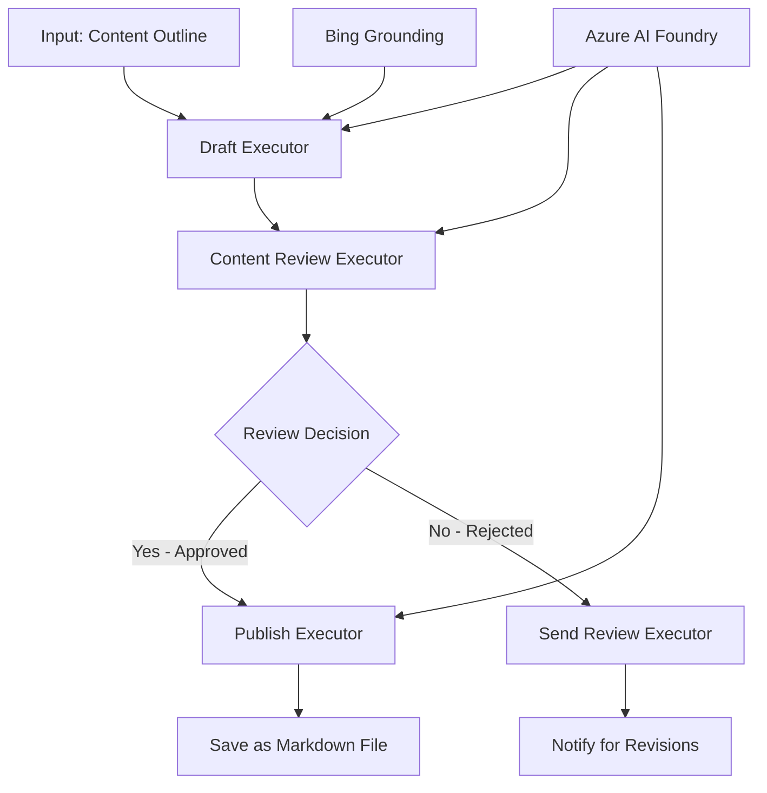

<!--
CO_OP_TRANSLATOR_METADATA:
{
  "original_hash": "8abd335151cee553293b637ee3d80d10",
  "translation_date": "2025-11-11T12:22:14+00:00",
  "source_file": "08-multi-agent/code_samples/workflows-agent-framework/dotNET/04.dotnet-agent-framework-workflow-aifoundry-condition.md",
  "language_code": "he"
}
-->
# 🔀 זרימות עבודה מותנות עם Azure AI Foundry (.NET)

## 📋 מדריך לזרימות עבודה מבוססות החלטות חכמות

מחברת זו מדגימה **תבניות זרימת עבודה מותנות** באמצעות Azure AI Foundry ומסגרת Microsoft Agent Framework עבור .NET. תלמדו כיצד לבנות זרימות עבודה מתקדמות, מבוססות החלטות, שמנתבות באופן חכם את התהליכים על סמך ניתוח AI, כללי עסק ודינמיות לצורך אוטומציה ברמה ארגונית.

## 🎯 מטרות למידה

### 🧠 **ארכיטקטורת החלטות חכמה**
- **יישום לוגיקה מותנית**: בניית עצי החלטה מורכבים עם נקודות הסתעפות מרובות
- **ניתוב מבוסס AI**: שימוש במודלים של Azure AI Foundry לקבלת החלטות ניתוב חכמות
- **התאמת זרימת עבודה דינמית**: שינוי התנהגות זרימת העבודה על סמך ניתוח ותנאים בזמן ריצה
- **שילוב כללים ארגוניים**: שילוב לוגיקה עסקית ודרישות תאימות בזרימות עבודה

### 🔀 **תבניות מותנות מתקדמות**
- **קבלת החלטות רב-קריטריונית**: הערכת גורמים מרובים לצורך החלטות ניתוב
- **עיבוד מודע להקשר**: קבלת החלטות על סמך הקשר והיסטוריית זרימת העבודה המצטברת
- **שינוי זרימת עבודה אדפטיבית**: התאמת מסלולי עיבוד באופן דינמי על סמך תנאים בזמן אמת
- **שילוב מנועי כללים**: יישום מנועי כללים עסקיים מתקדמים בתוך זרימות עבודה

### 🏢 **יישומים מותנים ארגוניים**
- **סיווג וניתוב מסמכים**: סיווג אוטומטי וניתוב מסמכים לזרימות עבודה מתאימות
- **תיעדוף שירות לקוחות**: ניתוב חכם של פניות לקוחות לצוותי טיפול מתמחים
- **עיבוד תאימות וסיכונים**: יישום תהליכי אימות וביקורת שונים על סמך הערכת סיכונים
- **זרימות עבודה לבקרת איכות**: ניתוב תוכן דרך תהליכי ביקורת מתאימים על סמך מדדי איכות

## ⚙️ דרישות והגדרות

### 📦 **חבילות NuGet נדרשות**

חבילות מתקדמות לעיבוד זרימות עבודה מותנות:

```xml
<!-- Core AI Framework -->
<PackageReference Include="Microsoft.Extensions.AI" Version="9.9.0" />

<!-- Azure AI Agents with Persistent State -->
<PackageReference Include="Azure.AI.Agents.Persistent" Version="1.2.0-beta.5" />

<!-- Azure Identity and Utilities -->
<PackageReference Include="Azure.Identity" Version="1.15.0" />
<PackageReference Include="System.Linq.Async" Version="6.0.3" />
<PackageReference Include="DotNetEnv" Version="3.1.1" />

<!-- Local Workflow Framework References -->
<!-- Microsoft.Agents.Workflows.dll - Advanced workflow orchestration -->
<!-- Microsoft.Agents.AI.AzureAI.dll - Azure AI Foundry integration -->
<!-- Microsoft.Agents.AI.dll - Core agent abstractions -->
```

### 🔑 **הגדרת Azure AI Foundry**

**משאבי Azure נדרשים:**
- סביבת עבודה של Azure AI Foundry עם מודלים לעיבוד מותנה
- מנוי Azure עם מכסות חישוב והרשאות מתאימות
- מודלים AI פרוסים לקבלת החלטות וניתוח תוכן
- (אופציונלי) חיבור ל-Bing Search API לצורך יכולות עיגון

**הגדרת סביבה (.env file):**
```env
# Azure AI Foundry Configuration
AZURE_AI_PROJECT_ENDPOINT=https://your-project.cognitiveservices.azure.com/
BING_CONNECTION_ID=your-bing-connection-id
```

**הגדרת אימות:**
```csharp
// Azure CLI or Managed Identity authentication
using Azure.Identity;
var credential = new AzureCliCredential();

// Load environment configuration
DotNetEnv.Env.Load("../../../.env");
```

### 🏗️ **ארכיטקטורת זרימת עבודה מותנית**



**רכיבים מרכזיים:**
- **Draft Executor**: סוכן AI שיוצר טיוטות תוכן ראשוניות מתוך מתארים
- **Content Review Executor**: סוכן AI שמעריך את איכות הטיוטה והתאימות
- **ניתוב מותנה**: לוגיקת החלטות שמנתבת על סמך תוצאות הביקורת
- **מסלולי פרסום/ביקורת**: מסלולי עיבוד נפרדים לתוכן מאושר מול תוכן שנדחה
- **ניהול מצב**: שומר על הקשר התוכן והביקורת לאורך זרימת העבודה

## 🎨 **תבניות עיצוב לזרימות עבודה מותנות**

### 📋 **ייצור תוכן עם שערי איכות**
```
Outline → Draft Creation → Quality Review → {Approve: Publish | Reject: Revise}
```

### 🎯 **עיבוד מסמכים מבוסס סיכון**
```
Document → Risk Assessment → {Low: Standard | High: Enhanced Review}
```

### 🔍 **ניתוב חכם של שירות לקוחות**
```
Customer Query → Analysis → {Simple: FAQ Bot | Complex: Human Agent}
```

### 💼 **זרימות עבודה מונעות תאימות**
```
Content → Compliance Check → {Pass: Publish | Fail: Legal Review}
```

## 🏢 **יתרונות מותנים ארגוניים**

### 🎯 **אוטומציה חכמה**
- **קבלת החלטות חכמה**: החלטות ניתוב מבוססות AI על סמך ניתוח תוכן והקשר
- **עיבוד אדפטיבי**: זרימות עבודה שמתאימות את עצמן באופן אוטומטי לתנאים משתנים
- **אכיפת כללים עסקיים**: יישום אוטומטי של לוגיקה עסקית ומדיניות מורכבת
- **ניתוב מודע להקשר**: החלטות על סמך היסטוריית זרימת העבודה והקשר מצטבר

### 📈 **מצוינות תפעולית**
- **הקצאת משאבים אופטימלית**: ניתוב עבודה למומחים ולתהליכים המתאימים ביותר
- **הפחתת התערבות ידנית**: קבלת החלטות אוטומטית ממזערת את הצורך בנתיב ידני
- **זמני פתרון מהירים יותר**: ניתוב ישיר למומחיות וליכולות עיבוד מתאימות
- **יישום עקבי**: יישום אחיד של כללים עסקיים וקריטריוני החלטה

### 🛡️ **ניהול סיכונים ותאימות**
- **הערכת סיכונים אוטומטית**: הערכת סיכונים מבוססת AI לתוכן ולמצבים
- **אכיפת תאימות**: ניתוב אוטומטי דרך תהליכים רגולטוריים נדרשים
- **יישום פרוטוקולי אבטחה**: אמצעי אבטחה משופרים מיושמים על סמך הערכת סיכונים
- **שמירת תיעוד ביקורת**: תיעוד מלא של החלטות ניתוב ונימוקים

### 📊 **אנליטיקה ושיפור מתמשך**
- **אנליטיקה החלטתית**: מעקב אחר יעילות ודיוק החלטות ניתוב
- **זיהוי תבניות**: זיהוי מגמות ותבניות בהחלטות ניתוב לאורך זמן
- **אופטימיזציה ביצועית**: שיפור מתמשך של קריטריוני החלטות ויעילות ניתוב
- **מודיעין עסקי**: תובנות על מאפייני תוכן ודרישות עיבוד

### 🔧 **מצוינות טכנית**
- **ניהול מצב מתמשך**: שמירה על מצב מורכב לאורך ביצוע זרימת העבודה
- **ארכיטקטורה ניתנת להרחבה**: טיפול בדרישות עיבוד מותנות בנפח גבוה
- **יכולות אינטגרציה**: אינטגרציה חלקה עם מערכות ותהליכים עסקיים קיימים
- **מעקב ונראות**: מעקב מקיף אחר ביצועי זרימת העבודה והחלטות

בואו נבנה זרימות עבודה ארגוניות חכמות ומבוססות החלטות עם .NET! 🚀

## 💻 הרצת הקוד

היישום המלא זמין ב-`04.dotnet-agent-framework-workflow-aifoundry-condition.cs`. זה מדגים **זרימת עבודה לייצור תוכן עם שערי איכות**:

### 🏗️ **ארכיטקטורת זרימת עבודה**

```
Content Outline → Draft Creation → Quality Review → Conditional Routing:
                                                      ├─ Approved (>200 words) → Publish
                                                      └─ Rejected (<200 words) → Review Notification
```

**סוכנים בזרימת העבודה:**
1. **Evangelist Agent**: יוצר טיוטות מדריך מתוך מתארים עם עיגון Bing
2. **Content Reviewer Agent**: מעריך את איכות הטיוטה (מספר מילים, שלמות)
3. **Publisher Agent**: שומר תוכן מאושר כקבצי Markdown עם חותמת זמן

**מבצעי מותאמים אישית:**
1. **DraftExecutor**: מתאם יצירת טיוטות
2. **ContentReviewExecutor**: מבצע הערכת איכות
3. **PublishExecutor**: מטפל בפרסום תוכן מאושר
4. **SendReviewExecutor**: מנהל הודעות על תוכן שנדחה

### 🚀 הרצת הדוגמה

**דרישות מוקדמות:**
- סביבת עבודה של Azure AI Foundry מוגדרת
- אימות Azure CLI (`az login`)
- (אופציונלי) חיבור ל-Bing Search לצורך עיגון

```bash
# Make the script executable (Unix/Linux/macOS)
chmod +x 04.dotnet-agent-framework-workflow-aifoundry-condition.cs

# Run the conditional workflow
./04.dotnet-agent-framework-workflow-aifoundry-condition.cs
```

או ב-Windows:
```powershell
dotnet run 04.dotnet-agent-framework-workflow-aifoundry-condition.cs
```

### 📝 תוצאה צפויה

זרימת העבודה תבצע:
1. **יצירת סוכנים**: אתחול שלושה סוכני Azure AI Foundry מתמחים
2. **יצירת טיוטה**: סוכן Evangelist יוצר טיוטת מדריך מתוך מתאר
3. **ביקורת תוכן**: Content Reviewer מעריך את איכות הטיוטה
4. **ניתוב מותנה**:
   - **אם מאושר (>200 מילים)**: Publish Executor שומר כקובץ Markdown
   - **אם נדחה (<200 מילים)**: Send Review Executor שולח הודעת ביקורת
5. **הצגת תוצאות**: הצגת תוצאת זרימת העבודה הסופית

### 🔧 אפשרויות התאמה אישית

**שינוי קריטריוני ביקורת:**
```csharp
const string ContentReviewerInstructions = @"
You are a content reviewer...
1. Check if content is more than 500 words (instead of 200)
2. Verify technical accuracy
3. Ensure proper formatting
...";
```

**הוספת מסלולים מותנים נוספים:**
```csharp
var workflow = new WorkflowBuilder(draftExecutor)
    .AddEdge(draftExecutor, contentReviewerExecutor)
    .AddEdge(contentReviewerExecutor, publishExecutor, condition: GetCondition("Excellent"))
    .AddEdge(contentReviewerExecutor, editExecutor, condition: GetCondition("Good"))
    .AddEdge(contentReviewerExecutor, sendReviewerExecutor, condition: GetCondition("Poor"))
    .Build();
```

**שינוי דרישות תוכן:**
```csharp
string OUTLINE_Content = @"
# Your Custom Topic
## Section 1
https://your-reference-url
## Section 2
...
";
```

### 🎯 יישומים בעולם האמיתי

תבנית זרימת עבודה מותנית זו אידיאלית עבור:
- **מערכות ניהול תוכן**: זרימות עבודה עריכתיות אוטומטיות עם שערי איכות
- **עיבוד מסמכים**: ניתוב מסמכים על סמך סיווג ותאימות
- **תמיכת לקוחות**: ניתוב כרטיסים חכם על סמך מורכבות ודחיפות
- **ביקורת משפטית**: ניתוב חוזים על סמך הערכת סיכונים וערך
- **תהליכי משאבי אנוש**: ניתוב בקשות דרך זרימות סינון מתאימות

### 🔍 הבנת לוגיקה מותנית

**פונקציית תנאי:**
```csharp
public Func<object?, bool> GetCondition(string expectedResult) =>
    reviewResult => reviewResult is ReviewResult review && review.Result == expectedResult;
```

פונקציה זו יוצרת תנאי שמבצע:
1. בדיקה אם התוצאה היא מסוג `ReviewResult`
2. השוואת מאפיין `Result` לערך הצפוי
3. החזרת true/false לקביעת ניתוב

**קצוות זרימת עבודה עם תנאים:**
```csharp
.AddEdge(contentReviewerExecutor, publishExecutor, condition: GetCondition("Yes"))
.AddEdge(contentReviewerExecutor, sendReviewerExecutor, condition: GetCondition("No"))
```

### 📊 תכונות מתקדמות

**אימות סכמת JSON:**
זרימת העבודה משתמשת בסכמות JSON להבטחת תגובות מובנות:

```csharp
// Define response structure
public class ReviewResult
{
    [JsonPropertyName("review_result")]
    public string Result { get; set; } = string.Empty;
    
    [JsonPropertyName("reason")]
    public string Reason { get; set; } = string.Empty;
    
    [JsonPropertyName("draft_content")]
    public string DraftContent { get; set; } = string.Empty;
}

// Apply to agent
ResponseFormat = ChatResponseFormat.ForJsonSchema(
    AIJsonUtilities.CreateJsonSchema(typeof(ReviewResult)), 
    "ReviewResult", 
    "Review Result From DraftContent"
)
```

**שילוב עיגון Bing:**
סוכן Evangelist משתמש בעיגון Bing לגישה למידע בזמן אמת:

```csharp
var bingGroundingConfig = new BingGroundingSearchConfiguration(bing_conn_id);
BingGroundingToolDefinition bingGroundingTool = new(
    new BingGroundingSearchToolParameters([bingGroundingConfig])
);
```

זה מאפשר לסוכן לעקוב אחר כתובות URL במתאר ולחלץ מידע עדכני.

### 🛡️ טיפול בשגיאות

זרימת העבודה כוללת טיפול שגיאות חזק לתוכן שנדחה:
- כשלי ביקורת מפעילים את המסלול החלופי
- הודעות מספקות סיבות דחייה ברורות
- התוכן נשמר לצורך תיקון

### 🔄 הרחבת זרימת העבודה

**הוספת לולאת תיקון:**
יצירת לולאת משוב שמנסחת מחדש תוכן באופן אוטומטי:

```csharp
.AddEdge(contentReviewerExecutor, publishExecutor, condition: GetCondition("Yes"))
.AddEdge(contentReviewerExecutor, draftExecutor, condition: GetCondition("No")) // Loop back
```

**יישום ביקורת רב-שלבית:**
הוספת שלבי ביקורת מרובים עם קריטריונים שונים:

```csharp
.AddEdge(draftExecutor, technicalReviewer)
.AddEdge(technicalReviewer, editorialReviewer, condition: GetCondition("TechPass"))
.AddEdge(editorialReviewer, publishExecutor, condition: GetCondition("EditPass"))
```

תבנית זרימת עבודה מותנית זו מספקת את הבסיס לבניית מערכות אוטומציה ארגוניות מתקדמות וחכמות! 🚀

---

<!-- CO-OP TRANSLATOR DISCLAIMER START -->
**כתב ויתור**:  
מסמך זה תורגם באמצעות שירות תרגום AI [Co-op Translator](https://github.com/Azure/co-op-translator). למרות שאנו שואפים לדיוק, יש לקחת בחשבון שתרגומים אוטומטיים עשויים להכיל שגיאות או אי דיוקים. המסמך המקורי בשפתו המקורית צריך להיחשב כמקור סמכותי. עבור מידע קריטי, מומלץ להשתמש בתרגום מקצועי אנושי. איננו אחראים לאי הבנות או לפרשנויות שגויות הנובעות משימוש בתרגום זה.
<!-- CO-OP TRANSLATOR DISCLAIMER END -->