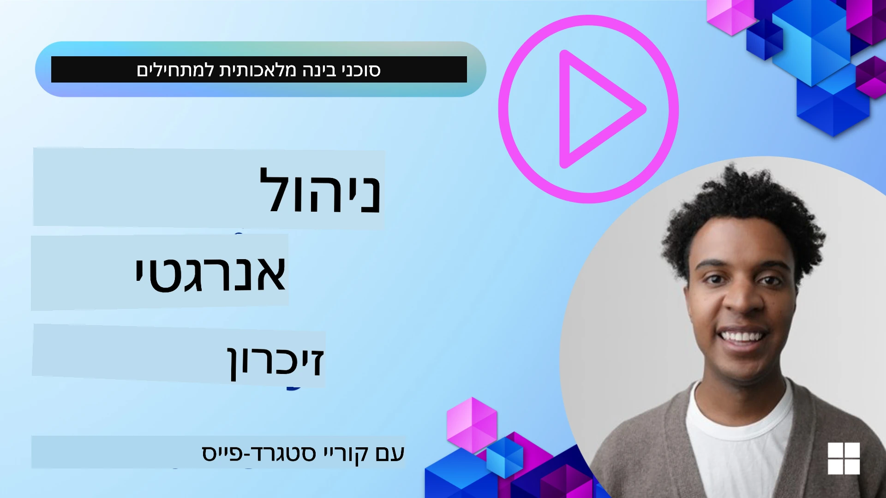

<!--
CO_OP_TRANSLATOR_METADATA:
{
  "original_hash": "a1d90991499ad697c4ad24decaf36968",
  "translation_date": "2025-12-09T12:32:34+00:00",
  "source_file": "13-agent-memory/README.md",
  "language_code": "he"
}
-->
# זיכרון לסוכני AI

כשמדברים על היתרונות הייחודיים של יצירת סוכני AI, שני דברים עיקריים עולים לדיון: היכולת להשתמש בכלים לביצוע משימות והיכולת להשתפר עם הזמן. זיכרון הוא הבסיס ליצירת סוכן שמשתפר בעצמו ויכול להעניק חוויות טובות יותר למשתמשים שלנו.

בשיעור זה, נבחן מהו זיכרון עבור סוכני AI, כיצד ניתן לנהל אותו וכיצד להשתמש בו לטובת האפליקציות שלנו.

## מבוא

השיעור יעסוק ב:

• **הבנת זיכרון של סוכני AI**: מהו זיכרון ולמה הוא חיוני עבור סוכנים.

• **יישום ואחסון זיכרון**: שיטות מעשיות להוספת יכולות זיכרון לסוכני AI, תוך התמקדות בזיכרון קצר טווח וארוך טווח.

• **הפיכת סוכני AI למשופרים בעצמם**: כיצד זיכרון מאפשר לסוכנים ללמוד מאינטראקציות קודמות ולהשתפר עם הזמן.

## יישומים זמינים

שיעור זה כולל שני מדריכים מפורטים בפורמט מחברת:

• **[13-agent-memory.ipynb](./13-agent-memory.ipynb)**: מיישם זיכרון באמצעות Mem0 ו-Azure AI Search עם מסגרת Semantic Kernel.

• **[13-agent-memory-cognee.ipynb](./13-agent-memory-cognee.ipynb)**: מיישם זיכרון מובנה באמצעות Cognee, בונה אוטומטית גרף ידע המבוסס על embeddings, מציג גרף ומבצע שליפה חכמה.

## מטרות למידה

לאחר השלמת השיעור, תדעו כיצד:

• **להבחין בין סוגי זיכרון שונים של סוכני AI**, כולל זיכרון עבודה, זיכרון קצר טווח, זיכרון ארוך טווח וצורות מיוחדות כמו זיכרון פרסונה וזיכרון אפיזודי.

• **ליישם ולנהל זיכרון קצר טווח וארוך טווח עבור סוכני AI** באמצעות מסגרת Semantic Kernel, תוך שימוש בכלים כמו Mem0, Cognee, זיכרון Whiteboard ושילוב עם Azure AI Search.

• **להבין את העקרונות מאחורי סוכני AI שמשתפרים בעצמם** וכיצד מערכות ניהול זיכרון חזקות תורמות ללמידה והתאמה מתמשכת.

## הבנת זיכרון של סוכני AI

בבסיסו, **זיכרון עבור סוכני AI מתייחס למנגנונים שמאפשרים להם לשמור ולשלוף מידע**. מידע זה יכול להיות פרטים ספציפיים על שיחה, העדפות משתמש, פעולות קודמות או אפילו דפוסים שנלמדו.

ללא זיכרון, אפליקציות AI הן לרוב חסרות מצב, כלומר כל אינטראקציה מתחילה מאפס. זה מוביל לחוויית משתמש חוזרת ומתסכלת שבה הסוכן "שוכח" הקשר או העדפות קודמות.

### למה זיכרון חשוב?

האינטליגנציה של סוכן קשורה עמוקות ליכולתו לזכור ולהשתמש במידע מהעבר. זיכרון מאפשר לסוכנים להיות:

• **רפלקטיביים**: ללמוד מפעולות ותוצאות קודמות.

• **אינטראקטיביים**: לשמור על הקשר במהלך שיחה מתמשכת.

• **פרואקטיביים וריאקטיביים**: לצפות צרכים או להגיב בהתאם על סמך נתונים היסטוריים.

• **אוטונומיים**: לפעול באופן עצמאי יותר על ידי שימוש בידע שנשמר.

המטרה של יישום זיכרון היא להפוך את הסוכנים ליותר **אמינים ומסוגלים**.

### סוגי זיכרון

#### זיכרון עבודה

חשבו על זה כמו דף טיוטה שהסוכן משתמש בו במהלך משימה או תהליך מחשבה יחיד. הוא מחזיק מידע מיידי הדרוש לחישוב הצעד הבא.

עבור סוכני AI, זיכרון עבודה לרוב לוכד את המידע הרלוונטי ביותר משיחה, גם אם היסטוריית השיחה המלאה ארוכה או מקוצרת. הוא מתמקד בהפקת אלמנטים מרכזיים כמו דרישות, הצעות, החלטות ופעולות.

**דוגמה לזיכרון עבודה**

בסוכן להזמנת טיולים, זיכרון העבודה עשוי ללכוד את בקשת המשתמש הנוכחית, כמו "אני רוצה להזמין טיול לפריז". דרישה ספציפית זו נשמרת בהקשר המיידי של הסוכן כדי להנחות את האינטראקציה הנוכחית.

#### זיכרון קצר טווח

סוג זה של זיכרון שומר מידע למשך שיחה או סשן יחיד. זהו ההקשר של השיחה הנוכחית, המאפשר לסוכן להתייחס לפניות קודמות בדיאלוג.

**דוגמה לזיכרון קצר טווח**

אם משתמש שואל, "כמה יעלה טיסה לפריז?" ואז ממשיך עם "ומה לגבי לינה שם?", זיכרון קצר הטווח מבטיח שהסוכן יודע ש"שם" מתייחס ל"פריז" באותה שיחה.

#### זיכרון ארוך טווח

זהו מידע שנשמר לאורך מספר שיחות או סשנים. הוא מאפשר לסוכנים לזכור העדפות משתמש, אינטראקציות היסטוריות או ידע כללי לאורך זמן. זה חשוב להתאמה אישית.

**דוגמה לזיכרון ארוך טווח**

זיכרון ארוך טווח עשוי לשמור ש"בן אוהב סקי ופעילויות חוץ, אוהב קפה עם נוף הרים ורוצה להימנע ממסלולי סקי מתקדמים בגלל פציעה קודמת". מידע זה, שנלמד מאינטראקציות קודמות, משפיע על המלצות בתכנון טיולים עתידיים, מה שהופך אותם לאישיים מאוד.

#### זיכרון פרסונה

סוג זיכרון מיוחד זה עוזר לסוכן לפתח "אישיות" או "פרסונה" עקבית. הוא מאפשר לסוכן לזכור פרטים על עצמו או על תפקידו המיועד, מה שהופך את האינטראקציות ליותר זורמות וממוקדות.

**דוגמה לזיכרון פרסונה**

אם הסוכן לתכנון טיולים נועד להיות "מומחה לתכנון סקי", זיכרון הפרסונה עשוי לחזק תפקיד זה, ולהשפיע על תגובותיו כך שיתאימו לטון ולידע של מומחה.

#### זיכרון אפיזודי/תהליכי

זיכרון זה שומר את רצף הצעדים שהסוכן נוקט במהלך משימה מורכבת, כולל הצלחות וכישלונות. זה כמו לזכור "פרקים" או חוויות קודמות כדי ללמוד מהם.

**דוגמה לזיכרון אפיזודי**

אם הסוכן ניסה להזמין טיסה מסוימת אך נכשל בגלל חוסר זמינות, זיכרון אפיזודי יכול לתעד כישלון זה, ולאפשר לסוכן לנסות טיסות חלופיות או ליידע את המשתמש על הבעיה בצורה מושכלת יותר בניסיון הבא.

#### זיכרון ישויות

זיכרון זה כולל חילוץ ושמירה של ישויות ספציפיות (כמו אנשים, מקומות או דברים) ואירועים משיחות. הוא מאפשר לסוכן לבנות הבנה מובנית של אלמנטים מרכזיים שנדונו.

**דוגמה לזיכרון ישויות**

משיחה על טיול קודם, הסוכן עשוי לחלץ "פריז", "מגדל אייפל" ו"ארוחת ערב במסעדת לה שאט נואר" כישויות. באינטראקציה עתידית, הסוכן יכול לזכור את "לה שאט נואר" ולהציע להזמין שם שוב.

#### RAG מובנה (שליפה מוגברת)

בעוד ש-RAG היא טכניקה רחבה יותר, "RAG מובנה" מודגש כטכנולוגיית זיכרון חזקה. הוא מחלץ מידע מובנה וצפוף ממקורות שונים (שיחות, מיילים, תמונות) ומשתמש בו לשיפור דיוק, שליפה ומהירות בתגובות. בניגוד ל-RAG קלאסי שמסתמך רק על דמיון סמנטי, RAG מובנה עובד עם המבנה הפנימי של המידע.

**דוגמה ל-RAG מובנה**

במקום רק להתאים מילות מפתח, RAG מובנה יכול לנתח פרטי טיסה (יעד, תאריך, שעה, חברת תעופה) ממייל ולאחסן אותם בצורה מובנית. זה מאפשר שאילתות מדויקות כמו "איזו טיסה הזמנתי לפריז ביום שלישי?"

## יישום ואחסון זיכרון

יישום זיכרון לסוכני AI כולל תהליך שיטתי של **ניהול זיכרון**, הכולל יצירה, אחסון, שליפה, שילוב, עדכון ואפילו "שכחה" (או מחיקה) של מידע. שליפה היא היבט קריטי במיוחד.

### כלים מיוחדים לזיכרון

#### Mem0

אחת הדרכים לאחסן ולנהל זיכרון סוכן היא באמצעות כלים מיוחדים כמו Mem0. Mem0 פועל כשכבת זיכרון מתמשכת, המאפשרת לסוכנים לשלוף אינטראקציות רלוונטיות, לאחסן העדפות משתמש והקשר עובדתי, וללמוד מהצלחות וכישלונות לאורך זמן. הרעיון כאן הוא שסוכנים חסרי מצב הופכים לבעלי מצב.

הוא פועל באמצעות **צינור זיכרון דו-שלבי: חילוץ ועדכון**. תחילה, הודעות שנוספו לשרשור של הסוכן נשלחות לשירות Mem0, שמשתמש במודל שפה גדול (LLM) כדי לסכם את היסטוריית השיחה ולחלץ זיכרונות חדשים. לאחר מכן, שלב עדכון מונע LLM קובע האם להוסיף, לשנות או למחוק זיכרונות אלה, תוך אחסונם במאגר נתונים היברידי שיכול לכלול וקטורים, גרפים ומאגרי מפתח-ערך. מערכת זו תומכת גם בסוגי זיכרון שונים ויכולה לשלב זיכרון גרפי לניהול קשרים בין ישויות.

#### Cognee

גישה חזקה נוספת היא שימוש ב-**Cognee**, זיכרון סמנטי בקוד פתוח לסוכני AI שממיר נתונים מובנים ולא מובנים לגרפי ידע ניתנים לשאילתה המבוססים על embeddings. Cognee מספקת **ארכיטקטורת אחסון כפולה** שמשלבת חיפוש דמיון וקטורי עם קשרי גרף, ומאפשרת לסוכנים להבין לא רק איזה מידע דומה, אלא גם כיצד מושגים קשורים זה לזה.

היא מצטיינת ב-**שליפה היברידית** שמשלבת דמיון וקטורי, מבנה גרף והסקת LLM - מחיפוש גולמי ועד מענה לשאלות מודעות לגרף. המערכת שומרת על **זיכרון חי** שמתפתח וצומח תוך שהוא נשאר ניתן לשאילתה כגרף מחובר אחד, ותומך גם בהקשר סשן קצר טווח וגם בזיכרון מתמשך ארוך טווח.

מדריך המחברת של Cognee ([13-agent-memory-cognee.ipynb](./13-agent-memory-cognee.ipynb)) מדגים בניית שכבת זיכרון מאוחדת זו, עם דוגמאות מעשיות של קליטת מקורות נתונים מגוונים, הצגת גרף הידע ושאילתות עם אסטרטגיות חיפוש שונות המותאמות לצרכי הסוכן.

### אחסון זיכרון עם RAG

מעבר לכלי זיכרון מיוחדים כמו Mem0, ניתן לנצל שירותי חיפוש מתקדמים כמו **Azure AI Search כבסיס לאחסון ושליפת זיכרונות**, במיוחד עבור RAG מובנה.

זה מאפשר לבסס את תגובות הסוכן על הנתונים שלכם, ולהבטיח תשובות רלוונטיות ומדויקות יותר. Azure AI Search יכול לשמש לאחסון זיכרונות נסיעות של משתמשים, קטלוגי מוצרים או כל ידע ייחודי אחר.

Azure AI Search תומך ביכולות כמו **RAG מובנה**, שמצטיין בחילוץ ושליפת מידע מובנה וצפוף ממאגרי נתונים גדולים כמו היסטוריות שיחה, מיילים או אפילו תמונות. זה מספק "דיוק ושליפה על-אנושיים" בהשוואה לגישות מסורתיות של חיתוך טקסטים ויצירת embeddings.

## הפיכת סוכני AI למשופרים בעצמם

תבנית נפוצה לסוכנים שמשתפרים בעצמם כוללת הצגת **"סוכן ידע"**. סוכן זה צופה בשיחה הראשית בין המשתמש לסוכן הראשי. תפקידו הוא:

1. **לזהות מידע בעל ערך**: לקבוע אם חלק מהשיחה שווה לשמור כידע כללי או כהעדפת משתמש ספציפית.

2. **לחלץ ולסכם**: לזקק את הלמידה או ההעדפה החשובה מהשיחה.

3. **לאחסן בבסיס ידע**: לשמר את המידע שהופק, לעיתים קרובות במאגר וקטורי, כך שניתן יהיה לשלוף אותו מאוחר יותר.

4. **להעשיר שאילתות עתידיות**: כאשר המשתמש יוזם שאילתה חדשה, סוכן הידע שולף מידע רלוונטי שנשמר ומוסיף אותו להנחיית המשתמש, ומספק הקשר חשוב לסוכן הראשי (בדומה ל-RAG).

### אופטימיזציות לזיכרון

• **ניהול השהיה**: כדי להימנע מהאטת אינטראקציות משתמש, ניתן להשתמש במודל זול ומהיר יותר בתחילה כדי לבדוק במהירות אם מידע שווה לשמור או לשלוף, ולהפעיל את תהליך החילוץ/שליפה המורכב יותר רק במידת הצורך.

• **תחזוקת בסיס ידע**: עבור בסיס ידע שגדל, ניתן להעביר מידע פחות בשימוש ל"אחסון קר" כדי לנהל עלויות.

## יש לכם עוד שאלות על זיכרון סוכנים?

הצטרפו ל-[Azure AI Foundry Discord](https://aka.ms/ai-agents/discord) כדי לפגוש לומדים נוספים, להשתתף בשעות קבלה ולקבל תשובות לשאלות שלכם על סוכני AI.

---

<!-- CO-OP TRANSLATOR DISCLAIMER START -->
**כתב ויתור**:  
מסמך זה תורגם באמצעות שירות תרגום AI [Co-op Translator](https://github.com/Azure/co-op-translator). למרות שאנו שואפים לדיוק, יש לקחת בחשבון שתרגומים אוטומטיים עשויים להכיל שגיאות או אי דיוקים. המסמך המקורי בשפתו המקורית צריך להיחשב כמקור סמכותי. עבור מידע קריטי, מומלץ להשתמש בתרגום מקצועי אנושי. איננו אחראים לאי הבנות או לפרשנויות שגויות הנובעות משימוש בתרגום זה.
<!-- CO-OP TRANSLATOR DISCLAIMER END -->