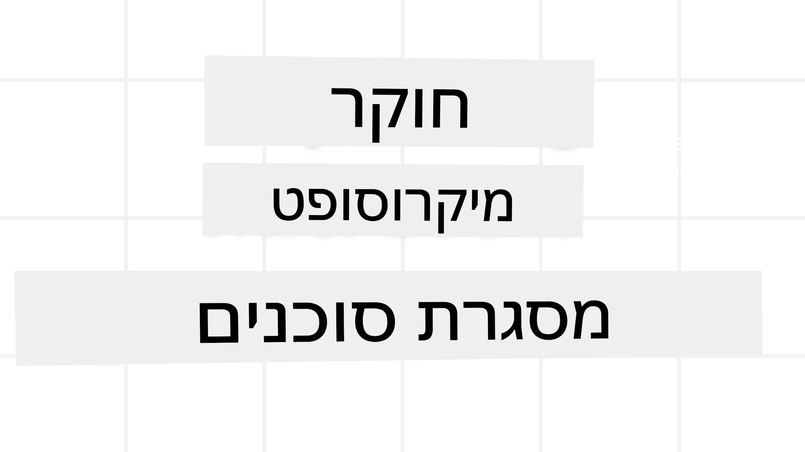
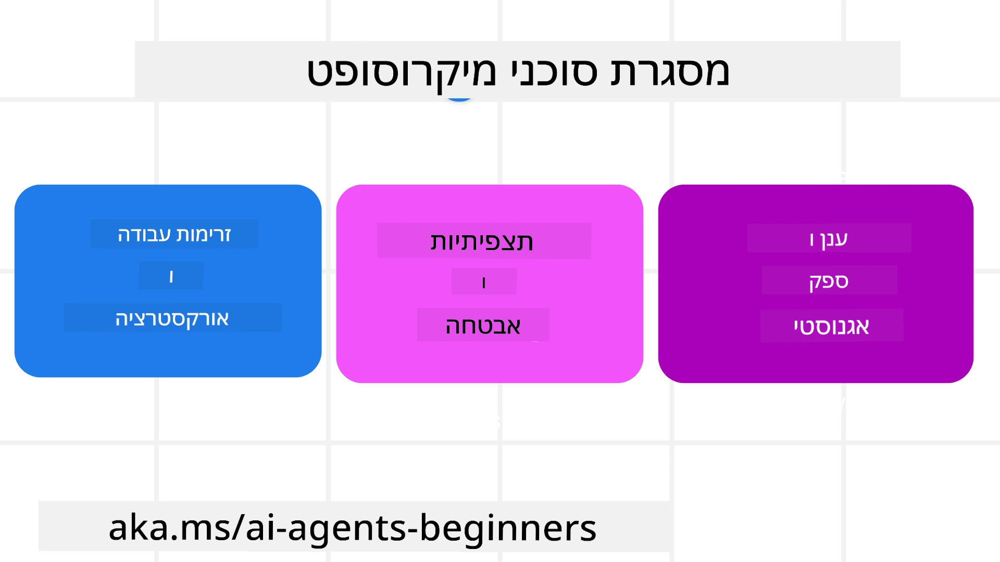
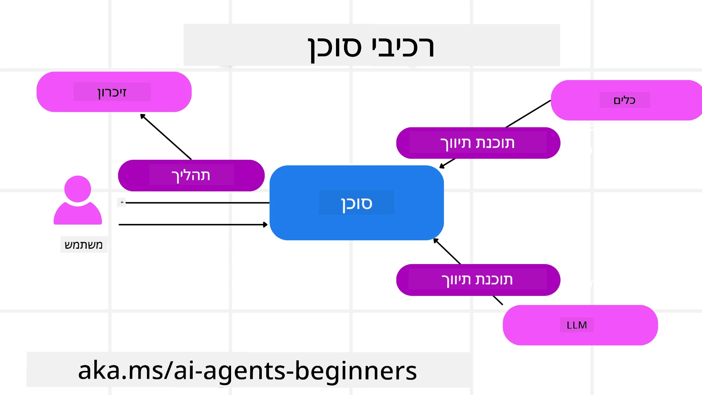

<!--
CO_OP_TRANSLATOR_METADATA:
{
  "original_hash": "19c4dab375acbc733855cc7f2f04edbc",
  "translation_date": "2025-10-02T17:26:47+00:00",
  "source_file": "14-microsoft-agent-framework/README.md",
  "language_code": "he"
}
-->
# חקר Microsoft Agent Framework



### הקדמה

השיעור הזה יעסוק ב:

- הבנת Microsoft Agent Framework: תכונות עיקריות וערך  
- חקר המושגים המרכזיים של Microsoft Agent Framework  
- השוואת MAF ל-Semantic Kernel ו-AutoGen: מדריך מעבר  

## מטרות למידה

לאחר סיום השיעור, תדעו כיצד:

- לבנות סוכנים מבוססי AI מוכנים לייצור באמצעות Microsoft Agent Framework  
- ליישם את התכונות המרכזיות של Microsoft Agent Framework על מקרי השימוש שלכם  
- להעביר ולשלב מסגרות וכלים סוכניים קיימים  

## דוגמאות קוד

דוגמאות קוד עבור [Microsoft Agent Framework (MAF)](https://aka.ms/ai-agents-beginners/agent-framewrok) ניתן למצוא במאגר זה תחת הקבצים `xx-python-agent-framework` ו-`xx-dotnet-agent-framework`.

## הבנת Microsoft Agent Framework



[Microsoft Agent Framework (MAF)](https://aka.ms/ai-agents-beginners/agent-framewrok) מבוסס על הניסיון והלמידות מ-Semantic Kernel ו-AutoGen. הוא מציע גמישות להתמודדות עם מגוון רחב של מקרי שימוש סוכניים בסביבות ייצור ומחקר, כולל:

- **תזמור סוכנים רציף** בתרחישים בהם נדרשים תהליכי עבודה שלב אחר שלב.  
- **תזמור מקבילי** בתרחישים בהם סוכנים צריכים להשלים משימות בו-זמנית.  
- **תזמור שיחות קבוצתיות** בתרחישים בהם סוכנים יכולים לשתף פעולה יחד במשימה אחת.  
- **תזמור העברה** בתרחישים בהם סוכנים מעבירים את המשימה אחד לשני כאשר תתי-המשימות הושלמו.  
- **תזמור מגנטי** בתרחישים בהם סוכן מנהל יוצר ומעדכן רשימת משימות ומנהל את תיאום תתי-הסוכנים להשלמת המשימה.  

כדי לספק סוכנים מבוססי AI בייצור, MAF כולל גם תכונות עבור:

- **תצפיות** באמצעות OpenTelemetry, שם כל פעולה של הסוכן כולל קריאות לכלים, שלבי תזמור, זרימות חשיבה ומעקב ביצועים דרך לוחות מחוונים של Azure AI Foundry.  
- **אבטחה** על ידי אירוח סוכנים באופן מקומי ב-Azure AI Foundry, הכולל בקרות אבטחה כמו גישה מבוססת תפקידים, טיפול בנתונים פרטיים ובטיחות תוכן מובנית.  
- **עמידות** כאשר תהליכי עבודה של סוכנים יכולים להשהות, להמשיך ולהתאושש משגיאות, מה שמאפשר תהליכים ארוכי טווח.  
- **שליטה** כאשר תהליכי עבודה עם מעורבות אנושית נתמכים, בהם משימות מסומנות כזקוקות לאישור אנושי.  

Microsoft Agent Framework מתמקד גם ביכולת פעולה הדדית על ידי:

- **אי תלות בענן** - סוכנים יכולים לפעול במכולות, מקומית ובעננים שונים.  
- **אי תלות בספק** - ניתן ליצור סוכנים באמצעות SDK מועדף, כולל Azure OpenAI ו-OpenAI.  
- **שילוב תקנים פתוחים** - סוכנים יכולים להשתמש בפרוטוקולים כמו Agent-to-Agent (A2A) ו-Model Context Protocol (MCP) כדי לגלות ולהשתמש בסוכנים וכלים אחרים.  
- **תוספים ומחברים** - ניתן ליצור חיבורים לשירותי נתונים וזיכרון כמו Microsoft Fabric, SharePoint, Pinecone ו-Qdrant.  

בואו נבחן כיצד תכונות אלו מיושמות על כמה מהמושגים המרכזיים של Microsoft Agent Framework.

## מושגים מרכזיים של Microsoft Agent Framework

### סוכנים



**יצירת סוכנים**

יצירת סוכן מתבצעת על ידי הגדרת שירות ההסקה (ספק LLM), סט הוראות שהסוכן צריך לעקוב אחריהן, ושם מוקצה:

```python
agent = AzureOpenAIChatClient(credential=AzureCliCredential()).create_agent( instructions="You are good at recommending trips to customers based on their preferences.", name="TripRecommender" )
```

הדוגמה לעיל משתמשת ב-`Azure OpenAI`, אך ניתן ליצור סוכנים באמצעות מגוון שירותים, כולל `Azure AI Foundry Agent Service`:

```python
AzureAIAgentClient(async_credential=credential).create_agent( name="HelperAgent", instructions="You are a helpful assistant." ) as agent
```

OpenAI `Responses`, `ChatCompletion` APIs

```python
agent = OpenAIResponsesClient().create_agent( name="WeatherBot", instructions="You are a helpful weather assistant.", )
```

```python
agent = OpenAIChatClient().create_agent( name="HelpfulAssistant", instructions="You are a helpful assistant.", )
```

או סוכנים מרוחקים באמצעות פרוטוקול A2A:

```python
agent = A2AAgent( name=agent_card.name, description=agent_card.description, agent_card=agent_card, url="https://your-a2a-agent-host" )
```

**הפעלת סוכנים**

סוכנים מופעלים באמצעות השיטות `.run` או `.run_stream` עבור תגובות לא-זורמות או זורמות.

```python
result = await agent.run("What are good places to visit in Amsterdam?")
print(result.text)
```

```python
async for update in agent.run_stream("What are the good places to visit in Amsterdam?"):
    if update.text:
        print(update.text, end="", flush=True)

```

כל הפעלת סוכן יכולה לכלול אפשרויות להתאמת פרמטרים כמו `max_tokens` שהסוכן משתמש בהם, `tools` שהסוכן יכול לקרוא להם, ואפילו המודל עצמו שהסוכן משתמש בו.

זה שימושי במקרים בהם נדרשים מודלים או כלים ספציפיים להשלמת משימת המשתמש.

**כלים**

ניתן להגדיר כלים גם בעת הגדרת הסוכן:

```python
def get_attractions( location: Annotated[str, Field(description="The location to get the top tourist attractions for")], ) -> str: """Get the top tourist attractions for a given location.""" return f"The top attractions for {location} are." 


# When creating a ChatAgent directly 

agent = ChatAgent( chat_client=OpenAIChatClient(), instructions="You are a helpful assistant", tools=[get_attractions]

```

וגם בעת הפעלת הסוכן:

```python

result1 = await agent.run( "What's the best place to visit in Seattle?", tools=[get_attractions] # Tool provided for this run only )
```

**תהליכי סוכן**

תהליכי סוכן משמשים לניהול שיחות מרובות פניות. ניתן ליצור תהליכים על ידי:

- שימוש ב-`get_new_thread()` שמאפשר לשמור את התהליך לאורך זמן.  
- יצירת תהליך באופן אוטומטי בעת הפעלת סוכן, כאשר התהליך נשמר רק במהלך ההפעלה הנוכחית.  

כדי ליצור תהליך, הקוד נראה כך:

```python
# Create a new thread. 
thread = agent.get_new_thread() # Run the agent with the thread. 
response = await agent.run("Hello, I am here to help you book travel. Where would you like to go?", thread=thread)

```

ניתן לאחר מכן לסדר את התהליך כדי לשמור אותו לשימוש עתידי:

```python
# Create a new thread. 
thread = agent.get_new_thread() 

# Run the agent with the thread. 

response = await agent.run("Hello, how are you?", thread=thread) 

# Serialize the thread for storage. 

serialized_thread = await thread.serialize() 

# Deserialize the thread state after loading from storage. 

resumed_thread = await agent.deserialize_thread(serialized_thread)
```

**Middleware של סוכן**

סוכנים מתקשרים עם כלים ו-LLMs כדי להשלים משימות של משתמשים. בתרחישים מסוימים, אנו רוצים לבצע או לעקוב בין האינטראקציות הללו. Middleware של סוכן מאפשר לנו לעשות זאת באמצעות:

*Middleware פונקציונלי*

Middleware זה מאפשר לנו לבצע פעולה בין הסוכן לבין פונקציה/כלי שהוא יקרא להם. דוגמה לשימוש בזה היא כאשר רוצים לבצע רישום של קריאת הפונקציה.

בקוד למטה `next` מגדיר אם יש לקרוא ל-Middleware הבא או לפונקציה עצמה.

```python
async def logging_function_middleware(
    context: FunctionInvocationContext,
    next: Callable[[FunctionInvocationContext], Awaitable[None]],
) -> None:
    """Function middleware that logs function execution."""
    # Pre-processing: Log before function execution
    print(f"[Function] Calling {context.function.name}")

    # Continue to next middleware or function execution
    await next(context)

    # Post-processing: Log after function execution
    print(f"[Function] {context.function.name} completed")
```

*Middleware שיחה*

Middleware זה מאפשר לנו לבצע או לרשום פעולה בין הסוכן לבין הבקשות בין ה-LLM.

זה מכיל מידע חשוב כמו `messages` שנשלחים לשירות ה-AI.

```python
async def logging_chat_middleware(
    context: ChatContext,
    next: Callable[[ChatContext], Awaitable[None]],
) -> None:
    """Chat middleware that logs AI interactions."""
    # Pre-processing: Log before AI call
    print(f"[Chat] Sending {len(context.messages)} messages to AI")

    # Continue to next middleware or AI service
    await next(context)

    # Post-processing: Log after AI response
    print("[Chat] AI response received")

```

**זיכרון סוכן**

כפי שנלמד בשיעור `Agentic Memory`, זיכרון הוא אלמנט חשוב שמאפשר לסוכן לפעול על פני הקשרים שונים. MAF מציע כמה סוגי זיכרונות:

*אחסון בזיכרון*

זהו הזיכרון המאוחסן בתהליכים במהלך זמן הריצה של האפליקציה.

```python
# Create a new thread. 
thread = agent.get_new_thread() # Run the agent with the thread. 
response = await agent.run("Hello, I am here to help you book travel. Where would you like to go?", thread=thread)
```

*הודעות מתמשכות*

זיכרון זה משמש כאשר שומרים היסטוריית שיחות בין מפגשים שונים. הוא מוגדר באמצעות `chat_message_store_factory`:

```python
from agent_framework import ChatMessageStore

# Create a custom message store
def create_message_store():
    return ChatMessageStore()

agent = ChatAgent(
    chat_client=OpenAIChatClient(),
    instructions="You are a Travel assistant.",
    chat_message_store_factory=create_message_store
)

```

*זיכרון דינמי*

זיכרון זה נוסף להקשר לפני הפעלת סוכנים. זיכרונות אלו יכולים להישמר בשירותים חיצוניים כמו mem0:

```python
from agent_framework.mem0 import Mem0Provider

# Using Mem0 for advanced memory capabilities
memory_provider = Mem0Provider(
    api_key="your-mem0-api-key",
    user_id="user_123",
    application_id="my_app"
)

agent = ChatAgent(
    chat_client=OpenAIChatClient(),
    instructions="You are a helpful assistant with memory.",
    context_providers=memory_provider
)

```

**תצפיות סוכן**

תצפיות חשובות לבניית מערכות סוכנים אמינות וניתנות לתחזוקה. MAF משתלב עם OpenTelemetry כדי לספק מעקב ומדדים לתצפיות טובות יותר.

```python
from agent_framework.observability import get_tracer, get_meter

tracer = get_tracer()
meter = get_meter()
with tracer.start_as_current_span("my_custom_span"):
    # do something
    pass
counter = meter.create_counter("my_custom_counter")
counter.add(1, {"key": "value"})
```

### תהליכי עבודה

MAF מציע תהליכי עבודה שהם שלבים מוגדרים מראש להשלמת משימה וכוללים סוכני AI כמרכיבים בשלבים אלו.

תהליכי עבודה מורכבים ממרכיבים שונים שמאפשרים שליטה טובה יותר בזרימת העבודה. תהליכי עבודה גם מאפשרים **תזמור רב-סוכני** ו-**שמירת נקודות ציון** כדי לשמור את מצב תהליך העבודה.

המרכיבים המרכזיים של תהליך עבודה הם:

**מבצעים**

מבצעים מקבלים הודעות קלט, מבצעים את המשימות שהוקצו להם, ואז מפיקים הודעת פלט. זה מקדם את תהליך העבודה לקראת השלמת המשימה הגדולה יותר. מבצעים יכולים להיות סוכני AI או לוגיקה מותאמת אישית.

**קצוות**

קצוות משמשים להגדרת זרימת ההודעות בתהליך עבודה. אלו יכולים להיות:

*קצוות ישירים* - חיבורים פשוטים אחד-לאחד בין מבצעים:

```python
from agent_framework import WorkflowBuilder

builder = WorkflowBuilder()
builder.add_edge(source_executor, target_executor)
builder.set_start_executor(source_executor)
workflow = builder.build()
```

*קצוות מותנים* - מופעלים לאחר שמתקיים תנאי מסוים. לדוגמה, כאשר חדרי מלון אינם זמינים, מבצע יכול להציע אפשרויות אחרות.

*קצוות Switch-case* - מנתבים הודעות למבצעים שונים בהתבסס על תנאים מוגדרים. לדוגמה, אם ללקוח נסיעות יש גישה עדיפות, המשימות שלו יטופלו דרך תהליך עבודה אחר.

*קצוות Fan-out* - שולחים הודעה אחת למספר יעדים.

*קצוות Fan-in* - אוספים מספר הודעות ממבצעים שונים ושולחים ליעד אחד.

**אירועים**

כדי לספק תצפיות טובות יותר בתהליכי עבודה, MAF מציע אירועים מובנים לביצוע כולל:

- `WorkflowStartedEvent` - תחילת ביצוע תהליך העבודה  
- `WorkflowOutputEvent` - תהליך העבודה מפיק פלט  
- `WorkflowErrorEvent` - תהליך העבודה נתקל בשגיאה  
- `ExecutorInvokeEvent` - מבצע מתחיל לעבד  
- `ExecutorCompleteEvent` - מבצע מסיים לעבד  
- `RequestInfoEvent` - בקשה מונפקת  

## מעבר ממסגרות אחרות (Semantic Kernel ו-AutoGen)

### הבדלים בין MAF ל-Semantic Kernel

**יצירת סוכן פשוטה**

Semantic Kernel מסתמך על יצירת מופע Kernel עבור כל סוכן. MAF משתמש בגישה פשוטה יותר באמצעות הרחבות עבור הספקים המרכזיים.

```python
agent = AzureOpenAIChatClient(credential=AzureCliCredential()).create_agent( instructions="You are good at reccomending trips to customers based on their preferences.", name="TripRecommender" )
```

**יצירת תהליכי סוכן**

Semantic Kernel דורש יצירת תהליכים באופן ידני. ב-MAF, הסוכן מוקצה ישירות לתהליך.

```python
thread = agent.get_new_thread() # Run the agent with the thread. 
```

**רישום כלים**

ב-Semantic Kernel, כלים נרשמים ל-Kernel וה-Kernel מועבר לסוכן. ב-MAF, כלים נרשמים ישירות במהלך תהליך יצירת הסוכן.

```python
agent = ChatAgent( chat_client=OpenAIChatClient(), instructions="You are a helpful assistant", tools=[get_attractions]
```

### הבדלים בין MAF ל-AutoGen

**צוותים לעומת תהליכי עבודה**

`Teams` הם מבנה האירועים לפעילות מונעת אירועים עם סוכנים ב-AutoGen. MAF משתמש ב-`Workflows` שמנתבים נתונים למבצעים דרך ארכיטקטורה מבוססת גרף.

**יצירת כלים**

AutoGen משתמש ב-`FunctionTool` לעטוף פונקציות שסוכנים יכולים לקרוא להן. MAF משתמש ב-@ai_function שפועל באופן דומה אך גם מסיק את הסכמות באופן אוטומטי עבור כל פונקציה.

**התנהגות סוכן**

סוכנים הם סוכנים של פנייה אחת כברירת מחדל ב-AutoGen אלא אם כן `max_tool_iterations` מוגדר לערך גבוה יותר. ב-MAF, ה-`ChatAgent` הוא רב-פניות כברירת מחדל, כלומר הוא ימשיך לקרוא לכלים עד שמשימת המשתמש תושלם.

## דוגמאות קוד

דוגמאות קוד עבור Microsoft Agent Framework ניתן למצוא במאגר זה תחת הקבצים `xx-python-agent-framework` ו-`xx-dotnet-agent-framework`.

## יש לכם עוד שאלות על Microsoft Agent Framework?

הצטרפו ל-[Azure AI Foundry Discord](https://aka.ms/ai-agents/discord) כדי לפגוש לומדים אחרים, להשתתף בשעות קבלה ולקבל תשובות לשאלות שלכם על סוכני AI.

---

**כתב ויתור**:  
מסמך זה תורגם באמצעות שירות תרגום מבוסס בינה מלאכותית [Co-op Translator](https://github.com/Azure/co-op-translator). למרות שאנו שואפים לדיוק, יש לקחת בחשבון שתרגומים אוטומטיים עשויים להכיל שגיאות או אי דיוקים. המסמך המקורי בשפתו המקורית צריך להיחשב כמקור סמכותי. עבור מידע קריטי, מומלץ להשתמש בתרגום מקצועי על ידי אדם. איננו נושאים באחריות לאי הבנות או לפרשנויות שגויות הנובעות משימוש בתרגום זה.