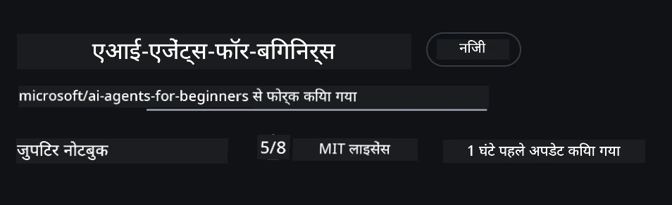
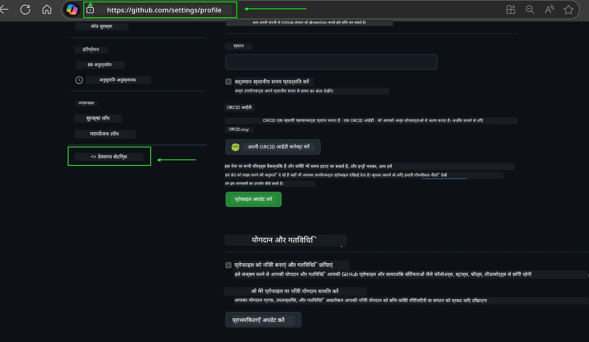
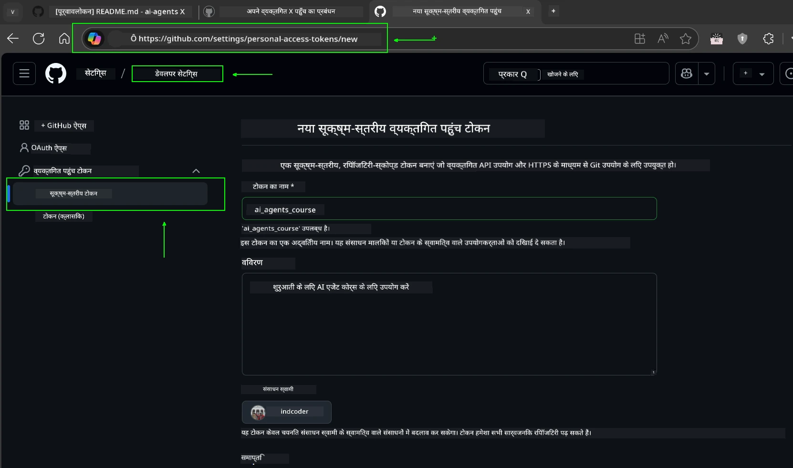
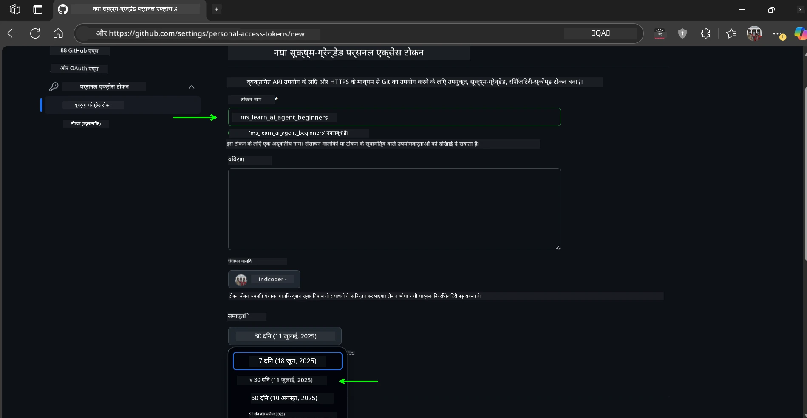
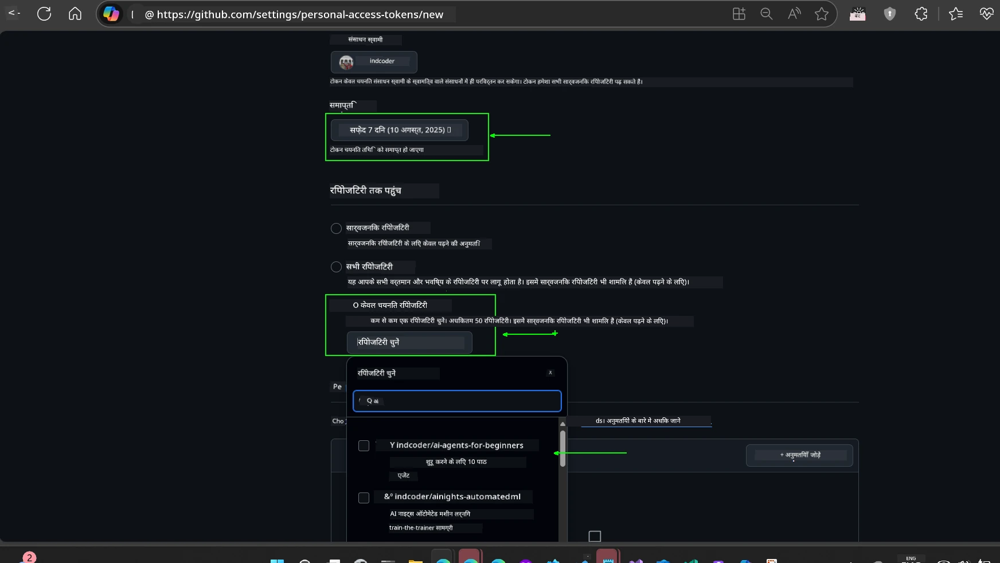
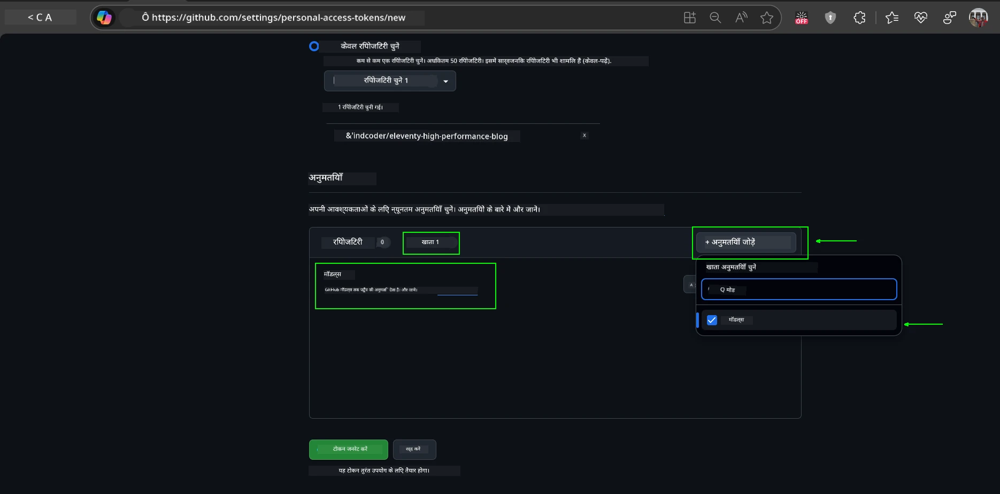
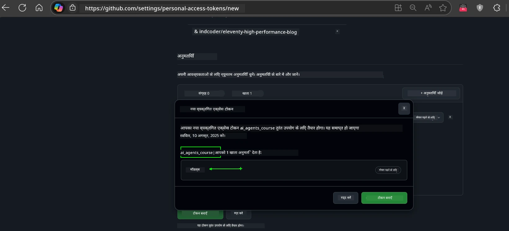
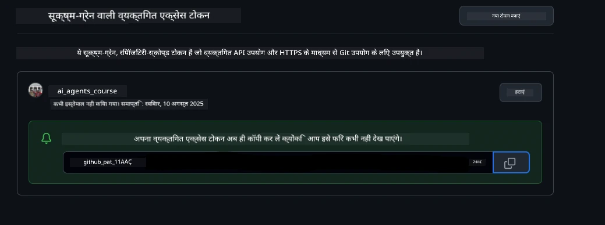
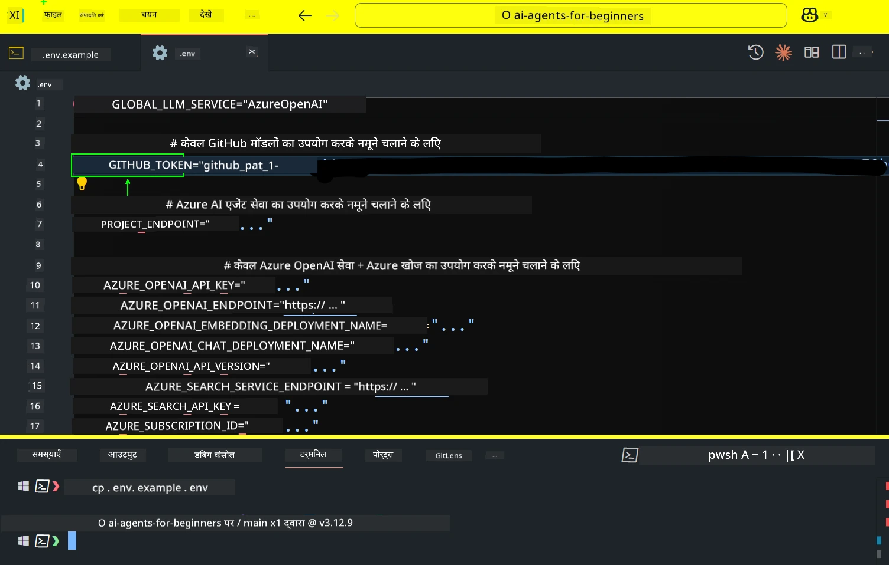
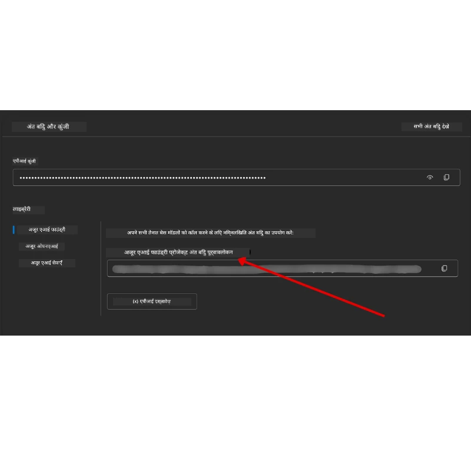

<!--
CO_OP_TRANSLATOR_METADATA:
{
  "original_hash": "63b1a8f6e840df15934935b728e569f0",
  "translation_date": "2025-12-03T14:04:53+00:00",
  "source_file": "00-course-setup/README.md",
  "language_code": "hi"
}
-->
# कोर्स सेटअप

## परिचय

इस पाठ में आप सीखेंगे कि इस कोर्स के कोड नमूनों को कैसे चलाना है।

## अन्य शिक्षार्थियों से जुड़ें और मदद प्राप्त करें

अपने रिपॉजिटरी को क्लोन करने से पहले, [AI Agents For Beginners Discord चैनल](https://aka.ms/ai-agents/discord) से जुड़ें ताकि सेटअप में मदद, कोर्स से संबंधित सवालों के जवाब, या अन्य शिक्षार्थियों से जुड़ सकें।

## इस रिपॉजिटरी को क्लोन या फोर्क करें

शुरू करने के लिए, कृपया GitHub रिपॉजिटरी को क्लोन या फोर्क करें। इससे आपके पास कोर्स सामग्री का अपना संस्करण होगा ताकि आप कोड को चला सकें, टेस्ट कर सकें और उसमें बदलाव कर सकें!

आप <a href="https://github.com/microsoft/ai-agents-for-beginners/fork" target="_blank">रिपॉजिटरी को फोर्क करने</a> के लिंक पर क्लिक करके ऐसा कर सकते हैं।

अब आपके पास इस कोर्स का फोर्क किया हुआ संस्करण निम्नलिखित लिंक पर होना चाहिए:



### शैलो क्लोन (वर्कशॉप / Codespaces के लिए अनुशंसित)

  >पूरी रिपॉजिटरी बड़ी हो सकती है (~3 GB) जब आप पूरी हिस्ट्री और सभी फाइलें डाउनलोड करते हैं। यदि आप केवल वर्कशॉप में भाग ले रहे हैं या केवल कुछ पाठ फ़ोल्डर की आवश्यकता है, तो शैलो क्लोन (या स्पार्स क्लोन) अधिकांश डाउनलोड को रोकता है और हिस्ट्री को छोटा करता है।

#### त्वरित शैलो क्लोन — न्यूनतम हिस्ट्री, सभी फाइलें

नीचे दिए गए कमांड में `<your-username>` को अपने फोर्क URL (या यदि आप चाहें तो अपस्ट्रीम URL) से बदलें।

केवल नवीनतम कमिट हिस्ट्री को क्लोन करने के लिए (छोटा डाउनलोड):

```bash|powershell
git clone --depth 1 https://github.com/<your-username>/ai-agents-for-beginners.git
```

किसी विशेष ब्रांच को क्लोन करने के लिए:

```bash|powershell
git clone --depth 1 --branch <branch-name> https://github.com/<your-username>/ai-agents-for-beginners.git
```

#### आंशिक (स्पार्स) क्लोन — न्यूनतम ब्लॉब्स + केवल चयनित फ़ोल्डर

यह आंशिक क्लोन और स्पार्स-चेकआउट का उपयोग करता है (Git 2.25+ की आवश्यकता है और आधुनिक Git के साथ आंशिक क्लोन समर्थन अनुशंसित है):

```bash|powershell
git clone --depth 1 --filter=blob:none --sparse https://github.com/<your-username>/ai-agents-for-beginners.git
```

रिपॉजिटरी फ़ोल्डर में जाएं:

```bash|powershell
cd ai-agents-for-beginners
```

फिर उन फ़ोल्डरों को निर्दिष्ट करें जिन्हें आप चाहते हैं (नीचे उदाहरण में दो फ़ोल्डर दिखाए गए हैं):

```bash|powershell
git sparse-checkout set 00-course-setup 01-intro-to-ai-agents
```

क्लोन और फाइलों को सत्यापित करने के बाद, यदि आपको केवल फाइलों की आवश्यकता है और स्थान खाली करना चाहते हैं (कोई git हिस्ट्री नहीं), तो कृपया रिपॉजिटरी मेटाडेटा को हटा दें (💀अपरिवर्तनीय — आप सभी Git कार्यक्षमता खो देंगे: कोई कमिट्स, पुल्स, पुशेस, या हिस्ट्री एक्सेस नहीं)।

```bash
# ज़श/बैश
rm -rf .git
```

```powershell
# पावरशेल
Remove-Item -Recurse -Force .git
```

#### GitHub Codespaces का उपयोग करना (स्थानीय बड़े डाउनलोड से बचने के लिए अनुशंसित)

- [GitHub UI](https://github.com/codespaces) के माध्यम से इस रिपॉजिटरी के लिए एक नया Codespace बनाएं।  

- नए बनाए गए Codespace के टर्मिनल में, ऊपर दिए गए शैलो/स्पार्स क्लोन कमांड में से एक चलाएं ताकि केवल आवश्यक पाठ फ़ोल्डर Codespace कार्यक्षेत्र में लाए जा सकें।
- वैकल्पिक: Codespaces के अंदर क्लोन करने के बाद, अतिरिक्त स्थान पुनः प्राप्त करने के लिए .git को हटा दें (ऊपर दिए गए हटाने के कमांड देखें)।
- नोट: यदि आप Codespaces में रिपॉजिटरी को सीधे खोलना पसंद करते हैं (बिना अतिरिक्त क्लोन के), तो ध्यान दें कि Codespaces devcontainer वातावरण बनाएगा और संभवतः आपकी आवश्यकता से अधिक प्रावधान करेगा। एक ताजा Codespace के अंदर एक शैलो कॉपी क्लोन करना आपको डिस्क उपयोग पर अधिक नियंत्रण देता है।

#### सुझाव

- यदि आप संपादन/कमिट करना चाहते हैं तो हमेशा क्लोन URL को अपने फोर्क से बदलें।
- यदि आपको बाद में अधिक हिस्ट्री या फाइलों की आवश्यकता हो, तो आप उन्हें प्राप्त कर सकते हैं या स्पार्स-चेकआउट को समायोजित कर सकते हैं ताकि अतिरिक्त फ़ोल्डर शामिल किए जा सकें।

## कोड चलाना

यह कोर्स Jupyter Notebooks की एक श्रृंखला प्रदान करता है जिसे आप AI Agents बनाने का व्यावहारिक अनुभव प्राप्त करने के लिए चला सकते हैं।

कोड नमूने निम्नलिखित का उपयोग करते हैं:

**GitHub अकाउंट आवश्यक - मुफ्त**:

1) Semantic Kernel Agent Framework + GitHub Models Marketplace। लेबल किया गया (semantic-kernel.ipynb)
2) AutoGen Framework + GitHub Models Marketplace। लेबल किया गया (autogen.ipynb)

**Azure सदस्यता आवश्यक**:

3) Azure AI Foundry + Azure AI Agent Service। लेबल किया गया (azureaiagent.ipynb)

हम आपको तीनों प्रकार के उदाहरण आज़माने के लिए प्रोत्साहित करते हैं ताकि आप देख सकें कि आपके लिए कौन सा सबसे अच्छा काम करता है।

आप जो भी विकल्प चुनते हैं, वह नीचे दिए गए सेटअप चरणों को निर्धारित करेगा:

## आवश्यकताएँ

- Python 3.12+
  - **NOTE**: यदि आपके पास Python3.12 इंस्टॉल नहीं है, तो सुनिश्चित करें कि आप इसे इंस्टॉल करें। फिर requirements.txt फ़ाइल से सही संस्करण इंस्टॉल करने के लिए python3.12 का उपयोग करके अपना venv बनाएं।
  
    >उदाहरण

    Python venv डायरेक्टरी बनाएं:

    ```bash|powershell
    python -m venv venv
    ```

    फिर venv वातावरण को सक्रिय करें:

    ```bash
    # ज़श/बैश
    source venv/bin/activate
    ```
  
    ```dos
    # Command Prompt for Windows
    venv\Scripts\activate
    ```

- .NET 10+: .NET का उपयोग करने वाले नमूना कोड के लिए, सुनिश्चित करें कि आप [.NET 10 SDK](https://dotnet.microsoft.com/download/dotnet/10.0) या बाद का संस्करण इंस्टॉल करें। फिर, अपने इंस्टॉल किए गए .NET SDK संस्करण की जांच करें:

    ```bash|powershell
    dotnet --list-sdks
    ```

- GitHub अकाउंट - GitHub Models Marketplace तक पहुंच के लिए
- Azure सदस्यता - Azure AI Foundry तक पहुंच के लिए
- Azure AI Foundry अकाउंट - Azure AI Agent Service तक पहुंच के लिए

हमने इस रिपॉजिटरी की रूट में एक `requirements.txt` फ़ाइल शामिल की है जिसमें कोड नमूने चलाने के लिए सभी आवश्यक Python पैकेज शामिल हैं।

आप इसे रिपॉजिटरी की रूट में अपने टर्मिनल में निम्नलिखित कमांड चलाकर इंस्टॉल कर सकते हैं:

```bash|powershell
pip install -r requirements.txt
```

हम किसी भी संघर्ष और समस्याओं से बचने के लिए Python वर्चुअल वातावरण बनाने की सलाह देते हैं।

## VSCode सेटअप

सुनिश्चित करें कि आप VSCode में सही संस्करण का Python उपयोग कर रहे हैं।


## GitHub Models का उपयोग करने वाले नमूनों के लिए सेटअप 

### चरण 1: अपना GitHub Personal Access Token (PAT) प्राप्त करें

यह कोर्स GitHub Models Marketplace का उपयोग करता है, जो आपको Large Language Models (LLMs) तक मुफ्त पहुंच प्रदान करता है जिसे आप AI Agents बनाने के लिए उपयोग करेंगे।

GitHub Models का उपयोग करने के लिए, आपको [GitHub Personal Access Token](https://docs.github.com/en/authentication/keeping-your-account-and-data-secure/managing-your-personal-access-tokens) बनाना होगा।

यह आपके GitHub अकाउंट में <a href="https://github.com/settings/personal-access-tokens" target="_blank">Personal Access Tokens settings</a> पर जाकर किया जा सकता है।

कृपया [Principle of Least Privilege](https://docs.github.com/en/get-started/learning-to-code/storing-your-secrets-safely) का पालन करें जब आप अपना टोकन बना रहे हों। इसका मतलब है कि आपको केवल टोकन को उतनी ही अनुमति देनी चाहिए जितनी इस कोर्स के कोड नमूनों को चलाने के लिए आवश्यक है।

1. **Developer settings** पर जाकर बाईं ओर `Fine-grained tokens` विकल्प चुनें।

   

   फिर `Generate new token` चुनें।

   

2. अपने टोकन के लिए एक वर्णनात्मक नाम दर्ज करें जो इसके उद्देश्य को दर्शाता हो, ताकि इसे बाद में पहचानना आसान हो।

    🔐 टोकन अवधि अनुशंसा

    अनुशंसित अवधि: 30 दिन
    अधिक सुरक्षित दृष्टिकोण के लिए, आप एक छोटी अवधि चुन सकते हैं—जैसे 7 दिन 🛡️
    यह एक व्यक्तिगत लक्ष्य निर्धारित करने और कोर्स को पूरा करने का एक शानदार तरीका है जब आपका सीखने का उत्साह उच्च हो 🚀।

    

3. टोकन के स्कोप को इस रिपॉजिटरी के फोर्क तक सीमित करें।

    

4. टोकन की अनुमतियों को प्रतिबंधित करें: **Permissions** के तहत, **Account** टैब पर क्लिक करें, और "+ Add permissions" बटन पर क्लिक करें। एक ड्रॉपडाउन दिखाई देगा। कृपया **Models** खोजें और इसके बॉक्स को चेक करें।

    

5. टोकन बनाने से पहले आवश्यक अनुमतियों की पुष्टि करें। 

6. टोकन बनाने से पहले सुनिश्चित करें कि आप इसे सुरक्षित स्थान जैसे पासवर्ड मैनेजर वॉल्ट में संग्रहीत करने के लिए तैयार हैं, क्योंकि इसे बनाने के बाद फिर से नहीं दिखाया जाएगा। 

अपने नए बनाए गए टोकन को कॉपी करें। अब आप इसे इस कोर्स में शामिल `.env` फ़ाइल में जोड़ेंगे।

### चरण 2: अपनी `.env` फ़ाइल बनाएं

अपनी `.env` फ़ाइल बनाने के लिए अपने टर्मिनल में निम्नलिखित कमांड चलाएं।

```bash
# ज़श/बैश
cp .env.example .env
```

```powershell
# पावरशेल
Copy-Item .env.example .env
```

यह उदाहरण फ़ाइल को कॉपी करेगा और आपकी डायरेक्टरी में `.env` बनाएगा, जहां आप पर्यावरण चर के लिए मान भर सकते हैं।

अपने टोकन को कॉपी करके, अपनी पसंदीदा टेक्स्ट एडिटर में `.env` फ़ाइल खोलें और अपने टोकन को `GITHUB_TOKEN` फ़ील्ड में पेस्ट करें।



अब आप इस कोर्स के कोड नमूनों को चला सकते हैं।

## Azure AI Foundry और Azure AI Agent Service का उपयोग करने वाले नमूनों के लिए सेटअप

### चरण 1: अपना Azure प्रोजेक्ट एंडपॉइंट प्राप्त करें

Azure AI Foundry में हब और प्रोजेक्ट बनाने के चरणों का पालन करें: [Hub resources overview](https://learn.microsoft.com/azure/ai-foundry/concepts/ai-resources)

एक बार जब आप अपना प्रोजेक्ट बना लेते हैं, तो आपको अपने प्रोजेक्ट के लिए कनेक्शन स्ट्रिंग प्राप्त करनी होगी।

यह Azure AI Foundry पोर्टल में अपने प्रोजेक्ट के **Overview** पेज पर जाकर किया जा सकता है।



### चरण 2: अपनी `.env` फ़ाइल बनाएं

अपनी `.env` फ़ाइल बनाने के लिए अपने टर्मिनल में निम्नलिखित कमांड चलाएं।

```bash
# ज़श/बैश
cp .env.example .env
```

```powershell
# पावरशेल
Copy-Item .env.example .env
```

यह उदाहरण फ़ाइल को कॉपी करेगा और आपकी डायरेक्टरी में `.env` बनाएगा, जहां आप पर्यावरण चर के लिए मान भर सकते हैं।

अपने टोकन को कॉपी करके, अपनी पसंदीदा टेक्स्ट एडिटर में `.env` फ़ाइल खोलें और अपने टोकन को `PROJECT_ENDPOINT` फ़ील्ड में पेस्ट करें।

### चरण 3: Azure में साइन इन करें

सुरक्षा के सर्वोत्तम अभ्यास के रूप में, हम [keyless authentication](https://learn.microsoft.com/azure/developer/ai/keyless-connections?tabs=csharp%2Cazure-cli?WT.mc_id=academic-105485-koreyst) का उपयोग करेंगे ताकि Microsoft Entra ID के साथ Azure OpenAI में प्रमाणित हो सकें। 

इसके बाद, एक टर्मिनल खोलें और `az login --use-device-code` चलाकर अपने Azure अकाउंट में साइन इन करें।

साइन इन करने के बाद, टर्मिनल में अपनी सदस्यता चुनें।

## अतिरिक्त पर्यावरण चर - Azure Search और Azure OpenAI 

Agentic RAG पाठ - पाठ 5 - में ऐसे नमूने हैं जो Azure Search और Azure OpenAI का उपयोग करते हैं।

यदि आप इन नमूनों को चलाना चाहते हैं, तो आपको अपनी `.env` फ़ाइल में निम्नलिखित पर्यावरण चर जोड़ने होंगे:

### Overview पेज (प्रोजेक्ट)

- `AZURE_SUBSCRIPTION_ID` - अपने प्रोजेक्ट के **Overview** पेज पर **Project details** देखें।

- `AZURE_AI_PROJECT_NAME` - अपने प्रोजेक्ट के **Overview** पेज के शीर्ष पर देखें।

- `AZURE_OPENAI_SERVICE` - **Overview** पेज पर **Azure OpenAI Service** के लिए **Included capabilities** टैब में इसे खोजें।

### Management Center

- `AZURE_OPENAI_RESOURCE_GROUP` - **Management Center** के **Overview** पेज पर **Project properties** पर जाएं।

- `GLOBAL_LLM_SERVICE` - **Connected resources** के तहत, **Azure AI Services** कनेक्शन नाम खोजें। यदि सूचीबद्ध नहीं है, तो अपने संसाधन समूह के तहत AI Services संसाधन नाम के लिए **Azure portal** देखें।

### Models + Endpoints पेज

- `AZURE_OPENAI_EMBEDDING_DEPLOYMENT_NAME` - अपना एम्बेडिंग मॉडल चुनें (जैसे, `text-embedding-ada-002`) और मॉडल विवरण से **Deployment name** नोट करें।

- `AZURE_OPENAI_CHAT_DEPLOYMENT_NAME` - अपना चैट मॉडल चुनें (जैसे, `gpt-4o-mini`) और मॉडल विवरण से **Deployment name** नोट करें।

### Azure Portal

- `AZURE_OPENAI_ENDPOINT` - **Azure AI services** देखें, उस पर क्लिक करें, फिर **Resource Management**, **Keys and Endpoint** पर जाएं, "Azure OpenAI endpoints" तक स्क्रॉल करें, और वह कॉपी करें जो "Language APIs" कहता है।

- `AZURE_OPENAI_API_KEY` - उसी स्क्रीन से, KEY 1 या KEY 2 कॉपी करें।

- `AZURE_SEARCH_SERVICE_ENDPOINT` - अपने **Azure AI Search** संसाधन को खोजें, उस पर क्लिक करें, और **Overview** देखें।

- `AZURE_SEARCH_API_KEY` - फिर **Settings** और फिर **Keys** पर जाएं ताकि प्राथमिक या द्वितीयक एडमिन की को कॉपी कर सकें।

### बाहरी वेबपेज

- `AZURE_OPENAI_API_VERSION` - [API version lifecycle](https://learn.microsoft.com/azure/ai-services/openai/api-version-deprecation#latest-ga-api-release) पेज पर **Latest GA API release** के तहत जाएं।

### Keyless authentication सेटअप करें

अपने क्रेडेंशियल्स को हार्डकोड करने के बजाय, हम Azure OpenAI के साथ keyless कनेक्शन का उपयोग करेंगे। ऐसा करने के लिए, हम `DefaultAzureCredential` को आयात करेंगे और बाद में `DefaultAzureCredential` फ़ंक्शन को कॉल करेंगे ताकि क्रेडेंशियल प्राप्त हो सके।

```python
# पायथन
from azure.identity import DefaultAzureCredential, InteractiveBrowserCredential
```

## कहीं अटके हैं?
यदि इस सेटअप को चलाने में कोई समस्या हो, तो हमारे <a href="https://discord.gg/kzRShWzttr" target="_blank">Azure AI Community Discord</a> में शामिल हों या <a href="https://github.com/microsoft/ai-agents-for-beginners/issues?WT.mc_id=academic-105485-koreyst" target="_blank">एक समस्या दर्ज करें</a>।

## अगला पाठ

अब आप इस पाठ्यक्रम के कोड को चलाने के लिए तैयार हैं। एआई एजेंट्स की दुनिया के बारे में और अधिक सीखने का आनंद लें!

[एआई एजेंट्स और उनके उपयोग के मामलों का परिचय](../01-intro-to-ai-agents/README.md)

---

<!-- CO-OP TRANSLATOR DISCLAIMER START -->
**अस्वीकरण**:  
यह दस्तावेज़ AI अनुवाद सेवा [Co-op Translator](https://github.com/Azure/co-op-translator) का उपयोग करके अनुवादित किया गया है। जबकि हम सटीकता के लिए प्रयास करते हैं, कृपया ध्यान दें कि स्वचालित अनुवाद में त्रुटियां या अशुद्धियां हो सकती हैं। मूल भाषा में दस्तावेज़ को प्रामाणिक स्रोत माना जाना चाहिए। महत्वपूर्ण जानकारी के लिए, पेशेवर मानव अनुवाद की सिफारिश की जाती है। इस अनुवाद के उपयोग से उत्पन्न किसी भी गलतफहमी या गलत व्याख्या के लिए हम उत्तरदायी नहीं हैं।
<!-- CO-OP TRANSLATOR DISCLAIMER END -->