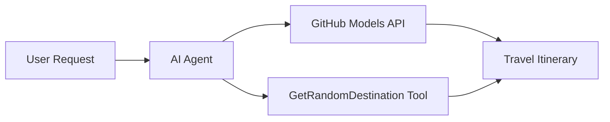

<!--
CO_OP_TRANSLATOR_METADATA:
{
  "original_hash": "5f351412e934f0833c8c821a0a60efaf",
  "translation_date": "2025-11-13T11:37:55+00:00",
  "source_file": "01-intro-to-ai-agents/code_samples/01-dotnet-agent-framework.md",
  "language_code": "hi"
}
-->
# 🌍 माइक्रोसॉफ्ट एजेंट फ्रेमवर्क (.NET) के साथ एआई ट्रैवल एजेंट

## 📋 परिदृश्य का अवलोकन

यह उदाहरण दिखाता है कि माइक्रोसॉफ्ट एजेंट फ्रेमवर्क का उपयोग करके एक बुद्धिमान यात्रा योजना एजेंट कैसे बनाया जाए। यह एजेंट दुनिया भर के रैंडम डेस्टिनेशन्स के लिए व्यक्तिगत दिन-यात्रा योजनाएं स्वचालित रूप से तैयार कर सकता है।

### मुख्य क्षमताएं:

- 🎲 **रैंडम डेस्टिनेशन चयन**: छुट्टियों के स्थानों को चुनने के लिए एक कस्टम टूल का उपयोग करता है  
- 🗺️ **बुद्धिमान यात्रा योजना**: दिन-प्रतिदिन की विस्तृत योजनाएं बनाता है  
- 🔄 **रियल-टाइम स्ट्रीमिंग**: त्वरित और स्ट्रीमिंग प्रतिक्रियाओं दोनों का समर्थन करता है  
- 🛠️ **कस्टम टूल इंटीग्रेशन**: एजेंट की क्षमताओं को बढ़ाने का प्रदर्शन करता है  

## 🔧 तकनीकी संरचना

### मुख्य तकनीकें

- **माइक्रोसॉफ्ट एजेंट फ्रेमवर्क**: एआई एजेंट विकास के लिए नवीनतम .NET कार्यान्वयन  
- **GitHub Models इंटीग्रेशन**: GitHub के एआई मॉडल इनफरेंस सेवा का उपयोग करता है  
- **OpenAI API संगतता**: कस्टम एंडपॉइंट्स के साथ OpenAI क्लाइंट लाइब्रेरी का लाभ उठाता है  
- **सुरक्षित कॉन्फ़िगरेशन**: पर्यावरण-आधारित API कुंजी प्रबंधन  

### मुख्य घटक

1. **AIAgent**: मुख्य एजेंट ऑर्केस्ट्रेटर जो बातचीत के प्रवाह को संभालता है  
2. **कस्टम टूल्स**: `GetRandomDestination()` फ़ंक्शन एजेंट के लिए उपलब्ध है  
3. **चैट क्लाइंट**: GitHub Models-समर्थित बातचीत इंटरफ़ेस  
4. **स्ट्रीमिंग समर्थन**: रियल-टाइम प्रतिक्रिया निर्माण क्षमताएं  

### इंटीग्रेशन पैटर्न



## 🚀 आरंभ करना

### आवश्यकताएं

- [.NET 10 SDK](https://dotnet.microsoft.com/download/dotnet/10.0) या उच्चतर  
- [GitHub Models API एक्सेस टोकन](https://docs.github.com/github-models/github-models-at-scale/using-your-own-api-keys-in-github-models)  

### आवश्यक पर्यावरण वेरिएबल्स

```bash
# zsh/bash
export GH_TOKEN=<your_github_token>
export GH_ENDPOINT=https://models.github.ai/inference
export GH_MODEL_ID=openai/gpt-5-mini
```

```powershell
# PowerShell
$env:GH_TOKEN = "<your_github_token>"
$env:GH_ENDPOINT = "https://models.github.ai/inference"
$env:GH_MODEL_ID = "openai/gpt-5-mini"
```

### नमूना कोड

कोड उदाहरण चलाने के लिए,

```bash
# zsh/bash
chmod +x ./01-dotnet-agent-framework.cs
./01-dotnet-agent-framework.cs
```

या dotnet CLI का उपयोग करके:

```bash
dotnet run ./01-dotnet-agent-framework.cs
```

पूरा कोड [`01-dotnet-agent-framework.cs`](../../../../01-intro-to-ai-agents/code_samples/01-dotnet-agent-framework.cs) में देखें।

```csharp
#!/usr/bin/dotnet run

#:package Microsoft.Extensions.AI@9.*
#:package Microsoft.Agents.AI.OpenAI@1.*-*

using System.ClientModel;
using System.ComponentModel;

using Microsoft.Agents.AI;
using Microsoft.Extensions.AI;

using OpenAI;

// Tool Function: Random Destination Generator
// This static method will be available to the agent as a callable tool
// The [Description] attribute helps the AI understand when to use this function
// This demonstrates how to create custom tools for AI agents
[Description("Provides a random vacation destination.")]
static string GetRandomDestination()
{
    // List of popular vacation destinations around the world
    // The agent will randomly select from these options
    var destinations = new List<string>
    {
        "Paris, France",
        "Tokyo, Japan",
        "New York City, USA",
        "Sydney, Australia",
        "Rome, Italy",
        "Barcelona, Spain",
        "Cape Town, South Africa",
        "Rio de Janeiro, Brazil",
        "Bangkok, Thailand",
        "Vancouver, Canada"
    };

    // Generate random index and return selected destination
    // Uses System.Random for simple random selection
    var random = new Random();
    int index = random.Next(destinations.Count);
    return destinations[index];
}

// Extract configuration from environment variables
// Retrieve the GitHub Models API endpoint, defaults to https://models.github.ai/inference if not specified
// Retrieve the model ID, defaults to openai/gpt-5-mini if not specified
// Retrieve the GitHub token for authentication, throws exception if not specified
var github_endpoint = Environment.GetEnvironmentVariable("GH_ENDPOINT") ?? "https://models.github.ai/inference";
var github_model_id = Environment.GetEnvironmentVariable("GH_MODEL_ID") ?? "openai/gpt-5-mini";
var github_token = Environment.GetEnvironmentVariable("GH_TOKEN") ?? throw new InvalidOperationException("GH_TOKEN is not set.");

// Configure OpenAI Client Options
// Create configuration options to point to GitHub Models endpoint
// This redirects OpenAI client calls to GitHub's model inference service
var openAIOptions = new OpenAIClientOptions()
{
    Endpoint = new Uri(github_endpoint)
};

// Initialize OpenAI Client with GitHub Models Configuration
// Create OpenAI client using GitHub token for authentication
// Configure it to use GitHub Models endpoint instead of OpenAI directly
var openAIClient = new OpenAIClient(new ApiKeyCredential(github_token), openAIOptions);

// Create AI Agent with Travel Planning Capabilities
// Initialize OpenAI client, get chat client for specified model, and create AI agent
// Configure agent with travel planning instructions and random destination tool
// The agent can now plan trips using the GetRandomDestination function
AIAgent agent = openAIClient
    .GetChatClient(github_model_id)
    .CreateAIAgent(
        instructions: "You are a helpful AI Agent that can help plan vacations for customers at random destinations",
        tools: [AIFunctionFactory.Create(GetRandomDestination)]
    );

// Execute Agent: Plan a Day Trip
// Run the agent with streaming enabled for real-time response display
// Shows the agent's thinking and response as it generates the content
// Provides better user experience with immediate feedback
await foreach (var update in agent.RunStreamingAsync("Plan me a day trip"))
{
    await Task.Delay(10);
    Console.Write(update);
}
```

## 🎓 मुख्य सीख

1. **एजेंट आर्किटेक्चर**: माइक्रोसॉफ्ट एजेंट फ्रेमवर्क .NET में एआई एजेंट बनाने के लिए एक साफ, टाइप-सुरक्षित दृष्टिकोण प्रदान करता है  
2. **टूल इंटीग्रेशन**: `[Description]` एट्रिब्यूट्स के साथ सजाए गए फ़ंक्शन एजेंट के लिए उपलब्ध टूल बन जाते हैं  
3. **कॉन्फ़िगरेशन प्रबंधन**: पर्यावरण वेरिएबल्स और सुरक्षित क्रेडेंशियल हैंडलिंग .NET के सर्वोत्तम प्रथाओं का पालन करते हैं  
4. **OpenAI संगतता**: GitHub Models इंटीग्रेशन OpenAI-संगत APIs के माध्यम से सहजता से काम करता है  

## 🔗 अतिरिक्त संसाधन

- [माइक्रोसॉफ्ट एजेंट फ्रेमवर्क डाक्यूमेंटेशन](https://learn.microsoft.com/agent-framework)  
- [GitHub Models मार्केटप्लेस](https://github.com/marketplace?type=models)  
- [Microsoft.Extensions.AI](https://learn.microsoft.com/dotnet/ai/microsoft-extensions-ai)  
- [.NET सिंगल फाइल ऐप्स](https://devblogs.microsoft.com/dotnet/announcing-dotnet-run-app)  

---

<!-- CO-OP TRANSLATOR DISCLAIMER START -->
**अस्वीकरण**:  
यह दस्तावेज़ AI अनुवाद सेवा [Co-op Translator](https://github.com/Azure/co-op-translator) का उपयोग करके अनुवादित किया गया है। जबकि हम सटीकता के लिए प्रयास करते हैं, कृपया ध्यान दें कि स्वचालित अनुवाद में त्रुटियां या अशुद्धियां हो सकती हैं। मूल भाषा में दस्तावेज़ को प्रामाणिक स्रोत माना जाना चाहिए। महत्वपूर्ण जानकारी के लिए, पेशेवर मानव अनुवाद की सिफारिश की जाती है। इस अनुवाद के उपयोग से उत्पन्न किसी भी गलतफहमी या गलत व्याख्या के लिए हम उत्तरदायी नहीं हैं।
<!-- CO-OP TRANSLATOR DISCLAIMER END -->